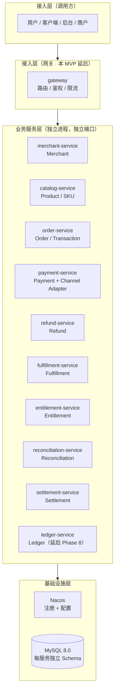
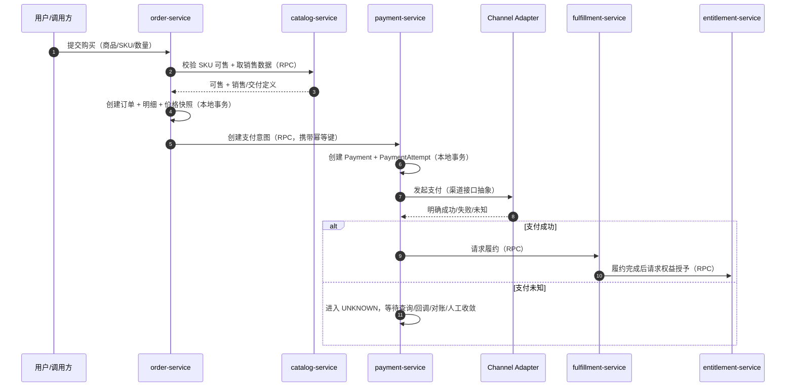
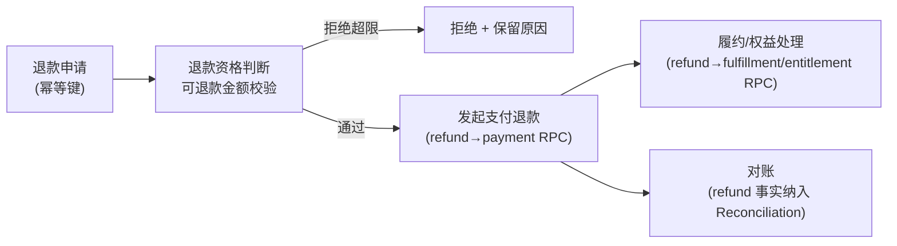

# PaymentArch 总体架构方案

**状态**：已确认，作为当前实现基线（综合性总体技术方案，指导后续所有 Feature）

**生效日期**：2026-08-26

**关联决策**：[ADR-0001](../adr/0001-adopt-spring-cloud-microservices.md)、[ADR-0002](../adr/0002-technology-stack.md)

**权威来源**：本文是 Constitution（最高约束）、ADR（决策日志）、Spec 001（业务模型）在「当前系统」层面的**落地化综合**。本文不得与 [Constitution](../../.specify/memory/constitution.md) 冲突；若需调整领域边界、服务边界、状态机或数据层，属于 Constitution §8 人类决策边界，须另立 ADR / 提案并经人类确认。

---

## 1. 项目目标

PaymentArch 是一个 **Production-Oriented 的 Commerce & Payment Platform**（Java / Spring Cloud 微服务），用于学习并实践支付、交易、履约、权益、对账、结算体系与高质量后端工程。**不是 CRUD Demo、不是玩具脚本。**

落地到工程，任何功能须同时满足八性（详见 Constitution §1）：业务模型真实（Realistic）、架构合理（Sound）、工程完整（Complete）、可运行（Runnable）、可测试（Testable）、可观测（Observable）、可部署（Deployable）、可演进（Evolvable）。

**首要态度**：宁可**正确地实现一个较小范围**，也不做**范围大但不真实、不可验证的表面功能** —— 真实 > 全面。

**最高优先级**：资金正确性 > 一切（幂等、复式记账、未知状态不猜成败）。其他优先级与冲突裁决规则见 Constitution §10。

## 2. 系统总体架构

采用**按限界上下文（Bounded Context）划分的 Spring Cloud 微服务架构**（ADR-0001）：一个领域上下文一个服务，每个服务拥有独立的业务模型、状态机、数据访问边界与部署单元。



**要点**：

- **Database-per-Service 的业务目标**，但「每服务独立数据库」首先表示**数据所有权与访问边界**，不是强制每服务必须独占一个物理数据库。单机/Compose 阶段多个服务可共用一个物理库，但**必须使用独立 Schema**，跨服务不共享表、不访问他服务 Schema（ADR-0001、Constitution §4）。
- **通信**：跨服务统一走**公开的同步 HTTP/RPC 用例**；服务内部可用事件表达本地状态变化，但**事件不跨服务发布**；当前不引入 MQ 或跨服务异步事件。
- **分层**（单服务内，详见 [project-structure.md](project-structure.md)）：`api → application → domain ← infra`，依赖单向；`domain` 不依赖任何框架层，`infra` 实现 `domain` 声明的仓储接口（依赖倒置）。

## 3. 领域架构（12 领域）

系统由 12 个可独立说明职责与生命周期的业务领域构成（Spec 001）。每个领域拥有**独立的模型、状态机与数据所有权**；`Ledger` 作为第 13 个领域，是资金账本基础，当前延后到 Phase 8。

| 领域 | 解决的问题 | 不负责的问题 | 核心实体 | 核心状态 |
|---|---|---|---|---|
| Merchant | 谁可经营商品、接收交易并参与结算 | 订单、支付执行、履约、对账差异 | Merchant、Settlement Account | 待审核 → 有效 → 暂停/终止 |
| Product | 面向用户与商家的商品概念与生命周期 | 销售价格快照、订单、支付 | Product、Product Version | 草稿 → 上架 → 下架 → 归档 |
| SKU | 哪个具体销售单元可被购买、以何属性交付 | 订单金额确认、支付状态 | SKU、Price、Delivery Definition | 草稿 → 可售 → 暂停 → 失效 |
| Order | 用户买什么、向谁买、订单金额与购买生命周期 | 渠道协议、资金收取、直接发权益 | Order、Order Item、Price Snapshot | 待确认 → 待支付 → 部分/已支付 → 履约中 → 已完成/取消/关闭 |
| Transaction | 商业交易如何关联订单与支付、是否完成 | 渠道通信、履约交付、权益管理 | Transaction、Transaction Relation | 待处理 → 处理中 → 成功/失败/取消/未知 |
| Payment | 一次资金收取意图与支付尝试的生命周期 | 商品、履约、具体渠道协议 | Payment、Payment Attempt、Payment Result | 待支付 → 处理中 → 成功/失败/未知 → 已关闭 |
| Payment Channel | 如何与外部支付机构交互并解释其结果 | 平台订单、履约、权益、最终业务判断 | Channel、Channel Attempt、Channel Reference | 可用 → 不可用/停用 |
| Refund | 为什么退、退多少、是否可退、退款整体进度 | 单独替代支付退款、履约撤销、对账 | Refund、Refund Item、Refund Decision | 申请中 → 处理中 → 成功/部分/失败/未知/拒绝/关闭 |
| Fulfillment | 如何交付商品或服务、交付是否完成 | 支付结果确认、权益内部生命周期 | Fulfillment、Fulfillment Item、Delivery | 待履约 → 履约中 → 已交付/部分/失败/取消 |
| Entitlement | 用户获得什么消费权利、如何用与撤销 | 判断是否已付款、渠道退款 | Entitlement、Grant、Consumption | 待授予 → 可用 → 部分/已用尽 → 过期/撤销/失败 |
| Reconciliation | 平台事实与外部事实是否一致、差异如何处理 | 资金划转、修改原始交易事实 | Batch、Match、Difference | 待处理 → 对账中 → 一致/有差异 → 处理中/关闭 |
| Settlement | 商户应结算多少、批次是否完成 | 发现全部原始差异、代替支付成功判断 | Batch、Item、Adjustment | 待结算 → 计算中 → 待执行 → 执行中 → 成功/失败/未知/关闭 |

**六条关键边界（Constitution §2.3，必须时刻区分）**：

| # | 区分 | 含义 |
|---|---|---|
| 1 | **Order ≠ Payment** | Order 是商业意图（买什么/多少钱/谁买），Payment 是资金动作（钱如何被收）。独立生命周期与状态机；订单金额、已支付金额、已退款金额是三个不同字段。 |
| 2 | **Payment ≠ Channel** | Payment 是领域编排层（意图/金额/币种/状态/幂等），Channel 是对外支付提供方的技术适配（协议/签名/回调）。Payment 只依赖 Channel 接口抽象，不依赖具体渠道实现。 |
| 3 | **Payment Success ≠ Entitlement Granted** | 支付成功是财务事件，权益授予是消费权利，不同概念、不同生命周期。支付成功**触发**权益授予；权益也可因试用/赠送授予、可独立撤销、有有效期。 |
| 4 | **Reconciliation ≠ Settlement** | Reconciliation 是对账（比对两本账找差异、校验/审计），Settlement 是结算（资金划转）。对账周期 ≠ 结算周期（如 T+1），二者解耦。 |
| 5 | **Refund ≠ Payment Refund** | Refund 是领域级退款决策，跨多领域编排（渠道退款 + 权益撤销 + 账本冲正 + 对账调整），不是「调用一次渠道退款」一句话。 |
| 6 | **Fulfillment 不强耦合 Payment** | Fulfillment 有自己的状态机，可被支付成功触发，但不依赖支付内部实现，也不被支付状态反向阻塞。 |

**依赖方向（核心约束）**：领域依赖 MUST **单向、向内**——编排层（Order/Payment/Refund）可依赖底层领域，底层领域不得反向依赖编排层；`Ledger` 只被依赖、不依赖任何业务领域；`Channel` 只依赖外部协议、不依赖业务领域。

## 4. 核心业务模型

> MVP 的实体基数关系与状态机来自 Spec 001 与 data-model；这些是「总体业务模型」的当前基线，随 Feature 落地逐步实现，不在此展开单个实体的字段级实现。

**MVP 基数关系（关键约束）**：

```text
Order (1) ───── (1) Transaction (1) ───── (1) Payment (1) ───── (N) PaymentAttempt
   │                                                                      │
   └─ Order Items / Price Snapshots                             每次尝试 ≤ 1 个渠道引用
```

- 一个 Order 在 MVP 中只有**一个有效 Transaction**（表达订单支付义务）。
- 一个 Transaction 在 MVP 中对应**一个 Payment**，金额与币种必须与 Transaction 一致。
- 一个 Payment 允许多次 PaymentAttempt（1:N）；每次尝试独立追踪，最多对应一个渠道引用。

**核心状态机**（领域自持，集中状态转换函数，禁止散落直接 set）：

| 实体 | 允许的状态流 |
|---|---|
| Order | 待确认 → 待支付 → 部分支付/已支付 → 履约中 → 已完成；取消/关闭仅当业务允许 |
| Transaction | 待处理 → 处理中 → 成功/失败/取消/未知 |
| Payment | 待支付 → 处理中 → 成功/失败/未知 → 已关闭 |
| PaymentAttempt | 待处理 → 已受理 → 成功/失败/未知 |
| Fulfillment | 待履约 → 履约中 → 已交付/部分交付/失败/取消 |
| Entitlement | 待授予 → 可用 → 部分使用/已用尽 → 已过期/已撤销/失败 |
| Refund | 申请中 → 处理中 → 成功/部分成功/失败/未知/拒绝/关闭 |
| Reconciliation | 待处理 → 对账中 → 一致/有差异 → 处理中/关闭 |
| Settlement | 待结算 → 计算中 → 待执行 → 执行中 → 成功/失败/未知/关闭 |

**金额铁律（Constitution §2）**：金额一律用**最小货币单位（`long` 分）或 `BigDecimal`（明确 scale）**，封装 `Money` 值对象（金额+币种）；全库禁止 `float`/`double`；任何真实资金变动须经 Ledger 复式记账（见 §9）。

**跨实体约束（data-model）**：
1. Payment 只有在 Transaction 及金额/币种关系有效时才能成功。
2. PaymentSucceeded 不会直接设置 Fulfillment 或 Entitlement 状态。
3. Refund 金额受「已确认支付金额 − 此前已占用可退款金额」约束。
4. Settlement 只消费已确认事实，且始终可追溯到来源 Payment/Refund 记录。
5. 重复命令/RPC 不得创建重复的 PaymentAttempt、Fulfillment、Entitlement 授予或 Settlement 批次。

## 5. 核心业务流程

跨服务副作用通过**同步 RPC 用例**完成，后置流程由负责方调用下游公开用例；任何同步边界不得要求一次调用完成跨领域全链路（如 Payment 不等 Fulfillment/Entitlement 完成）。

### 5.1 购买主链路



### 5.2 支付回调

渠道通知**可能重复、乱序、延迟**到达。payment-service 依据「渠道交易引用 + 支付尝试」幂等吸收重复通知，不回退已确认的合法状态；终态成功不被后到的失败回调覆盖。回调只更新 Payment/PaymentAttempt，不直接改写 Order/Fulfillment/Entitlement。

### 5.3 UNKNOWN 收敛

渠道超时/断连/响应不完整时，Payment 或 Refund **进入 UNKNOWN**（不是失败别名）。收敛路径：主动查询接口、后续回调、对账、人工处理；在未收敛前**不得重复执行不可确认的资金动作**。

### 5.4 退款链路



### 5.5 履约与权益

`PaymentSucceeded`（Payment 服务内部事实）→ 通过 RPC 请求 `fulfillment-service` 履约；履约完成后再请求 `entitlement-service` 授予权益。支付成功只**触发**履约，不决定履约最终状态；履约失败不回写支付为失败；权益授予失败保留履约事实、可重试/人工补发，不重复扣款。

### 5.6 对账

`reconciliation-service` 读取已确认的 Payment/Refund 事实，与 Mock/预置渠道账单比对，产出：一致、金额差异、状态差异、平台独有、渠道独有。**对账只产生匹配/差异事实，永不修改原始 Payment/Refund 事实。**

### 5.7 结算

`settlement-service` 只消费「已确认且差异可解释」的财务事实（校验 merchant 结算资格 → 净额计算 → 生成结算批次）。同一商户周期不重复生成批次；未知执行结果不等于成功。

### 5.8 典型跨服务调用（Overview 基线）

```text
order-service → catalog-service        校验 SKU + 取销售数据
order-service → payment-service        创建支付意图
payment-service → Channel Adapter      发起支付 / 查询渠道结果
payment-service → fulfillment-service  支付成功后请求履约
fulfillment-service → entitlement-service  履约完成后请求权益授予
refund-service → payment-service       发起支付退款
refund-service → fulfillment/entitlement   退款后处理
reconciliation-service → payment/refund    读已确认业务事实
settlement-service → merchant/reconciliation 校验结算资格 + 生成结算批次
```

## 6. 数据架构

- **数据库**：MySQL 8.0（本地通过 [docker-compose.yml](../../deployment/docker-compose.yml) 启动）。
- **隔离策略**：Database-per-Service 的访问边界（ADR-0001）——每个服务独占自己的 Schema，命名如 `merchant_schema` / `catalog_schema` / `order_schema` / `payment_schema` / `refund_schema` / `fulfillment_schema` / `entitlement_schema` / `reconciliation_schema` / `settlement_schema`（具体 schema 命名待 Phase 0 落地收口，见 §15）。
- **数据所有权**：每个领域只拥有自己核心实体的**唯一事实来源**（详见 Spec 001 §Data Ownership）；其他领域只能保存必要引用或不可变副本，不得把副本当作可修改事实来源。
- **禁止**：任何服务直接 SQL 他服务 Schema 的表；跨服务读写一律经对方公开 API/RPC。

## 7. 一致性模型

一致性是支付系统的**必答题**，三层分层、不可混淆（Constitution §5）：

| 机制 | 落地 |
|---|---|
| **幂等** | 支付、退款、结算等资金入口 MUST 有幂等键；幂等键由调用方提供、服务端持久化并唯一约束；同键重复请求返回同一业务结果，不产生重复资金动作 |
| **状态机** | Order/Payment/Refund/Fulfillment/Entitlement/Settlement 均显式、单向；状态流转集中在状态转换函数，禁止散落 set |
| **本地事务** | 单服务内部状态变更用本地事务保证原子 |
| **最终一致** | 跨服务通过同步 RPC 编排 + 幂等重试实现最终一致；对外部系统（渠道）采用最终一致；暂不引入 MQ / 跨服务异步事件 |
| **重试** | 仅对幂等的外部调用允许自动重试，须有退避与上限；非幂等调用禁止盲目重试 |
| **重复消息/回调** | 处理侧假设消息与回调会重复，靠幂等键 + 状态机幂等吸收，不重复入账 |
| **超时** | 所有外部调用有超时；超时 ≠ 失败/成功，进入未知状态 |
| **UNKNOWN** | 结果不确定时不猜成败直接落账，靠查询/对账/人工收敛 —— 支付系统最核心的正确性保障 |

**明确禁止**：2PC/XA 分布式事务；跨服务直接改他服务数据；散落直改 `status` 绕过状态机。

## 8. Payment 架构

Payment 是平台核心资金领域，落实 **Payment ≠ Channel**（边界 #2）：

- **领域编排层（Payment）**：负责支付意图、金额、币种、幂等、状态机、支付结果；**不包含具体渠道实现细节**。
- **渠道适配层（Channel）**：负责与第三方支付机构通信、协议、请求/响应转换、回调、渠道特有错误；以 **Channel Adapter + Mock Channel** 形式内聚在 `payment-service` 内（ADR-0001：Channel 不单独成服务）。渠道差异被接口抽象隔离，核心 Payment 不依赖具体渠道实现。

```text
payment-service/
├── application/channel/   Channel 接口（Payment 依赖的抽象）
└── infra/channel/         具体适配器（Mock / 未来支付宝·微信）
```

- **实体与基数**：Payment（1）→ PaymentAttempt（N）→ 每尝试 ≤ 1 渠道引用；PaymentResult 记录平台侧支付结果。
- **状态机**：待支付 → 处理中 → 成功/失败/未知 → 已关闭。渠道**明确结果**才进入成功/失败；超时/断连/响应不完整进入 UNKNOWN。
- **回调幂等**：按渠道交易引用 + 支付尝试吸收重复/乱序回调；终态成功不被迟到失败覆盖。
- **触发下游**：PaymentSucceeded 通过 RPC 请求履约，不直接写 Fulfillment/Entitlement 状态。

当前 MVP 使用 **Mock Channel**，不接真实支付机构、不真实记账（见 §9）。

## 9. Ledger 定位

- **当前（Phase 0-7）**：Ledger **不创建、不实现**。支付、退款、结算只**模拟资金业务事实**（Payment/Refund/Settlement 状态），不执行真实记账、复式分录与真实出款。
- **Phase 8 才引入**：建立可追溯的复式账务事实（科目、分录、借贷平衡、业务引用），Payment/Refund/Settlement 与 Ledger 的记账边界、记账幂等与审计追踪。
- **为何延后**：真实资金动作必须有 Ledger 支撑，不能用 Payment/Refund/Settlement 状态替代账务事实；但 Ledger 只有在前面各阶段业务事实稳定后建立才有意义（Roadmap Phase 8）。
- **即便当前无 Ledger，金额铁律仍生效**：所有金额用 `long`/`BigDecimal` + `Money` 值对象；后续任何真实资金变动必须经 Ledger 复式记账，禁止直改余额字段。

## 10. 可观测性

所有核心业务流程必须具备可观测能力，且**用轻量方案起步**（Micrometer + 结构化日志 + 计数器），不提前上重型 Trace 基础设施——「可观测」优先于「工具链复杂度」（Constitution §6）。

- **Metrics（Micrometer）**：请求量、延迟、错误率 + 关键业务计数。核心指标至少覆盖：
  - 支付：成功率 / 失败率 / 超时率 / 耗时 / 渠道成功率 / 渠道耗时
  - 退款：成功率 / 失败率 / 耗时
  - 履约：成功率 / 失败率 / 权益发放失败率
  - 对账：差异数量 / 差异金额
  - 结算：成功率 / 失败数量
- **Logs**：结构化日志（logback），关联字段含 `traceId` / `orderId` / `paymentId`；**资金动作 MUST 有审计日志**；敏感信息（卡号、密钥）脱敏。
- **Traces**：Micrometer Tracing 跨服务传播 `traceId`/`spanId`，初期不上独立分布式追踪基础设施。
- **业务告警**：对「支付状态未知堆积」「对账差异」「退款失败」「重试耗尽」等业务异常 MUST 告警，而非只告警基础设施。
- **SLO**：为核心接口定义可用性、P99 延迟、对账达成率等目标，具备错误预算意识。

## 11. 技术栈

| 维度 | 选择 | 说明 |
|---|---|---|
| 语言 / JDK | Java 21 LTS | Spring Boot 3.x 全面支持 |
| 框架 | Spring Boot 3.x + Spring Cloud | 主流企业级 |
| 构建 | Maven（mvnw Wrapper 锁版本） | 父 POM + `dependencyManagement` 统一版本 |
| ORM | MyBatis / MyBatis-Plus | SQL 显式可控，适合资金/复式记账/对账复杂查询 |
| 注册 + 配置 | Nacos | 同时提供注册与配置能力 |
| 服务调用 | Spring Cloud OpenFeign + LoadBalancer | 声明式服务间调用 |
| API 网关 | Spring Cloud Gateway | 响应式网关（本 MVP 延后启用） |
| 熔断 | Resilience4j 或 Sentinel | **延迟到需要时再引入** |
| 可观测 | Micrometer + Micrometer Tracing | 指标与链路追踪 |
| 测试 | JUnit 5 + Mockito + AssertJ；Testcontainers | 集成测试用容器 |
| 代码质量 | Checkstyle + Spotless | CI 强制 |

> 具体工程落地规范见 [guides/engineering-standards.md](../guides/engineering-standards.md)；每个新依赖须有理由（ADR 或 commit），最小化依赖。

## 12. 部署架构

**当前部署形态：单机多进程 + 单 MySQL 独立 Schema**（不是模块化单体）：

```text
一台服务器
├── merchant-service / catalog-service / order-service / payment-service
├── refund-service / fulfillment-service / entitlement-service
└── reconciliation-service / settlement-service      （各自不同端口）

一个物理数据库（MySQL 8.0）
└── merchant_schema / catalog_schema / order_schema / ...   （各自独立 Schema）
```

- 服务是**独立进程、独立端口、独立部署单元**；单机只是多个进程跑在同一台服务器，不改变服务边界。
- `gateway` 与 `ledger-service` 本 MVP **不创建、不部署**（延后）。
- 本地启动：`./mvnw` 逐服务启动；`docker-compose up` 起 MySQL（见 [deployment/README.md](../../deployment/README.md)）。
- 演进路径：本地多服务 → Docker Compose → 单机部署 → CI/CD → 可观测增强 → 有证据的部分服务独立数据库迁移（Roadmap Phase 10）。

## 13. 架构演进（Phase 0-3 详述）

当前处于 **Phase 0 — Foundation**，正在推进 Feature `001-core-business-model`。

| 阶段 | 目标 | 交付边界 |
|---|---|---|
| **Phase 0 · Foundation** | 收口架构裁决、服务目录、端口、Schema 约定、Spec Kit 唯一入口 | 不实现业务领域、不接真实支付、不建 Ledger、不引 MQ/K8s |
| **Phase 1 · Commerce Core** | Merchant/Product/SKU/Order/Transaction 最小可运行能力（商品选择、价格快照、订单创建/查询） | 不含 Payment、退款、权益、结算、库存/促销/税费 |
| **Phase 2 · Payment Core** | Payment/PaymentAttempt/Channel Adapter + Mock Channel；支付意图、渠道调用、回调、状态机 | 不含真实渠道、真实记账、Ledger、路由/风控/多币种 |
| **Phase 3 · Payment Reliability** | UNKNOWN 查询/回调收敛、重复/乱序/延迟回调、有限重试与耗尽处理、业务指标与审计 | 不含生产级渠道 SLA、多活、复杂风控、自动资金补偿 |

Phase 4-10 概览（详见 [roadmap.md](roadmap.md)）：Phase 4 Fulfillment & Entitlement → Phase 5 Refund → Phase 6 Reconciliation → Phase 7 Settlement → Phase 8 Ledger → Phase 9 Risk/Security → Phase 10 Distributed Evolution。可并行不阻塞主链路：009 Observability Baseline、010 Delivery/CI-CD Baseline。

**每个 Feature 完成后的 SOP** 见 [roadmap.md](roadmap.md)（Spec → Clarify → Plan → 确认 → Tasks → Implement → 测试/verify/quickstart → Review → 更新 Roadmap）。

## 14. 架构约束

本文档描述的架构受以下硬约束（落地化摘要，全文见 Constitution §3/§4/§5）：

**六条架构边界**：
1. **Domain Boundary**：领域间只通过对方暴露的领域服务接口/应用服务交互，不共享表、不共享仓储实现。
2. **Module Boundary**：每服务按 `com.payment.<service>` 分包，只暴露最小 API。
3. **Dependency Direction**：依赖指向内层/稳定层，禁止循环依赖。
4. **Data Ownership**：每服务独占自己的表，其他服务读写必须经其 API。
5. **API Boundary**：对外 HTTP API 与领域模型分离，API 不直接暴露数据库实体。
6. **RPC Boundary**：跨服务只经对方公开 API/RPC 用例，不共享状态、不直接调内部实现。

**禁止清单（MUST NOT）**：
- ❌ 跨服务直接修改他服务数据（直接 SQL 他服务表）。
- ❌ 核心领域（Payment/Order/Ledger）依赖具体渠道实现。
- ❌ 为炫技过度拆分（CQRS / Event Sourcing / DDD 全套仪式，除非业务真实需要）。
- ❌ 无理由新增微服务或中间件（服务边界已由 ADR-0001 固定，新增须立 ADR）。
- ❌ 引入 2PC/XA 分布式事务（用 Saga + RPC + 幂等替代）。
- ❌ 为体现复杂度引入中间件（Kafka/Redis/MQ/ES 等，除非对应阶段有真实需要且经 ADR 论证）。

**引入基础设施的决策门槛**：不为了分布式而分布式。引入任何基础设施/中间件前 MUST 回答五问——①解决什么问题？②为什么当前方案解决不了？③引入后的收益？④引入后的成本？⑤是否值得长期维护？答不全视为「为了炫技」，禁止引入。

## 15. Open Questions（待后续裁决，不臆造）

以下事项当前文档尚无法给出确定结论，留待对应 Feature / ADR 落地时裁决（涉及领域边界、服务边界、Schema 迁移或 API 破坏性变更的，须走 Constitution §8 人类决策边界）：

- [ ] **Product 与 SKU 是否合并服务**：Spec 001 将其作为两个概念分开建模，但「实际服务是否合并属于后续架构决策」（当前 catalog-service 承载 Product/SKU）。
- [ ] **Payment Channel 是否独立部署**：当前以接口+模块内聚 payment-service；渠道数量/隔离/扩展需求足够时是否演进为独立 Channel Gateway（ADR-0001 已预留，须另立 ADR）。
- [ ] **具体端口号分配**：每服务端口约定尚未在文档中落定（Phase 0 收口项）。
- [ ] **Schema 命名细节**：各服务独立 Schema 的最终命名与数据所有权约定（Phase 0 收口项）。
- [ ] **真实支付渠道 / 银行接入时机**：当前 MVP 仅 Mock Channel，真实机构接入属后续阶段（Roadmap Phase 9/10 之后评估）。
- [ ] **熔断组件选型**：Resilience4j vs Sentinel，ADR-0002 明确「延迟到需要时再引入」。
- [ ] **Nacos 部署方式**：本地 / 容器化的具体运行形态（ADR-0002 提及运行时依赖）。
- [ ] **gateway 启用时机**：接入层当前延后，何时作为统一入口/鉴权/限流落地。
- [ ] **退款已消费权益的回收政策**：Phase 5 前需确认「统一回收政策」（Roadmap Phase 5 不包含项）。
- [ ] **结算净额/税费/分账规则**：Phase 7 不包含真实出款、多币种清分、税费与复杂分账，具体规则待确认。

---

> 本文是「当前有效总体架构」的**综合快照**，随 Roadmap 阶段与 ADR 演进而更新。任何修改若触及领域边界、服务边界、状态机、数据库 Schema 或公共 API，须遵循 Constitution §8，先立提案并经人类确认。
