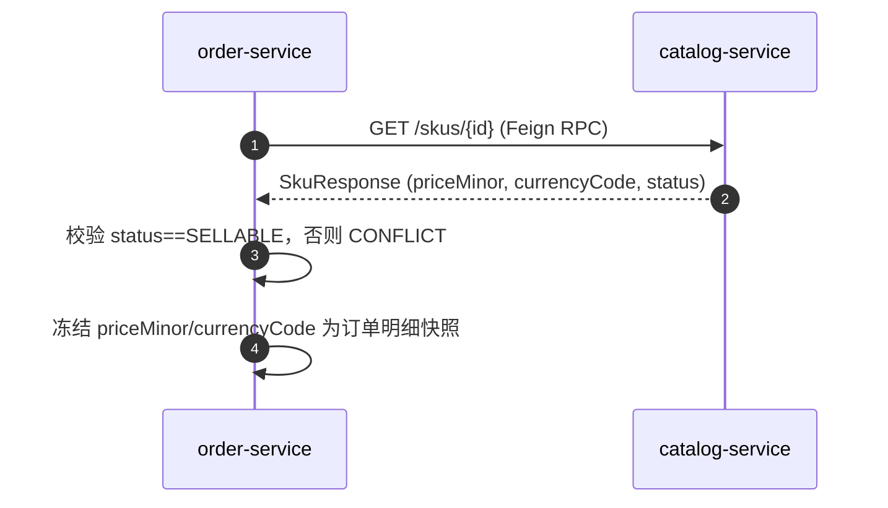

# catalog-service 系统设计

**服务**：catalog-service（商品 / SKU / 价格 / 可售性）
**端口**：8082 | **Schema**：`catalog` | **包根**：`com.payment.catalog`

> 标注约定：无标记 = 已实现；`[目标]` = 建议值待确认；`[待定]` = 留待后续；`[Phase N 延后]` = 明确延后。

---

> **章节结构**：遵循 [system-design-standard](../../standards/system-design-standard.md) 的 15 章骨架。
> 2026-09-22 文档治理将原 6 章结构重排为标准章号，**正文内容未删改**。

---

## 1. 职责（Responsibility）

商品（Product）生命周期、SKU 生命周期、SKU 价格（`priceMinor` 最小货币单位）、SKU 可售性判定、交付定义（delivery definition）、按唯一编码/ID 查询

### 1.1 技术指标（`[目标]`，待确认）

| 指标 | 目标值 |
|---|---|
| 创建/查询 SKU P99 | ≤ 300ms（本地 MySQL 单次读写） |
| 上架/激活/暂停状态迁移 P99 | ≤ 300ms |
| 商品目录可用性 | ≥ 99.9% |

> 以上为建议值，非已测得事实；当前无 catalog 专用业务埋点（见 §11.1）。

---

## 2. 不负责（Non-Responsibility）

订单金额确认/支付、促销/税费、价格快照的冻结与计算（下单时取 catalog 当前值后本地冻结）、跨服务写他 Schema 的任何表。**注：库存扣减现归 catalog 自有（见 §3.2 与 ADR-0041：Stock/StockReservation 聚合在此服务内，三段式预占→确认→释放）**

## 3. 上下文与约束（Context）

### 3.1 上下游依赖方向

- **上游依赖**：order-service（下单时只读校验 SKU 可售性 + 取价格快照，经 `GET /skus/{id}` 的 Feign RPC）
- **下游依赖**：无（catalog 自持 `products` / `skus`，不主动调用其他服务）

- **依赖方式**：跨服务交互一律经公开 REST / Feign RPC 或事件通道，**禁止**直接 SQL 他服务 Schema（Database-per-Service，见 [technical-solution.md §3.1](../technical-solution.md)）。

### 3.2 硬约束（Constitution / ADR）

- **数据所有权**：`products` / `skus` 仅属 catalog-service；order-service 只能经公开 RPC 读，禁止直接 SQL 本 Schema（technical-solution §3.1）。
- **金额铁律**：SKU 价格一律 `long` 最小货币单位（`priceMinor`）+ 币种 `currencyCode`，禁止 `float`/`double`；领域测试 [CatalogInvariantTest.java](../../../catalog-service/src/test/java/com/payment/catalog/domain/CatalogInvariantTest.java) 显式断言字段无浮点类型。
- **状态机显式**：Product / SKU 状态流转集中在领域方法（`list/unlist/archive`、`activate/suspend/discontinue`），禁止外部直改 `status`（见 [domain/Product.java](../../../catalog-service/src/main/java/com/payment/catalog/domain/Product.java) 与 [domain/Sku.java](../../../catalog-service/src/main/java/com/payment/catalog/domain/Sku.java)）。
- **可售性约束**：仅 `SELLABLE` 的 SKU 可被加入新订单（[domain/Sku.java](../../../catalog-service/src/main/java/com/payment/catalog/domain/Sku.java):114 `isSellable()`）；下单校验在 order-service 侧完成。
- **乐观锁**：并发状态迁移走 `version` 乐观锁，冲突抛 `CONFLICT`（[infra/persistence/sku/MybatisSkuRepository.java](../../../catalog-service/src/main/java/com/payment/catalog/infra/persistence/sku/MybatisSkuRepository.java):47）。

## 4. 领域模型（Domain Model）

### 4.1 聚合与值对象

| 类型 | 名称 | 位置 | 说明 |
|---|---|---|---|
| 聚合根 | `Product` | [domain/Product.java](../../../catalog-service/src/main/java/com/payment/catalog/domain/Product.java) | 商品身份（`productCode`）、类型、生命周期状态；价格不在 Product 上 |
| 聚合根 | `Sku` | [domain/Sku.java](../../../catalog-service/src/main/java/com/payment/catalog/domain/Sku.java) | 销售单元：商品引用、名称、`priceMinor`+`currencyCode`、交付定义、可售状态 |
| 值对象 | 价格（**内嵌，非独立实体**） | [domain/Sku.java](../../../catalog-service/src/main/java/com/payment/catalog/domain/Sku.java):18 | `long priceMinor` + `String currencyCode`，直接挂在 Sku 上，**未**封装为 `Money` 值对象 |
| 枚举 | `ProductStatus` | [domain/ProductStatus.java](../../../catalog-service/src/main/java/com/payment/catalog/domain/ProductStatus.java) | DRAFT / LISTED / UNLISTED / ARCHIVED |
| 枚举 | `SkuStatus` | [domain/SkuStatus.java](../../../catalog-service/src/main/java/com/payment/catalog/domain/SkuStatus.java) | DRAFT / SELLABLE / SUSPENDED / DISCONTINUED |
| 仓储接口 | `ProductRepository` / `SkuRepository` | [domain/](../../../catalog-service/src/main/java/com/payment/catalog/domain/) | 领域层接口，无持久化技术依赖 |
| 仓储实现 | `MybatisProductRepository` / `MybatisSkuRepository` | [infra/persistence/](../../../catalog-service/src/main/java/com/payment/catalog/infra/persistence/) | MyBatis-Plus 实现；另含 InMemory 实现仅供单测（`@Repository` 仅 MyBatis 版，内存版不注入 Spring） |

**基数关系（MVP）**：`Product (1) ─ (N) Sku`（`skus.product_id` 普通索引 `idx_skus_product_id`）。Price 非独立聚合，随 Sku 持久化。

### 4.2 表结构与索引策略

来源：[deployment/schema/02-catalog-schema.sql](../../../deployment/schema/02-catalog-schema.sql)（权威 DDL）。

**`products`**

| 列 | 类型 | 说明 |
|---|---|---|
| id | BIGINT PK AUTO_INCREMENT | 商品 ID |
| product_code | VARCHAR(64) NOT NULL | 商品编码，唯一 `uk_products_product_code` |
| name | VARCHAR(128) NOT NULL | 名称 |
| type | VARCHAR(32) NOT NULL | 类型 |
| status | VARCHAR(32) NOT NULL | 状态机枚举名 |
| created_at / updated_at / created_by / updated_by / version | — | 审计 + 乐观锁 |

**`skus`**

| 列 | 类型 | 说明 |
|---|---|---|
| id | BIGINT PK AUTO_INCREMENT | SKU ID |
| sku_code | VARCHAR(64) NOT NULL | SKU 编码，唯一 `uk_skus_sku_code` |
| product_id | BIGINT NOT NULL | 商品引用，普通索引 `idx_skus_product_id` |
| name | VARCHAR(128) NOT NULL | 名称 |
| price_minor | BIGINT NOT NULL | 价格（最小货币单位） |
| currency_code | VARCHAR(8) NOT NULL | 币种 |
| delivery_definition | VARCHAR(255) NOT NULL | 交付定义 |
| status | VARCHAR(32) NOT NULL | 状态机枚举名 |
| created_at / updated_at / created_by / updated_by / version | — | 审计 + 乐观锁 |

**索引策略（已实现）**：
- `products`：`uk_products_product_code`（编码唯一）。
- `skus`：`uk_skus_sku_code`（编码唯一）、`idx_skus_product_id`（按商品查 SKU）。

**分库分表键**：`[Phase 10 延后]` 当前单库单表；候选分片键为 `product_id`，留待有真实负载证据后再评估（Constitution §3.4）。

---

## 5. 状态机（State Machine）

**Product**（`ProductStatus`，[domain/Product.java](../../../catalog-service/src/main/java/com/payment/catalog/domain/Product.java):72）：

```text
DRAFT --list--> LISTED --unlist--> UNLISTED --archive--> ARCHIVED
```

- `list()`：DRAFT → LISTED（[domain/Product.java](../../../catalog-service/src/main/java/com/payment/catalog/domain/Product.java):72）。
- `unlist()`：LISTED → UNLISTED（:78，**领域已实现，但 §6 控制器未暴露端点 → 骨架**）。
- `archive()`：UNLISTED → ARCHIVED（:84，同上，未暴露端点）。
- 非法来源抛 `STATE_TRANSITION_VIOLATION`（:89 `requireStatus`）。

**Sku**（`SkuStatus`，[domain/Sku.java](../../../catalog-service/src/main/java/com/payment/catalog/domain/Sku.java):92）：

```text
DRAFT --activate--> SELLABLE --suspend--> SUSPENDED
SELLABLE/SUSPENDED --discontinue--> DISCONTINUED
```

- `activate()`：DRAFT → SELLABLE（:92）。
- `suspend()`：SELLABLE → SUSPENDED（:98）。
- `discontinue()`：SELLABLE/SUSPENDED → DISCONTINUED（:104，领域已实现、测试覆盖，但 §6 控制器未暴露端点 → 骨架）。
- `isSellable()`：仅 `SELLABLE` 返回 `true`（:114）。
- 非法来源抛 `STATE_TRANSITION_VIOLATION`（:118 `requireStatus`）。

## 6. 接口与事件契约（API / Event Contract）

### 6.1 创建商品

`POST /products` → `201 Created`（[controller](../../../catalog-service/src/main/java/com/payment/catalog/api/CatalogController.java):30）

**请求** `CreateProductRequest`：`{ productCode, name, type }`。
**响应** `ProductResponse`：`{ id, productCode, name, type, status }`（新建即 `DRAFT`）。
**规则**：`productCode` 重复 → `findByCode` 命中抛 `CONFLICT`（[application](../../../catalog-service/src/main/java/com/payment/catalog/application/CatalogApplicationService.java):26）。
**错误**：`CONFLICT`、`INVALID_ARGUMENT`（字段缺失）。

### 6.2 上架商品（DRAFT → LISTED）

`POST /products/{id}/list` → `200`（[controller](../../../catalog-service/src/main/java/com/payment/catalog/api/CatalogController.java):37）

**响应** `ProductResponse`。非 DRAFT 状态 → `STATE_TRANSITION_VIOLATION`。
**错误**：`NOT_FOUND`、`STATE_TRANSITION_VIOLATION`。

### 6.3 创建 SKU

`POST /skus` → `201 Created`（[controller](../../../catalog-service/src/main/java/com/payment/catalog/api/CatalogController.java):42）

**请求** `CreateSkuRequest`：`{ skuCode, productId, name, priceMinor(long), currencyCode, deliveryDefinition }`（价格以最小货币单位 `long` 传递）。
**响应** `SkuResponse`：`{ id, skuCode, productId, name, priceMinor, currencyCode, deliveryDefinition, status }`（新建即 `DRAFT`）。
**规则**：`skuCode` 重复 → `CONFLICT`（[application](../../../catalog-service/src/main/java/com/payment/catalog/application/CatalogApplicationService.java):45）。
**错误**：`CONFLICT`、`INVALID_ARGUMENT`。

### 6.4 激活 SKU（DRAFT → SELLABLE）

`POST /skus/{id}/activate` → `200`（[controller](../../../catalog-service/src/main/java/com/payment/catalog/api/CatalogController.java):55）

**响应** `SkuResponse`。非 DRAFT → `STATE_TRANSITION_VIOLATION`。
**错误**：`NOT_FOUND`、`STATE_TRANSITION_VIOLATION`。

### 6.5 暂停 SKU（SELLABLE → SUSPENDED）

`POST /skus/{id}/suspend` → `200`（[controller](../../../catalog-service/src/main/java/com/payment/catalog/api/CatalogController.java):60）

**响应** `SkuResponse`。非 SELLABLE → `STATE_TRANSITION_VIOLATION`。
**错误**：`NOT_FOUND`、`STATE_TRANSITION_VIOLATION`。

### 6.6 查询 SKU / 商品

`GET /skus/{id}` → `200`（[controller](../../../catalog-service/src/main/java/com/payment/catalog/api/CatalogController.java):65）
`GET /products/{id}` → `200`（[controller](../../../catalog-service/src/main/java/com/payment/catalog/api/CatalogController.java):70）

**响应**：对应的 `SkuResponse` / `ProductResponse`。
**错误**：`NOT_FOUND`。

> 备注：`DISCONTINUED`（SKU）与 `UNLISTED` / `ARCHIVED`（Product）状态机转移已在领域实现，但**控制器未暴露对应端点**（`unlist`/`archive`/`discontinue` 不可经 API 触发）→ 骨架。

### 6.7 出站 RPC（catalog → order，只读 SKU 校验 + 价格快照）

catalog-service **不主动调用** order-service。反向依赖由 order-service 发起：

- order-service 通过 `CatalogFeignClient`（`@FeignClient(name="catalog-service", url="${services.catalog.url:http://localhost:8082}")`，[order-service](../../../order-service/src/main/java/com/payment/order/infra/client/CatalogFeignClient.java):10）调 `GET /skus/{id}`。
- 响应镜像 `CatalogSkuDto`（[order-service](../../../order-service/src/main/java/com/payment/order/infra/client/CatalogSkuDto.java):9）映射为 order 侧 `SkuSnapshot`：`{ skuId, skuCode, name, priceMinor(long), currencyCode, sellable }`（[SkuSnapshot.java](../../../order-service/src/main/java/com/payment/order/application/SkuSnapshot.java):7）。
- order-service 在 `OrderApplicationService.doCreateOrder` 中：取 SKU → 校验 `sellable`（[order-service](../../../order-service/src/main/java/com/payment/order/application/OrderApplicationService.java):67）→ 否则 `CONFLICT`；取 `priceMinor`/`currencyCode` 冻结为订单明细价格快照（同文件 :77），并校验同单币种一致。
- 404 由 `FeignCatalogClient` 转 `NOT_FOUND`（[order-service](../../../order-service/src/main/java/com/payment/order/infra/client/FeignCatalogClient.java):27）。

> 注意：**校验“SKU 可售 + 价格快照”的逻辑在 order-service 侧**（读 catalog 数据后判断 `SELLABLE`），catalog-service 仅提供数据，未提供独立“校验/预留”RPC。

### 6.8 错误码枚举（全局，common-core `ErrorCodes`）

| 错误码 | 语义 | 本服务使用场景 |
|---|---|---|
| `INVALID_ARGUMENT` | 参数非法 | 字段缺失、混合币种（在 order 侧） |
| `NOT_FOUND` | 资源不存在 | 商品/SKU 不存在 |
| `CONFLICT` | 状态/并发冲突 | 编码重复、乐观锁并发更新 0 行命中 |
| `STATE_TRANSITION_VIOLATION` | 非法状态迁移 | 非法的 list/activate/suspend/discontinue |
| `DUPLICATE` | 幂等冲突 | （catalog 未使用，见 §9.1） |
| `INTERNAL_ERROR` | 内部错误 | — |

---

### 6.9 事件通道（消费，spec 029 / [ADR-0074](../../adr/0074-redis-transactional-message.md#adr-0074)，✅ 已实现）

| 方向 | 事件 | 对端 | 模式 | 处理 |
|---|---|---|---|---|
| 消费 | `order.paid` | ← order | 广播组之一 | 确认扣减库存（reserve → sold），幂等键 `order:{orderNo}:sku:{skuId}` |
| 消费 | `refund.succeeded` | ← order | 广播组之一 | 秒杀配额回补，幂等键 `refund:{TXRF}:sku:{skuId}` |
| 消费 | `order.cancelled` | ← order | 广播组之一 | 释放预占 + 回补秒杀（当前由 order 在关单流程内串行调用） |

**本服务不生产事件**：库存侧的事实最终以本库为准，无需对外广播。

**语义保持**：三段式（reserve → confirm → release）与「release 仅 PENDING 放行 → 不超回」的守卫**不变**；变化的只是触发方式由同步 RPC 改为订阅事件。

**已知限制（沿用现状）**：退款**不回补普通库存**（仅回补秒杀配额），源码注释「已确认的预占不回滚」。

**实现实况**（spec 029 批次 D，`com.payment.catalog.mq`）：

| 项 | 值 |
|---|---|
| 配置类 | `CatalogMqConfig`（`payment.mq.enabled=false` 回落同步 Feign） |
| 业务消费组 | `catalog`（消费名 `catalog-op` / `catalog-rs` / `catalog-oc`） |
| 幂等键 | `order.paid` → `"order:" + orderNo + ":sku:" + skuId`（确认预占）；`refund.succeeded` → `"refund:" + TXRF + ":sku:" + skuId`（秒杀回补） |
| 处理动作 | `CatalogMqHandlers`：`onOrderPaid` → `stockService.confirm(..., "PAY:" + paymentNo)`；`onRefundSucceeded` → `seckillService.rollback`；`onOrderCancelled` → `stockService.release` + `seckillService.rollback` |
| 无 checker | 本服务只消费、不生产事件，故无需回查 checker |

## 7. 运行链路（Runtime Flow）

### 7.1 创建商品 / SKU 与上架（含状态机）

`CatalogController.createProduct/createSku/listProduct/activateSku` → `CatalogApplicationService`（[application](../../../catalog-service/src/main/java/com/payment/catalog/application/CatalogApplicationService.java)）：

1. 编码唯一性：`findByCode` 回查；命中 → 抛 `CONFLICT`（非数据库唯一约束兜底，见 §9.1）。
2. 构造领域对象（状态初始 `DRAFT`）→ `repository.save`（插入或乐观锁更新）。
3. 状态迁移（如 `list`/`activate`）仅在当前状态合法时通过领域方法推进，非法抛 `STATE_TRANSITION_VIOLATION`。
4. `save` 落库；乐观锁冲突（更新 0 行）→ `CONFLICT`。

### 7.2 order-service 下单时的 SKU 校验 + 价格快照（跨服务 RPC）



- catalog 侧无状态变更，纯只读；可售性判定与快照冻结在 order-service 本地事务内完成（technical-solution §4.3.1）。
- 价格**不被** catalog 锁定/预留；若下单后 catalog 改价或停售，已落订单以自身快照为准（订单金额独立、不可变）。

### 7.3 状态机迁移（领域自持）

所有状态机迁移集中在 `Product` / `Sku` 领域方法，控制器只触发、不直改 `status`；并发由 `version` 乐观锁保护。无跨服务状态联动（catalog 状态变化不反向推 order/payment）。

---

## 8. 失败与恢复（Failure / Recovery）

### 8.1 异常与边界场景

| 场景 | 处理 | 规则 |
|---|---|---|
| 商品/SKU 编码重复 | 应用层 `findByCode` 命中 → `CONFLICT` | 非并发时干净返回 |
| 并发重复创建 | MySQL 唯一约束冲突 → `DuplicateKeyException` 未捕获 | `[待定]` 应转 `CONFLICT`（骨架差距） |
| 非法状态迁移 | 领域 `requireStatus` 抛 `STATE_TRANSITION_VIOLATION` | 终态不可被错误来源覆盖 |
| 乐观锁并发更新 | `updateById` 0 行 → `CONFLICT` | 防止并发直改状态覆盖 |
| 下单引用了已停售/失效 SKU | order-service 侧 `sellable==false` → `CONFLICT` | catalog 不感知订单 |
| 下单后 catalog 改价/停售 | 订单以本地快照为准，catalog 不回写 | 价格独立不可变 |

**超时/重试/降级阈值（`[目标]`，待确认）**：
- 出站 Feign（order → catalog）超时：使用 OpenFeign 默认值；`[目标]` connectTimeout=1s、readTimeout=3s。
- 熔断/降级：`[Phase 按需延后]` Resilience4j/Sentinel 延迟引入。

---

## 9. 幂等 / 一致性 / 并发（Idempotency / Consistency / Concurrency）

### 9.1 幂等性方案

| 作用域 | 机制 | 成熟度 |
|---|---|---|
| 商品/SKU 编码唯一 | `uk_products_product_code` / `uk_skus_sku_code` DDL 唯一约束 + 应用层 `findByCode` 先查 | 骨架 |
| 并发重复创建 | 应用层 check-then-save（非原子）；真正并发冲突将由 MySQL 唯一约束抛 `DuplicateKeyException`，**当前未捕获转 `CONFLICT`/幂等响应** → 可能以 500 暴露 | 骨架 |
| 资金入口幂等键 | **不适用**（catalog 非资金入口；Constitution 不要求幂等键） | — |

> 与 payment-service 的“幂等键 + `DuplicateKeyException` 捕获回查”相比，catalog 仅依赖唯一约束 + 应用层先查，未实现 DB 级异常兜底。属已知差距，不影响主链路正确性（编码重复属业务冲突）。

### 9.2 分布式事务方案

- 单服务内：商品/SKU 创建与状态迁移在应用服务本地事务原子提交。
- 跨服务：catalog **只读**提供数据，order-service 本地冻结快照；catalog 不参与任何跨服务写，无 Saga/补偿需求（符合 technical-solution §4.5）。

## 10. 数据与存储（Data / Storage）

### 10.1 存储读写策略

- **写路径**：`MybatisProductRepository` / `MybatisSkuRepository` 在应用服务内写 `products` / `skus`；状态机逻辑在领域层，持久层只存枚举名（[SkuEntity](../../../catalog-service/src/main/java/com/payment/catalog/infra/persistence/sku/SkuEntity.java):70 `setStatus(status.name())`）。
- **读路径**：`findById` / `findByCode`（按编码唯一查）；order-service 走 `findById`（`GET /skus/{id}`）。
- **缓存**：`SkuCache` 采用 **Cache-Aside**（Redis，`StringRedisTemplate`，TTL 300s，**fail-open**）——SKU 读优先命中缓存、未命中回源 MySQL 并回填；压测佐证：默认配置下 MySQL DB 卸载 **99.98%**（`deployment/performance/results/2026-09-02-catalog-perf-report.html`）。秒杀库存由 `SeckillStockService` 经 **Redis Lua 原子预扣**（**fail-closed**，库存不足直接拒）。非秒杀的商品/SKU 写路径仍直连 MySQL，保持强一致。

## 11. 可观测性与安全（Observability / Security）

### 11.1 埋点与日志键（本服务）

- **业务指标（Micrometer）**：`[待定]` 当前**未定义** catalog 专用业务埋点（如 `catalog.product.created` / `catalog.sku.sellable`）；仅 `management` 暴露 `health/info/metrics/prometheus`。
- **资金审计日志**：catalog 非资金入口，**无 `FINANCIAL_AUDIT` 日志**要求。
- **关联字段**：`traceId` 由公共 `TraceContext` / Feign 拦截器跨服务传播；catalog 经 RPC 被调用时透传，但本服务未额外打点。

> 若后续需观测目录写入量/状态迁移量，建议在 `CatalogApplicationService` 接入 `BusinessMetrics`（参照 payment-service §11.1），当前为 `[待定]`。

## 12. 部署（Deployment）

- **进程与端口**：`catalog-service` :8082；单机多进程部署，独立进程 / 独立端口 / 独立部署单元（整体部署形态见 [technical-solution.md §6](../technical-solution.md) 与 [diagrams/08-deployment](../diagrams/08-deployment.puml)）。

### 12.1 运行态配置（application.yml）

来源：[application.yml](../../../catalog-service/src/main/resources/application.yml)

```yaml
spring:
  application:
    name: catalog-service
  datasource:
    url: jdbc:mysql://localhost:3306/catalog?useSSL=false&serverTimezone=UTC&allowPublicKeyRetrieval=true
    username: root
    password: root
    driver-class-name: com.mysql.cj.jdbc.Driver
server:
  port: 8082
management:
  endpoints.web.exposure.include: health,info,metrics,prometheus
mybatis-plus:
  configuration.map-underscore-to-camel-case: true
```

### 12.2 环境变量清单（dev / test / prod 差异化项，`[目标]` 建议）

| 配置项 | dev（默认） | test | prod（`[目标]`） |
|---|---|---|---|
| `spring.datasource.url` | `jdbc:mysql://localhost:3306/catalog` | Testcontainers MySQL | 环境变量/配置中心指向生产实例 |
| `spring.datasource.username/password` | root/root | — | 环境变量注入，禁止硬编码 |
| `server.port` | 8082 | 随机 | 8082（或编排指定） |
| `services.catalog.url` | `http://localhost:8082`（order 侧 Feign） | fake | Nacos 服务发现（去掉硬编码 url） |
| 连接池大小 | 默认 10 | — | `[目标]` 按并发调优 |

### 12.3 启动依赖顺序

```text
1. MySQL 8.0 就绪（catalog schema 由 deployment/schema/02-catalog-schema.sql 建库建表）
2. Nacos 就绪（注册 + 配置）  [目标：生产启用；当前本地直连 MySQL，未强制依赖 Nacos]
3. 启动 catalog-service（端口 8082），完成 MyBatis-Plus Mapper 装配
4. order-service 可延后就绪（下单 RPC 失败可容错，不阻塞 catalog 启动）
```

## 13. 测试与验证（Testing / Verification）

### 13.1 验证方式

- **领域 / 单元测试**：金额、状态迁移、幂等等领域不变量以纯单测覆盖，源码位于 [`catalog-service/src/test/java/`](../../../catalog-service/src/test/java/)。
- **集成测试**：Spring Boot 上下文 + H2 载体（项目既定测试载体，见 [ADR-0081](../../adr/0081-test-carrier-and-schema-replayability.md)）；E2E 默认 `skipTests`，按需显式启用（见 [engineering-standards.md §测试](../../guides/engineering-standards.md)）。
- **架构不变量**：`deployment/architecture-tests` 的 ArchUnit 规则在 `./mvnw -B verify` 中执行。
- **端到端 / 演示验证**：`deployment/demo/*.sh` 与 `mock-channel-web`（:8091）演示控制台；全链路追踪用 `/demo/trace?orderId=`。

## 14. 相关文档（Related Documents）

### 14.1 本文明文引用的 ADR

`ADR-0041`、`ADR-0074`

> 完整索引见 [docs/adr/README.md](../../adr/README.md)，落点追溯见 [docs/adr/traceability.md](../../adr/traceability.md)。

### 14.2 本文明文引用的 Spec

`spec 029`

> Spec 索引见 [docs/specs/README.md](../../specs/README.md)。

### 14.3 相关图

- [01-system-context](../diagrams/01-system-context.puml)（C4 L1）
- [02-container-overview](../diagrams/02-container-overview.puml)（C4 L2）
- [08-deployment](../diagrams/08-deployment.puml)（C4 Deployment）

### 14.4 关联文档

- [technical-solution.md](../technical-solution.md)（全局当前事实）
- [roadmap.md](../roadmap.md)（阶段与状态）
- [system-design-standard.md](../../standards/system-design-standard.md)（本文件遵循的规范）
- [code-debt-backlog.md](../../operations/code-debt-backlog.md)（已知缺口台账）

## 15. 已知缺口（Known Gaps）

### 15.1 当前缺口登记

本节只登记**已确认的当前缺口与显式接受的风险**，不登记未来设计。与 catalog-service 相关的已知缺口见 [code-debt-backlog.md](../../operations/code-debt-backlog.md) 与 [stage-05 design-review.md](../../specs/stage-05-channel-and-finance-deepening/design-review.md)。
