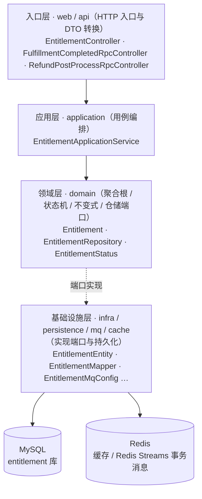
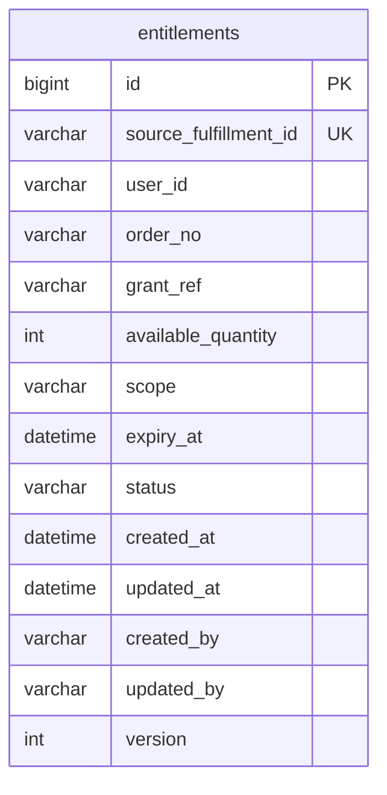
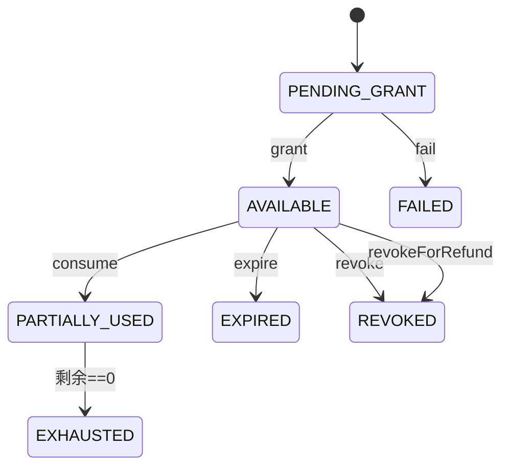
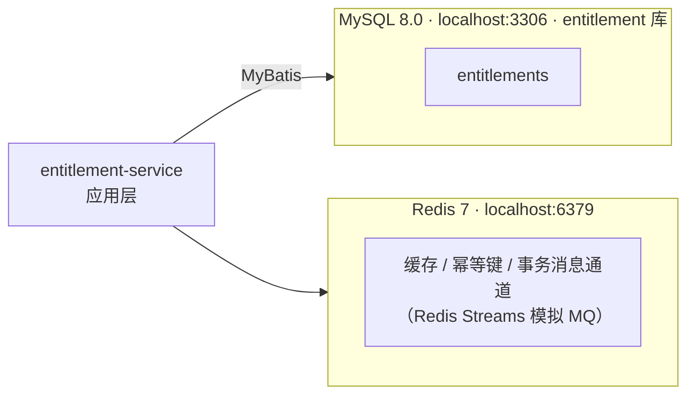

# entitlement-service 系统设计

**服务**：entitlement-service（权益授予 / 撤销 / 查询）
**端口**：8087 | **Schema**：`entitlement` | **包根**：`com.payment.entitlement`

> 标注约定：无标记 = 已实现；`[目标]` = 建议值待确认；`[待定]` = 留待后续；`[Phase N 延后]` = 明确延后。

---

> **章节结构**：遵循 [system-design-standard](../../standards/system-design-standard.md) 的 15 章骨架。
> 2026-09-22 文档治理将原 6 章结构重排为标准章号，**正文内容未删改**。

---

## 1. 职责（Responsibility）

权益聚合、权益状态机、由「履约完成」触发的权益授予、由「退款成功」触发的权益撤销、按 ID 查询权益、授予幂等（sourceFulfillmentId）、乐观锁并发保护

### 1.1 技术指标（`[目标]`，待确认）

| 指标 | 目标值 |
|---|---|
| 授予（履约完成 RPC）P99 | ≤ 300ms（单次 MySQL 写 + 幂等回查） |
| 权益查询 P99 | ≤ 200ms |
| 退款后撤销 P99 | ≤ 300ms |
| 授予入口可用性 | ≥ 99.9% |

---

## 2. 不负责（Non-Responsibility）

支付/履约状态判断（不读 payment/fulfillment 表）；金额收取；履约交付本身；退款整体决策（归属 payment-service 退款域）；消费核销的实际业务落账（仅领域方法，未接 API）

## 3. 上下文与约束（Context）

### 3.1 上下游依赖方向

- **上游依赖**：fulfillment-service（履约完成后同步请求授予权益）、payment-service 的 refund 包（退款成功后同步请求撤销权益，Feature 015 起原独立 refund-service 已并入）
- **下游依赖**：无跨服务 SQL；仅自身 `entitlement` Schema（Database-per-Service）

- **依赖方式**：跨服务交互一律经公开 REST / Feign RPC 或事件通道，**禁止**直接 SQL 他服务 Schema（Database-per-Service，见 [technical-solution.md §3.1](../technical-solution.md)）。

### 3.2 硬约束（Constitution / ADR）

- **Payment Success ≠ Entitlement Granted**：支付成功是财务事件，权益是消费权利。权益**仅由「履约完成」RPC 触发授予**，支付成功只经 fulfillment-service 间接传导，绝不反向直连 payment 状态或改写其数据（Constitution #3）。
- **状态机集中**：权益状态只允许通过 `Entitlement` 领域方法迁移（`grant/consume/expire/revoke/revokeForRefund/fail`），禁止外部直接 set（见 [Entitlement.java](../../../entitlement-service/src/main/java/com/payment/entitlement/domain/Entitlement.java)）。
- **幂等**：授予以 `sourceFulfillmentId` 为幂等键，数据库唯一索引兜底；重复投递同一履约完成请求不会创建第二条权益。
- **退款不伪造成功**：`revokeForRefund()` 对非 AVAILABLE 状态返回 `false` 不抛异常，不伪造「已撤销」成功（保留退款事实，留人工）。
- **无跨服务 SQL**：entitlement-service 只读写自有 `entitlement` Schema，从不直连其他服务库。


### 3.3 内部分层与模块

下图由 `deployment/tools/gen-module-diagrams.py` 扫描 `entitlement-service/src/main/java` **自动生成**，反映真实的包与类分布（DTO 不计入）。


### 3.4 内部分层与模块

下图由 `deployment/tools/gen-module-diagrams.py` 扫描 `entitlement-service/src/main/java` **自动生成**，反映真实的包与类分布（DTO 不计入）。


<!-- diagram:module -->
<!-- AUTO-GENERATED by deployment/tools/gen-module-diagrams.py — 请勿手改 -->

<!-- /diagram:module -->


## 4. 领域模型（Domain Model）

### 4.1 聚合与值对象

| 类型 | 名称 | 位置 | 说明 |
|---|---|---|---|
| 聚合根 | `Entitlement` | [domain/Entitlement.java](../../../entitlement-service/src/main/java/com/payment/entitlement/domain/Entitlement.java) | 一项用户消费权利；含状态机与剩余量 |
| 枚举 | `EntitlementStatus` | [domain/EntitlementStatus.java](../../../entitlement-service/src/main/java/com/payment/entitlement/domain/EntitlementStatus.java) | PENDING_GRANT / AVAILABLE / PARTIALLY_USED / EXHAUSTED / EXPIRED / REVOKED / FAILED |
| 仓储接口 | `EntitlementRepository` | [domain/EntitlementRepository.java](../../../entitlement-service/src/main/java/com/payment/entitlement/domain/EntitlementRepository.java) | 依赖倒置：domain 声明，infra 实现 |
| 持久化实体 | `EntitlementEntity` | [infra/persistence/entitlement/EntitlementEntity.java](../../../entitlement-service/src/main/java/com/payment/entitlement/infra/persistence/entitlement/EntitlementEntity.java) | PO，仅承载表列，继承 `BaseEntity` |
| Mapper | `EntitlementMapper` | [infra/persistence/entitlement/EntitlementMapper.java](../../../entitlement-service/src/main/java/com/payment/entitlement/infra/persistence/entitlement/EntitlementMapper.java) | MyBatis-Plus `BaseMapper` |

**基数关系（MVP）**：`Order/履约 (1) ─ (N) Entitlement`，每权益由唯一 `sourceFulfillmentId` 关联一次履约完成事件（唯一约束，1:1）。

### 4.2 表结构与索引策略

来源：[deployment/schema/05-entitlement-schema.sql](../../../deployment/schema/05-entitlement-schema.sql)（权威 DDL，Database-per-Service 自有库 `entitlement`）。

**`entitlements`**

| 列 | 类型 | 说明 |
|---|---|---|
| id | BIGINT PK AUTO_INCREMENT | 权益 ID |
| user_id | VARCHAR(64) NOT NULL | 用户引用 |
| order_id | VARCHAR(64) NOT NULL | 订单引用（退款按订单撤销用） |
| source_fulfillment_id | VARCHAR(64) NOT NULL | 幂等键，唯一 `uk_entitlements_source_fulfillment_id` |
| grant_ref | VARCHAR(64) | 授予引用（当前未回填，[待定]） |
| available_quantity | INT NOT NULL | 剩余可用量（最小整数单位） |
| scope | VARCHAR(64) NOT NULL | 权益范围/类型标识（当前固定 "default"） |
| expiry_at | DATETIME | 过期时间（当前为 null） |
| status | VARCHAR(32) NOT NULL | 状态机枚举名 |
| created_at / updated_at / created_by / updated_by / version | — | 审计 + 乐观锁（BaseEntity） |

**索引策略（已实现）**：
- `uk_entitlements_source_fulfillment_id`：授予幂等兜底，保证同一履约完成事件只授予一次。
- 读路径：`findById`（PK）、`findBySourceFulfillmentId`（唯一索引）、`findByOrderId`（全表扫，[目标] 加 `idx_entitlements_order_id`）。

---


### 4.3 表关系（ER 图）

由 `deployment/tools/gen-er-diagrams.py` 从 `deployment/schema/*.sql` 解析**自动生成**，字段与真实 Schema 一致。
⚠️ 图内只出现**同库**关系：跨服务引用一律走业务单号、不建外键（[ADR-0063](../../adr/0063-cross-service-reference-by-business-no.md)），因此不存在跨库连线。


### 4.4 表关系（ER 图）

由 `deployment/tools/gen-er-diagrams.py` 从 `deployment/schema/*.sql` 解析**自动生成**，字段与真实 Schema 一致。
⚠️ 图内只出现**同库**关系：跨服务引用一律走业务单号、不建外键（[ADR-0063](../../adr/0063-cross-service-reference-by-business-no.md)），因此不存在跨库连线。


<!-- diagram:er -->
<!-- AUTO-GENERATED by deployment/tools/gen-er-diagrams.py — 请勿手改 -->

<!-- /diagram:er -->


## 5. 状态机（State Machine）

**Entitlement**（`EntitlementStatus`，[源码](../../../entitlement-service/src/main/java/com/payment/entitlement/domain/Entitlement.java)）：

```text
PENDING_GRANT --grant()--> AVAILABLE --consume(qty)--> PARTIALLY_USED (剩余>0)
                                  |                         \--(剩余==0)--> EXHAUSTED
                                  |--expire()--> EXPIRED
                                  |--revoke()--> REVOKED
                                  |--revokeForRefund()--> REVOKED (幂等, 非 AVAILABLE 返回 false)
PENDING_GRANT --fail(reason)--> FAILED
```

- `grant()`：PENDING_GRANT → AVAILABLE（[Entitlement.java:55](../../../entitlement-service/src/main/java/com/payment/entitlement/domain/Entitlement.java#L55)）。
- `consume(qty)`：AVAILABLE/PARTIALLY_USED → PARTIALLY_USED 或 EXHAUSTED；`qty<=0` 或 `qty>availableQuantity` 抛 `AMOUNT_INVARIANT_VIOLATION`（[Entitlement.java:64](../../../entitlement-service/src/main/java/com/payment/entitlement/domain/Entitlement.java#L64)）。
- `expire()`：AVAILABLE → EXPIRED（[Entitlement.java:81](../../../entitlement-service/src/main/java/com/payment/entitlement/domain/Entitlement.java#L81)）。
- `revoke()`：AVAILABLE → REVOKED，非法来源抛 `STATE_TRANSITION_VIOLATION`（[Entitlement.java:87](../../../entitlement-service/src/main/java/com/payment/entitlement/domain/Entitlement.java#L87)）。
- `revokeForRefund()`：AVAILABLE → REVOKED；已 REVOKED 或非 AVAILABLE 返回 `false`（[Entitlement.java:100](../../../entitlement-service/src/main/java/com/payment/entitlement/domain/Entitlement.java#L100)）。
- `fail(reason)`：PENDING_GRANT → FAILED（[Entitlement.java:112](../../../entitlement-service/src/main/java/com/payment/entitlement/domain/Entitlement.java#L112)）。

**不变量**：所有迁移经 `requireState/requireAnyState` 校验；非法迁移抛 `STATE_TRANSITION_VIOLATION`（[Entitlement.java:117](../../../entitlement-service/src/main/java/com/payment/entitlement/domain/Entitlement.java#L117)）。


### 5.1 状态迁移图

由 `deployment/tools/gen-sysdoc-diagrams.py` 从**本章上文的迁移文本**转换而来，不引入文中没有的状态或迁移。


### 5.2 状态迁移图

由 `deployment/tools/gen-sysdoc-diagrams.py` 从**本章上文的迁移文本**转换而来，不引入文中没有的状态或迁移。


<!-- diagram:state -->
<!-- AUTO-GENERATED by deployment/tools/gen-sysdoc-diagrams.py — 请勿手改 -->

<!-- /diagram:state -->


## 6. 接口与事件契约（API / Event Contract）

### 6.1 履约完成 → 授予权益（内部 RPC，供 fulfillment-service）

`POST /internal/entitlements/on-fulfillment-completed` → `200`

**请求** `FulfillmentCompletedRequest`（common-dto）：`{ fulfillmentId: Long, orderNo: String, userId: String }`（ADR-0063 业务单号）

**响应** `EntitlementGrantedResponse`：`{ entitlementId: Long, status: String }`（status 为 `EntitlementStatus` 枚举名）。

**幂等规则**：同 `fulfillmentId` 重复投递 → 命中已有权益直接返回（不新建）。授予失败（领域异常）→ 落 FAILED 并计数。

**错误**：`NOT_FOUND`（不在此接口）、`STATE_TRANSITION_VIOLATION`（仅在并发/异常时）、`CONFLICT`（乐观锁冲突）。

### 6.2 退款成功 → 撤销权益（内部 RPC，供 payment-service 退款域）

`POST /internal/entitlements/on-refund` → `200`

**请求** `RefundPostProcessRequest`：`{ refundNo: String, paymentNo: String, orderNo: String, userId: String, reason: String }`（ADR-0063 业务单号）

**响应** `RefundPostProcessResponse`：`{ refundNo: String, status: "REVOKED"|"NOOP" }`；按订单撤销全部 AVAILABLE 权益，撤销≥1 条返回 REVOKED，无权益返回 NOOP。

**规则**：非 AVAILABLE 权益不自动撤销（留人工），不伪造成功（[EntitlementApplicationService.java:64](../../../entitlement-service/src/main/java/com/payment/entitlement/application/EntitlementApplicationService.java#L64)）。

### 6.3 查询权益

`GET /entitlements/{id}` → `200`

**响应** `EntitlementResponse`：`{ id, userId, orderNo, status, availableQuantity }`（[EntitlementResponse.java](../../../entitlement-service/src/main/java/com/payment/entitlement/api/EntitlementResponse.java)）。

**错误**：`NOT_FOUND`。

### 6.4 错误码枚举（全局，common-core `ErrorCodes`）

| 错误码 | 语义 | 本服务使用场景 |
|---|---|---|
| `INVALID_ARGUMENT` | 参数非法 | （预留） |
| `NOT_FOUND` | 资源不存在 | 权益不存在（§3.3） |
| `CONFLICT` | 并发冲突 | 乐观锁更新 0 行（[MybatisEntitlementRepository.java:64](../../../entitlement-service/src/main/java/com/payment/entitlement/infra/persistence/entitlement/MybatisEntitlementRepository.java#L64)） |
| `STATE_TRANSITION_VIOLATION` | 非法状态迁移 | 重复 grant / 非 AVAILABLE 消费 / 非法 revoke/expire |
| `AMOUNT_INVARIANT_VIOLATION` | 数量不变量 | consume qty≤0 或超可用量 |
| `INTERNAL_ERROR` | 内部错误 | （预留） |

> 消费/过期/手动撤销（consume/expire/revoke）**领域已实现但未暴露任何 RPC/API**，属 骨架（见 §6 矛盾点）。

---

### 6.5 事件通道（消费，spec 029 / [ADR-0074](../../adr/0074-redis-transactional-message.md#adr-0074)，✅ 已实现）

| 方向 | 事件 | 对端 | 模式 | 替代的原同步调用 |
|---|---|---|---|---|
| 消费 | `fulfillment.completed` | ← fulfillment | 点对点 | §3.1 履约完成 → 授予权益（内部 RPC） |
| 消费 | `fulfillment.revoked` | ← fulfillment | 点对点 | §3.2 退款成功 → 撤销权益（内部 RPC） |

**幂等**：授予按 `sourceFulfillmentId` 唯一；回收为 AVAILABLE → REVOKED 终态迁移，已终态则 NOOP。重复投递安全。

**触发方不变**：权益仍只由 fulfillment 触发，order 不直调本服务；改为事件后这一点保持不变。

**Redis 依赖**：本服务需新增 `spring-boot-starter-data-redis`（ADR-0074 D11），仅用于消费，不做缓存 / 计数。

**实现实况**（spec 029 批次 D，`com.payment.entitlement.mq`）：

| 项 | 值 |
|---|---|
| 配置类 | `EntitlementMqConfig`（`payment.mq.enabled=false` 回落同步 Feign） |
| 业务消费组 | `entitlement`（消费名 `et-fc` / `et-fr`） |
| 处理动作 | `EntitlementMqHandlers`：`onFulfillmentCompleted` → `grantOnFulfillmentCompleted`；`onFulfillmentRevoked` → `revokeOnRefund` |
| 无 checker | 本服务只消费、不生产事件，故无需回查 checker |
| traceId 继承 | 消费时 MDC 恢复信封 traceId；本服务不生产新事件，链路止于权益（FR-604 的链路延续在 fulfillment → entitlement 段） |

## 7. 运行链路（Runtime Flow）

### 7.1 履约完成授予权益

`FulfillmentCompletedRpcController.onFulfillmentCompleted` → `EntitlementApplicationService.grantOnFulfillmentCompleted`（[源码](../../../entitlement-service/src/main/java/com/payment/entitlement/application/EntitlementApplicationService.java#L33)）：

1. `repository.findBySourceFulfillmentId(fulfillmentId)` 回查；命中 → 直接返回已有权益（**幂等**）。
2. `newEntitlement(...)` 构造 PENDING_GRANT 权益（当前固定 `availableQuantity=1, scope="default", expiryAt=null`，[EntitlementApplicationService.java:54](../../../entitlement-service/src/main/java/com/payment/entitlement/application/EntitlementApplicationService.java#L54)）。
3. `e.grant()`：PENDING_GRANT → AVAILABLE；若领域异常 → `e.fail(reason)` 并落 FAILED、计数 `entitlement.grant.failed`。
4. `repository.save(e)` 持久化；成功计数 `entitlement.granted`。
5. 返回 `EntitlementGrantedResponse`。

**关键点**：授予只由 fulfillment-service 调用触发，与 payment 完全解耦（Constitution #3）。

### 7.2 退款成功撤销权益

`RefundPostProcessRpcController.onRefund` → `EntitlementApplicationService.revokeOnRefund`（[源码](../../../entitlement-service/src/main/java/com/payment/entitlement/application/EntitlementApplicationService.java#L64)）：

1. `repository.findByOrderNo(orderNo)` 取该订单全部权益。
2. 空 → 返回 `NOOP`；否则逐条 `revokeForRefund()`，撤销成功计数。
3. 撤销≥1 条返回 `REVOKED`，否则 `NOOP`；不抛异常、不反写退款成功事实。

### 7.3 调用链全景（Constitution 边界）

```text
payment-service ──RPC──> fulfillment-service ──履约完成 RPC──> entitlement-service (grant)
payment-service（退款域） ──退款后处理 RPC──> entitlement-service (revokeForRefund)
```

- 支付成功**只触发**履约，不决定履约/权益最终状态（[technical-solution §4.3.4](../technical-solution.md)）。
- 权益授予失败保留履约事实，可重试/人工补发，不重复扣款。

---

## 8. 失败与恢复（Failure / Recovery）

### 8.1 异常与边界场景

| 场景 | 处理 | 阈值/规则 |
|---|---|---|
| 重复履约完成投递 | `findBySourceFulfillmentId` 命中返回已有 | 幂等，不新建 |
| 并发重复授予 | 唯一索引兜底；但 `DuplicateKeyException` 未捕获吸收（[待定] 修复） | 当前可能上抛 5xx |
| 乐观锁冲突更新 | `updateById` 0 行 → `CONFLICT` | 杜绝并发覆盖状态 |
| 非 AVAILABLE 消费 | `consume` 抛 `STATE_TRANSITION_VIOLATION` | 领域级防护（未接 API） |
| 退款撤销已消费/过期权益 | `revokeForRefund` 返回 false | 不伪造成功，留人工 |
| 授予领域异常 | `fail(reason)` 落 FAILED + 计数 | 保留失败事实 |

**超时/重试/降级阈值（`[目标]`，待确认）**：
- 入站同步 RPC 超时：用 Web 容器默认；`[目标]` 增 Servlet/Feign 超时 1s/3s。
- 重试：调用方（fulfillment/refund）对授予/撤销做幂等重试；entitlement 侧靠唯一索引 + 幂等方法保证安全。
- 熔断/降级：`[Phase 按需延后]` 未引入 Resilience4j。

---

## 9. 幂等 / 一致性 / 并发（Idempotency / Consistency / Concurrency）

### 9.1 幂等性方案

| 作用域 | 机制 |
|---|---|
| 授予（履约完成） | `uk_entitlements_source_fulfillment_id` 唯一约束 + 先回查 `findBySourceFulfillmentId`；命中即返回已有权益 |
| 退款撤销 | 按订单逐条 `revokeForRefund()` 幂等（已 REVOKED/非 AVAILABLE 返回 false，不重复撤销） |
| 并发状态迁移 | `version` 乐观锁，`updateById` 0 行 → `CONFLICT` |

> **矛盾点**：`grantOnFulfillmentCompleted` 未加 `@Transactional`，且未捕获 `DuplicateKeyException`（对比 payment-service 有捕获回查）。并发重复投递若同时越过 `findBySourceFulfillmentId` 回查，第二次 `insert` 会因唯一索引抛 `DuplicateKeyException` 而未被吸收，直接上抛 5xx。属 骨架级可靠性缺口（见 §6）。

### 9.2 分布式事务方案

- 单服务内：grant/revoke 各自一次 `save`，无跨聚合事务（单一聚合根）。
- 跨服务：履约→授予、退款→撤销均为同步 RPC 后置副作用，靠**幂等重试 / 人工补发**最终一致；拒绝 2PC/XA。授予失败不回滚履约事实（Constitution #3）。

## 10. 数据与存储（Data / Storage）

### 10.1 存储读写策略

- **写路径**：`MybatisEntitlementRepository.save`（[源码](../../../entitlement-service/src/main/java/com/payment/entitlement/infra/persistence/entitlement/MybatisEntitlementRepository.java#L54)）：新增 `insert`，更新走 `updateById` 乐观锁（version），0 行命中抛 `CONFLICT`；状态机逻辑在领域层，持久层只存枚举名。
- **读路径**：`findById` / `findBySourceFulfillmentId` / `findByOrderId`。
- **缓存**：`[已评估·本期不引入]` 当前**无 Redis/本地缓存**，全部直连 MySQL；权益状态需强一致，不引入 Cache-Aside。Redis 已在平台引入（ADR-0044），本服务经评估**不使用**（状态需强一致）；未来若出现只读热点须另立 ADR。


### 10.2 存储拓扑

由 `deployment/tools/gen-sysdoc-diagrams.py` 依据 `application.yml` 的数据源/Redis 配置与 `deployment/schema/*.sql` 的表清单**自动生成**。


### 10.3 存储拓扑

由 `deployment/tools/gen-sysdoc-diagrams.py` 依据 `application.yml` 的数据源/Redis 配置与 `deployment/schema/*.sql` 的表清单**自动生成**。


<!-- diagram:storage -->
<!-- AUTO-GENERATED by deployment/tools/gen-sysdoc-diagrams.py — 请勿手改 -->

<!-- /diagram:storage -->


## 11. 可观测性与安全（Observability / Security）

### 11.1 埋点与日志键（本服务）

**业务指标（Micrometer，`BusinessMetrics`）**：

| 指标键 | 类型 | 维度 | 说明 |
|---|---|---|---|
| `entitlement.granted` | counter | module=entitlement | 授予成功 |
| `entitlement.grant.failed` | counter | module=entitlement | 授予领域失败（落 FAILED） |

> 退款撤销、查询、消费暂无独立指标（`[目标]` 增补 `entitlement.revoked` / `entitlement.consumed` 等）。

**资金/权益审计日志**：`[待定]` 当前未引入 `FINANCIAL_AUDIT` 结构化审计（对比 payment-service §11.1）；授予/撤销属重要业务事实，建议后续补齐单行 JSON 审计（含 `traceId`、`sourceFulfillmentId`、状态迁移）。

**关联字段**：`traceId`（`TraceContext` / `TraceIdFilter` 跨服务传播，`TraceIdRequestInterceptor` 透传 Feign），需在出站/入站 RPC 接入（[待定]）。

---

## 12. 部署（Deployment）

- **进程与端口**：`entitlement-service` :8087；单机多进程部署，独立进程 / 独立端口 / 独立部署单元（整体部署形态见 [technical-solution.md §6](../technical-solution.md) 与 [diagrams/08-deployment](../diagrams/08-deployment.puml)）。

### 12.1 运行态配置（application.yml）

来源：[application.yml](../../../entitlement-service/src/main/resources/application.yml)

```yaml
spring:
  application:
    name: entitlement-service
  datasource:
    url: jdbc:mysql://localhost:3306/entitlement?useSSL=false&serverTimezone=UTC&allowPublicKeyRetrieval=true
    username: root
    password: root
    driver-class-name: com.mysql.cj.jdbc.Driver
server:
  port: 8087
management:
  endpoints.web.exposure.include: health,info,metrics,prometheus
mybatis-plus:
  configuration:
    map-underscore-to-camel-case: true
```

### 12.2 环境变量清单（dev / test / prod 差异化项，`[目标]` 建议）

| 配置项 | dev（默认） | test | prod（`[目标]`） |
|---|---|---|---|
| `spring.datasource.url` | `jdbc:mysql://localhost:3306/entitlement` | Testcontainers MySQL | 环境变量/配置中心，指向生产实例 |
| `spring.datasource.username/password` | root/root | — | 环境变量注入，禁止硬编码 |
| `server.port` | 8087 | 随机 | 8087（或编排指定） |
| 连接池 `spring.datasource.hikari.maximum-pool-size` | 默认 10 | — | `[目标]` 按并发调优 |
| 出站依赖（fulfillment/refund 调用方地址） | 调用方 Feign 默认 | — | Nacos 服务发现（去掉硬编码 url） |

### 12.3 启动依赖顺序

```text
1. MySQL 8.0 就绪（entitlement schema 由 deployment/schema/05-entitlement-schema.sql 建库建表）
2. Nacos 就绪（注册 + 配置）  [目标：生产启用；当前本地直连 MySQL]
3. 启动 entitlement-service（端口 8087），完成 Mapper 装配（@MapperScan）
4. 上游 fulfillment-service / payment-service（退款域）可延后就绪（RPC 失败可重试，不阻塞启动）
```

## 13. 测试与验证（Testing / Verification）

### 13.1 验证方式

- **领域 / 单元测试**：金额、状态迁移、幂等等领域不变量以纯单测覆盖，源码位于 [`entitlement-service/src/test/java/`](../../../entitlement-service/src/test/java/)。
- **集成测试**：Spring Boot 上下文 + H2 载体（项目既定测试载体，见 [ADR-0081](../../adr/0081-test-carrier-and-schema-replayability.md)）；E2E 默认 `skipTests`，按需显式启用（见 [engineering-standards.md §测试](../../guides/engineering-standards.md)）。
- **架构不变量**：`deployment/architecture-tests` 的 ArchUnit 规则在 `./mvnw -B verify` 中执行。
- **端到端 / 演示验证**：`deployment/demo/*.sh` 与 `mock-channel-web`（:8091）演示控制台；全链路追踪用 `/demo/trace?orderId=`。

## 14. 相关文档（Related Documents）

### 14.1 本文明文引用的 ADR

`ADR-0044`、`ADR-0063`、`ADR-0074`

> 完整索引见 [docs/adr/README.md](../../adr/README.md)，落点追溯见 [docs/adr/traceability.md](../../adr/traceability.md)。

### 14.2 本文明文引用的 Spec

`spec 029`

> Spec 索引见 [docs/specs/README.md](../../specs/README.md)。

### 14.3 相关图

- [01-system-context](../diagrams/01-system-context.puml)（C4 L1）
- [02-container-overview](../diagrams/02-container-overview.puml)（C4 L2）
- [08-deployment](../diagrams/08-deployment.puml)（C4 Deployment）

### 14.4 关联文档

- [technical-solution.md](../technical-solution.md)（全局当前事实）
- [roadmap.md](../roadmap.md)（阶段与状态）
- [system-design-standard.md](../../standards/system-design-standard.md)（本文件遵循的规范）
- [code-debt-backlog.md](../../operations/code-debt-backlog.md)（已知缺口台账）

## 15. 已知缺口（Known Gaps）

### 15.1 矛盾点与成熟度汇总（对照 reference）

> 本表对照 payment-service 的已落地基线，标记 entitlement-service 的差距。

| 能力 | 成熟度 | 说明 / 矛盾 |
|---|---|---|
| 履约完成→授予（幂等） | 已实现 | 唯一索引 + 回查幂等 |
| 退款成功→撤销（幂等） | 已实现 | 逐条 `revokeForRefund` 返回 REVOKED/NOOP |
| 权益查询（按 ID） | 已实现 | `GET /entitlements/{id}` |
| 状态机（grant/consume/expire/revoke/revokeForRefund/fail） | 已实现（领域） | [Entitlement.java](../../../entitlement-service/src/main/java/com/payment/entitlement/domain/Entitlement.java)，含单测 [EntitlementStateMachineTest.java](../../../entitlement-service/src/test/java/com/payment/entitlement/domain/EntitlementStateMachineTest.java) |
| **消费核销 consume 暴露为 API** | 骨架 | 领域已实现，但无任何 RPC/Controller 调用，roadmap Phase 4「可消费的权益」验收未闭环 |
| **过期 expire / 手动撤销 revoke 触发源** | 骨架 | 领域已实现，无定时任务/人工接口触发，权益不会自动过期 |
| **grantRef 回填** | [待定] | 字段存在且可持久化，但授予路径从未 set，恒为 null |
| **授予事务 + 唯一键冲突吸收** | [待定]（缺口） | 无 `@Transactional`，未捕获 `DuplicateKeyException`（payment-service 已捕获回查），并发重复投递可能 5xx |
| **审计日志 / traceId** | [待定] | 无 `FINANCIAL_AUDIT`、未接 traceId |
| **Constitution #3（Payment≠Entitlement）** | 已实现 | 仅由 fulfillment 触发，与 payment 解耦，符合约束 |
