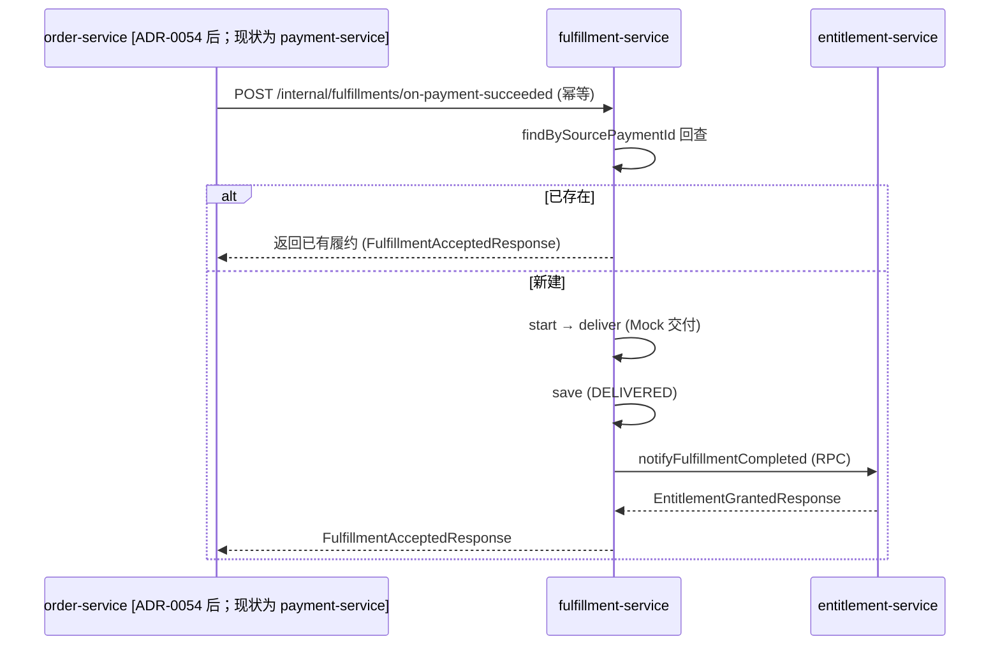

# fulfillment-service 系统设计

**服务**：fulfillment-service（履约 + 交付 + 权益触发）
**端口**：8086 | **Schema**：`fulfillment` | **包根**：`com.payment.fulfillment`

**上游依赖**：payment-service（支付成功触发履约，同步 RPC）
**下游依赖**：entitlement-service（履约完成后触发权益授予，同步 RPC）

> 标注约定：无标记 = 已实现；`[目标]` = 建议值待确认；`[待定]` = 留待后续；`[Phase N 延后]` = 明确延后。

---

## 1. 设计目标与约束

### 1.1 职责边界（负责 / 不负责）

| 维度 | 说明 |
|---|---|
| **负责** | 接收 order-service 的支付成功 RPC、按订单明细创建履约聚合与自有状态机、交付执行（当前 Mock）、明细粒度幂等、履约完成后触发权益授予 RPC；自身失败记录与终态 |
| **不负责** | 支付金额/渠道/退款决策（归属 payment-service 退款域）；权益内部生命周期与发放细节（归属 entitlement-service）；订单/交易最终状态（归属 order-service） |

### 1.2 硬约束（Constitution / ADR）

- **Fulfillment 不强耦合 Payment（Constitution #6）**：履约有**自己的状态机**，不被支付状态反向阻塞；入站 RPC 只接收 common-dto `PaymentSucceededRequest`（携带原始事实），不访问 payment 模块内部实体。支付成功只**触发**履约，不决定履约最终状态。
- **状态机铁律**：状态只能通过 `domain.Fulfillment` 的领域方法（`start/deliver/fail/cancel`）推进，禁止外部直接 `setStatus`；非法迁移抛 `STATE_TRANSITION_VIOLATION`（`Fulfillment.java:73`）。
- **幂等**：按 `(source_payment_no, order_item_id)` 唯一确定一条明细履约；同一支付可因多个订单明细创建多条履约，重复通知由该复合键吸收。
- **终态不反写前序事实**：履约失败/权益失败**不回写支付为失败**，履约 DELIVERED 事实独立保留（technical-solution §4.3.4）。
- **UNKNOWN 不臆断**：交付异常视为失败并记录，绝不臆断为成功（`FulfillmentApplicationService.java:49-55`）。
- **Database-per-Service**：自有 `fulfillment` Schema，绝不直连他服务表（Constitution 数据所有权）。

### 1.3 技术指标（`[目标]`，待确认）

| 指标 | 目标值 |
|---|---|
| 接收支付成功 RPC P99 | ≤ 300ms（内存/单 MySQL 写 + 同步 Mock 交付） |
| 履约查询（GET）P99 | ≤ 100ms |
| 权益授予 RPC P99 | `[目标]` ≤ 300ms（依赖 entitlement-service） |
| 履约服务可用性 | ≥ 99.9% |

---

## 2. 核心数据模型（DDD）

### 2.1 聚合与值对象

| 类型 | 名称 | 位置 | 说明 |
|---|---|---|---|
| 聚合根 | `Fulfillment` | [domain/Fulfillment.java](../../../fulfillment-service/src/main/java/com/payment/fulfillment/domain/Fulfillment.java) | 履约 + 自有状态机；不保存支付内部状态 |
| 仓储端口 | `FulfillmentRepository` | [domain/FulfillmentRepository.java](../../../fulfillment-service/src/main/java/com/payment/fulfillment/domain/FulfillmentRepository.java) | 领域接口，不依赖 MyBatis/Spring |
| 状态枚举 | `FulfillmentStatus` | [domain/FulfillmentStatus.java](../../../fulfillment-service/src/main/java/com/payment/fulfillment/domain/FulfillmentStatus.java) | PENDING/PROCESSING/DELIVERED/PARTIALLY_DELIVERED/FAILED/CANCELLED |
| 出站端口 | `EntitlementGateway` | [application/EntitlementGateway.java](../../../fulfillment-service/src/main/java/com/payment/fulfillment/application/EntitlementGateway.java) | 履约完成→权益授予 RPC 抽象（生产 Feign / 测试 fake） |
| 值对象 | `PaymentSucceededRequest` | [common-dto](../../../common/common-dto/src/main/java/com/payment/common/dto/rpc/PaymentSucceededRequest.java) | 入站请求（仅原始事实，无 payment 内部实体） |
| 值对象 | `FulfillmentAcceptedResponse` | [common-dto](../../../common/common-dto/src/main/java/com/payment/common/dto/rpc/FulfillmentAcceptedResponse.java) | 入站受理响应（fulfillmentId + 状态枚举名） |
| 值对象 | `FulfillmentCompletedRequest` / `EntitlementGrantedResponse` | [common-dto](../../../common/common-dto/src/main/java/com/payment/common/dto/rpc/) | 出站权益授予请求/响应 |

**基数关系（当前）**：`Payment (1) ── (N) Fulfillment`，每个 `OrderItem` 对应一条履约；`Fulfillment` 本身承载订单项引用，不另设 `FulfillmentItem` / `Delivery` 子实体。

### 2.2 状态机

**Fulfillment**（`FulfillmentStatus`）：

```text
PENDING --start--> PROCESSING --deliver--> DELIVERED
                     |      \--fail--------> FAILED
PENDING --cancel--> CANCELLED
（PARTIALLY_DELIVERED 已声明但未实现可达迁移，见 §5.4）
```

- `start()`：PENDING → PROCESSING（`Fulfillment.java:49`）。
- `deliver()`：PROCESSING → DELIVERED（`Fulfillment.java:55`）。
- `fail(reason)`：PROCESSING → FAILED，记录 `failureReason`（`Fulfillment.java:61`）。
- `cancel()`：PENDING → CANCELLED（`Fulfillment.java:68`）。
- `requireStatus(expected, action)`：非期望状态抛 `STATE_TRANSITION_VIOLATION`（`Fulfillment.java:73`）。
- **终态吸收**：`deliver/fail` 仅对 PROCESSING 有效；已 DELIVERED/FAILED/CANCELLED 再次调用将抛异常（由上层调用方保证不重复驱动）。

### 2.3 表结构与索引策略

来源：[deployment/schema/04-fulfillment-schema.sql](../../../deployment/schema/04-fulfillment-schema.sql)（权威 DDL）。

**`fulfillments`**

| 列 | 类型 | 说明 |
|---|---|---|
| id | BIGINT PK AUTO_INCREMENT | 履约 ID |
| order_id | VARCHAR(64) NOT NULL | 订单引用 |
| order_item_id | VARCHAR(64) NOT NULL | 订单项业务单号（`OI+雪花`），由 order-service 在支付成功通知中提供 |
| delivery_content | VARCHAR(255) NOT NULL | 交付内容（当前 "mock delivery"） |
| source_payment_no | VARCHAR(32) NOT NULL | 来源支付业务单号（paymentNo，PM+雪花，ADR-0063） |
| status | VARCHAR(32) NOT NULL | 状态机枚举名 |
| failure_reason | VARCHAR(255) | 失败原因 |
| created_at / updated_at / created_by / updated_by / version | — | 审计 + 乐观锁（BaseEntity，`@Version`） |

**索引策略（已实现）**：
- `uk_fulfillments_source_payment_item (source_payment_no, order_item_id)`（明细粒度幂等兜底）。
- 普通索引：`findById` 走 PK；`findBySourcePaymentId` 走唯一约束（无独立二级索引，命中 UK 即可）。

**分库分表键**：`[Phase 10 延后]` 当前单库单表；候选分片键 `order_id`，留待有真实负载证据后评估。

---

## 3. 接口详细定义（API 契约）

> 统一错误响应体 `ApiError`（common-core），错误码见 §3.4。响应成功体均为 JSON。

### 3.1 支付成功触发履约（内部 RPC，供 payment-service）

`POST /internal/fulfillments/on-payment-succeeded` → `200`

来源：[api/PaymentSuccessRpcController.java:23](../../../fulfillment-service/src/main/java/com/payment/fulfillment/api/PaymentSuccessRpcController.java)

**请求** `PaymentSucceededRequest`（common-dto）：`{ paymentNo, orderNo, transactionId, userId, amountMinor, currencyCode }`（只携带原始事实，业务单号，ADR-0063）。

**响应** `FulfillmentAcceptedResponse`：`{ fulfillmentId: Long, status: String }`（`FulfillmentStatus` 枚举名；payment 侧不回写履约结果）。

**幂等**：同 `paymentNo` 重复请求 → 返回已存在的履约（`FulfillmentApplicationService.java:39-42`），不新建。

**错误**：`STATE_TRANSITION_VIOLATION`（异常状态推进，理论上不应发生）、出站权益 RPC 异常向上抛（payment 侧 catch 忽略，不回滚支付事实）。

### 3.2 查询履约

`GET /fulfillments/{id}` → `200`

来源：[api/FulfillmentController.java:25](../../../fulfillment-service/src/main/java/com/payment/fulfillment/api/FulfillmentController.java)

**响应** `FulfillmentResponse`：`{ id, orderNo, sourcePaymentNo, status, failureReason }`（`FulfillmentResponse.java`）。

**错误**：`NOT_FOUND`。

### 3.3 出站 RPC（fulfillment → entitlement）

来源：[infra/client/EntitlementFeignClient.java:10](../../../fulfillment-service/src/main/java/com/payment/fulfillment/infra/client/EntitlementFeignClient.java)

`POST /internal/entitlements/on-fulfillment-completed`（Feign，默认 `http://localhost:8087`）

**请求** `FulfillmentCompletedRequest`：`{ fulfillmentId, orderNo, userId }`
**响应** `EntitlementGrantedResponse`：`{ entitlementId, status }`

**规则**：仅履约 DELIVERED 后触发一次；权益失败不反写履约为失败（履约事实已落库）。当前没有自动重试/补偿机制，失败交由人工补发。

### 3.4 错误码枚举（全局，common-core `ErrorCodes`）

| 错误码 | 语义 | 本服务使用场景 |
|---|---|---|
| `INVALID_ARGUMENT` | 参数非法 | （预留） |
| `NOT_FOUND` | 资源不存在 | 履约查询不存在（`FulfillmentController.java:28`） |
| `CONFLICT` | 并发状态冲突 | 乐观锁更新 0 行（`MybatisFulfillmentRepository.java:52`） |
| `STATE_TRANSITION_VIOLATION` | 非法状态迁移 | `start/deliver/fail/cancel` 期望状态不符（`Fulfillment.java:75`） |
| `INTERNAL_ERROR` | 内部错误 | 权益 RPC 意外异常透传 |

---

### 3.5 事件通道（生产 / 消费，spec 029 / [ADR-0074](../../adr/0074-redis-transactional-message.md#adr-0074)，✅ 已实现）

支付成功后的当前调用方是 order-service；order 使用自身 `order_items` 事实源补齐明细后，通过 `PaymentSucceededRequest.items` 调用本服务。履约完成后仍由 fulfillment-service 调用 entitlement-service，order 不直接修改权益。

**实现实况**（spec 029 批次 D，`com.payment.fulfillment.mq`）：

| 项 | 值 |
|---|---|
| 配置类 | `FulfillmentMqConfig`（`payment.mq.enabled=false` 回落同步 Feign） |
| 生产 | `FulfillmentEventPublisher`（`fulfillment.completed` / `fulfillment.revoked`，点对点 → entitlement） |
| 业务消费组 | `fulfillment`（消费名 `ff-op` / `ff-rs` / `ff-oc`） |
| 回查 checker | `fulfillment.completed` → 履约单是否 DELIVERED；`fulfillment.revoked` → 履约单是否 CANCELLED 或不存在 |
| 注入说明 | `FulfillmentApplicationService` 主构造器 `@Autowired` 收 `ObjectProvider<FulfillmentEventPublisher>`；另留 3 参 / 4 参构造器给测试 |

## 4. 关键流程链路剖析

### 4.1 接收支付成功并履约

`PaymentSuccessRpcController.onPaymentSucceeded` → `FulfillmentApplicationService.acceptPaymentSucceeded`（`FulfillmentApplicationService.java:35`）：

1. `sourcePaymentNo = request.paymentNo()`；`repository.findBySourcePaymentNo` 回查（幂等）。
2. 命中 → 直接返回已有履约（**不重复创建、不重复交付、不重复触发权益**）。
3. 未命中 → 按 `orderItemNo` 调用 `newFulfillment(orderNo, orderItemNo, sourcePaymentNo)`（状态 PENDING）→ `fulfillment.start()`（PENDING → PROCESSING）。
4. 同步 Mock 交付：`try { fulfillment.deliver(); } catch (RuntimeException ex) { fulfillment.fail(ex.getMessage()); metrics.counter("fulfillment.failed"); save; return; }`（PROCESSING → DELIVERED 或 FAILED，异常绝不臆断成功）。
5. `metrics.counter("fulfillment.completed")` → `repository.save(fulfillment)`（DELIVERED 落库）。
6. `entitlementGateway.notifyFulfillmentCompleted(...)` 触发权益授予（同步 RPC）；权益失败抛异常，不反写履约 DELIVERED 事实。

### 4.2 跨服务链路



### 4.3 幂等命中与指标

- 幂等命中路径**不递增** `fulfillment.completed/failed` 计数，也无独立 `fulfillment.duplicate` 指标（`[待定]` 建议补齐，对齐 payment-service 的 `payment.duplicate` 观测）。

---

## 5. 存储与缓存设计 + 详细逻辑处理策略（Edge Cases）

### 5.1 存储读写策略

- **写路径**：`MybatisFulfillmentRepository`（`MybatisFulfillmentRepository.java:42`）`save`：新对象 `insert` 并回填 id/version；已存在对象 `updateById`，0 行命中抛 `CONFLICT`（乐观锁）。
- **读路径**：`findById`（PK）、`findBySourcePaymentNoAndOrderItemId`（复合唯一键）、`findByOrderNo`（退款撤销遍历）。
- **映射**：领域 `Fulfillment` ↔ PO `FulfillmentEntity`（`@TableName("fulfillments")`）双向映射，状态机逻辑只在领域层，持久化只存枚举名（`MybatisFulfillmentRepository.java:58-75`）。
- **缓存**：`[已评估·本期不引入]` 当前无 Redis/本地缓存，直连 MySQL；履约状态需强一致，不引入 Cache-Aside。Redis 已在平台引入（ADR-0044），本服务经评估**不使用**（状态需强一致）；未来若出现只读热点须另立 ADR。
- **@Transactional**：应用服务方法未显式标注事务（`[待定]` 建议补 `@Transactional` 以明确写边界与可回滚语义）。

### 5.2 幂等性方案

| 作用域 | 机制 |
|---|---|
| 支付成功触发履约 | `(source_payment_no, order_item_id)` 复合唯一约束 + `findBySourcePaymentNoAndOrderItemId` 先回查 |
| 请求契约 | `items` 为空直接返回 `INVALID_ARGUMENT`；order-service 必须先以自身 `order_items` 富化明细 |
| 权益授予「最多一次」 | 仅在新建且 DELIVERED 后触发一次（幂等命中路径不触发） |

### 5.3 分布式事务方案

- 单服务内：`save(fulfillment)` 为单次 MySQL 写（当前未包 `@Transactional`，`[待定]`）。
- 跨服务：权益授予 RPC 为后置副作用，**失败不回滚履约 DELIVERED 事实**；当前实现保留履约事实并将失败交由人工补发处理（禁 2PC/XA）。

### 5.4 异常与边界场景

| 场景 | 处理 | 阈值/规则 |
|---|---|---|
| 交付异常（Mock 抛 RuntimeException） | `fail(reason)` 记录 FAILED，不触发权益 | 不臆断成功 |
| 幂等重复（同 paymentNo + orderItemNo） | 回查命中直接返回已有明细履约 | 不重复创建/交付 |
| 乐观锁冲突更新 | `updateById` 0 行 → `CONFLICT` | 并发状态迁移保护 |
| 权益 RPC 失败 | 异常透传，履约 DELIVERED 保留 | 不反写支付/履约失败 |
| `PARTIALLY_DELIVERED` | 枚举存在但当前没有可达迁移方法 | 当前 Mock 交付只产生 DELIVERED 或 FAILED |

**超时/重试/降级阈值（`[目标]`，待确认）**：
- 出站 Feign（entitlement）超时：未显式配置（OpenFeign 默认值）；`[目标]` connectTimeout=1s、readTimeout=3s。
- 重试：当前无自动退避重试；权益 RPC 失败后保留履约事实并由人工补发。
- 熔断/降级：`[Phase 按需延后]` Resilience4j/Sentinel 延迟引入。

---

## 6. 部署拓扑与配置文件设计

### 6.1 运行态配置（application.yml）

来源：[application.yml](../../../fulfillment-service/src/main/resources/application.yml)

```yaml
spring:
  application:
    name: fulfillment-service
  datasource:
    url: jdbc:mysql://localhost:3306/fulfillment?useSSL=false&serverTimezone=UTC&allowPublicKeyRetrieval=true
    username: root
    password: root
    driver-class-name: com.mysql.cj.jdbc.Driver
server:
  port: 8086
mybatis-plus:
  configuration:
    map-underscore-to-camel-case: true
```

### 6.2 环境变量清单（dev / test / prod 差异化项，`[目标]` 建议）

| 配置项 | dev（默认） | test | prod（`[目标]`） |
|---|---|---|---|
| `spring.datasource.url` | `jdbc:mysql://localhost:3306/fulfillment` | Testcontainers MySQL | 环境变量/配置中心，指向生产实例 |
| `spring.datasource.username/password` | root/root | — | 环境变量注入，禁止硬编码 |
| `server.port` | 8086 | 随机 | 8086（编排指定） |
| `services.entitlement.url` | `http://localhost:8087` | fake | Nacos 服务发现（去掉硬编码 url） |
| 连接池大小 `spring.datasource.hikari.maximum-pool-size` | 默认 10 | — | `[目标]` 按并发调优 |
| 出站 Feign 超时 | 未配置 | — | `[目标]` connect 1s / read 3s |

### 6.3 启动依赖顺序

```text
1. MySQL 8.0 就绪（fulfillment schema 由 deployment/schema/04-fulfillment-schema.sql 建库建表）
2. Nacos 就绪（注册 + 配置）  [目标：生产启用；当前本地直连 MySQL，未强制依赖 Nacos]
3. 启动 fulfillment-service（端口 8086），完成 Feign 客户端装配（entitlement-service）
4. 上游 payment-service 可延后就绪（履约 RPC 由支付成功触发，不阻塞启动）
```

### 6.4 埋点与日志键（本服务）

**业务指标（Micrometer，`BusinessMetrics`）**：

| 指标键 | 类型 | 维度 | 说明 |
|---|---|---|---|
| `fulfillment.completed` | counter | module=fulfillment | 履约交付成功（DELIVERED） |
| `fulfillment.failed` | counter | module=fulfillment | 履约交付失败（FAILED） |
| `fulfillment.duplicate` | counter | module=fulfillment | `[待定]` 幂等命中（当前未计数） |

**资金/履约审计日志**：`[待定]` 当前未落地 `FINANCIAL_AUDIT` 级别结构化日志（delivery/权益触发可观测性建议补齐，对齐 payment-service §6.4）。

**关联字段**：`traceId`（`TraceContext` / `TraceIdFilter` 跨服务传播，Feign 透传），用于串联 payment→fulfillment→entitlement 调用链。
