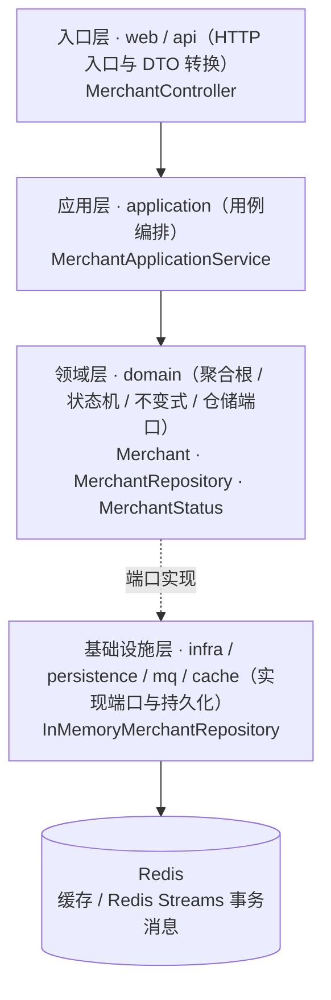
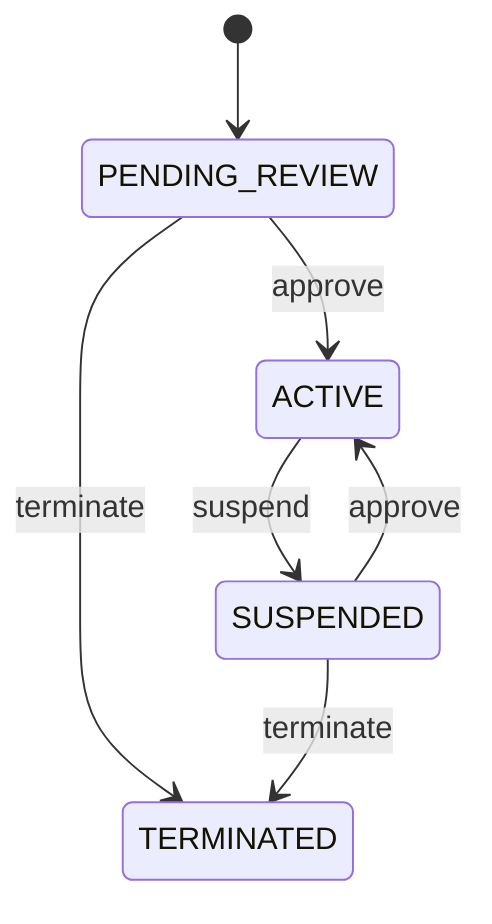
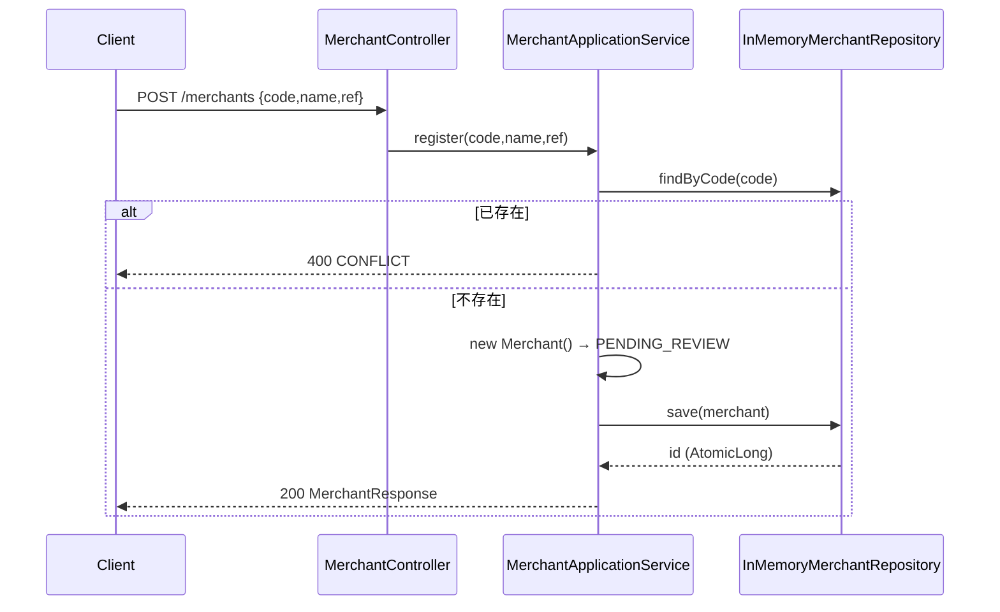
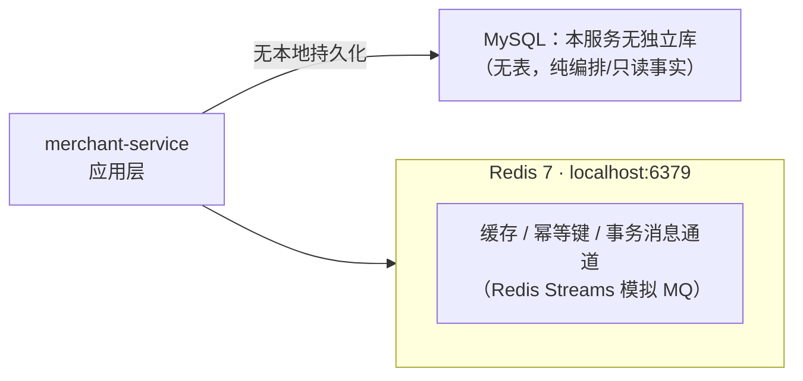

# merchant-service 系统设计

**服务**：merchant-service（商户注册 + 生命周期 + 结算资格）
**端口**：8081 | **Schema**：`无（当前为内存存储，无 DDL 建库）` | **包根**：`com.payment.merchant`

> 标注约定：无标记 = 已实现；`[目标]` = 建议值待确认；`[待定]` = 留待后续；`[Phase N 延后]` = 明确延后。

> **成熟度说明（骨架）**：本服务在 `technical-solution.md §3.3` 中标注为「骨架」。代码实证与之一致——核心 **状态机已实现**，但 **持久层为内存 `ConcurrentHashMap`**（非 MySQL/MyBatis），**无 Schema DDL**、**无出站/入站 RPC**、**无幂等键**。下文凡涉及数据库/缓存/RPC 之处均按「骨架」如实标注。

---

> **章节结构**：遵循 [system-design-standard](../../standards/system-design-standard.md) 的 15 章骨架。
> 2026-09-22 文档治理将原 6 章结构重排为标准章号，**正文内容未删改**。

---

## 1. 职责（Responsibility）

商户注册（code/name/结算账户引用）、商户生命周期状态机（待审核→有效→暂停/终止）、结算资格判定（`status==ACTIVE && settlementEligible`）

### 1.1 技术指标（`[目标]`，待确认）

| 指标 | 目标值 |
|---|---|
| 注册 P99 | ≤ 100ms（纯内存 Map 写）`[目标]` |
| 生命周期变更 P99 | ≤ 100ms `[目标]` |
| 可用性 | ≥ 99.9% `[目标]`（但内存存储重启即丢数据，落地前不可用） |

---

## 2. 不负责（Non-Responsibility）

真实资金/结算账户托管（仅存 `settlementAccountRef` 字符串引用）；订单/支付/履约执行；结算批次生成（归属 settlement-service）；资质人工审核流程

## 3. 上下文与约束（Context）

### 3.1 上下游依赖方向

- **上游依赖**：无（当前无任何入站 RPC；结算资格校验接口未暴露）
- **下游依赖**：无（当前不调用任何外部服务，包括 settlement-service）

- **依赖方式**：跨服务交互一律经公开 REST / Feign RPC 或事件通道，**禁止**直接 SQL 他服务 Schema（Database-per-Service，见 [technical-solution.md §3.1](../technical-solution.md)）。

### 3.2 硬约束（Constitution / ADR）

- **显式状态机**：`Merchant.status` 无公共 setter，所有迁移只经 `approve()/suspend()/terminate()`，非法迁移抛 `STATE_TRANSITION_VIOLATION`（`[已实现]`）。
- **依赖倒置**：领域层只依赖 `MerchantRepository` 接口，实现在 `infra`（当前为内存实现，`[骨架]`）。
- **金额铁律（本服务不直接适用）**：商户不持有资金金额，仅以 `settlementEligible` 布尔 + `status` 表达「可否结算」；`settlementAccountRef` 为外部账户引用字符串，非金额。
- **幂等**：**当前注册接口无幂等键**（仅以 `code` 唯一性抛 `CONFLICT` 兜底，`[骨架]`；注册非资金入口，但缺少幂等键属已知缺口，见 §9.1）。
- **禁止跨服务直连 SQL**：本服务独立存储，符合 `technical-solution §3.1`；当前亦无任何跨服务调用。


### 3.3 内部分层与模块

下图由 `deployment/tools/gen-module-diagrams.py` 扫描 `merchant-service/src/main/java` **自动生成**，反映真实的包与类分布（DTO 不计入）。


### 3.4 内部分层与模块

下图由 `deployment/tools/gen-module-diagrams.py` 扫描 `merchant-service/src/main/java` **自动生成**，反映真实的包与类分布（DTO 不计入）。


<!-- diagram:module -->
<!-- AUTO-GENERATED by deployment/tools/gen-module-diagrams.py — 请勿手改 -->

<!-- /diagram:module -->


## 4. 领域模型（Domain Model）

### 4.1 聚合与值对象

| 类型 | 名称 | 位置 | 说明 |
|---|---|---|---|
| 聚合根 | `Merchant` | [domain/Merchant.java](../../../merchant-service/src/main/java/com/payment/merchant/domain/Merchant.java) | 商户实体 + 生命周期状态机；无金额字段 |
| 枚举 | `MerchantStatus` | [domain/MerchantStatus.java](../../../merchant-service/src/main/java/com/payment/merchant/domain/MerchantStatus.java) | `PENDING_REVIEW / ACTIVE / SUSPENDED / TERMINATED` |
| 端口 | `MerchantRepository` | [domain/MerchantRepository.java](../../../merchant-service/src/main/java/com/payment/merchant/domain/MerchantRepository.java) | 持久化端口（依赖倒置） |
| 实现 | `InMemoryMerchantRepository` | [infra/InMemoryMerchantRepository.java](../../../merchant-service/src/main/java/com/payment/merchant/infra/InMemoryMerchantRepository.java) | `ConcurrentHashMap` + `AtomicLong` 内存实现 `[骨架]` |
| 入站 DTO | `RegisterMerchantRequest` | [api/dto/RegisterMerchantRequest.java](../../../merchant-service/src/main/java/com/payment/merchant/api/dto/RegisterMerchantRequest.java) | `code / name / settlementAccountRef` |
| 出站 DTO | `MerchantResponse` | [api/dto/MerchantResponse.java](../../../merchant-service/src/main/java/com/payment/merchant/api/dto/MerchantResponse.java) | `id / code / name / status / settlementEligible` |

**基数关系（MVP）**：单一 `Merchant` 聚合，无子实体；`settlementAccountRef` 为外部账户引用（不持有 Settlement Account 聚合，与 `technical-solution §4.1`「核心实体 Merchant、Settlement Account」的表述尚不完全一致——Settlement Account 当前仅为字符串引用）。

### 4.2 表结构与索引策略

**无 DDL（骨架）**：`deployment/schema/` 下仅有 `01-order`~`08-settlement` 八个文件，**不存在 `merchant` schema**。当前 `InMemoryMerchantRepository` 以 `ConcurrentHashMap<Long, Merchant>` 存储，`AtomicLong` 自增 id（`InMemoryMerchantRepository.java:19`）。

```text
[待定] 落地 MySQL 后的候选表（merchants）：
  id BIGINT PK AUTO_INCREMENT
  merchant_code VARCHAR(64) NOT NULL  -- uk_merchants_code（当前内存 findByCode 线性扫描）
  name VARCHAR(128) NOT NULL
  status VARCHAR(32) NOT NULL
  settlement_account_ref VARCHAR(128)
  settlement_eligible BOOLEAN NOT NULL DEFAULT FALSE
  created_at / updated_at / version  -- 审计 + 乐观锁
```

**索引策略（[待定]）**：`uk_merchants_code`（注册唯一性）、`idx_merchants_status`（按状态查可结算商户）。当前内存实现 `findByCode` 为全量流过滤（`InMemoryMerchantRepository.java:28`），**非索引查找**。

---

## 5. 状态机（State Machine）

**Merchant**（`MerchantStatus`，`[已实现]` 逻辑，`[骨架]` 持久化）：

```text
PENDING_REVIEW --approve--> ACTIVE --suspend--> SUSPENDED --approve--> ACTIVE
       |                       |
       |                       \--terminate--> TERMINATED
       \--terminate--------------------------> TERMINATED (任意非 TERMINATED 态)
TERMINATED 为终态，二次 terminate 抛 STATE_TRANSITION_VIOLATION
```

迁移规则（`domain/Merchant.java`）：
- `approve()`：`PENDING_REVIEW | SUSPENDED → ACTIVE`，并置 `settlementEligible = true`（`Merchant.java:66`）。
- `suspend()`：`ACTIVE → SUSPENDED`（仅 ACTIVE 可暂停，`Merchant.java:79`）。
- `terminate()`：任意非 `TERMINATED → TERMINATED`；终态二次调用抛 `STATE_TRANSITION_VIOLATION`（`Merchant.java:90`）。
- `isEligibleForSettlement()`：仅 `status == ACTIVE && settlementEligible` 返回 `true`（`Merchant.java:101`）——即「有效」态才参与结算。


### 5.1 状态迁移图

由 `deployment/tools/gen-sysdoc-diagrams.py` 从**本章上文的迁移文本**转换而来，不引入文中没有的状态或迁移。


### 5.2 状态迁移图

由 `deployment/tools/gen-sysdoc-diagrams.py` 从**本章上文的迁移文本**转换而来，不引入文中没有的状态或迁移。


<!-- diagram:state -->
<!-- AUTO-GENERATED by deployment/tools/gen-sysdoc-diagrams.py — 请勿手改 -->

<!-- /diagram:state -->


## 6. 接口与事件契约（API / Event Contract）

### 6.1 注册商户（write）

`POST /merchants` → `200`

**请求** `RegisterMerchantRequest`：`{ code: String, name: String, settlementAccountRef: String }`（全必填，无校验注解）。
**响应** `MerchantResponse`：`{ id, code, name, status, settlementEligible }`（新建后 `status=PENDING_REVIEW`，`settlementEligible=false`）。
**规则**：`code` 重复 → 抛 `CONFLICT`（`MerchantApplicationService.java:23`）。**无幂等键**，并发同 `code` 两次注册可能双双通过 `findByCode` 检查后都写入（内存实现无唯一约束兜底，`[骨架缺陷]`）。

### 6.2 审核通过（write）

`POST /merchants/{id}/approve` → `200`
**响应** `MerchantResponse`（状态迁移为 `ACTIVE`，`settlementEligible=true`）。
**错误**：`NOT_FOUND`（id 不存在）、`STATE_TRANSITION_VIOLATION`（非 PENDING_REVIEW/SUSPENDED）。

### 6.3 暂停（write）

`POST /merchants/{id}/suspend` → `200`
**响应** `MerchantResponse`（`ACTIVE → SUSPENDED`）。
**错误**：`NOT_FOUND`、`STATE_TRANSITION_VIOLATION`（非 ACTIVE）。

### 6.4 终止（write）

`POST /merchants/{id}/terminate` → `200`
**响应** `MerchantResponse`（→ `TERMINATED`，终态）。
**错误**：`NOT_FOUND`、`STATE_TRANSITION_VIOLATION`（已 TERMINATED）。

### 6.5 查询商户（read）

`GET /merchants/{id}` → `200`
**响应** `MerchantResponse`。**错误**：`NOT_FOUND`。

### 6.6 结算资格查询（供 settlement-service）— **[骨架/缺失]**

`technical-solution §4.1` 与 §(结算链路) 暗示 settlement-service 会校验商户结算资格，但 **本服务当前无任何入站 RPC 端点暴露 `isEligibleForSettlement()`**（仅作为领域方法存在，未映射为 API）。`[待定]` 需新增 `GET /merchants/{id}/settlement-eligibility` 或 Feign 接口，否则 settlement-service 无法实际调用（见 §6 矛盾 C2）。

### 6.7 错误码枚举（复用 common-core `ErrorCodes`）

| 错误码 | 语义 | 本服务使用场景 |
|---|---|---|
| `CONFLICT` | 资源冲突 | 注册 `code` 已存在 |
| `NOT_FOUND` | 资源不存在 | 商户 id 不存在 |
| `STATE_TRANSITION_VIOLATION` | 非法状态迁移 | approve/suspend/terminate 非法来源 |
| `INVALID_ARGUMENT` | 参数非法 | （预留，当前 DTO 无校验） |
| `INTERNAL_ERROR` | 内部错误 | （预留） |

---

## 7. 运行链路（Runtime Flow）

### 7.1 注册商户（含状态初始化）

`MerchantController.register` → `MerchantApplicationService.register`（`MerchantApplicationService.java:22`）：

1. `merchantRepository.findByCode(code)` 回查；命中 → 抛 `CONFLICT`（**非幂等键机制**）。
2. `new Merchant(code, name, settlementAccountRef)` → 构造时 `status = PENDING_REVIEW`、`settlementEligible = false`（`Merchant.java:27`）。
3. `merchantRepository.save(merchant)`：内存实现分配 `AtomicLong` id 并 `put`（`InMemoryMerchantRepository.java:35`）。
4. `MerchantResponse.from(...)` 返回。



### 7.2 生命周期变更（状态机驱动）

`approve/suspend/terminate` 均为同一模式（`MerchantApplicationService.java:30/36/42`）：`get(id)`（不存在 `NOT_FOUND`）→ 调用领域状态机方法（非法迁移抛 `STATE_TRANSITION_VIOLATION`）→ `save`。**纯内存读写，无事务边界**（单服务内存操作，无需本地事务；但 PD 后需 `@Transactional` + 乐观锁）。

### 7.3 结算资格判定（领域内，未对外暴露）

`Merchant.isEligibleForSettlement()`（`Merchant.java:101`）在领域层计算，供 settlement-service 未来调用；当前**无调用方、无 API**（见 §3.6、§6 矛盾 C2）。

---

## 8. 失败与恢复（Failure / Recovery）

### 8.1 异常与边界场景

| 场景 | 处理 | 阈值/规则 |
|---|---|---|
| 注册 `code` 重复 | 抛 `CONFLICT` | 内存线性查重，非约束兜底 |
| 非法状态迁移 | 抛 `STATE_TRANSITION_VIOLATION` | 状态机吸收 |
| 商户 id 不存在 | 抛 `NOT_FOUND` | `get(id)` |
| 进程重启 | **数据全丢**（内存存储） | `[骨架]` 致命缺陷，PD 前不可用 |
| 并发双写同 `code` | 可能皆成功（无唯一约束） | `[骨架缺陷]` |
| DTO 空字段 | 无校验，可能存空 `code/name` | `[待定]` 补 Bean Validation |

**超时/重试/降级（[Phase 按需延后]）**：当前无出站调用，无需配置；落库 + 接入 settlement RPC 后再引入 Feign 超时/熔断（参照 payment-service §8.1 阈值建议）。

---

## 9. 幂等 / 一致性 / 并发（Idempotency / Consistency / Concurrency）

### 9.1 幂等性方案

| 作用域 | 机制 | 状态 |
|---|---|---|
| 注册商户 | 仅 `code` 唯一性 `CONFLICT` 检查，**无幂等键**；无数据库唯一约束兜底 | `[骨架缺陷]` 并发双写可绕过 |
| 生命周期变更 | 依赖 id 幂等（同一 id 重复 approve 第二次抛 `STATE_TRANSITION_VIOLATION`，天然幂等吸收） | `[已实现]` |

> 与项目硬规则「资金入口必须有幂等键」对比：商户注册非资金入口，缺幂等键不直接违反铁律，但属于成熟度缺口，建议 PD 阶段补 `idempotencyKey`。

### 9.2 分布式事务方案

- 本服务**当前无任何跨服务调用**，无 Saga/2PC 需求。
- `[待定]` 落库后，与 settlement-service 的交互（结算资格校验）将走同步 RPC（OpenFeign），失败由 settlement 侧容错/重试，不回滚商户状态。

## 10. 数据与存储（Data / Storage）

### 10.1 存储读写策略

- **写路径（[骨架]）**：`InMemoryMerchantRepository` 操作 `ConcurrentHashMap`，**无 MySQL、无 MyBatis、无 datasource 配置**（见 `application.yml` 仅有 `spring.application.name`、`server.port`、actuator）。
- **读路径**：`findById`（Map.get）、`findByCode`（流过滤）、`save`（put）。
- **缓存**：不适用（内存即存储）。`[待定]` 落库后是否引入只读缓存待评估，但商户状态需强一致，倾向直连 DB。


### 10.2 存储拓扑

由 `deployment/tools/gen-sysdoc-diagrams.py` 依据 `application.yml` 的数据源/Redis 配置与 `deployment/schema/*.sql` 的表清单**自动生成**。


### 10.3 存储拓扑

由 `deployment/tools/gen-sysdoc-diagrams.py` 依据 `application.yml` 的数据源/Redis 配置与 `deployment/schema/*.sql` 的表清单**自动生成**。


<!-- diagram:storage -->
<!-- AUTO-GENERATED by deployment/tools/gen-sysdoc-diagrams.py — 请勿手改 -->

<!-- /diagram:storage -->


## 11. 可观测性与安全（Observability / Security）

### 11.1 埋点与日志键（[待定]）

- **业务指标（Micrometer）**：当前 **未注入 `BusinessMetrics`**（对照 payment-service §11.1 的 `payment.*` 计数器）；`[待定]` 建议补充 `merchant.registered / merchant.approved / merchant.suspended / merchant.terminated`。
- **资金审计日志（`FINANCIAL_AUDIT`）**：本服务无资金动作，**不适用**。
- **关联字段（traceId）**：未配置 `TraceIdFilter` / Feign 透传（`[待定]`，随 `009 Observability` 落地）。

---

## 12. 部署（Deployment）

- **进程与端口**：`merchant-service` :8081；单机多进程部署，独立进程 / 独立端口 / 独立部署单元（整体部署形态见 [technical-solution.md §6](../technical-solution.md) 与 [diagrams/08-deployment](../diagrams/08-deployment.puml)）。

### 12.1 运行态配置（application.yml）

来源：[application.yml](../../../merchant-service/src/main/resources/application.yml)

```yaml
spring:
  application:
    name: merchant-service
server:
  port: 8081
management:
  endpoints:
    web:
      exposure:
        include: health,info,metrics,prometheus
  endpoint:
    health:
      show-details: always
```

> **注意**：**无 `spring.datasource`、无 `mybatis-plus`、无 Nacos 配置**——证实本服务为内存骨架，与 `technical-solution §3.5`（MyBatis + Nacos）的全局技术栈描述尚不完全对齐。

### 12.2 环境变量清单（dev / test / prod 差异化项，`[目标]` 建议）

| 配置项 | dev（当前） | test | prod（`[目标]`） |
|---|---|---|---|
| `server.port` | 8081 | 随机 | 8081（或编排指定） |
| `spring.datasource.url/username/password` | **无（内存）** | — | `[目标]` 指向 `merchant` schema，禁止硬编码 |
| `mybatis-plus.configuration.map-underscore-to-camel-case` | 无 | — | `[目标]` 落库后开启 |
| Nacos 注册/配置 | 无 | — | `[目标]` 启用（与全局一致） |
| 连接池大小 | 不适用 | — | `[目标]` 按并发调优 |

### 12.3 启动依赖顺序

```text
1. 当前：无外部依赖（纯内存），可直接启动于端口 8081
2. [目标] 落库后：MySQL 8.0 就绪（需先补充 merchant schema DDL，当前缺失）
3. [目标] Nacos 就绪（注册 + 配置）
4. [目标] 若接入 settlement RPC：settlement-service 可延后就绪（资格校验失败可容错）
```

## 13. 测试与验证（Testing / Verification）

### 13.1 验证方式

- **领域 / 单元测试**：金额、状态迁移、幂等等领域不变量以纯单测覆盖，源码位于 [`merchant-service/src/test/java/`](../../../merchant-service/src/test/java/)。
- **集成测试**：Spring Boot 上下文 + H2 载体（项目既定测试载体，见 [ADR-0081](../../adr/0081-test-carrier-and-schema-replayability.md)）；E2E 默认 `skipTests`，按需显式启用（见 [engineering-standards.md §测试](../../guides/engineering-standards.md)）。
- **架构不变量**：`deployment/architecture-tests` 的 ArchUnit 规则在 `./mvnw -B verify` 中执行。
- **端到端 / 演示验证**：`deployment/demo/*.sh` 与 `mock-channel-web`（:8091）演示控制台；全链路追踪用 `/demo/trace?orderId=`。

## 14. 相关文档（Related Documents）

### 14.1 本文明文引用的 ADR

本服务暂无专属 ADR；全局决策见 [docs/adr/README.md](../../adr/README.md)。

### 14.2 本文明文引用的 Spec

无（本服务当前未由具体 Spec 引入改动）。

### 14.3 相关图

- [01-system-context](../diagrams/01-system-context.puml)（C4 L1）
- [02-container-overview](../diagrams/02-container-overview.puml)（C4 L2）
- [08-deployment](../diagrams/08-deployment.puml)（C4 Deployment）

### 14.4 关联文档

- [technical-solution.md](../technical-solution.md)（全局当前事实）
- [roadmap.md](../roadmap.md)（阶段与状态）
- [system-design-standard.md](../../standards/system-design-standard.md)（本文件遵循的规范）
- [code-debt-backlog.md](../../operations/code-debt-backlog.md)（已知缺口台账）

## 15. 已知缺口（Known Gaps）

### 15.1 与 roadmap / technical-solution 的状态矛盾（C1–C3）

- **C1（Schema 矛盾，确证）**：`technical-solution §3.1` 声称每服务独占 `merchant_schema`、§3.5 列 MyBatis/MySQL/Nacos 为全局技术栈；但 **`deployment/schema/` 无 merchant DDL**，`application.yml` 无 datasource，依赖树无 MyBatis/MySQL/Nacos，运行态为纯内存。**结论**：merchant-service 仍是「内存骨架」，尚未完成 DB 落地。
- **C2（结算资格接口缺失，确证）**：`technical-solution §4.1` 与结算链路描述「settlement-service 校验结算资格」；但 merchant-service **未暴露任何结算资格查询端点**，`isEligibleForSettlement()` 仅为领域方法。settlement-service 现阶段无法实际调用本服务校验资格——「商户参与结算」尚未真正接线。
- **C3（端到端可跑通声明，部分成立）**：roadmap 称「merchant→…→entitlement 端到端可跑通」。商户注册/查询端点存在、可参与主链，但因内存存储重启丢数据、且无结算资格 API，**「参与结算」环节未闭环**。骨架状态与 roadmap 主链声明在结算维度存在落差，建议 roadmap 措辞限定为「主链可跑通，结算环节仍为骨架」。
