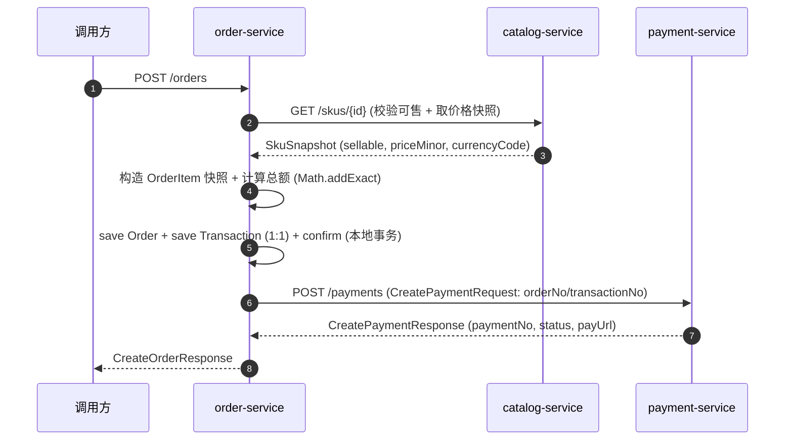
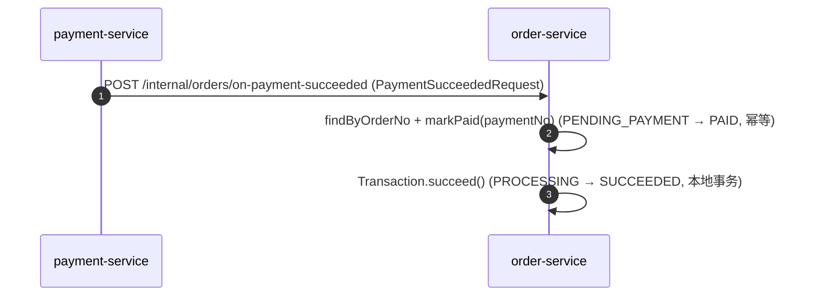

# order-service 系统设计

**服务**：order-service（订单 + 交易）
**端口**：8083 | **Schema**：`order` | **包根**：`com.payment.order`

**上游依赖**：调用方（用户/客户端）
**下游依赖**：catalog-service（校验 SKU 可售 + 取价格快照）、payment-service（创建支付意图）

> 标注约定：无标记 = 已实现；`[目标]` = 建议值待确认；`[待定]` = 留待后续；`[Phase N 延后]` = 明确延后。

---

## 1. 设计目标与约束

### 1.1 职责边界（负责 / 不负责）

| 维度 | 说明 |
|---|---|
| **负责** | 订单创建、订单明细与价格快照（不可变）、订单状态机、订单金额不变量（总额/已支付/已退款）、Order 1:1 Transaction、下单时同步创建支付意图、支付成功回调回写订单/交易状态 |
| **不负责** | 支付执行/渠道协议（归属 payment-service）；商品定义（归属 catalog-service）；履约/权益最终状态 |

### 1.2 硬约束（Constitution / ADR）

- **Order ≠ Payment**：订单是商业意图，支付是资金动作，独立生命周期与状态机。
- **价格快照不可变**：SKU 下单后价格/名称/销售状态变化，订单使用创建时的快照，不追溯修改历史订单。
- **金额铁律**：金额一律最小货币单位 `long`（`*Minor`），总额/明细小计用 `Math.addExact/multiplyExact` 防溢出，禁 `float`/`double`。
- **金额不变量**：`总额 = Σ 明细小计`、`已支付 ≤ 总额`、`已退款 ≤ 已支付`、`可退款 = 已支付 − 已退款`。

### 1.3 技术指标（`[目标]`，待确认）

| 指标 | 目标值 |
|---|---|
| 创建订单 P99 | ≤ 1s（含 catalog + payment 两次同步 RPC） |
| 查询订单 P99 | ≤ 300ms |
| 订单创建可用性 | ≥ 99.9% |

---

## 2. 核心数据模型（DDD）

### 2.1 聚合与值对象

| 类型 | 名称 | 位置 | 说明 |
|---|---|---|---|
| 聚合根 | `Order` | [domain/Order.java](../../order-service/src/main/java/com/payment/order/domain/Order.java) | 用户买什么、向谁买、金额与购买生命周期 |
| 实体 | `Transaction` | [domain/Transaction.java](../../order-service/src/main/java/com/payment/order/domain/Transaction.java) | 交易生命周期 + Order 1:1 关联（MVP） |
| 值对象 | `OrderItem` | [domain/OrderItem.java](../../order-service/src/main/java/com/payment/order/domain/OrderItem.java) | 订单明细 + 价格快照（不可变） |
| 值对象 | `SkuSnapshot` | [application/SkuSnapshot.java](../../order-service/src/main/java/com/payment/order/application/SkuSnapshot.java) | catalog SKU 的可售性 + 价格只读视图 |

> 金额承载：order-service 领域内**直接用 `long`（`*Minor`）**字段（`totalMinor`/`paidMinor`/`refundedMinor`），未使用 common-core 的 `Money` 值对象；`Money` 作为可复用的不可变金额值对象存在（[Money.java](../../common/common-core/src/main/java/com/payment/common/core/money/Money.java)），供后续服务按需引入。

**基数关系（MVP）**：`Order (1) ─ (1) Transaction`；`Order (1) ─ (N) OrderItem`。

### 2.2 状态机

**Order**（`OrderStatus`）：

```text
PENDING_CONFIRMATION --confirm--> PENDING_PAYMENT
PENDING_PAYMENT --markPaid(paymentNo)--> PAID
PAID --markFulfilling--> FULFILLING --complete--> COMPLETED
PENDING_CONFIRMATION/PENDING_PAYMENT --cancel--> CANCELLED
COMPLETED/CANCELLED --close--> CLOSED
```

- `confirm()`：PENDING_CONFIRMATION → PENDING_PAYMENT。
- `recordPayment(paymentNo)`：下单时同步 RPC 返回的支付业务单号（PM+雪花），不改变订单状态。
- `markPaid(paymentNo)`：PENDING_PAYMENT → PAID（整单支付，不支持部分支付）；记录下游支付业务单号、`paidMinor = totalMinor`；对已 PAID 的重复回调返回 `false` 幂等吸收。
- `markFulfilling()` / `complete()`：PAID → FULFILLING → COMPLETED。
- `cancel()`：仅 PENDING_CONFIRMATION/PENDING_PAYMENT；`close()`：仅 COMPLETED/CANCELLED。
- `recordRefund(amount)`：`refunded+amount > paid` 抛 `AMOUNT_INVARIANT_VIOLATION`。

**Transaction**（`TransactionStatus`）：

```text
PENDING --start--> PROCESSING --succeed/fail--> SUCCEEDED/FAILED
PROCESSING --markUnknown--> UNKNOWN --succeed/fail--> SUCCEEDED/FAILED
PENDING --cancel--> CANCELLED
```

- 关键不变量：未知只能由权威结果收敛，不可猜成败；`succeed()/fail()` 对终态返回 `false`。

> **状态回写（已实现，Feature 002）**：下单创建支付意图后，Transaction 由 `start()` 进入 `PROCESSING`；支付成功回调通过内部 RPC（[OrderPaymentRpcController](../../order-service/src/main/java/com/payment/order/api/OrderPaymentRpcController.java)）驱动 Order `PENDING_PAYMENT → PAID`、Transaction `PROCESSING → SUCCEEDED`，重复回调幂等吸收。

### 2.3 表结构与索引策略

来源：[deployment/schema/01-order-schema.sql](../../deployment/schema/01-order-schema.sql)（权威 DDL）。

**`orders`**

| 列 | 类型 | 说明 |
|---|---|---|
| id | BIGINT PK AUTO_INCREMENT | 订单 ID |
| user_id | VARCHAR(64) NOT NULL | 用户 |
| merchant_id | VARCHAR(64) NOT NULL | 商户 |
| payment_id | BIGINT NULL | 下游支付单号（payment-service 的 payment.id；下单时同步 RPC 返回、支付成功回调确认） |
| status | VARCHAR(32) NOT NULL | 状态机枚举名 |
| currency_code | VARCHAR(8) NOT NULL | 币种 |
| total_minor / paid_minor / refunded_minor | BIGINT NOT NULL | 总额 / 已支付 / 已退款（分） |
| created_at / updated_at / created_by / updated_by / version | — | 审计 + 乐观锁（BaseEntity） |

**`order_items`**

| 列 | 类型 | 说明 |
|---|---|---|
| id | BIGINT PK AUTO_INCREMENT | 明细 ID |
| order_id | BIGINT NOT NULL | 订单引用，普通索引 `idx_order_items_order_id` |
| sku_id / sku_code | VARCHAR(64) NOT NULL | SKU 引用 + 代码 |
| name | VARCHAR(128) NOT NULL | 商品名快照 |
| quantity | INT NOT NULL | 数量 |
| price_minor | BIGINT NOT NULL | 单价快照（分） |
| currency_code | VARCHAR(8) NOT NULL | 币种 |

**`transactions`**

| 列 | 类型 | 说明 |
|---|---|---|
| id | BIGINT PK AUTO_INCREMENT | 交易 ID |
| order_id | VARCHAR(64) NOT NULL | 订单引用，唯一 `uk_transactions_order_id`（1:1） |
| amount_minor | BIGINT NOT NULL | 金额（分） |
| currency_code | VARCHAR(8) NOT NULL | 币种 |
| purpose | VARCHAR(32) NOT NULL | 用途（"PURCHASE"） |
| status | VARCHAR(32) NOT NULL | 状态机枚举名 |

**索引策略（已实现）**：
- `orders`：目前仅主键（订单查询当前以 `id` 为主）。
- `order_items`：`idx_order_items_order_id`（按订单查明细）。
- `transactions`：`uk_transactions_order_id`（Order 1:1 Transaction 唯一约束）。

**分库分表键**：`[Phase 10 延后]` 当前单库单表，不引入分库分表；候选分片键为 `user_id` 或 `merchant_id`，留待有真实负载证据后再评估。

---

## 3. 接口详细定义（API 契约）

> 统一错误响应体 `ApiError`（common-core），错误码见 §3.3。

### 3.1 创建订单

`POST /orders` → `201 Created`

**请求** `CreateOrderRequest`：

| 字段 | 类型 | 必填 | 说明 |
|---|---|---|---|
| userId | String | 是 | 用户 ID |
| merchantId | String | 是 | 商户 ID |
| items | List\<OrderLineRequest\> | 是 | 明细行（非空） |
| items[].skuId | Long | 是 | SKU ID |
| items[].quantity | int | 是 | 数量（> 0） |

**响应** `CreateOrderResponse`：`{ orderNo, transactionNo, status, totalMinor, currencyCode, paymentNo, paymentStatus, payUrl }`（业务单号，ADR-0063）。

**流程副作用**：创建订单 + 明细快照 → 创建 1:1 Transaction → `confirm()` → 同步 RPC 创建支付意图。

**错误**：`INVALID_ARGUMENT`（明细为空、多币种混用）、`CONFLICT`（SKU 不可售）、`NOT_FOUND`（SKU 不存在）、`AMOUNT_INVARIANT_VIOLATION`（金额不变量）。

### 3.2 查询订单

`GET /orders/{id}` → `200`

**响应** `OrderResponse`：`{ id, userId, merchantId, status, totalMinor, currencyCode, paidMinor, refundedMinor, items: [{ skuId, skuCode, name, quantity, priceMinor, currencyCode }] }`。

**错误**：`NOT_FOUND`。

### 3.3 错误码枚举（全局，common-core `ErrorCodes`）

| 错误码 | 语义 | 本服务使用场景 |
|---|---|---|
| `INVALID_ARGUMENT` | 参数非法 | 明细为空、多币种混用 |
| `NOT_FOUND` | 资源不存在 | 订单不存在、SKU 不存在（catalog 404 映射） |
| `CONFLICT` | 状态冲突 | SKU 不可售 |
| `STATE_TRANSITION_VIOLATION` | 非法状态迁移 | 订单非法 cancel/close/markPaid |
| `AMOUNT_INVARIANT_VIOLATION` | 金额不变量 | 支付超总额、退款超已支付、总额溢出 |

### 3.4 内部 RPC（入站 / 出站）

**入站**（payment-service → order-service）：

| 来源 | 路径 | 请求/响应 |
|---|---|---|
| payment-service | `POST /internal/orders/on-payment-succeeded` | `PaymentSucceededRequest` → 无返回体（幂等吸收） |

**出站**：

| 目标 | 路径 | 请求/响应 |
|---|---|---|
| catalog-service | `GET /skus/{id}`（Feign，默认 `http://localhost:8082`） | 响应 `CatalogSkuDto` → `SkuSnapshot` |
| payment-service | `POST /payments`（Feign，默认 `http://localhost:8084`） | `CreatePaymentRequest` → `CreatePaymentResponse` |

---

## 4. 关键流程链路剖析

### 4.1 创建订单（含 SKU 校验 + 支付意图）

`OrderController.createOrder` → `OrderApplicationService.createOrder`（[源码](../../order-service/src/main/java/com/payment/order/application/OrderApplicationService.java)）：

1. 断言 `lines` 非空（`INVALID_ARGUMENT`）。
2. 逐行 `catalogClient.getSku(skuId)`（Feign → catalog-service）：`!sellable` 抛 `CONFLICT`；首行确定币种，后续混币抛 `INVALID_ARGUMENT`；构造 `OrderItem`（价格快照）。
3. `new Order(userId, merchantId, currencyCode, items)`：总额 = `Σ Math.addExact(subtotalMinor)`。
4. `orderRepository.save(order)` → `new Transaction(orderNo, totalMinor, currencyCode, "PURCHASE")` → `transactionRepository.save(transaction)`。
5. `order.confirm()`（PENDING_CONFIRMATION → PENDING_PAYMENT）→ `save`。
6. `paymentGateway.createPayment(CreatePaymentRequest(...))`：同步 RPC 创建支付意图（CreatePaymentRequest 携 orderNo/transactionNo，ADR-0063）。
7. `transaction.start()`（PENDING → PROCESSING）+ `order.recordPayment(paymentNo)`：交易进入处理中、订单记录下游支付业务单号。
8. 返回 `CreateOrderResult(orderNo, transactionNo, status, totalMinor, currencyCode, paymentNo, paymentStatus, payUrl)`。



### 4.2 支付成功回调回写（Feature 002）

`OrderPaymentRpcController.onPaymentSucceeded` → `OrderApplicationService.onPaymentSucceeded`（[源码](../../order-service/src/main/java/com/payment/order/application/OrderApplicationService.java)）：

1. `findById(orderId)`；不存在 `NOT_FOUND`。
2. `order.markPaid(request.paymentNo())`：`PENDING_PAYMENT → PAID`（记录 paymentNo、`paidMinor = totalMinor`）；已 `PAID` 返回 `false`（幂等重复回调吸收）。
3. `changed` 时 `save`；`transactionRepository.findByOrderId` → `succeed()`（`PROCESSING → SUCCEEDED`，`PENDING` 时先 `start()`）。
4. 事务边界：`onPaymentSucceeded` 标 `@Transactional`（订单 + 交易在同一本地事务原子提交）。



---

## 5. 存储与缓存设计 + 详细逻辑处理策略（Edge Cases）

### 5.1 存储读写策略

- **写路径**：`MybatisOrderRepository` / `MybatisTransactionRepository` 在应用服务内写 `orders` / `order_items` / `transactions`；状态机与金额不变量在领域层。
- **读路径**：`findById` 直连 MySQL。
- **缓存**：订单状态/金额**不引入 Cache-Aside**（需强一致，避免读到过期状态）。**但入口幂等键 `Idempotency-Key` 存于 Redis**（ADR-0039/0040：`OrderEntryIdempotencyService` 以 Redis 唯一存储，IN_PROGRESS TTL 30s / DONE TTL 24h），属幂等去重而非业务缓存。

### 5.2 幂等性方案

- 下单入口**有强幂等键**：客户端生成 `Idempotency-Key` 请求头，由 `OrderEntryIdempotencyService` 基于 Redis 唯一存储接管——并发同 key 返回 **409 + `Retry-After: 1`**（不接管、轮询），已完成返回 **200 REPLAY**，**fail-open**（订单非资金入口，资金正确性由 payment-service 的 `uk_payments_idempotency_key` + DB 唯一约束兜底，ADR-0039/0040）。订单创建本身仍允许多次产生不同订单（无 key 时）；支付意图幂等键由 payment-service 维护（混合幂等：调用方 key 优先，缺省 `payment:{orderNo}:{channelCode}:{attemptSeq}`，ADR-0064）。
- Transaction 1:1 由 `uk_transactions_order_id` 唯一约束兜底。

### 5.3 分布式事务方案

- 单服务内：订单 + 明细 + 交易 + `confirm` 在**同一本地事务**内原子提交（[OrderApplicationService.createOrder](../../order-service/src/main/java/com/payment/order/application/OrderApplicationService.java) 整体无 `@Transactional` 注解于方法，但仓储 `save` 各自落库 —— **注意**：见 §5.4 风险）。
- 跨服务：支付意图为下单的后置 RPC，支付失败不回滚订单（订单仍是合法商业意图，可重试支付）；禁 2PC/XA。

### 5.4 异常与边界场景

| 场景 | 处理 | 阈值/规则 |
|---|---|---|
| SKU 不可售 | 抛 `CONFLICT`，拒绝下单 | 不使用过期销售条件 |
| SKU 不存在（catalog 404） | Feign 404 映射 `NOT_FOUND` | [FeignCatalogClient.getSku](../../order-service/src/main/java/com/payment/order/infra/client/FeignCatalogClient.java) |
| 多币种混用 | 抛 `INVALID_ARGUMENT` | 一单仅一种币种 |
| 明细为空 / 数量 ≤ 0 | 抛 `INVALID_ARGUMENT` / `IllegalArgumentException` | OrderItem 构造校验 |
| 金额溢出 | `Math.addExact/multiplyExact` 抛异常 | 拒绝溢出，不静默截断 |
| 支付 RPC 失败/超时 | 异常向上传播（未捕获） | `[待定]` 当前不自动重试；靠调用方幂等重试下单/支付 |
| 支付超额/退款超额 | `AMOUNT_INVARIANT_VIOLATION` | `paid ≤ total`、`refunded ≤ paid` |

> **已知缺口（待后续收口）**：`createOrder` 的「订单 + 交易 + confirm + 交易 start」多步写未显式包在 `@Transactional` 中，若中途失败可能残留不一致；`[待定]` 应统一收口下单事务边界（回调回写 `onPaymentSucceeded` 已用 `@Transactional`）。

**超时/重试/降级阈值（`[目标]`，待确认）**：
- 出站 Feign（catalog/payment）超时：当前未显式配置（OpenFeign 默认）；`[目标]` connectTimeout=1s、readTimeout=3s。
- 重试：`[目标]` 对幂等 RPC（创建支付意图）允许调用方有限退避重试；下单本身不自动重试。
- 熔断/降级：`[Phase 按需延后]` Resilience4j/Sentinel 延迟引入。

---

## 6. 部署拓扑与配置文件设计

### 6.1 运行态配置（application.yml）

来源：[application.yml](../../order-service/src/main/resources/application.yml)

```yaml
spring:
  application.name: order-service
  datasource:
    url: jdbc:mysql://localhost:3306/order?useSSL=false&serverTimezone=UTC&allowPublicKeyRetrieval=true
    username: root
    password: root
server:
  port: 8083
mybatis-plus.configuration.map-underscore-to-camel-case: true
```

### 6.2 环境变量清单（dev / test / prod 差异化项，`[目标]` 建议）

| 配置项 | dev（默认） | test | prod（`[目标]`） |
|---|---|---|---|
| `spring.datasource.url` | `jdbc:mysql://localhost:3306/order` | Testcontainers MySQL | 环境变量/配置中心 |
| `spring.datasource.username/password` | root/root | — | 环境变量注入 |
| `server.port` | 8083 | 随机 | 8083 |
| `services.catalog.url` | `http://localhost:8082` | fake | Nacos 服务发现 |
| `services.payment.url` | `http://localhost:8084` | fake | Nacos 服务发现 |
| 连接池大小 `maximum-pool-size` | 默认 10 | — | `[目标]` 按并发调优 |
| 出站 Feign 超时 | 未配置 | — | `[目标]` connect 1s / read 3s |

### 6.3 启动依赖顺序

```text
1. MySQL 8.0 就绪（order schema 由 deployment/schema/01-order-schema.sql 建库建表）
2. catalog-service 就绪（下单时 Feign 调用 GET /skus/{id}；缺省 url 8082）
3. payment-service 就绪（下单时 Feign 调用 POST /payments；缺省 url 8084）
4. 启动 order-service（端口 8083）
```

> 下游 catalog/payment 必须就绪，否则下单 RPC 失败；`[目标]` 接入 Nacos 服务发现后解除硬编码 url 依赖。

### 6.4 埋点与日志键（本服务）

- **业务指标**：`[待定]` 当前 order-service **未注入** `BusinessMetrics` / `StructuredAuditLogger`（资金审计由 payment-service 侧记录）；`[目标]` 建议补 `order.initiated` / `order.create_failed` 计数器。
- **链路关联**：`traceId` 由 common-core `TraceIdFilter` 生成、`TraceIdRequestInterceptor` 透传 Feign（跨 order→catalog/payment 传播），无服务侧自定义埋点。

---

## 8. 超时与库存释放（ADR-0043）

> 订单/支付超时未确认时，需释放已预占的库存，避免库存僵死。

- **机制**：`StockReservation` 的超时释放由 **Redis ZSet 时间轮**驱动（`SeckillStockService`/定时扫描 `releaseAt` 快照），到点调用 `StockApplicationService.release(reservationId)`。
- **归属**：库存聚合与预占/确认/释放三段式归 **catalog-service**（ADR-0041 / ADR-0042）；order-service 仅发起预占、在支付成功时确认、在取消/超时未支付时触发释放。
- **不变量**：`total = available + reserved + sold` 始终成立；释放为幂等操作（同 reservationId 重复释放幂等吸收）。
