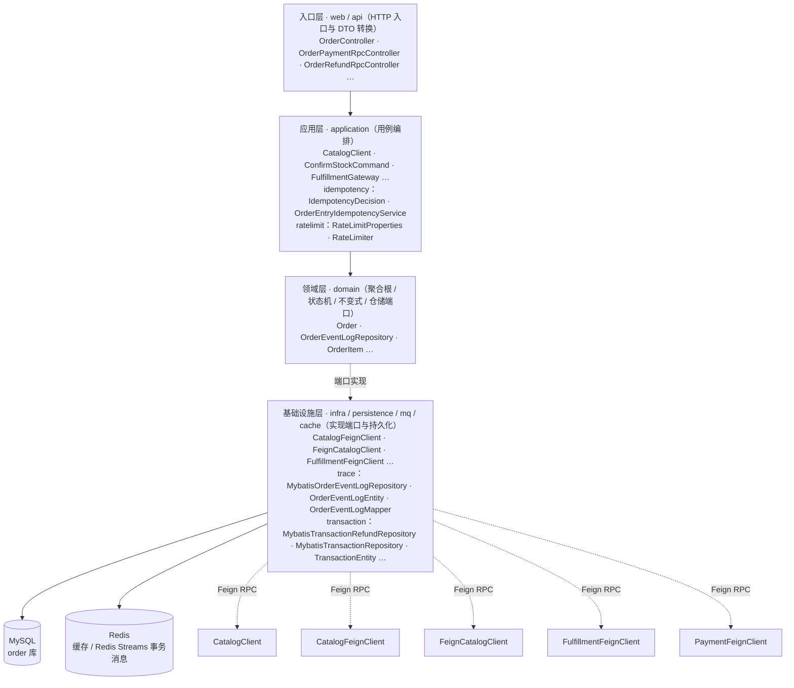
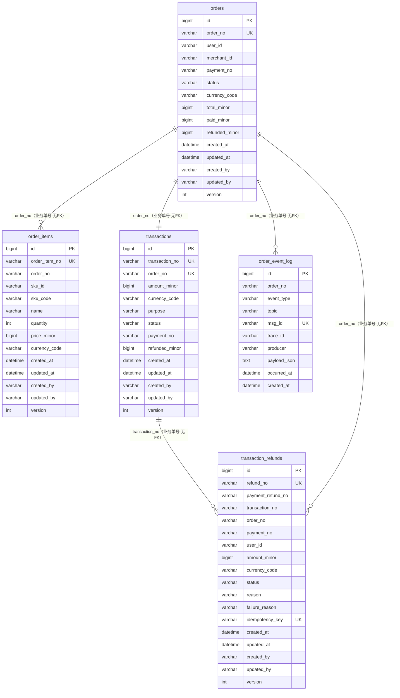
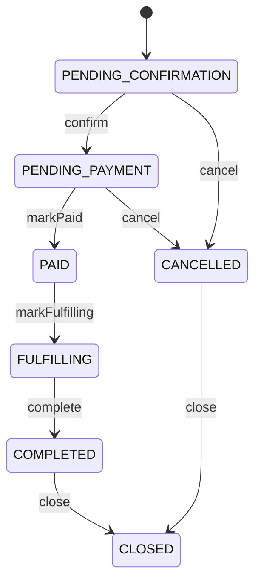
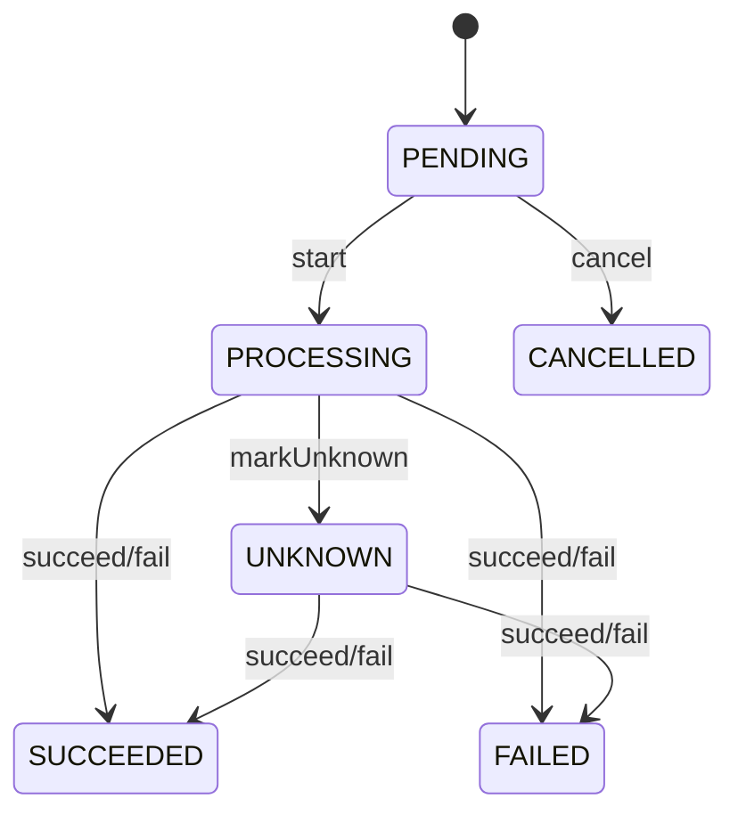
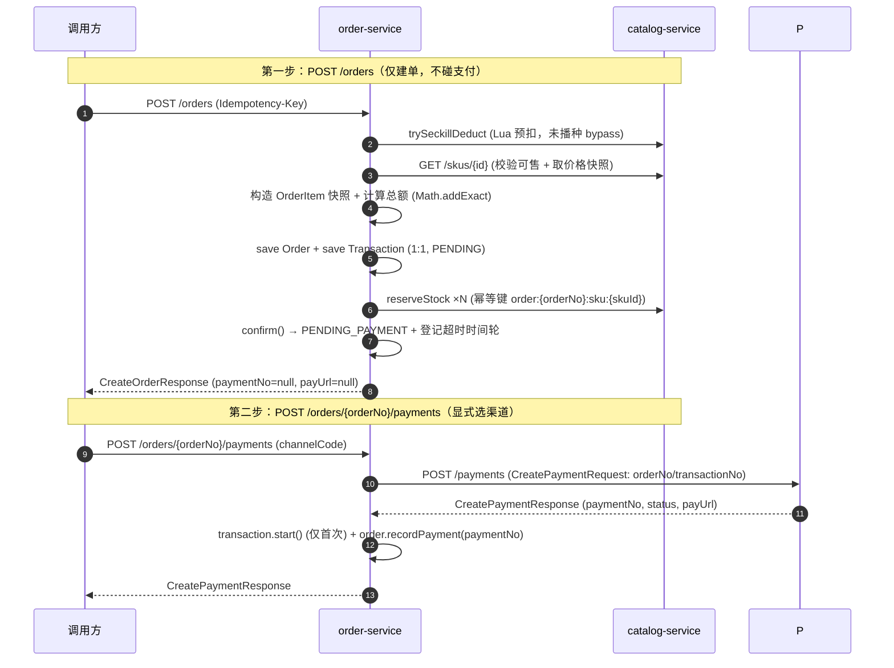
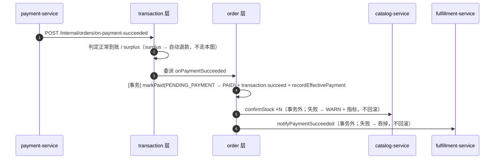
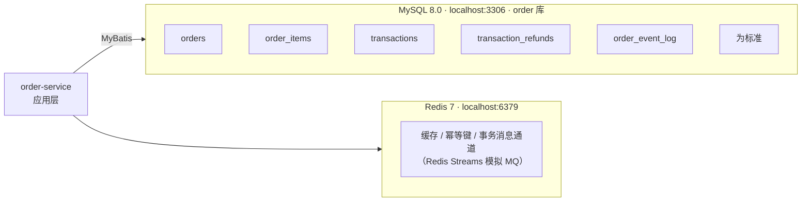

# order-service 系统设计

**服务**：order-service（订单 + 交易）
**端口**：8083 | **Schema**：`order` | **包根**：`com.payment.order`

> 标注约定：无标记 = 已实现；`[目标]` = 建议值待确认；`[待定]` = 留待后续；`[Phase N 延后]` = 明确延后。

---

> **章节结构**：遵循 [system-design-standard](../../standards/system-design-standard.md) 的 15 章骨架。
> 2026-09-22 文档治理将原 6 章结构重排为标准章号，**正文内容未删改**。

---

## 1. 职责（Responsibility）

订单创建、订单明细与价格快照（不可变）、订单状态机、订单金额不变量（总额/已支付/已退款）、Order 1:1 Transaction、下单时同步创建支付意图、支付成功回调回写订单/交易状态

### 1.1 技术指标（`[目标]`，待确认）

| 指标 | 目标值 |
|---|---|
| 创建订单 P99 | ≤ 1s（含 catalog + payment 两次同步 RPC） |
| 查询订单 P99 | ≤ 300ms |
| 订单创建可用性 | ≥ 99.9% |

---

## 2. 不负责（Non-Responsibility）

支付执行/渠道协议（归属 payment-service）；商品定义（归属 catalog-service）；履约/权益最终状态

## 3. 上下文与约束（Context）

### 3.1 上下游依赖方向

- **上游依赖**：调用方（用户/客户端）
- **下游依赖**：catalog-service（校验 SKU 可售 + 取价格快照）、payment-service（创建支付意图）

- **依赖方式**：跨服务交互一律经公开 REST / Feign RPC 或事件通道，**禁止**直接 SQL 他服务 Schema（Database-per-Service，见 [technical-solution.md §3.1](../technical-solution.md)）。

### 3.2 硬约束（Constitution / ADR）

- **Order ≠ Payment**：订单是商业意图，支付是资金动作，独立生命周期与状态机。
- **价格快照不可变**：SKU 下单后价格/名称/销售状态变化，订单使用创建时的快照，不追溯修改历史订单。
- **金额铁律**：金额一律最小货币单位 `long`（`*Minor`），总额/明细小计用 `Math.addExact/multiplyExact` 防溢出，禁 `float`/`double`。
- **金额不变量**：`总额 = Σ 明细小计`、`已支付 ≤ 总额`、`已退款 ≤ 已支付`、`可退款 = 已支付 − 已退款`。


### 3.3 内部分层与模块

下图由 `deployment/tools/gen-module-diagrams.py` 扫描 `order-service/src/main/java` **自动生成**，反映真实的包与类分布（DTO 不计入）。


### 3.4 内部分层与模块

下图由 `deployment/tools/gen-module-diagrams.py` 扫描 `order-service/src/main/java` **自动生成**，反映真实的包与类分布（DTO 不计入）。


<!-- diagram:module -->
<!-- AUTO-GENERATED by deployment/tools/gen-module-diagrams.py — 请勿手改 -->

<!-- /diagram:module -->


## 4. 领域模型（Domain Model）

### 4.1 聚合与值对象

| 类型 | 名称 | 位置 | 说明 |
|---|---|---|---|
| 聚合根 | `Order` | [domain/Order.java](../../../order-service/src/main/java/com/payment/order/domain/Order.java) | 用户买什么、向谁买、金额与购买生命周期 |
| 实体 | `Transaction` | [domain/Transaction.java](../../../order-service/src/main/java/com/payment/order/domain/Transaction.java) | 交易生命周期 + Order 1:1 关联（MVP） |
| 值对象 | `OrderItem` | [domain/OrderItem.java](../../../order-service/src/main/java/com/payment/order/domain/OrderItem.java) | 订单明细 + 价格快照（不可变） |
| 值对象 | `SkuSnapshot` | [application/SkuSnapshot.java](../../../order-service/src/main/java/com/payment/order/application/SkuSnapshot.java) | catalog SKU 的可售性 + 价格只读视图 |

> 金额承载：order-service 领域内**直接用 `long`（`*Minor`）**字段（`totalMinor`/`paidMinor`/`refundedMinor`），未使用 common-core 的 `Money` 值对象；`Money` 作为可复用的不可变金额值对象存在（[Money.java](../../../common/common-core/src/main/java/com/payment/common/core/money/Money.java)），供后续服务按需引入。

**基数关系（MVP）**：`Order (1) ─ (1) Transaction`；`Order (1) ─ (N) OrderItem`。

### 4.2 表结构与索引策略

来源：[deployment/schema/01-order-schema.sql](../../../deployment/schema/01-order-schema.sql)（权威 DDL）。

**`orders`**

| 列 | 类型 | 说明 |
|---|---|---|
| id | BIGINT PK AUTO_INCREMENT | 订单 ID |
| user_id | VARCHAR(64) NOT NULL | 用户 |
| merchant_id | VARCHAR(64) NOT NULL | 商户 |
| payment_id | BIGINT NULL | 下游支付单号（payment-service 的 payment.id；下单时同步 RPC 返回、支付成功回调确认） |
| status | VARCHAR(32) NOT NULL | 状态机枚举名 |
| currency_code | VARCHAR(8) NOT NULL | 币种 |
| total_minor / paid_minor / refunded_minor | BIGINT NOT NULL | 总额 / 已支付 / 已退款（分） |
| created_at / updated_at / created_by / updated_by / version | — | 审计 + 乐观锁（BaseEntity） |

**`order_items`**

| 列 | 类型 | 说明 |
|---|---|---|
| id | BIGINT PK AUTO_INCREMENT | 明细 ID |
| order_id | BIGINT NOT NULL | 订单引用，普通索引 `idx_order_items_order_id` |
| sku_id / sku_code | VARCHAR(64) NOT NULL | SKU 引用 + 代码 |
| name | VARCHAR(128) NOT NULL | 商品名快照 |
| quantity | INT NOT NULL | 数量 |
| price_minor | BIGINT NOT NULL | 单价快照（分） |
| currency_code | VARCHAR(8) NOT NULL | 币种 |

**`transactions`**

| 列 | 类型 | 说明 |
|---|---|---|
| id | BIGINT PK AUTO_INCREMENT | 交易 ID |
| order_id | VARCHAR(64) NOT NULL | 订单引用，唯一 `uk_transactions_order_id`（1:1） |
| amount_minor | BIGINT NOT NULL | 金额（分） |
| currency_code | VARCHAR(8) NOT NULL | 币种 |
| purpose | VARCHAR(32) NOT NULL | 用途（"PURCHASE"） |
| status | VARCHAR(32) NOT NULL | 状态机枚举名 |

**索引策略（已实现）**：
- `orders`：目前仅主键（订单查询当前以 `id` 为主）。
- `order_items`：`idx_order_items_order_id`（按订单查明细）。
- `transactions`：`uk_transactions_order_id`（Order 1:1 Transaction 唯一约束）。

**分库分表键**：`[Phase 10 延后]` 当前单库单表，不引入分库分表；候选分片键为 `user_id` 或 `merchant_id`，留待有真实负载证据后再评估。

---


### 4.3 表关系（ER 图）

由 `deployment/tools/gen-er-diagrams.py` 从 `deployment/schema/*.sql` 解析**自动生成**，字段与真实 Schema 一致。
⚠️ 图内只出现**同库**关系：跨服务引用一律走业务单号、不建外键（[ADR-0063](../../adr/0063-cross-service-reference-by-business-no.md)），因此不存在跨库连线。


### 4.4 表关系（ER 图）

由 `deployment/tools/gen-er-diagrams.py` 从 `deployment/schema/*.sql` 解析**自动生成**，字段与真实 Schema 一致。
⚠️ 图内只出现**同库**关系：跨服务引用一律走业务单号、不建外键（[ADR-0063](../../adr/0063-cross-service-reference-by-business-no.md)），因此不存在跨库连线。


<!-- diagram:er -->
<!-- AUTO-GENERATED by deployment/tools/gen-er-diagrams.py — 请勿手改 -->

<!-- /diagram:er -->


## 5. 状态机（State Machine）

**Order**（`OrderStatus`）：

```text
PENDING_CONFIRMATION --confirm--> PENDING_PAYMENT
PENDING_PAYMENT --markPaid(paymentNo)--> PAID
PAID --markFulfilling--> FULFILLING --complete--> COMPLETED
PENDING_CONFIRMATION/PENDING_PAYMENT --cancel--> CANCELLED
COMPLETED/CANCELLED --close--> CLOSED
```

- `confirm()`：PENDING_CONFIRMATION → PENDING_PAYMENT。
- `recordPayment(paymentNo)`：下单时同步 RPC 返回的支付业务单号（PM+雪花），不改变订单状态。
- `markPaid(paymentNo)`：PENDING_PAYMENT → PAID（整单支付，不支持部分支付）；记录下游支付业务单号、`paidMinor = totalMinor`；对已 PAID 的重复回调返回 `false` 幂等吸收。
- `markFulfilling()` / `complete()`：PAID → FULFILLING → COMPLETED。
- `cancel()`：仅 PENDING_CONFIRMATION/PENDING_PAYMENT；`close()`：仅 COMPLETED/CANCELLED。
- `recordRefund(amount)`：`refunded+amount > paid` 抛 `AMOUNT_INVARIANT_VIOLATION`。

**Transaction**（`TransactionStatus`）：

```text
PENDING --start--> PROCESSING --succeed/fail--> SUCCEEDED/FAILED
PROCESSING --markUnknown--> UNKNOWN --succeed/fail--> SUCCEEDED/FAILED
PENDING --cancel--> CANCELLED
```

- 关键不变量：未知只能由权威结果收敛，不可猜成败；`succeed()/fail()` 对终态返回 `false`。

> **状态回写（已实现，Feature 002）**：下单创建支付意图后，Transaction 由 `start()` 进入 `PROCESSING`；支付成功回调通过内部 RPC（[OrderPaymentRpcController](../../../order-service/src/main/java/com/payment/order/api/OrderPaymentRpcController.java)）驱动 Order `PENDING_PAYMENT → PAID`、Transaction `PROCESSING → SUCCEEDED`，重复回调幂等吸收。


### 5.1 状态迁移图

由 `deployment/tools/gen-sysdoc-diagrams.py` 从**本章上文的迁移文本**转换而来，不引入文中没有的状态或迁移。


### 5.2 状态迁移图

由 `deployment/tools/gen-sysdoc-diagrams.py` 从**本章上文的迁移文本**转换而来，不引入文中没有的状态或迁移。


<!-- diagram:state -->
**order**

<!-- AUTO-GENERATED by deployment/tools/gen-sysdoc-diagrams.py — 请勿手改 -->


**transaction**

<!-- AUTO-GENERATED by deployment/tools/gen-sysdoc-diagrams.py — 请勿手改 -->

<!-- /diagram:state -->


## 6. 接口与事件契约（API / Event Contract）

### 6.1 创建订单

`POST /orders` → `201 Created`

**请求** `CreateOrderRequest`：

| 字段 | 类型 | 必填 | 说明 |
|---|---|---|---|
| userId | String | 是 | 用户 ID |
| merchantId | String | 是 | 商户 ID |
| items | List\<OrderLineRequest\> | 是 | 明细行（非空） |
| items[].skuId | Long | 是 | SKU ID |
| items[].quantity | int | 是 | 数量（> 0） |

**响应** `CreateOrderResponse`：`{ orderNo, transactionNo, status, totalMinor, currencyCode, paymentNo, paymentStatus, payUrl }`（业务单号，ADR-0063）。

**流程副作用**：创建订单 + 明细快照 → 创建 1:1 Transaction → `confirm()` → 同步 RPC 创建支付意图。

**错误**：`INVALID_ARGUMENT`（明细为空、多币种混用）、`CONFLICT`（SKU 不可售）、`NOT_FOUND`（SKU 不存在）、`AMOUNT_INVARIANT_VIOLATION`（金额不变量）。

### 6.2 查询订单

`GET /orders/{id}` → `200`

**响应** `OrderResponse`：`{ id, userId, merchantId, status, totalMinor, currencyCode, paidMinor, refundedMinor, items: [{ skuId, skuCode, name, quantity, priceMinor, currencyCode }] }`。

**错误**：`NOT_FOUND`。

### 6.3 错误码枚举（全局，common-core `ErrorCodes`）

| 错误码 | 语义 | 本服务使用场景 |
|---|---|---|
| `INVALID_ARGUMENT` | 参数非法 | 明细为空、多币种混用 |
| `NOT_FOUND` | 资源不存在 | 订单不存在、SKU 不存在（catalog 404 映射） |
| `CONFLICT` | 状态冲突 | SKU 不可售 |
| `STATE_TRANSITION_VIOLATION` | 非法状态迁移 | 订单非法 cancel/close/markPaid |
| `AMOUNT_INVARIANT_VIOLATION` | 金额不变量 | 支付超总额、退款超已支付、总额溢出 |

### 6.4 内部 RPC（入站 / 出站）

**入站**（payment-service → order-service）：

| 来源 | 路径 | 请求/响应 |
|---|---|---|
| payment-service | `POST /internal/orders/on-payment-succeeded` | `PaymentSucceededRequest` → 无返回体（幂等吸收） |

**出站**：

| 目标 | 路径 | 请求/响应 |
|---|---|---|
| catalog-service | `GET /skus/{id}`、`POST /internal/stock/*`（Feign，服务名寻址，ADR-0059） | 响应 `CatalogSkuDto` → `SkuSnapshot` |
| payment-service | `POST /payments`（Feign，服务名寻址，ADR-0059） | `CreatePaymentRequest` → `CreatePaymentResponse` |

---

### 6.5 事件通道（生产 / 消费，spec 029 / [ADR-0074](../../adr/0074-redis-transactional-message.md#adr-0074)，✅ 已实现）

| 方向 | 事件 | 对端 | 模式 | 替代的原同步调用 |
|---|---|---|---|---|
| 生产 | `order.paid` | catalog、fulfillment、trace | 广播 | `onPaymentSucceeded` 中串行调 confirmStock / 驱动履约 |
| 生产 | `refund.succeeded` | catalog、fulfillment、trace | 广播 | `onRefundResult` 中串行调秒杀回补 / 终止履约 |
| 生产 | `order.cancelled` | catalog、payment、fulfillment、trace | 广播 | 关单后**当前无任何外部通知**（新增能力） |
| 消费 | `payment.succeeded` | ← payment | 点对点 | 支付成功回调（含 surplus 判定在 transaction 层） |
| 消费 | `refund.result` | ← payment | 点对点 | 退款结果回调 |

**广播点画在 `order.paid` 的理由**（ADR-0066）：`order_items` 是明细单一事实源，「绝不信任上游快照」；且「正常到账 vs surplus」判定在本服务 transaction 层。两项只能在 order 完成，故由 order 以订单域名义发布事实。

**回查依据**（半消息超时后判定本地事务是否成功）：`order.paid` → `orders` 是否 PAID；`refund.succeeded` → `transaction_refunds` 是否 SUCCEEDED；`order.cancelled` → `orders` 是否 CANCELLED / CLOSED。

**本服务不生产记账事件**：payment/refund → ledger 的记账链路维持同步（ADR-0074 D2）。

**实现实况**（spec 029 批次 C/E，`com.payment.order.mq`）：

| 项 | 值 |
|---|---|
| 配置类 | `OrderMqConfig`（`payment.mq.enabled=false` 时整体不生效，回落同步 Feign，FR-306） |
| 生产 | `OrderEventPublisher`（事务提交后 prepare + commit；`order.paid` 负载由本库 `order_items` 富化，INV-4） |
| 业务消费组 | `order`（消费名 `order-ps` / `order-rr`） |
| 轨迹消费组 | `trace`（消费名 `trace-{topic}`，订阅全部 7 个 topic，落 `order_event_log`，INV-5 只读投影） |
| 回查 checker | `order.paid` → `orders` 是否 PAID；`refund.succeeded` → `transaction_refunds` 是否 SUCCEEDED；`order.cancelled` → `orders` 是否 CANCELLED / CLOSED |
| 轨迹只读接口 | `GET /api/orders/{orderNo}/timeline`（`OrderTimelineController`，FR-403） |

**轨迹表**：`order_event_log`（`msg_id` 唯一键做幂等吸收，`(order_no, occurred_at)` 索引）；删表不影响业务链路（INV-5 / FR-404）。

## 7. 运行链路（Runtime Flow）

### 7.1 创建订单（两步式：建单与建支付单分离，spec 015 / 016）

`OrderController.createOrder` → `OrderApplicationService.createOrder`（[源码](../../../order-service/src/main/java/com/payment/order/application/OrderApplicationService.java)）：

1. 断言 `lines` 非空（`INVALID_ARGUMENT`）。
2. 逐行秒杀快速准入：`catalogClient.trySeckillDeduct(skuId, qty)`（Redis Lua 原子预扣；未播种 SKU `bypassed` 放行；配额不足抛 `CONFLICT`）。仅**真实扣减**（非 bypass）的行登记回滚清单——避免失败回滚凭空造出配额键（014 踩坑记录）。
3. 逐行 `catalogClient.getSku(skuId)`（Feign → catalog-service）：`!sellable` 抛 `CONFLICT`；首行确定币种，后续混币抛 `INVALID_ARGUMENT`；构造 `OrderItem`（价格快照）。
4. `orderRepository.save(order)` → `new Transaction(orderNo, totalMinor, currencyCode, "PURCHASE")` → `transactionRepository.save(transaction)`（1:1，`PENDING`）。
5. 逐行 `catalogClient.reserveStock`（幂等键 `reservationId = order:{orderNo}:sku:{skuId}`，ADR-0063）→ `order.confirm()`（PENDING_CONFIRMATION → PENDING_PAYMENT）→ `save` → 登记订单超时时间轮（Redis ZSet，014）。
6. 任一步失败：释放已预占库存 + `rollbackSeckill`（仅真实扣减行）+ 订单 `cancel()`，异常原样上抛（防库存泄漏）。
7. **返回 `CreateOrderResult(orderNo, transactionNo, status, totalMinor, currencyCode, paymentNo=null, paymentStatus=null, payUrl=null)`** —— 下单**不建支付单**（Feature 015，INV-2 前提：同一订单可多次支付尝试）。

**第二步：显式选渠道建支付单** `POST /orders/{orderNo}/payments`（带 `channelCode`）→ `OrderApplicationService.createPaymentForOrder`：

1. 校验订单 `PENDING_PAYMENT`（否则 `STATE_TRANSITION_VIOLATION`）。
2. `paymentGateway.createPayment(CreatePaymentRequest(orderNo/transactionNo/totalMinor/currencyCode/channelCode))`（幂等键由 payment-service 服务端生成，ADR-0064）。
3. 交易 `PENDING → start()`（PROCESSING，仅首次）；`order.recordPayment(paymentNo)` 记录最新尝试支付单。
4. 返回 `CreatePaymentResponse(paymentNo, status, payUrl)`。



### 7.2 支付成功回调回写（transaction 层判定 → order 层收口，ADR-0054 已实施）

`OrderPaymentRpcController.onPaymentSucceeded` → `TransactionApplicationService.onPaymentSucceeded`（surplus 判定）→ `OrderApplicationService.onPaymentSucceeded`（[源码](../../../order-service/src/main/java/com/payment/order/application/OrderApplicationService.java)）：

1. **transaction 层判定**：订单已 `PAID` 且回调支付单不同 → surplus（重复/超额支付），以 `transactionNo + paymentNo` 经 `PaymentGateway.refund` 发起自动退款（不抛 409）；正常到账 → 委派 order 层。
2. **order 层 DB 段（事务内，spec 023 / M1 收窄后仅含本地写）**：`order.markPaid(paymentNo)`（PENDING_PAYMENT → PAID，幂等重复回调吸收）→ `save`；`transaction.succeed()`（`PENDING` 时先 `start()`）→ `recordEffectivePayment(paymentNo)`（spec 019）→ `save`。
3. **事务外出站（spec 023 / M1）**：`confirmStock`（幂等键 `deductId = paymentNo`，ADR-0063）——失败仅 WARN + `order.stock_confirm_failed` 指标，**不回滚 PAID**（事实不回滚，ADR-0054；confirm 幂等可由对账/重放收敛）；履约驱动 `fulfillmentGateway.notifyPaymentSucceeded`（spec 018：以本库 order_items 富化明细）——失败 catch 吞掉，不回滚。
4. 契约违规快速失败：绕过 transaction 层的直接调用（surplus 未判定）→ `INTERNAL_ERROR`。



> **历史标注（已实施）**：ADR-0054 的 transaction 层拆分与「surplus 自动退款」已随 spec 016 落地；事务收窄（出站 RPC 移出事务）由 spec 023 完成。本节描述与代码同步。

### 7.3 当前退款编排（TXRF / PMRF）

- order/transaction 生成交易层退款单 `TXRF`，以 `transaction_refunds` 持久化并作为幂等键；同一 TXRF 重试回放原退款单。
- payment 生成支付层执行单 `PMRF`，并在 `transaction_refunds.payment_refund_no` 与 payment 退款记录之间互记双号。
- payment 负责渠道退款尝试、REFUND attempt 事实和成功后的 ledger 冲正；退款终态通过 `on-refund-result` 通知 order。
- order 按 TXRF 幂等收口交易/订单退款金额与状态，并触发已实现的库存回补和履约终止路径；原支付成功事实不被回滚。

---

## 8. 失败与恢复（Failure / Recovery）

### 8.1 异常与边界场景

| 场景 | 处理 | 阈值/规则 |
|---|---|---|
| SKU 不可售 | 抛 `CONFLICT`，拒绝下单 | 不使用过期销售条件 |
| SKU 不存在（catalog 404） | Feign 404 映射 `NOT_FOUND` | [FeignCatalogClient.getSku](../../../order-service/src/main/java/com/payment/order/infra/client/FeignCatalogClient.java) |
| 多币种混用 | 抛 `INVALID_ARGUMENT` | 一单仅一种币种 |
| 明细为空 / 数量 ≤ 0 | 抛 `INVALID_ARGUMENT` / `IllegalArgumentException` | OrderItem 构造校验 |
| 金额溢出 | `Math.addExact/multiplyExact` 抛异常 | 拒绝溢出，不静默截断 |
| 支付 RPC 失败/超时 | 异常向上传播（未捕获） | `[待定]` 当前不自动重试；靠调用方幂等重试下单/支付 |
| 支付超额/退款超额 | `AMOUNT_INVARIANT_VIOLATION` | `paid ≤ total`、`refunded ≤ paid` |

> **已知缺口（待后续收口）**：`createOrder` 的「订单 + 交易 + confirm + 交易 start」多步写未显式包在 `@Transactional` 中，若中途失败可能残留不一致；`[待定]` 应统一收口下单事务边界（回调回写 `onPaymentSucceeded` 已用 `@Transactional`）。

**超时/重试/降级阈值（`[目标]`，待确认）**：
- 出站 Feign（catalog/payment）超时：当前未显式配置（OpenFeign 默认）；`[目标]` connectTimeout=1s、readTimeout=3s。
- 重试：`[目标]` 对幂等 RPC（创建支付意图）允许调用方有限退避重试；下单本身不自动重试。
- 熔断/降级：`[Phase 按需延后]` Resilience4j/Sentinel 延迟引入。

---

## 9. 幂等 / 一致性 / 并发（Idempotency / Consistency / Concurrency）

### 9.1 幂等性方案

- 下单入口**有强幂等键**：客户端生成 `Idempotency-Key` 请求头，由 `OrderEntryIdempotencyService` 基于 Redis 唯一存储接管——并发同 key 返回 **409 + `Retry-After: 1`**（不接管、轮询），已完成返回 **200 REPLAY**，**fail-open**（订单非资金入口，资金正确性由 payment-service 的 `uk_payments_idempotency_key` + DB 唯一约束兜底，ADR-0039/0040）。订单创建本身仍允许多次产生不同订单（无 key 时）；支付意图幂等键由 payment-service 维护（混合幂等：调用方 key 优先，缺省 `payment:{orderNo}:{channelCode}:{attemptSeq}`，ADR-0064）。
- Transaction 1:1 由 `uk_transactions_order_id` 唯一约束兜底。

### 9.2 分布式事务方案

- 单服务内：订单 + 明细 + 交易 + `confirm` 在**同一本地事务**内原子提交（[OrderApplicationService.createOrder](../../../order-service/src/main/java/com/payment/order/application/OrderApplicationService.java) 整体无 `@Transactional` 注解于方法，但仓储 `save` 各自落库 —— **注意**：见 §8.1 风险）。
- 跨服务：支付意图为下单的后置 RPC，支付失败不回滚订单（订单仍是合法商业意图，可重试支付）；禁 2PC/XA。

## 10. 数据与存储（Data / Storage）

### 10.1 存储读写策略

- **写路径**：`MybatisOrderRepository` / `MybatisTransactionRepository` 在应用服务内写 `orders` / `order_items` / `transactions`；状态机与金额不变量在领域层。
- **读路径**：`findById` 直连 MySQL。
- **缓存**：订单状态/金额**不引入 Cache-Aside**（需强一致，避免读到过期状态）。**但入口幂等键 `Idempotency-Key` 存于 Redis**（ADR-0039/0040：`OrderEntryIdempotencyService` 以 Redis 唯一存储，IN_PROGRESS TTL 30s / DONE TTL 24h），属幂等去重而非业务缓存。


### 10.2 存储拓扑

由 `deployment/tools/gen-sysdoc-diagrams.py` 依据 `application.yml` 的数据源/Redis 配置与 `deployment/schema/*.sql` 的表清单**自动生成**。


### 10.3 存储拓扑

由 `deployment/tools/gen-sysdoc-diagrams.py` 依据 `application.yml` 的数据源/Redis 配置与 `deployment/schema/*.sql` 的表清单**自动生成**。


<!-- diagram:storage -->
<!-- AUTO-GENERATED by deployment/tools/gen-sysdoc-diagrams.py — 请勿手改 -->

<!-- /diagram:storage -->


## 11. 可观测性与安全（Observability / Security）

### 11.1 埋点与日志键（本服务）

- **业务指标**：`[待定]` 当前 order-service **未注入** `BusinessMetrics` / `StructuredAuditLogger`（资金审计由 payment-service 侧记录）；`[目标]` 建议补 `order.initiated` / `order.create_failed` 计数器。
- **链路关联**：`traceId` 由 common-core `TraceIdFilter` 生成、`TraceIdRequestInterceptor` 透传 Feign（跨 order→catalog/payment 传播），无服务侧自定义埋点。

---

## 12. 部署（Deployment）

- **进程与端口**：`order-service` :8083；单机多进程部署，独立进程 / 独立端口 / 独立部署单元（整体部署形态见 [technical-solution.md §6](../technical-solution.md) 与 [diagrams/08-deployment](../diagrams/08-deployment.puml)）。

### 12.1 运行态配置（application.yml）

来源：[application.yml](../../../order-service/src/main/resources/application.yml)

```yaml
spring:
  application.name: order-service
  datasource:
    url: jdbc:mysql://localhost:3306/order?useSSL=false&serverTimezone=UTC&allowPublicKeyRetrieval=true
    username: root
    password: root
server:
  port: 8083
mybatis-plus.configuration.map-underscore-to-camel-case: true
```

### 12.2 环境变量清单（dev / test / prod 差异化项，`[目标]` 建议）

| 配置项 | dev（默认） | test | prod（`[目标]`） |
|---|---|---|---|
| `spring.datasource.url` | `jdbc:mysql://localhost:3306/order` | Testcontainers MySQL | 环境变量/配置中心 |
| `spring.datasource.username/password` | root/root | — | 环境变量注入 |
| `server.port` | 8083 | 随机 | 8083 |
| `services.catalog.url` | `http://localhost:8082` | fake | Nacos 服务发现 |
| `services.payment.url` | `http://localhost:8084` | fake | Nacos 服务发现 |
| 连接池大小 `maximum-pool-size` | 默认 10 | — | `[目标]` 按并发调优 |
| 出站 Feign 超时 | 未配置 | — | `[目标]` connect 1s / read 3s |

### 12.3 启动依赖顺序

```text
1. MySQL 8.0 就绪（order schema 由 deployment/schema/01-order-schema.sql 建库建表）
2. catalog-service 就绪（下单时 Feign 调用 GET /skus/{id}；缺省 url 8082）
3. payment-service 就绪（下单时 Feign 调用 POST /payments；缺省 url 8084）
4. 启动 order-service（端口 8083）
```

> 下游 catalog/payment 必须就绪，否则下单 RPC 失败；`[目标]` 接入 Nacos 服务发现后解除硬编码 url 依赖。

## 13. 测试与验证（Testing / Verification）

### 13.1 验证方式

- **领域 / 单元测试**：金额、状态迁移、幂等等领域不变量以纯单测覆盖，源码位于 [`order-service/src/test/java/`](../../../order-service/src/test/java/)。
- **集成测试**：Spring Boot 上下文 + H2 载体（项目既定测试载体，见 [ADR-0081](../../adr/0081-test-carrier-and-schema-replayability.md)）；E2E 默认 `skipTests`，按需显式启用（见 [engineering-standards.md §测试](../../guides/engineering-standards.md)）。
- **架构不变量**：`deployment/architecture-tests` 的 ArchUnit 规则在 `./mvnw -B verify` 中执行。
- **端到端 / 演示验证**：`deployment/demo/*.sh` 与 `mock-channel-web`（:8091）演示控制台；全链路追踪用 `/demo/trace?orderId=`。

## 14. 相关文档（Related Documents）

### 14.1 本文明文引用的 ADR

`ADR-0039`、`ADR-0041`、`ADR-0042`、`ADR-0043`、`ADR-0054`、`ADR-0059`、`ADR-0063`、`ADR-0064`、`ADR-0066`、`ADR-0074`、`ADR-0082`

> 完整索引见 [docs/adr/README.md](../../adr/README.md)，落点追溯见 [docs/adr/traceability.md](../../adr/traceability.md)。

### 14.2 本文明文引用的 Spec

`spec 015`、`spec 016`、`spec 018`、`spec 019`、`spec 023`、`spec 029`、`spec 034`

> Spec 索引见 [docs/specs/README.md](../../specs/README.md)。

### 14.3 相关图

- [01-system-context](../diagrams/01-system-context.puml)（C4 L1）
- [02-container-overview](../diagrams/02-container-overview.puml)（C4 L2）
- [08-deployment](../diagrams/08-deployment.puml)（C4 Deployment）

### 14.4 关联文档

- [technical-solution.md](../technical-solution.md)（全局当前事实）
- [roadmap.md](../roadmap.md)（阶段与状态）
- [system-design-standard.md](../../standards/system-design-standard.md)（本文件遵循的规范）
- [code-debt-backlog.md](../../operations/code-debt-backlog.md)（已知缺口台账）

## 15. 已知缺口（Known Gaps）

### 15.1 当前缺口登记

本节只登记**已确认的当前缺口与显式接受的风险**，不登记未来设计。与 order-service 相关的已知缺口见 [code-debt-backlog.md](../../operations/code-debt-backlog.md) 与 [stage-05 design-review.md](../../specs/stage-05-channel-and-finance-deepening/design-review.md)。

## 16. 超时与库存释放（ADR-0043）

> 订单/支付超时未确认时，需释放已预占的库存，避免库存僵死。

- **机制**：`StockReservation` 的超时释放由 **Redis ZSet 时间轮**驱动（`SeckillStockService`/定时扫描 `releaseAt` 快照），到点调用 `StockApplicationService.release(reservationId)`。
- **归属**：库存聚合与预占/确认/释放三段式归 **catalog-service**（ADR-0041 / ADR-0042）；order-service 仅发起预占、在支付成功时确认、在取消/超时未支付时触发释放。
- **不变量**：`total = available + reserved + sold` 始终成立；释放为幂等操作（同 reservationId 重复释放幂等吸收）。

## 17. 搁浅退款重放（spec 034 / ADR-0082）

`StrandedRefundOrderScanner`：`order.refund.stranded-threshold=30s` 扫描退款请求已受理但交易未推进的订单，经 `doCreateRefund` unaccepted-retry 分支重放；**单订单 ≤2 次红线**，耗尽记 `FINANCIAL_AUDIT` 不自动判成败（R-3：重放语义只做「再问一次」，不做资金裁决）。扫描入口 `TraceContext.runWithNewTrace`（诊断①）。
