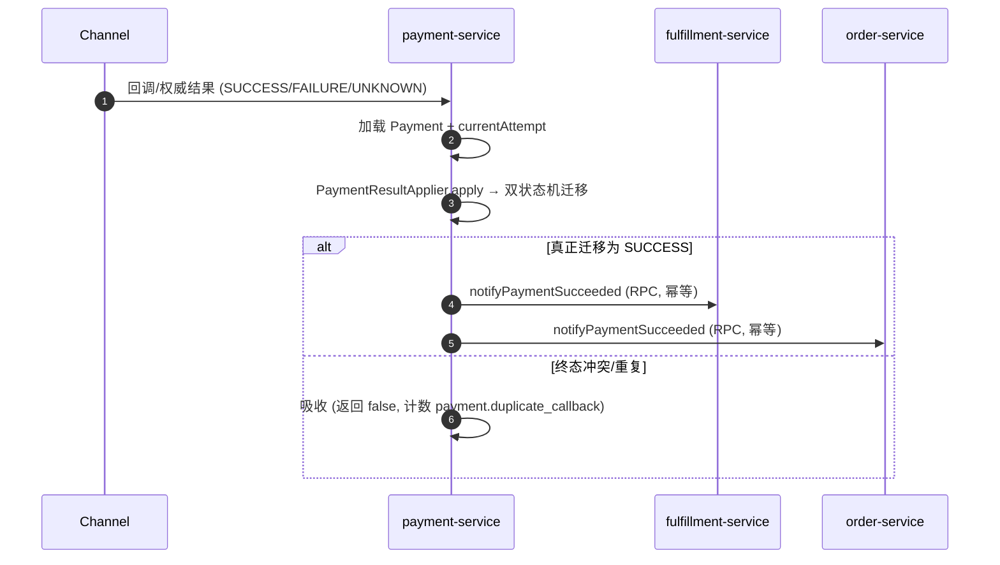

# payment-service 系统设计

**服务**：payment-service（支付编排 + 渠道适配）
**端口**：8084 | **Schema**：`payment` | **包根**：`com.payment.payment`

**上游依赖**：order-service（创建支付意图）、payment-service 内 refund 包（进程内自洽，Feature 015 起金额查询 + 渠道退款不再跨服务）、reconciliation-service（读支付事实）
**下游依赖**：order-service（支付成功回写订单/交易）、fulfillment-service（支付成功触发履约）、Channel Adapter（Mock Channel）

> 标注约定：无标记 = 已实现；`[目标]` = 建议值待确认；`[待定]` = 留待后续；`[Phase N 延后]` = 明确延后。

---

## 1. 设计目标与约束

### 1.1 职责边界（负责 / 不负责）

| 维度 | 说明 |
|---|---|
| **负责** | 支付意图、支付金额/币种、幂等键、支付状态机、支付尝试（PaymentAttempt）、渠道结果应用、回调幂等、UNKNOWN 收敛、支付成功回写订单/交易（RPC）、退款渠道尝试透传、对账支付事实抽取 |
| **不负责** | 具体渠道协议实现（依赖 `PaymentChannel` 接口抽象）；订单/履约/权益的最终状态；退款整体决策（归属 refund-service） |

### 1.2 硬约束（Constitution / ADR）

- **Payment ≠ Channel**：核心 Payment 领域只依赖 `application/channel/PaymentChannel` 接口，不依赖 `infra/channel` 具体实现。
- **金额铁律**：金额一律最小货币单位 `long`（`amountMinor`），禁止 `float`/`double`；不变量 `amountMinor > 0`。
- **幂等**：资金入口（创建支付意图、退款尝试）必须有幂等键，数据库唯一约束兜底。
- **UNKNOWN 不猜成败**：超时/断连/不完整响应进 `UNKNOWN`，绝不臆断成功/失败。
- **终态不可覆盖**：SUCCEEDED/FAILED 吸收一切迟到冲突结果。

### 1.3 技术指标（`[目标]`，待确认）

| 指标 | 目标值 |
|---|---|
| 创建支付意图 P99 | ≤ 500ms（本地 Mock Channel + 单次 MySQL 写） |
| 支付回调/收敛处理 P99 | ≤ 300ms |
| 支付事实查询 P99 | ≤ 300ms |
| 资金入口可用性 | ≥ 99.9% |

---

## 2. 核心数据模型（DDD）

### 2.1 聚合与值对象

| 类型 | 名称 | 位置 | 说明 |
|---|---|---|---|
| 聚合根 | `Payment` | [domain/Payment.java](../../payment-service/src/main/java/com/payment/payment/domain/Payment.java) | 平台支付意图 + 平台状态；不保存渠道内部状态 |
| 实体 | `PaymentAttempt` | [domain/PaymentAttempt.java](../../payment-service/src/main/java/com/payment/payment/domain/PaymentAttempt.java) | 一次渠道交互的完整历史（渠道引用/时间/结果/状态） |
| 值对象 | `Money` | [common-core](../../common/common-core/src/main/java/com/payment/common/core/money/Money.java) | 金额 + 币种（领域内金额用 `long` 分承载） |
| 值对象 | `IdempotencyKey` | [common-core](../../common/common-core/src/main/java/com/payment/common/core/idempotency/IdempotencyKey.java) | 幂等键 |
| 值对象 | `ChannelResult` | [application/channel/ChannelResult.java](../../payment-service/src/main/java/com/payment/payment/application/channel/ChannelResult.java) | 渠道结果 SUCCESS/FAILURE/UNKNOWN + 渠道引用 + 原因 |
| 值对象 | `ChargeRequest` / `RefundRequest` | [application/channel/](../../payment-service/src/main/java/com/payment/payment/application/channel/) | 平台→渠道请求（只读必要字段，不访问支付聚合内部状态） |

**基数关系（MVP）**：`Payment (1) ─ (N) PaymentAttempt`，每次尝试 ≤ 1 个渠道引用（`channel_reference` 唯一约束）。

### 2.2 状态机

**Payment**（`PaymentStatus`）：

```text
PENDING --start--> PROCESSING --succeed--> SUCCEEDED
                    |      \--fail---------> FAILED
                    \--markUnknown--------> UNKNOWN --succeed/fail--> SUCCEEDED/FAILED
SUCCEEDED/FAILED --close--> CLOSED
```

- `start(attemptId)`：PENDING → PROCESSING（记录当前尝试）。
- `succeed()`：PROCESSING/UNKNOWN → SUCCEEDED；终态冲突返回 `false`。
- `fail(reason)`：PROCESSING/UNKNOWN → FAILED；终态冲突返回 `false`。
- `markUnknown(reason)`：PROCESSING → UNKNOWN；终态冲突返回 `false`。
- `close()`：SUCCEEDED/FAILED → CLOSED；非法来源抛 `STATE_TRANSITION_VIOLATION`。

**PaymentAttempt**（`PaymentAttemptStatus`）：

```text
PENDING --accept--> ACCEPTED --succeed--> SUCCEEDED
            \------markUnknown--> UNKNOWN --succeed/fail--> SUCCEEDED/FAILED
                              ACCEPTED --fail--> FAILED
```

- 关键不变量：`succeed()/fail()` 对 SUCCEEDED/FAILED 返回 `false`（迟到结果被吸收），`markUnknown()` 对终态返回 `false`（迟到未知不覆盖终态）。

### 2.3 表结构与索引策略

来源：[deployment/schema/03-payment-schema.sql](../../deployment/schema/03-payment-schema.sql)（权威 DDL）。

**`payments`**

| 列 | 类型 | 说明 |
|---|---|---|
| id | BIGINT PK AUTO_INCREMENT | 支付 ID |
| transaction_id | VARCHAR(64) NOT NULL | 交易引用，唯一 `uk_payments_transaction_id` |
| order_id | VARCHAR(64) NOT NULL | 订单引用 |
| user_id | VARCHAR(64) NOT NULL | 用户引用 |
| amount_minor | BIGINT NOT NULL | 金额（最小货币单位） |
| currency_code | VARCHAR(8) NOT NULL | 币种 |
| idempotency_key | VARCHAR(128) NOT NULL | 幂等键，唯一 `uk_payments_idempotency_key` |
| status | VARCHAR(32) NOT NULL | 状态机枚举名 |
| current_attempt_id | BIGINT | 当前尝试 |
| failure_reason | VARCHAR(255) | 失败原因 |
| created_at / updated_at / created_by / updated_by / version | — | 审计 + 乐观锁（BaseEntity） |

**`payment_attempts`**

| 列 | 类型 | 说明 |
|---|---|---|
| id | BIGINT PK AUTO_INCREMENT | 尝试 ID |
| payment_id | BIGINT NOT NULL | 支付引用，普通索引 `idx_attempts_payment_id` |
| channel_code | VARCHAR(32) NOT NULL | 渠道标识 |
| requested_at / responded_at | DATETIME | 请求/响应时间 |
| channel_reference | VARCHAR(128) | 渠道交易引用，唯一 `uk_attempts_channel_reference` |
| status | VARCHAR(32) NOT NULL | 尝试状态机枚举名 |
| failure_reason | VARCHAR(255) | 失败原因 |
| retry_count | INT NOT NULL DEFAULT 0 | 重试计数 |

**索引策略（已实现）**：
- `payments`：`uk_payments_idempotency_key`（幂等兜底）、`uk_payments_transaction_id`（1:1 交易）。
- `payment_attempts`：`uk_attempts_channel_reference`（重复回调映射同一渠道交互）、`idx_attempts_payment_id`（按支付查尝试）。

**分库分表键**：`[Phase 10 延后]` 当前单库单表，不引入分库分表；候选分片键为 `order_id` 或 `user_id`，留待有真实负载证据后再评估（Constitution §3.4 决策门槛）。

---

## 3. 接口详细定义（API 契约）

### 3.1 通用约定

- 成功与错误响应均为 `application/json`；金额字段统一为最小货币单位 `long`，币种字段为 ISO-4217 三字母大写码。
- 请求链路使用 `X-Trace-Id`（缺失时由服务生成）；服务间 Feign 调用透传该值。错误响应中的 `traceId` 用于排障。
- 统一错误体 `ApiError`：

```json
{"code":"INVALID_ARGUMENT","message":"channelCode: unsupported channel","traceId":"trace-123",
 "timestamp":"2026-09-04T10:00:00Z","path":"/payments"}
```

- HTTP 映射：参数校验/业务参数错误为 `400`；资源不存在为 `404`；状态、金额、幂等冲突为 `409`；未预期系统错误为 `500`。
- 所有 `/internal/**` 接口仅供服务间调用，不作为公网 API；当前内部鉴权为空实现，依赖网络隔离。

### 3.2 创建支付意图（order-service → payment-service）

`POST /payments` → `201 Created`

**请求** `CreatePaymentRequest`（common-dto）：

| 字段 | 类型 | 必填 | 约束/说明 |
|---|---|---|---|
| orderId | String | 是 | 订单 ID |
| transactionId | String | 是 | 交易 ID |
| userId | String | 是 | 用户 ID |
| amountMinor | long | 是 | 金额（分，> 0） |
| currencyCode | String | 是 | `^[A-Z]{3}$`，如 `CNY` |
| idempotencyKey | String | 是 | 非空；重复请求不得产生第二次资金动作 |
| channelCode | String | 是 | 非空；必须已注册到渠道 Registry/Router |

**响应** `CreatePaymentResponse`：`{ paymentId: Long, status: String, payUrl: String|null }`。

`status` 为 `PaymentStatus` 枚举名；`payUrl` 仅在 `payment.mock-cashier.enabled=true` 时返回，否则为 `null`。

**错误**：`400 INVALID_ARGUMENT`（字段缺失、金额 `<= 0`、币种格式非法、`channelCode` 未注册）；`409 AMOUNT_INVARIANT_VIOLATION`（领域层金额不变量失败）、`409 DUPLICATE`（唯一键冲突且无法回查原支付）。

### 3.3 查询支付

`GET /payments/{id}` → `200`

**响应** `PaymentResponse`：`{ id, transactionId, orderId, userId, amountMinor, currencyCode, status, failureReason }`。

**错误**：`NOT_FOUND`。

### 3.4 收敛未知支付

`POST /payments/{id}/resolve` → `200`

**请求** `ResolveRequest`：`{ result: "SUCCESS"|"FAILURE", channelReference: String, reason: String }`。

**响应**：收敛后的 `PaymentResponse`。

**规则**：仅 `UNKNOWN` 状态可被收敛；已终态视为幂等重复（返回当前状态，不重复触发履约）。`result` 非 SUCCESS/FAILURE → `INVALID_ARGUMENT`。

**错误**：`400 INVALID_ARGUMENT`（结果非法）；`404 NOT_FOUND`；`409 STATE_TRANSITION_VIOLATION`（当前状态不允许收敛）。

### 3.5 渠道回调（Channel → payment-service）

`POST /internal/payments/{id}/channel-callback` → `200 OK`

**请求头**：`X-Channel-Timestamp`、`X-Channel-Signature`。当前验签过滤器为 ADR-0025 占位空实现，接入真实渠道前必须实现验签。

**请求体** `ChannelCallbackRequest`：`{ status: "SUCCESS|FAILURE|UNKNOWN", channelReference: String|null, reason: String|null, amountMinor: Long|null }`。

`amountMinor` 为渠道回传实付金额，仅落观测，当前不拦截。响应为当前支付的 `PaymentResponse`；重复、乱序及迟到冲突结果由状态机吸收。

**错误**：`400 INVALID_ARGUMENT`（status 非法或校验失败）；`404 NOT_FOUND`。

### 3.6 退款相关内部 RPC（供 refund-service）

`POST /internal/payments/query-amount`

**请求** `PaymentAmountQueryRequest`：`{ paymentId: Long }`
**响应** `PaymentAmountQueryResponse`：`{ paymentId, orderId, userId, paidAmountMinor, currencyCode, status }`
**错误**：`NOT_FOUND`。

`POST /internal/payments/refund-attempt`

**请求** `RefundAttemptRequest`：`{ refundNo, paymentNo, orderNo, userId, amountMinor, currencyCode, reason, idempotencyKey }`（ADR-0063 业务单号）
**响应** `RefundAttemptResponse`：`{ refundNo, status: "SUCCEEDED"|"FAILED"|"UNKNOWN", channelReference }`
**规则**：仅 `SUCCEEDED` 支付可退款；否则 `STATE_TRANSITION_VIOLATION`。渠道 UNKNOWN 原样回传，不臆断。

### 3.7 对账事实查询（供 reconciliation-service）

`GET /internal/payments/confirmed-facts` → `200`

**响应**：`List<PaymentFactResponse>`，每项 `{ paymentId, channelReference, amountMinor, currencyCode, status }`；仅返回 `SUCCEEDED` 支付。

### 3.8 出站 RPC（payment → fulfillment / order / ledger）

**fulfillment-service**：`POST /internal/fulfillments/on-payment-succeeded`（Feign，默认 `http://localhost:8086`）
**请求** `PaymentSucceededRequest`：`{ paymentId, orderId, transactionId, userId, amountMinor, currencyCode }`
**响应** `FulfillmentAcceptedResponse`：`{ fulfillmentId, status }`。

**order-service**：`POST /internal/orders/on-payment-succeeded`（Feign，默认 `http://localhost:8083`）
**请求** `PaymentSucceededRequest`（同上）
**响应** 无返回体（订单侧幂等吸收）。

**ledger-service**：`POST /internal/ledger/postings`，请求 `PostingRequest`，响应 `PostingResponse`；`GET /internal/ledger/postings?idempotencyKey=...` 用于记账幂等回查。记账请求的分录必须非空且借贷金额平衡，幂等键格式为 `PAYMENT:<payment-idempotency-key>`。

### 3.9 错误码枚举（全局，common-core `ErrorCodes`）

| 错误码 | 语义 | 本服务使用场景 |
|---|---|---|
| `INVALID_ARGUMENT` | 400 | 参数非法 | resolve 结果非法、字段缺失、未注册渠道 |
| `NOT_FOUND` | 404 | 资源不存在 | 支付/尝试不存在 |
| `CONFLICT` | 409 | 状态冲突 | （预留） |
| `DUPLICATE` | 409 | 幂等冲突 | 幂等键撞唯一约束且回查失败 |
| `STATE_TRANSITION_VIOLATION` | 409 | 非法状态迁移 | 非 SUCCEEDED 支付退款、非法 close/start/resolve |
| `AMOUNT_INVARIANT_VIOLATION` | 409 | 金额不变量 | amount ≤ 0 |
| `UNKNOWN_STATUS` | 400 | 未知状态 | （预留） |
| `INTERNAL_ERROR` | 500 | 内部错误 | 尝试缺失（数据不一致） |

---

## 4. 关键流程链路剖析

### 4.1 创建支付意图（含渠道调用）

`PaymentController.createPayment` → `PaymentApplicationService.createPaymentIntent`（[源码](../../payment-service/src/main/java/com/payment/payment/application/PaymentApplicationService.java)）：

1. `findByIdempotencyKey` 回查；命中 → 计数 `payment.duplicate` 并返回首次结果（幂等）。
2. 构造 `Payment`（校验 `amountMinor > 0`）→ `insertNew`：`save` 撞 `uk_payments_idempotency_key` 的 `DuplicateKeyException` 时回查返回首次结果（**数据库级幂等兜底，覆盖并发/重启后重复插入**）。
3. `new PaymentAttempt(...)` → `save`；`payment.start(attemptId)`（PENDING → PROCESSING）。
4. `channel.charge(ChargeRequest)` 调 Mock Channel，返回 `ChannelResult`（SUCCESS/FAILURE/UNKNOWN）。
5. `PaymentResultApplier.apply(payment, attempt, result)`：按结果驱动双状态机；返回 `changed`（是否真正迁移）。
6. `save` 支付 + 尝试（本地事务）；`changed` 时 `recordTransition`（指标 + `FINANCIAL_AUDIT` 审计）。
7. 若 `changed && SUCCESS`：`fulfillmentGateway.notifyPaymentSucceeded(...)`；**履约 RPC 失败 catch 忽略，不回滚支付成功事实**。

### 4.2 渠道回调 / 收敛（去重与 UNKNOWN 收敛）

`PaymentCallbackService.handleCallback` 与 `PaymentUnknownResolutionService.resolve` 复用 `PaymentResultProcessor.applyAndNotify`：

1. 加载 `Payment`（不存在 `NOT_FOUND`）+ `currentAttempt`。
2. `PaymentResultApplier.apply` 应用结果；终态冲突/重复回调返回 `false`（不触发事件）。
3. `save` 持久化；`changed && SUCCESS` 时触发一次履约 RPC 与一次订单回写 RPC（各自 try/catch 隔离，任一失败不回滚支付成功事实）。
4. 收敛仅对 `UNKNOWN` 生效：`resolve` 先断言 `status == UNKNOWN`，否则 `false`。



### 4.3 退款渠道尝试（透传）

`PaymentRefundService.refund`（[源码](../../payment-service/src/main/java/com/payment/payment/application/PaymentRefundService.java)）：

1. 加载支付（`NOT_FOUND`）；断言 `SUCCEEDED`（否则 `STATE_TRANSITION_VIOLATION`）。
2. `channel.refund(RefundRequest)` 调 Mock Channel，`ChannelResult` 映射为 `SUCCEEDED/FAILED/UNKNOWN` 字符串回传。
3. **不迁移支付领域状态**（退款决策归属 refund-service）；UNKNOWN 原样回传。

---

## 5. 存储与缓存设计 + 详细逻辑处理策略（Edge Cases）

### 5.1 存储读写策略

- **写路径**：`MybatisPaymentRepository` / `MybatisPaymentAttemptRepository` 在 `@Transactional` 应用服务内写 `payments` / `payment_attempts`；状态机逻辑在领域层，持久层只存枚举名。
- **读路径**：`findById` / `findByIdempotencyKey` / `findByStatus`（对账事实抽取按 `SUCCEEDED` 查询）。
- **缓存**：`[已评估·本期不引入]` 当前**无 Redis/本地缓存**，全部直连 MySQL；支付事实需强一致，不引入 Cache-Aside（避免读到过期状态）。Redis 已在平台引入（ADR-0044），本服务经评估**不使用**（状态需强一致）；未来若出现只读热点须另立 ADR。

### 5.2 幂等性方案

| 作用域 | 机制 |
|---|---|
| 创建支付意图 | `uk_payments_idempotency_key` 唯一约束 + 先回查 + `DuplicateKeyException` 捕获回查（数据库级，覆盖并发/重启） |
| 重复/乱序回调 | `uk_attempts_channel_reference` 唯一约束 + 状态机终态吸收（`succeed/fail/markUnknown` 对终态返回 `false`） |
| 履约触发「最多一次」 | 仅在 `PaymentResultApplier` 返回 `changed` 且 `SUCCESS` 时触发一次 RPC；重复回调 `changed=false` 不触发 |

### 5.3 分布式事务方案

- 单服务内：`createPaymentIntent` 的「支付 + 尝试」在同一本地事务原子提交。
- 跨服务：履约 RPC 与订单回写 RPC 均为后置副作用，**失败不回滚支付成功事实**（各自 `catch (RuntimeException ignored)`），靠对账/重试/人工收敛最终一致（Saga 语义，禁 2PC/XA）。

### 5.4 异常与边界场景

| 场景 | 处理 | 阈值/规则 |
|---|---|---|
| 渠道超时/断连/不完整响应 | Mock Channel 返回 `UNKNOWN`；`markUnknown` | 不猜成败；进 UNKNOWN 等待收敛 |
| 迟到失败覆盖成功 | 状态机终态吸收 | SUCCEEDED 后 `fail()` 返回 `false`，不覆盖 |
| 迟到未知覆盖终态 | `markUnknown` 对终态返回 `false` | 不覆盖 |
| 并发重复创建支付 | `DuplicateKeyException` → 回查返回首次结果 | 数据库唯一约束兜底 |
| 履约 RPC 失败 | 捕获忽略，不回滚支付成功 | 靠对账收敛，不重复扣款 |
| 幂等键冲突且回查失败 | 抛 `DUPLICATE` | 数据不一致时显式报错 |
| 非 SUCCEEDED 退款 | 抛 `STATE_TRANSITION_VIOLATION` | 拒绝 |

**超时/重试/降级阈值（`[目标]`，待确认）**：
- 出站 Feign（履约）超时：当前未显式配置（用 OpenFeign 默认值）；`[目标]` connectTimeout=1s、readTimeout=3s。
- 重试：仅对幂等调用允许重试；创建支付意图**不自动重试**（靠幂等键 + 调用方重试）；履约 RPC `[目标]` 有限退避重试（如 3 次、1s/2s/4s），耗尽后进入对账/人工。
- 熔断/降级：**撤回原「50% 打开熔断」表述**（与 ADR-0021「不引入 Resilience4j」冲突）。本期弹性口径 = **显式超时**（出站 RPC 1s / 对外 HTTP 1.5s，全服务统一）+ **仅幂等调用有限重试**（3 次退避 1s/2s/4s）。⚠️ 代码已引入 Resilience4j（**2026-09-04 负责人裁决：保留该依赖**，作为未接线空壳，故不描述任何熔断行为）；缺独立 ADR，登记 backlog #5。对账侧按 ADR-0021 明确不引入。

---

## 6. 部署拓扑与配置文件设计

### 6.1 运行态配置（application.yml）

来源：[application.yml](../../payment-service/src/main/resources/application.yml)

```yaml
spring:
  application.name: payment-service
  datasource:
    url: jdbc:mysql://localhost:3306/payment?useSSL=false&serverTimezone=UTC&allowPublicKeyRetrieval=true
    username: root
    password: root
server:
  port: 8084
mybatis-plus.configuration.map-underscore-to-camel-case: true
```

### 6.2 环境变量清单（dev / test / prod 差异化项，`[目标]` 建议）

| 配置项 | dev（默认） | test | prod（`[目标]`） |
|---|---|---|---|
| `spring.datasource.url` | `jdbc:mysql://localhost:3306/payment` | Testcontainers MySQL | 走环境变量/配置中心，指向生产实例 |
| `spring.datasource.username/password` | root/root | — | 环境变量注入，禁止硬编码 |
| `server.port` | 8084 | 随机 | 8084（或编排指定） |
| `services.fulfillment.url` | `http://localhost:8086` | fake | Nacos 服务发现（去掉硬编码 url） |
| `services.order.url` | `http://localhost:8083` | fake | Nacos 服务发现（去掉硬编码 url） |
| 连接池大小 `spring.datasource.hikari.maximum-pool-size` | 默认 10 | — | `[目标]` 按并发调优（如 20） |
| 出站 Feign 超时 | 未配置 | — | `[目标]` connect 1s / read 3s |

### 6.3 启动依赖顺序

```text
1. MySQL 8.0 就绪（payment schema 由 deployment/schema/03-payment-schema.sql 建库建表）
2. Nacos 就绪（注册 + 配置）  [目标：生产启用；当前本地直连 MySQL，未强制依赖 Nacos]
3. 启动 payment-service（端口 8084），完成 Feign 客户端装配
4. 下游 fulfillment-service 可延后就绪（履约 RPC 失败可容错，不阻塞启动）
```

### 6.4 埋点与日志键（本服务）

**业务指标（Micrometer，`BusinessMetrics`）**：

| 指标键 | 类型 | 维度 | 说明 |
|---|---|---|---|
| `payment.initiated` | counter | module=payment | 创建支付意图 |
| `payment.duplicate` | counter | module=payment | 幂等命中（重复请求） |
| `payment.succeeded` | counter | module=payment | 支付成功 |
| `payment.failed` | counter | module=payment | 支付失败 |
| `payment.unknown` | counter | module=payment | 支付未知 |
| `payment.duplicate_callback` | counter | module=payment | 重复回调被吸收 |
| `payment.unknown.duration` | timer | module=payment | UNKNOWN 收敛耗时 |

**资金审计日志（`FINANCIAL_AUDIT` logger，`StructuredAuditLogger`）**：

单行 JSON，`action` 取值 `payment.succeeded` / `payment.failed` / `payment.unknown`，字段键：

```json
{"action":"payment.succeeded","traceId":"...","idempotencyKey":"...","amountMinor":100,
 "currencyCode":"CNY","fromStatus":"PROCESSING","toStatus":"SUCCEEDED","entityType":"payment","entityId":"42"}
```

**关联字段**：`traceId`（`TraceContext` / `TraceIdFilter` 跨服务传播，`TraceIdRequestInterceptor` 透传 Feign）。

---

## 7. 回调与出站安全（Current Status）

> 本节补全审计缺口：原文档缺失「渠道回调验签 / 出站安全」专章。决策以 ADR 为权威（见 `technical-solution.md` §2.4、§5.2 与 `docs/adr/README.md`）。

| 能力 | 状态 | 接入点 | 决策 |
|---|---|---|---|
| 渠道回调验签（HMAC） | ⭕ 预留空实现（恒放行） | `ChannelCallbackSignatureFilter#verifySignature` | ADR-0025 / ADR-0052；伪造回调可翻转支付状态，**payment-service 不得暴露公网** |
| 内部服务间鉴权 | ⭕ 预留空实现（恒放行） | `verifyServiceToken`（空实现） | ADR-0024 / ADR-0035；`/internal/**` 依赖网络层隔离 |
| 对外 API 鉴权 | ⛔ 本期不做 | — | Constitution §Security.3；接入真实渠道前补齐 |
| 出站内部令牌 | ⛔ 已删除 | — | ADR-0034；`platform.security.*` 已移除 |
| 敏感数据脱敏 | ⛔ 本期不做 | — | ADR-0027；`StructuredAuditLogger.mask()` 保留但生产零调用 |
| 最小风控 | ⛔ 本期不做 | — | ADR-0028 |

**payUrl 链路（ADR-0048）**：`mock-channel-web`（8091）提供收银台页 + `payUrl` 跳转 + 回调签名转发 + 演示控制台（同源代理），仅演示用。

**Mock 场景配置化（ADR-0049）**：`payment.channel.mock-scenario` 切换渠道模拟行为（成功/失败/超时/重复回调），供演示与测试断言。

**部署前置条件**：上述「本期不做」成立的前提是**部署环境不对公网暴露**；一旦暴露，验签/对外鉴权 MUST 先于功能上线补齐。
