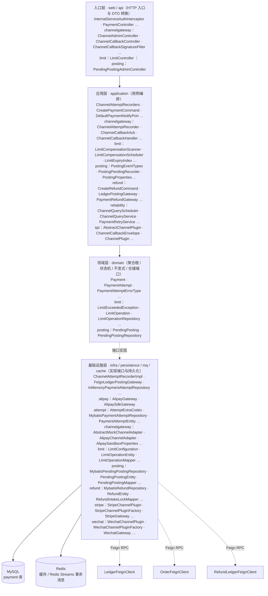
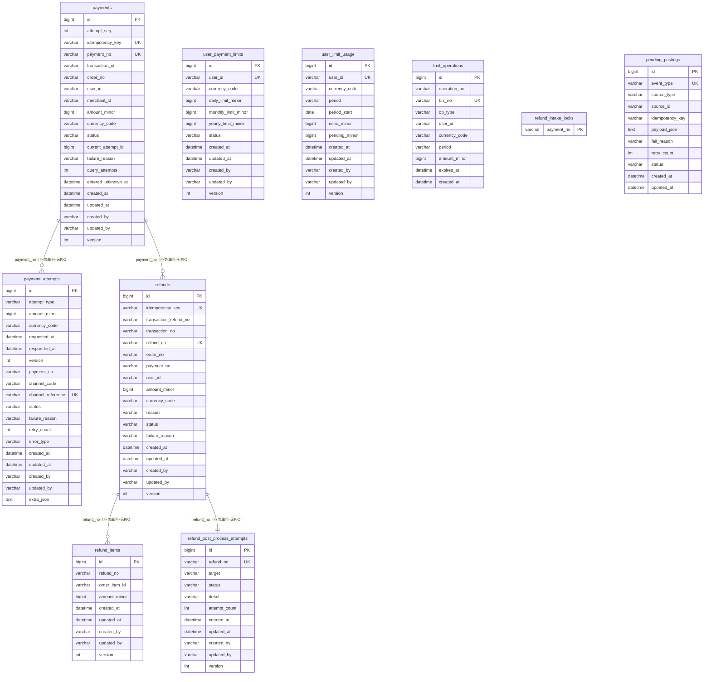
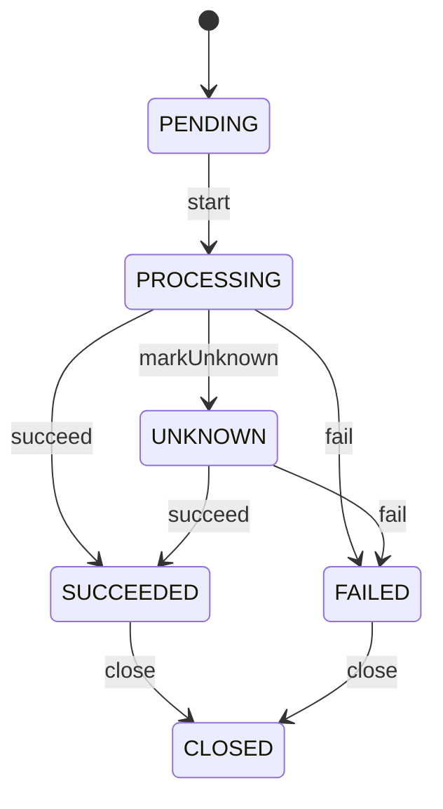
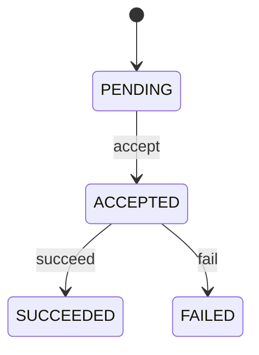
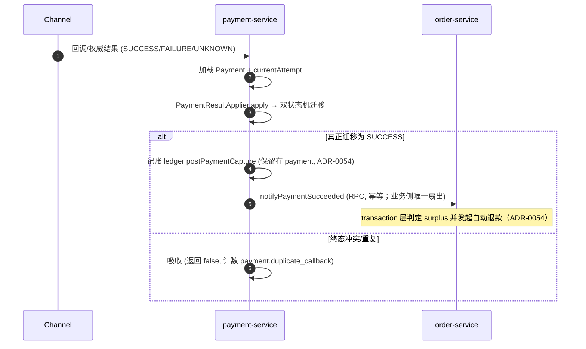
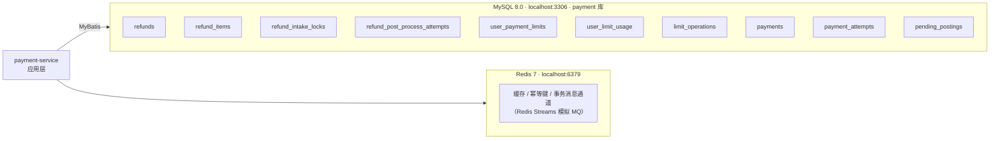

# payment-service 系统设计

**服务**：payment-service（支付编排 + 渠道适配）
**端口**：8084 | **Schema**：`payment` | **包根**：`com.payment.payment`

> 标注约定：无标记 = 已实现；`[目标]` = 建议值待确认；`[待定]` = 留待后续；`[Phase N 延后]` = 明确延后。

---

> **章节结构**：遵循 [system-design-standard](../../standards/system-design-standard.md) 的 15 章骨架。
> 2026-09-22 文档治理将原 6 章结构重排为标准章号，**正文内容未删改**。

---

## 1. 职责（Responsibility）

**payment 支付层**：支付意图、支付金额/币种、幂等键、支付状态机、渠道结果应用、回调幂等、UNKNOWN 收敛、支付成功回写订单/交易（RPC）、对账支付事实抽取、支付指令编排（含记账）、**渠道凭证到 `payUrl` 的出参**（spec 030）；**channelgateway 渠道网关层**：**渠道单**（`ChannelOrder`，表 `channel_orders`——原 `PaymentAttempt` / `payment_attempts`，spec 041 随域迁入并正名）的开单 / 收敛 / 落库，**唯一写入口 `ChannelOrderService`**（spec 041：payment 层不再写该表、两侧事务已拆分，终态偏差由主动查询 / 超时扫描 / 对账收敛）、渠道回执的两个入向端点、渠道实现族、渠道身份与注册表（spec 028）、**统一渠道契约**（spec 030 / ADR-0075）、**渠道模态（mock / 真实）的落库与分流**（spec 030 / ADR-0076）、**扣款派发策略**（spec 041 / `ChargeDispatchPolicy`：演示收银台裁决收在渠道侧）

### 1.1 技术指标（`[目标]`，待确认）

| 指标 | 目标值 |
|---|---|
| 创建支付意图 P99 | ≤ 500ms（本地 Mock Channel + 单次 MySQL 写） |
| 支付回调/收敛处理 P99 | ≤ 300ms |
| 支付事实查询 P99 | ≤ 300ms |
| 资金入口可用性 | ≥ 99.9% |

---

## 2. 不负责（Non-Responsibility）

具体渠道协议实现（由渠道层的实现族承载；payment 层只依赖 `PaymentChannel` / `AlipayGateway` 接口抽象，**不依赖 `channelgateway/infra`，也不依赖任何渠道 SDK**）；订单/履约/权益的最终状态；退款整体决策（归属本服务退款域，见 [§17](#8-退款域设计原-refund-servicefeature-015-并入)）

## 3. 上下文与约束（Context）

### 3.1 上下游依赖方向

- **上游依赖**：order-service（创建支付意图 + 退款发起/收口，ADR-0054/0067）、reconciliation-service（读支付事实）
- **下游依赖**：order-service（支付成功回写订单/交易，业务侧唯一扇出）、ledger-service（复式记账）、Channel Adapter（Mock Channel，退款默认受理+异步回调，spec 019）

- **依赖方式**：跨服务交互一律经公开 REST / Feign RPC 或事件通道，**禁止**直接 SQL 他服务 Schema（Database-per-Service，见 [technical-solution.md §3.1](../technical-solution.md)）。

### 3.2 硬约束（Constitution / ADR）

- **Payment ≠ Channel**：核心 Payment 领域只依赖 `channelgateway/application/PaymentChannel` 接口，不依赖 `channelgateway/infra` 具体实现。**构建期强制覆盖整个应用层**：`ServiceBoundaryTest#channelRoutingAbstractionMustNotDependOnChannelInfrastructure` 的 `that()` 为 `com.payment.payment.application..`（含 `.channel` 与 `.reliability`，不只是 `.application.channel` 一个子包），并配阳性对照防空转。2026-09-20 边界复审前该规则只覆盖 `application.channel..`，曾漏掉三处 `application..` → `infra.channel.SingleChannelRegistry` 的真实穿透。
- **金额铁律**：金额一律最小货币单位 `long`（`amountMinor`），禁止 `float`/`double`；不变量 `amountMinor > 0`。
- **幂等**：资金入口（创建支付意图、退款尝试）必须有幂等键，数据库唯一约束兜底。
- **UNKNOWN 不猜成败**：超时/断连/不完整响应进 `UNKNOWN`，绝不臆断成功/失败。
- **终态不可覆盖**：SUCCEEDED/FAILED 吸收一切迟到冲突结果。


### 3.3 内部分层与模块

下图由 `deployment/tools/gen-module-diagrams.py` 扫描 `payment-service/src/main/java` **自动生成**，反映真实的包与类分布（DTO 不计入）。


### 3.4 内部分层与模块

下图由 `deployment/tools/gen-module-diagrams.py` 扫描 `payment-service/src/main/java` **自动生成**，反映真实的包与类分布（DTO 不计入）。


<!-- diagram:module -->
<!-- AUTO-GENERATED by deployment/tools/gen-module-diagrams.py — 请勿手改 -->

<!-- /diagram:module -->


## 4. 领域模型（Domain Model）

### 4.1 聚合与值对象

| 类型 | 名称 | 位置 | 说明 |
|---|---|---|---|
| 聚合根 | `Payment` | [domain/Payment.java](../../../payment-service/src/main/java/com/payment/payment/domain/Payment.java) | 平台支付意图 + 平台状态；不保存渠道内部状态 |
| 实体 | `PaymentAttempt` | [domain/PaymentAttempt.java](../../../payment-service/src/main/java/com/payment/payment/domain/PaymentAttempt.java) | 一次渠道交互的完整历史（渠道引用/时间/结果/状态） |
| 值对象 | `Money` | [common-core](../../../common/common-core/src/main/java/com/payment/common/core/money/Money.java) | 金额 + 币种（领域内金额用 `long` 分承载） |
| 值对象 | `IdempotencyKey` | [common-core](../../../common/common-core/src/main/java/com/payment/common/core/idempotency/IdempotencyKey.java) | 幂等键 |
| 值对象 | `ChannelResult` | [channelgateway/application/ChannelResult.java](../../../payment-service/src/main/java/com/payment/channelgateway/application/ChannelResult.java) | 渠道结果 SUCCESS/FAILURE/UNKNOWN + 渠道引用 + 原因 + **可选付款凭证**（spec 030） |
| 值对象 | `ChargeRequest` / `RefundRequest` / `QueryStatusRequest` | [channelgateway/application/](../../../payment-service/src/main/java/com/payment/channelgateway/application/) | 平台→渠道请求（只读必要字段，不访问支付聚合内部状态）；**统一契约**见 [§3.11](#311-渠道内部契约spec-030--adr-0075) |
| 值对象 | `Goods` / `CallbackUrls` / `Payer` | 同上 | 商品信息 / 回调地址对 / 付款人（spec 030 契约分组） |
| 值对象 | `PayCredential` | 同上 | 渠道付款凭证：`kind`（六种）+ `payload` + `expiresAt`；**不落库** |
| 枚举 | `PaymentScene` | 同上 | 支付场景（`WEB` / `H5` / `NATIVE` / `JSAPI` / `MINI_PROGRAM` / `APP`），渠道能力声明的载体 |

**基数关系（MVP）**：`Payment (1) ─ (N) PaymentAttempt`，每次尝试 ≤ 1 个渠道引用（`channel_reference` 唯一约束）。

#### 4.1.1 内部两层结构（ADR-0072）

本服务内部分 **payment 支付层**与 **channelAttempt 渠道层**，各有自己的聚合、表与写入口：

| 层 | 聚合根 | 表 | 职责 |
|---|---|---|---|
| **payment 支付层** | `Payment` | `payments` | 支付单生命周期、**支付指令编排**（选路 → 调渠道 → 应用结果 → 记账 → 扇出 order）、幂等键、金额口径 |
| **channelAttempt 渠道层** | `PaymentAttempt` | `payment_attempts` | **渠道交互生命周期**（创建尝试 → 调用外部渠道 → 收敛结果 → 落渠道引用与错误分类）、**渠道实现族**（Alipay / Wechat / Douyin / Mock） |

**边界**：

- `payments` 表**只由 payment 层写**；`payment_attempts` 表**只由渠道层写**——payment 层 MUST NOT 直接依赖 `PaymentAttemptRepository`。
- payment 层需要渠道交互时**经 `PaymentChannel` 端口调用**，拿回 `ChannelResult` 后更新自己的 `Payment`（只持 `currentAttemptId` 作为指向，不持渠道细节）；**不关心渠道如何实现**（`Payment ≠ Channel`）。
- 退款 / 重试 / 主动查询走**反向路径**：以 `payment_attempts.channel_code` 记下的渠道解析实现，**禁止重新路由**（退款换渠道＝钱退错地方）。
- **分层 ≠ 拆事务**：两层共享同一本地事务——`payments` 与 `payment_attempts` 状态必须同时迁移，否则出现 `payment=SUCCEEDED / attempt=PENDING` 之类的永久不一致。

> 现状与目标差距、实施成本见 [ADR-0072](../../adr/0072-two-layer-channel-architecture.md)；渠道身份、注册表与选路规则见 [ADR-0073](../../adr/0073-channel-routing.md) 与 [spec 028](../../specs/stage-04-new-directions/028-channel-routing/spec.md)。

**渠道模态（spec 030 / [ADR-0076](../../adr/0076-traffic-dyeing-and-alipay-sandbox.md)）**：同一 `channelCode` 下可以有**两种协议实现**——本地 mock 与真实渠道。二者由**链路染色**（`X-Dye-Tag`）在**单次请求**维度决定，并落进 `payment_attempts.extra_json` 的 **`channelMode`** 键（H2 裁决：不用专用列）：

| 模态 | 含义 | 当前实现 |
|---|---|---|
| `MOCK`（缺省） | 走**内核统一**模拟语义（金额尾数故障注入 / runId 引用）。既有 Adapter 族经 `AbstractMockChannelAdapter`（另含异步退款推送与 `scenario` 配置），插件族经 `AbstractChannelPlugin`（同步退款） | `ALIPAY` / `DOUYIN` / `MOCK`（Adapter 族）+ `STRIPE` / `WECHAT`（插件族） |
| `SANDBOX` | 走**真实渠道协议** | `AlipayChannelAdapter`（支付宝沙箱）、`StripeChannelPlugin`（test mode）、`WechatChannelPlugin`（微信支付 V3；`enabled` 默认 `false`，未启用时染色 ⇒ 400） |

- 染色**只决定协议实现**，**不参与选路**（`ChannelRouter` 不读染色上下文，ADR-0073 规则不变）；
- **反向路径**（退款 / 主动查询 / 超时扫描）没有入口请求，据 `payment_attempts.extra_json` 的 **`channelMode` 落库值还原**模态（经 `PaymentAttempt.getChannelMode()` 只读派生访问器，fail-safe 缺省 `MOCK`），禁止依赖 ThreadLocal、禁止解析渠道引用字符串；
- 染色为 `SANDBOX` 但渠道 `supportsRealMode()=false`（或沙箱未启用）→ **`400 INVALID_ARGUMENT`**，不静默回落（ADR-0049 纪律）。

### 4.2 表结构与索引策略

来源：[deployment/schema/03-payment-schema.sql](../../../deployment/schema/03-payment-schema.sql)（权威 DDL）。

**`payments`**

| 列 | 类型 | 说明 |
|---|---|---|
| id | BIGINT PK AUTO_INCREMENT | 支付 ID |
| transaction_id | VARCHAR(64) NOT NULL | 交易引用，唯一 `uk_payments_transaction_id` |
| order_id | VARCHAR(64) NOT NULL | 订单引用 |
| user_id | VARCHAR(64) NOT NULL | 用户引用 |
| amount_minor | BIGINT NOT NULL | 金额（最小货币单位） |
| currency_code | VARCHAR(8) NOT NULL | 币种 |
| idempotency_key | VARCHAR(128) NOT NULL | 幂等键，唯一 `uk_payments_idempotency_key` |
| status | VARCHAR(32) NOT NULL | 状态机枚举名 |
| current_attempt_id | BIGINT | 当前尝试 |
| failure_reason | VARCHAR(255) | 失败原因 |
| created_at / updated_at / created_by / updated_by / version | — | 审计 + 乐观锁（BaseEntity） |

**`payment_attempts`**

| 列 | 类型 | 说明 |
|---|---|---|
| id | BIGINT PK AUTO_INCREMENT | 尝试 ID |
| payment_id | BIGINT NOT NULL | 支付引用，普通索引 `idx_attempts_payment_id` |
| channel_code | VARCHAR(32) NOT NULL | 渠道标识 |
| requested_at / responded_at | DATETIME | 请求/响应时间 |
| channel_reference | VARCHAR(128) | 渠道交易引用，唯一 `uk_attempts_channel_reference` |
| status | VARCHAR(32) NOT NULL | 尝试状态机枚举名 |
| failure_reason | VARCHAR(255) | 失败原因 |
| retry_count | INT NOT NULL DEFAULT 0 | 重试计数 |
| **extra_json** | TEXT NULL | **通用扩展 JSON 列**（spec 030 / [ADR-0076](../../adr/0076-traffic-dyeing-and-alipay-sandbox.md)）；**渠道模态**以键 **`channelMode`**（`MOCK` / `SANDBOX`）承载。反向路径据此还原协议实现。**TEXT 存 JSON**，沿用本项目 `payload_json` / `matches_json` 先例（不用 MySQL 原生 `JSON` 类型，避开 H2 方言差异） |

> **`extra_json` 的迁移（spec 030）**：本列由 `deployment/schema/030-payment-attempt-extra-json.sql` **增量迁移**引入，
> 同时写进 `03-payment-schema.sql` 的建表语句与测试 H2 schema——**三处必须齐备**，因为建表语句用
> `CREATE TABLE IF NOT EXISTS`，**存量库不会自动补列**（按 `ALTER TABLE ADD COLUMN` 语义追加在表末）。
>
> **载体裁决（H2，2026-09-19）**：模态**不新增专用列**（`channel_mode` 专用列方案已废弃），改由通用
> `extra_json` 的 `channelMode` 键承载——**决策语义不变**（模态仍「落库 + 反向读库」），**仅载体形态不同**。
> 读取侧 **MUST** 为 fail-safe：`NULL` / 非法 JSON / 缺 `channelMode` 键 / 值不在 `{MOCK,SANDBOX}`
> 这四类坏数据一律读作 `MOCK`，**MUST NOT** 抛异常中断反向路径、**MUST NOT** 误判为 `SANDBOX`
> （缺省语义「不染色 = MOCK」是安全默认，绝不误连真实渠道）。存量行 `NULL` **不回填、不修正**（历史事实）。

**索引策略（已实现）**：
- `payments`：`uk_payments_idempotency_key`（幂等兜底）、`uk_payments_transaction_id`（1:1 交易）。
- `payment_attempts`：`uk_attempts_channel_reference`（重复回调映射同一渠道交互）、`idx_attempts_payment_id`（按支付查尝试）。

**基数口径（与 [technical-solution.md](../technical-solution.md) 同源，MUST 同步修改）**：
`Payment : PaymentAttempt = 1:1（支付尝试）+ 1:N（退款尝试）`——`payment_attempts` 以 **`attempt_type`** 区分
`PAYMENT` / `REFUND`（Feature 016 / FR-017），同一 `payment_no` 可有 **1 条 PAYMENT 尝试 + N 条 REFUND 尝试**；
渠道重试在同一 attempt 行内 `retry_count` 递增、**不新建行**（ADR-0054）。

**分库分表键**：`[Phase 10 延后]` 当前单库单表，不引入分库分表；候选分片键为 `order_id` 或 `user_id`，留待有真实负载证据后再评估（Constitution §3.4 决策门槛）。

---


### 4.3 表关系（ER 图）

由 `deployment/tools/gen-er-diagrams.py` 从 `deployment/schema/*.sql` 解析**自动生成**，字段与真实 Schema 一致。
⚠️ 图内只出现**同库**关系：跨服务引用一律走业务单号、不建外键（[ADR-0063](../../adr/0063-cross-service-reference-by-business-no.md)），因此不存在跨库连线。


### 4.4 表关系（ER 图）

由 `deployment/tools/gen-er-diagrams.py` 从 `deployment/schema/*.sql` 解析**自动生成**，字段与真实 Schema 一致。
⚠️ 图内只出现**同库**关系：跨服务引用一律走业务单号、不建外键（[ADR-0063](../../adr/0063-cross-service-reference-by-business-no.md)），因此不存在跨库连线。


<!-- diagram:er -->
<!-- AUTO-GENERATED by deployment/tools/gen-er-diagrams.py — 请勿手改 -->

<!-- /diagram:er -->


## 5. 状态机（State Machine）

**Payment**（`PaymentStatus`）：

```text
PENDING --start--> PROCESSING --succeed--> SUCCEEDED
                    |      \--fail---------> FAILED
                    \--markUnknown--------> UNKNOWN --succeed/fail--> SUCCEEDED/FAILED
SUCCEEDED/FAILED --close--> CLOSED
```

- `start(attemptId)`：PENDING → PROCESSING（记录当前尝试）。
- `succeed()`：PROCESSING/UNKNOWN → SUCCEEDED；终态冲突返回 `false`。
- `fail(reason)`：PROCESSING/UNKNOWN → FAILED；终态冲突返回 `false`。
- `markUnknown(reason)`：PROCESSING → UNKNOWN；终态冲突返回 `false`。
- `close()`：SUCCEEDED/FAILED → CLOSED；非法来源抛 `STATE_TRANSITION_VIOLATION`。

**PaymentAttempt**（`PaymentAttemptStatus`）：

```text
PENDING --accept--> ACCEPTED --succeed--> SUCCEEDED
            \------markUnknown--> UNKNOWN --succeed/fail--> SUCCEEDED/FAILED
                              ACCEPTED --fail--> FAILED
```

- 关键不变量：`succeed()/fail()` 对 SUCCEEDED/FAILED 返回 `false`（迟到结果被吸收），`markUnknown()` 对终态返回 `false`（迟到未知不覆盖终态）。


### 5.1 状态迁移图

由 `deployment/tools/gen-sysdoc-diagrams.py` 从**本章上文的迁移文本**转换而来，不引入文中没有的状态或迁移。


### 5.2 状态迁移图

由 `deployment/tools/gen-sysdoc-diagrams.py` 从**本章上文的迁移文本**转换而来，不引入文中没有的状态或迁移。


<!-- diagram:state -->
**payment**

<!-- AUTO-GENERATED by deployment/tools/gen-sysdoc-diagrams.py — 请勿手改 -->


**paymentattempt**

<!-- AUTO-GENERATED by deployment/tools/gen-sysdoc-diagrams.py — 请勿手改 -->

<!-- /diagram:state -->


## 6. 接口与事件契约（API / Event Contract）

### 6.1 通用约定

- 成功与错误响应均为 `application/json`；金额字段统一为最小货币单位 `long`，币种字段为 ISO-4217 三字母大写码。
- 请求链路使用 `X-Trace-Id`（缺失时由服务生成）；服务间 Feign 调用透传该值。错误响应中的 `traceId` 用于排障。
- 统一错误体 `ApiError`：

```json
{"code":"INVALID_ARGUMENT","message":"channelCode: unsupported channel","traceId":"trace-123",
 "timestamp":"2026-09-04T10:00:00Z","path":"/payments"}
```

- HTTP 映射：参数校验/业务参数错误为 `400`；资源不存在为 `404`；状态、金额、幂等冲突为 `409`；未预期系统错误为 `500`。
- 所有 `/internal/**` 接口仅供服务间调用，不作为公网 API；当前内部鉴权为空实现，依赖网络隔离。

### 6.2 创建支付意图（order-service → payment-service）

`POST /payments` → `201 Created`

**请求** `CreatePaymentRequest`（common-dto）：

| 字段 | 类型 | 必填 | 约束/说明 |
|---|---|---|---|
| orderNo | String | 是 | 订单业务单号（OR+雪花，[ADR-0063](../../adr/0063-cross-service-reference-by-business-no.md)） |
| transactionId | String | 是 | 交易单号 |
| userId | String | 是 | 用户 ID |
| amountMinor | long | 是 | 金额（分，`> 0`） |
| currencyCode | String | 是 | `^[A-Z]{3}$`，如 `CNY` |
| idempotencyKey | String | **否** | 由 payment-service 服务端生成 `payment:{orderNo}:{channelCode}:{attemptSeq}`（Feature 015 起）；调用方传 `null` 即可 |
| channelCode | String | **否**（spec 028 起） | 未传 → 由 `ChannelRouter` 按配置规则选路；传了 → **显式优先**（仅校验已注册，不校验 `enabled`）。`ChannelRegistry` / `ChannelRouter` 由 [spec 028](../../specs/stage-04-new-directions/028-channel-routing/spec.md) 引入——此前该处描述的组件在代码中并不存在 |

**响应** `CreatePaymentResponse`：`{ paymentNo: String, status: String, payUrl: String|null, attemptSeq: int, channelCode: String }`。

- `status` 为 `PaymentStatus` 枚举名；
- `payUrl` 仅在 `payment.mock-cashier.enabled=true` 时返回，否则为 `null`；
- `attemptSeq` / `channelCode`（Feature 015）：本次尝试序号与所选渠道，供订单侧「换渠道重付」展示与对账聚合；`channelCode` 在 spec 028 后语义收口为「**路由后最终渠道**」（不再等同于调用方原始输入，未指定渠道时为 Router 选出的结果）。

**错误**：`400 INVALID_ARGUMENT`（字段缺失、金额 `<= 0`、币种格式非法、`channelCode` 未注册）；`409 AMOUNT_INVARIANT_VIOLATION`（领域层金额不变量失败）、`409 DUPLICATE`（唯一键冲突且无法回查原支付）；`409 NO_AVAILABLE_CHANNEL`（spec 028：未指定渠道且无可用候选）、`409 CHANNEL_UNAVAILABLE`（spec 028：显式指定的渠道已 DOWN——明确拒绝，不偷偷改选）。

### 6.3 查询支付

`GET /payments/{id}` → `200`

**响应** `PaymentResponse`：`{ id, transactionId, orderId, userId, amountMinor, currencyCode, status, failureReason }`。

**错误**：`NOT_FOUND`。

### 6.4 收敛未知支付

`POST /payments/{id}/resolve` → `200`

**请求** `ResolveRequest`：`{ result: "SUCCESS"|"FAILURE", channelReference: String, reason: String }`。

**响应**：收敛后的 `PaymentResponse`。

**规则**：仅 `UNKNOWN` 状态可被收敛；已终态视为幂等重复（返回当前状态，不重复触发履约）。`result` 非 SUCCESS/FAILURE → `INVALID_ARGUMENT`。

**错误**：`400 INVALID_ARGUMENT`（结果非法）；`404 NOT_FOUND`；`409 STATE_TRANSITION_VIOLATION`（当前状态不允许收敛）。

### 6.5 渠道回调（Channel → payment-service）

`POST /internal/payments/{id}/channel-callback` → `200 OK`

**请求头**：`X-Channel-Timestamp`、`X-Channel-Signature`。当前验签过滤器为 ADR-0025 占位空实现，接入真实渠道前必须实现验签。

**请求体** `ChannelCallbackRequest`：`{ status: "SUCCESS|FAILURE|UNKNOWN", channelReference: String|null, reason: String|null, amountMinor: Long|null }`。

`amountMinor` 为渠道回传实付金额，仅落观测，当前不拦截。响应为当前支付的 `PaymentResponse`；重复、乱序及迟到冲突结果由状态机吸收。

**错误**：`400 INVALID_ARGUMENT`（status 非法或校验失败）；`404 NOT_FOUND`。

> **与支付宝回调端点并存（spec 030；端点已于 spec 037 / FR-015 合并）**：本端点是**渠道无关的 JSON 入站回调**（`amountMinor` 仅落观测，**不做**金额拦截）；
> 支付宝异步通知原走专属端点 `POST /internal/channels/alipay/notify`，**spec 037 / T6 起已并入通用插件端点**
> `POST /internal/channels/{channelCode}/callback`（见 [§6.11.1](#6111-渠道回调端点通用插件端点spec-037--fr-015-已实现)），
> 后者自带**三段式语义校验**（验签/身份 → 引用归属 → 金额/币种）。二者**收敛语义一致**（共用 `PaymentCallbackService`），
> 差异仅在报文形态与验签层位。

### 6.6 退款相关内部 RPC（退款域已并入本服务，ADR-0064；spec 019 双层退款单）

`POST /internal/payments/query-amount`

**请求** `PaymentAmountQueryRequest`：`{ paymentId: Long }`
**响应** `PaymentAmountQueryResponse`：`{ paymentId, orderId, userId, paidAmountMinor, currencyCode, status }`
**错误**：`NOT_FOUND`。

`POST /internal/payments/refund-attempt`

**请求** `RefundAttemptRequest`：`{ refundNo(PMRF), paymentNo, orderNo, userId, amountMinor, currencyCode, reason, idempotencyKey }`（ADR-0063 业务单号）
**响应** `RefundAttemptResponse`：`{ refundNo, status: "SUCCEEDED"|"FAILED"|"UNKNOWN", channelReference }`
**规则**：仅 `SUCCEEDED` 支付可退款；否则 `STATE_TRANSITION_VIOLATION`。Mock 渠道默认异步受理（`payment.channel.refund-async=true`）→ 当场返回 `UNKNOWN`（已受理未定），落 REFUND 尝试行；权威结果经渠道回调收敛。

`POST /internal/payments/refunds/{refundNo}/channel-callback`（spec 019：Mock 渠道异步推送入口，HMAC 验签占位）

**请求体**：`{ status: "SUCCESS|FAILURE", channelReference, reason }`
**规则**：与进程内推送桥（`MockRefundResultBridge`）走同一收敛路径 `RefundResultProcessor`——退款状态机终态 + REFUND 尝试行收敛 + 记账冲正（幂等键 `REFUND:{PMRF}`）+ 通知 order 收口（TXRF+PMRF 双号）。终态吸收重复/迟到冲突结果。

### 6.7 对账事实查询（供 reconciliation-service）

`GET /internal/payments/confirmed-facts?period=...` → `200`

**响应**：`List<PaymentFactResponse>`，每项 `{ paymentId, channelReference, merchantId, amountMinor, currencyCode, status }`；仅返回 `SUCCEEDED` 支付。

**规则（spec 032 / H-032-1）**：`period` 可解析为日期（`YYYY-MM-DD`）时按 `DATE(created_at) = period` 过滤（跨期不重复结算的事实侧锚点）；缺省或不可解析（demo 周期串）返回全量并 WARN 留痕。`merchantId` 为 032 匹配键（G2）与结算商户校验（G4）的事实锚，缺商户的事实会被 settlement `ConfirmedFactGate` 拒绝。退款侧 `GET /internal/payments/refunds/confirmed-facts` 同周期过滤语义，`RefundFactResponse.merchantId` 经 payment 反查。

### 6.8 出站 RPC（payment → order / ledger；Feign 服务名寻址，ADR-0059）

**order-service**：`POST /internal/orders/on-payment-succeeded`（业务侧唯一扇出，ADR-0054）
**请求** `PaymentSucceededRequest`：`{ paymentId, orderId, transactionId, userId, amountMinor, currencyCode }`
**响应** 无返回体（订单侧幂等吸收；履约/库存由 order 层编排，payment 不直调 fulfillment）。

**ledger-service**：`POST /internal/ledger/postings`，请求 `PostingRequest`，响应 `PostingResponse`；`GET /internal/ledger/postings?idempotencyKey=...` 用于记账幂等回查。记账请求的分录必须非空且借贷金额平衡，幂等键格式为 `PAYMENT:<payment-idempotency-key>`（退款冲正为 `REFUND:{PMRF}`）。

### 6.9 错误码枚举（全局，common-core `ErrorCodes`）

| 错误码 | 语义 | 本服务使用场景 |
|---|---|---|
| `INVALID_ARGUMENT` | 400 | 参数非法 | resolve 结果非法、字段缺失、未注册渠道（列出已注册清单）、`routing.enabled=false` 且未指定渠道 |
| `NOT_FOUND` | 404 | 资源不存在 | 支付/尝试不存在 |
| `CONFLICT` | 409 | 状态冲突 | （预留） |
| `DUPLICATE` | 409 | 幂等冲突 | 幂等键撞唯一约束且回查失败 |
| `STATE_TRANSITION_VIOLATION` | 409 | 非法状态迁移 | 非 SUCCEEDED 支付退款、非法 close/start/resolve |
| `AMOUNT_INVARIANT_VIOLATION` | 409 | 金额不变量 | amount ≤ 0 |
| `UNKNOWN_STATUS` | 400 | 未知状态 | （预留） |
| `INTERNAL_ERROR` | 500 | 内部错误 | 尝试缺失（数据不一致）、被退支付单无生效支付渠道记录（FR-005） |
| `NO_AVAILABLE_CHANNEL` | 409 | 无可用渠道 | 自动选路候选集为空（全部 `enabled=false` 或 `DOWN`，Feature 028 / FR-032） |
| `CHANNEL_UNAVAILABLE` | 409 | 指定渠道不可用 | 显式指定的渠道当前 `status=DOWN`，明确拒绝不偷改（Feature 028 / FR-034） |

### 6.10 渠道路由只读端点（Feature 028 / FR-044、FR-045）

| 方法 | 路径 | 说明 |
|---|---|---|
| `GET` | `/internal/channels` | 各渠道 `code / status / priority / enabled`（演示页与排障两用） |
| `GET` | `/internal/channels/route-preview` | dry-run：此刻不指定渠道会选谁 + 候选排序 + 排除理由；**不产生任何落库** |
| `POST` | `/internal/channels/{code}/status` | **仅 `demo` profile** 注册的可用性覆盖开关（内存生效，重启复位；生产环境不存在此入口） |

响应示例（`GET /internal/channels`）：

```json
{ "routingEnabled": true,
  "channels": [ { "code": "ALIPAY", "status": "UP", "priority": 10, "enabled": true },
                { "code": "DOUYIN", "status": "UP", "priority": 30, "enabled": false } ] }
```

> **可用性是静态配置桩**（L1）：不做渠道健康探测，渠道故障需人工关渠；`DOWN` 只影响路由候选集，
> 不复用 Resilience4j CircuitBreaker 状态（D6 / S11）。

---

### 6.11 渠道内部契约（spec 030 / ADR-0075）

> **本节为契约权威定义**（[ADR-0075](../../adr/0075-unified-channel-contract.md) 🟢 Accepted）。
> 字段级需求的**验收**见 [spec 030](../../specs/stage-05-channel-and-finance-deepening/030-channel-contract-sandbox-callback/spec.md)，本节只承载**契约本身**。

**请求侧**（平台 → 渠道，`channelgateway/application/`）：

| 类型 | 字段 | 说明 |
|---|---|---|
| `ChargeRequest` | `paymentNo` / `attemptId` / `amountMinor` / `currencyCode` / `channelCode` / `scene` / `goods` / `callbackUrls` / `expireAt` / `payer` / `attach` / `channelExtra` | 扩为 12 字段（spec 030 FR-105）；**保留 5 参兼容构造器** |
| `RefundRequest` | 原 5 字段 + `channelTransactionId` / `outRequestNo` / `reason` / `refundNotifyUrl` | 扩为 9 字段（FR-106）；真实渠道退款 **MUST** 带渠道交易号 |
| `QueryStatusRequest` | 原 3 字段 + `channelTransactionId` | 扩为 4 字段（FR-107）；**`transactionId` 是平台侧交易号，不是渠道交易号** |

**响应侧**（渠道 → 平台）：

| 类型 | 说明 |
|---|---|
| `ChannelResult` | `Status`（SUCCESS / FAILURE / UNKNOWN）+ `channelReference` + `reason` + `transportCode` / `businessCode` + **可空 `credential`**（FR-112） |
| `PayCredential` | `(Kind kind, String payload, Instant expiresAt)`；`Kind ∈ {REDIRECT_URL, FORM_HTML, QR_CODE, H5_URL, JSAPI_PARAMS, CLIENT_SECRET}`（FR-111）；**不落库**（INV-2） |

**端口能力声明**：`PaymentChannel` 新增两个 `default` 方法——`supportedScenes()`（默认全支持）、`supportsRealMode()`（默认 `false`）；**不新增 `close` / `callback`**（FR-109）。

**凭证语义（INV-6）**：`credential != null` ⇒ 渠道仅**受理**、买家尚未付款 ⇒ payment **MUST** 停 `PROCESSING`，**MUST NOT** 走成功收敛路径。凭证经 `RoutedPayment` 透传至 `CreatePaymentResponse.payUrl`（`payUrl` 优先取凭证，无凭证回落 mock 收银台链接，FR-114）。

**实现实况**（spec 030 Phase 3~8，✅ 已实现）：

| 项 | 值 |
|---|---|
| 双模态分派 | `AlipayChannelAdapter`（**单 Adapter 双模态**，FR-130 / N11）——按 `DyeContext` 分发：`MOCK` 走 `super` 委托（基类 4 件横切行为零漂移），`SANDBOX` 走真实协议 |
| 沙箱凭证形态 | 电脑网站支付 `alipay.trade.page.pay` ⇒ `PayCredential(Kind.FORM_HTML)`——payload 是**自动提交表单 HTML**（`pageExecute().getBody()`），**不是 URL**。消费端 MUST 按 `Kind` 分流：URL 可直接 `window.open`，表单 HTML 须先包装成可加载页面（`demo.html` 用 Blob URL）否则**空白页**。⚠️ 2026-09-20 修正：此前误标 `REDIRECT_URL` 正是空白页根因 |
| 端口收口（INV-7） | `channelgateway/application/AlipayGateway` 为端口（**只用平台自有类型**）；`channelgateway/infra/alipay/AlipaySdkGateway` 是**唯一** import SDK **Java 包 `com.alipay.api`** 的类（⚠️ 不是 Maven 坐标 `com.alipay.sdk:alipay-sdk-java`，两者混淆会让门禁空转）。ArchUnit 构建期强制（`ServiceBoundaryTest#alipaySdkMustBeConfinedToItsInfrastructureAdapter`，含阳性对照） |
| 沙箱配置 | `channelgateway/infra/config/AlipaySandboxProperties`（`payment.channel.adapters.alipay.sandbox.*`，`enabled` 默认 `false`）；密钥一律 env 注入，`toString()` 省略密钥（INV-2），启动期强校验缺失项（FR-134） |
| 沙箱未启用 | 染色 `SANDBOX` 而 `enabled=false` ⇒ **400 INVALID_ARGUMENT**，**不静默回落 mock**（FR-241 / INV-8） |
| 场景收窄 | `supportedScenes()`：沙箱取 `{WEB}`，mock 取全集（FR-131） |
| 金额换算 | `BigDecimal.valueOf(amountMinor, 2).toPlainString()`——**禁 `double`/`float`**（INV-1 / FR-139） |
| 渠道状态映射 | `AlipayTradeStatus`（`SUCCESS` / `CLOSED` / `WAIT_BUYER_PAY` / `UNKNOWN`）——渠道协议概念的平台投影，不外泄渠道私有错误码（FR-141） |

> **本节状态**：契约条款由 ADR-0075 定稿，实现实况由 T138 于 spec 030 实现完成后补齐（2026-09-20）。

#### 6.11.1 渠道回调端点（通用插件端点，spec 037 / FR-015，✅ 已实现）

| 项 | 值 |
|---|---|
| 端点 | `POST /internal/channels/{channelCode}/callback`（支付宝 = `/internal/channels/ALIPAY/callback`） |
| 实现 | `channelgateway/api/ChannelPluginCallbackController`——只做「收报文、交网关」；**刻意不限制 content-type**（表单协议与 JSON 协议的渠道并存，限制成表单会让后者永远收不到回调） |
| 内核模板 | `channelgateway/application/ChannelCallbackHandler#handle`（`final`：四步顺序不可换） |
| ① 选插件 | 按路径 `channelCode` 经 `ChannelRegistry` **精确寻址**（INV-6，绝不重新路由）；非插件渠道 / 未声明回调挂载点 ⇒ **直接失败**，不伪装成 200/403（那是配置错误，不是渠道报文问题） |
| ② 验签 + 身份 | 插件 `parseCallback` 内（支付宝：RSA2 验签 → `app_id` 一致性）。失败 ⇒ **403** 且**不触达** Payment 侧（INV-10），计 `payment.notify_rejected{reason=signature}` |
| ③ 报文转换 | 插件把渠道私有报文翻成 `ParsedCallback`（哪一笔 / 什么结论 / 渠道声称多少钱）。内核**不认识任何渠道字段名**——一旦认识 `out_trade_no`，第二家渠道就得改内核 |
| ④ 跨域通知 | 内核统一封装 `ChannelPayNotified`（`common-dto`），经 `PaymentNotifyPort` 交 Payment；模态包裹 `DyeContext.callWith(SANDBOX, …)` 在此处（FR-013：模态判定内聚在渠道网关域） |
| 业务校验 | `DefaultPaymentNotifyPort`：渠道引用归属（防串号，FR-212）+ 金额 / 币种（FR-210/211）；口径**逐字承自**原 `ChannelPluginCallbackController.validate()` |
| 响应体 | 受理 ⇒ 插件声明的应答体（支付宝**恰好**纯文本 `success`，FR-206）；业务拒绝 ⇒ `rejected: ...`；异常 ⇒ `processing error`。**一律 200**，靠 body 表达语义——渠道（如支付宝）靠 body 精确匹配判断「平台已收到」 |
| 校验失败三件套 | 不推进任何状态 + 计指标（`payment.notify_rejected`，带 `reason` 维度）+ 写审计（`FINANCIAL_AUDIT`），**缺一不可**（FR-213） |
| 收敛复用 | `PaymentCallbackService.handleCallback`（终态吸收 + 乱序保护 + 幂等），**不新建收敛链路**（FR-205） |
| 状态映射 | 由插件承担。支付宝：`TRADE_SUCCESS` / `TRADE_FINISHED` → success；`TRADE_CLOSED` → businessFailure；`WAIT_BUYER_PAY` / 未知 → businessUnknown（**不推进**，FR-204） |

> **FR-015 迁移记录（2026-09-25，spec 037 / T6）**：原支付宝专属端点
> `POST /internal/channels/alipay/notify`（`channelgateway/api/AlipayNotifyController`，
> `@ConditionalOnBean(AlipayGateway.class)`）**已删除**，回调统一走上面的通用端点。
> 它的三段职责被拆到各自该在的层：**报文解析**下沉到 `AlipayChannelAdapter#parseCallback`
> （插件钩子），**业务校验**归 `DefaultPaymentNotifyPort`（Payment 域），**模态包裹**归
> `ChannelCallbackHandler`（渠道网关域）。至此 **036 登记的 TD-1（回调双轨）关闭**，
> 038 白名单中的 `AlipayNotifyController` 条目同步移除（4 → 2 条）。
>
> 由此产生两处**有意**的行为差异（均已登记）：① 非表单请求不再被 415 拒绝，而是原样交给插件
> （多协议端点的前提）；② 身份校验失败从 `reason=app_id` 归入 `reason=signature`
> ——`app_id` 属「①签名/身份」段，与验签同源，故不再单列监控维度。

> 与既有 JSON 回调路径（§3.5）的关系：两条路径**收敛语义一致**（共用 `handleCallback`，SC-B2-06，由 `PaymentCallbackPathParityTest` 锁定）；差异在报文形态与验签层位（JSON 走 `ChannelCallbackSignatureFilter`，通用端点走插件 `parseCallback`），**不构成语义分叉**。

### 6.12 事件通道（生产 / 消费，spec 029 / [ADR-0074](../../adr/0074-redis-transactional-message.md#adr-0074)，✅ 已实现）

| 方向 | 事件 | 对端 | 模式 | 替代的原同步调用 |
|---|---|---|---|---|
| 生产 | `payment.succeeded` | order | 点对点 | `PaymentApplicationService` / `PaymentResultProcessor` 通知订单 |
| 生产 | `refund.result` | order | 点对点 | `RefundResultProcessor` 通知订单 |
| 消费 | `order.cancelled` | ← order | 广播组之一 | 关单后标记订单不可受理，拒收后续迟到回调（当前靠 surplus 兜底） |

**回查依据**：`payment.succeeded` → `payments` 该 paymentNo 是否 `SUCCEEDED`；`refund.result` → `refunds` 该 PMRF 是否终态。

**记账链路维持同步**：payment → ledger 的记账**不改异步**（ADR-0074 D2）——已有 T+1 账证核对兜底，且借贷平衡审计对顺序敏感。

**Redis 依赖**：本服务原**刻意不使用 Redis**（ADR-0044/G7）。引入消息通道构成该约束的**显式例外**（ADR-0074 D11，写法参照 ADR-0071 D13）：仅作消息通道，不做缓存 / 计数。

**实现实况**（spec 029 批次 C，`com.payment.payment.mq`）：

| 项 | 值 |
|---|---|
| 配置类 | `PaymentMqConfig`（`payment.mq.enabled=false` 回落同步 Feign） |
| 生产 | `PaymentEventPublisher`（`PaymentApplicationService` / `PaymentResultProcessor` / `RefundResultProcessor` 事务提交后 publish；另暴露 `sendInTransaction*` 供未来同事务场景） |
| 业务消费组 | `payment`（消费名 `payment-oc`，仅订阅 `order.cancelled`） |
| 回查 checker | `payment.succeeded` → `payments` 是否 SUCCEEDED / CLOSED；`refund.result` → `refunds` 该 PMRF 是否终态 |
| 消费动作 | `PaymentMqHandlers.onOrderCancelled`：按 `orderNo` 查 `payments`，`PENDING/PROCESSING/UNKNOWN → CLOSED`（`closeByOrderCancelled()`），SUCCEEDED 不动（钱已收，surplus 归 order 处置） |

## 7. 运行链路（Runtime Flow）

### 7.1 创建支付意图（含渠道调用）

`PaymentController.pay` → `PaymentApplicationService.pay`（spec 041 起统一命名，五步流水线：校验 → 建单 → 调渠道 → 应用结果 → 返回）（[源码](../../../payment-service/src/main/java/com/payment/payment/application/PaymentApplicationService.java)）：

1. `findByIdempotencyKey` 回查；命中 → 计数 `payment.duplicate` 并返回首次结果（幂等）。
2. 构造 `Payment`（校验 `amountMinor > 0`）→ `insertNew`：`save` 撞 `uk_payments_idempotency_key` 的 `DuplicateKeyException` 时回查返回首次结果（**数据库级幂等兜底，覆盖并发/重启后重复插入**），并以 `newlyCreated=false` **立即结束建单**——回放库内支付单与其**既有** PAYMENT 尝试（`created=false`），不再建第二条 attempt、不再推进状态机（FR-152 / FR-306）。
   > ⚠️ **2026-09-20 边界复审修复**：此前该分支回查后**仍继续**建第二条 attempt 再 `payment.start(...)`，而库内支付单已是 `PROCESSING` ⇒ 抛 `STATE_TRANSITION_VIOLATION` 整体回滚，**幂等重试被答成状态机错误**。回归测试 `PaymentPersistenceIdempotentRaceTest`（用「对手方先落库」的仓储桩把并发竞争钉成确定性）。
3. 经**渠道层写入口** `ChannelAttemptRecorder.openPaymentAttempt(...)` 落 `payment_attempts`（**Payment 1:1 PaymentAttempt**，写侧断言在端口默认方法上、三个实现同口径）→ `payment.start(attemptId)`（PENDING → PROCESSING）。
4. `channel.charge(ChargeRequest)` 调 Mock Channel，返回 `ChannelResult`（SUCCESS/FAILURE/UNKNOWN）。
5. `PaymentResultApplier.apply(payment, attempt, result)`：按结果驱动双状态机；返回 `changed`（是否真正迁移）。
6. `save` 支付 + 尝试（本地事务）；`changed` 时 `recordTransition`（指标 + `FINANCIAL_AUDIT` 审计）。
7. `changed && SUCCESS`：业务侧仅通知 **order-service**（`orderGateway.notifyPaymentSucceeded`，RPC 失败 catch 忽略，不回滚支付成功事实）；履约触发由 order 层编排（ADR-0054 已实施，payment 不直调 fulfillment）。

> **实施记录（ADR-0054 / spec 016，已落地）**：payment 的履约直调与 catch 409 自发起退款两路扇出已移除——`PaymentResultProcessor` 只保留「记账（保留在 payment）+ 通知 order」；surplus 判定与退款发起归 order transaction 层。

### 7.2 渠道回调 / 收敛（去重与 UNKNOWN 收敛）

`PaymentCallbackService.handleCallback` 与 `PaymentUnknownResolutionService.resolve` 复用 `PaymentResultProcessor.applyAndNotify`：

1. 加载 `Payment`（不存在 `NOT_FOUND`）+ `currentAttempt`。
2. `PaymentResultApplier.apply` 应用结果；终态冲突/重复回调返回 `false`（不触发事件）。
3. `save` 持久化；`changed && SUCCESS` 时：完成自身支付指令编排（**记账** `ledgerGateway.postPaymentCapture`，保留在 payment），并通知 order-service（业务侧唯一扇出，各自 try/catch 隔离，失败不回滚支付成功事实）；surplus（重复/超额支付）的判定与自动退款发起归 order transaction 层（ADR-0054 已实施，payment 不再 catch 409 自退款）。
4. 收敛仅对 `UNKNOWN` 生效：`resolve` 先断言 `status == UNKNOWN`，否则 `false`。

> **实施记录（ADR-0054 / spec 016，已落地）**：「履约 RPC」与「catch 409 自发起退款」两路扇出已移除——业务侧仅通知 order，履约由 order 编排，surplus 判定与退款发起归 order transaction 层；**记账保留在 payment**。



### 7.3 退款渠道事实（受理 + 异步回调收敛，spec 019 / ADR-0067）

`PaymentRefundService.refund`（[源码](../../../payment-service/src/main/java/com/payment/payment/application/PaymentRefundService.java)）：

1. 加载支付（`NOT_FOUND`）；断言 `SUCCEEDED`（否则 `STATE_TRANSITION_VIOLATION`）。
2. `channel.refund(RefundRequest)` 调 Mock Channel：默认异步受理模式（`payment.channel.refund-async=true`）当场返回 `accepted`（受理流水号，无业务结论）；同步模式可配。落 REFUND 尝试行（`payment_attempts.attempt_type='REFUND'`，UNKNOWN/ACCEPTED 态）。
3. **不迁移支付领域状态**（支付单保留 SUCCEEDED 事实不回滚，ADR-0054）；退款权威结果经渠道回调（进程内推送桥或 `POST /internal/payments/refunds/{refundNo}/channel-callback`）→ `RefundResultProcessor` 统一收敛：退款状态机终态 + REFUND 尝试行收敛到 SUCCEEDED/FAILED + 成功记账冲正（`REFUND:{PMRF}`）+ 通知 order 收口（TXRF+PMRF 双号）。
4. 退款整体决策（发起/收口/秒杀回补/履约终止/权益撤销）归 order，payment 只提供渠道事实（ADR-0054/0067）。

> **REFUND 尝试的渠道归属（ADR-0072/0073）**：该行 `channel_code` 取自被退支付单的**生效 PAYMENT 尝试**（同一 `payment_no` 下 `attempt_type='PAYMENT'` 且状态 `SUCCEEDED` 的记录）。`PaymentRefundService` 据此经 `ChannelRegistry` 解析渠道实现，退款、重试和主动查询均不重新走正常支付路由，也不静默回落默认渠道；缺少有效渠道记录直接报数据错误。
>
> **REFUND 行的写入归渠道层端口（2026-09-20 边界复审修复）**：`payment_attempts` 的写入（建行 + 收敛 + 落库）统一走 `ChannelAttemptRecorder.recordRefundAttempt(paymentNo, channelCode, amountMinor, currencyCode, result)`——payment 层只交出资金口径（D2：所属支付单金额）与权威渠道结果，不再自己 `new` / `converge` / `save` attempt。撞 `uk_attempts_channel_reference` 时**不再无条件当幂等吸收**：仅「同一 `payment_no` 已存在同 `channel_reference` 的 REFUND 行」才算真重放，引用被非退款行占用（把原支付交易号当退款流水号，F5 形态）一律抛错——无条件吸收会让「退款渠道流水号写丢了」长期隐身。

---

## 8. 失败与恢复（Failure / Recovery）

### 8.1 异常与边界场景

| 场景 | 处理 | 阈值/规则 |
|---|---|---|
| 渠道超时/断连/不完整响应 | Mock Channel 返回 `UNKNOWN`；`markUnknown` | 不猜成败；进 UNKNOWN 等待收敛 |
| 迟到失败覆盖成功 | 状态机终态吸收 | SUCCEEDED 后 `fail()` 返回 `false`，不覆盖 |
| 迟到未知覆盖终态 | `markUnknown` 对终态返回 `false` | 不覆盖 |
| 并发重复创建支付 | `DuplicateKeyException` → 回查返回首次结果 | 数据库唯一约束兜底 |
| 履约 RPC 失败 | 捕获忽略，不回滚支付成功 | 靠对账收敛，不重复扣款 |
| 幂等键冲突且回查失败 | 抛 `DUPLICATE` | 数据不一致时显式报错 |
| 非 SUCCEEDED 退款 | 抛 `STATE_TRANSITION_VIOLATION` | 拒绝 |

**超时/重试/降级阈值（`[目标]`，待确认）**：
- 出站 Feign（履约）超时：当前未显式配置（用 OpenFeign 默认值）；`[目标]` connectTimeout=1s、readTimeout=3s。
- 重试：仅对幂等调用允许重试；创建支付意图**不自动重试**（靠幂等键 + 调用方重试）；履约 RPC `[目标]` 有限退避重试（如 3 次、1s/2s/4s），耗尽后进入对账/人工。
- 熔断/降级：**撤回原「50% 打开熔断」表述**（与 ADR-0021「不引入 Resilience4j」冲突）。本期弹性口径 = **显式超时**（出站 RPC 1s / 对外 HTTP 1.5s，全服务统一）+ **仅幂等调用有限重试**（3 次退避 1s/2s/4s）。⚠️ 代码已引入 Resilience4j（**2026-09-04 负责人裁决：保留该依赖**，作为未接线空壳，故不描述任何熔断行为）；缺独立 ADR，登记 backlog #5。对账侧按 ADR-0021 明确不引入。

---

## 9. 幂等 / 一致性 / 并发（Idempotency / Consistency / Concurrency）

### 9.1 幂等性方案

| 作用域 | 机制 |
|---|---|
| 创建支付意图 | `uk_payments_idempotency_key` 唯一约束 + 先回查 + `DuplicateKeyException` 捕获回查（数据库级，覆盖并发/重启） |
| 重复/乱序回调 | `uk_attempts_channel_reference` 唯一约束 + 状态机终态吸收（`succeed/fail/markUnknown` 对终态返回 `false`） |
| 履约触发「最多一次」 | 仅在 `PaymentResultApplier` 返回 `changed` 且 `SUCCESS` 时触发一次 RPC；重复回调 `changed=false` 不触发 |

### 9.2 分布式事务方案

- 单服务内：`createPaymentIntent` 的「支付 + 尝试」在同一本地事务原子提交。
- 跨服务：履约 RPC 与订单回写 RPC 均为后置副作用，**失败不回滚支付成功事实**（各自 `catch (RuntimeException ignored)`），靠对账/重试/人工收敛最终一致（Saga 语义，禁 2PC/XA）。

## 10. 数据与存储（Data / Storage）

### 10.1 存储读写策略

- **写路径**：`MybatisPaymentRepository` / `MybatisPaymentAttemptRepository` 在 `@Transactional` 应用服务内写 `payments` / `payment_attempts`；状态机逻辑在领域层，持久层只存枚举名。
- **读路径**：`findById` / `findByIdempotencyKey` / `findByStatus`（对账事实抽取按 `SUCCEEDED` 查询）。
- **缓存**：支付事实与额度计数全部以 MySQL 为权威，不使用 Cache-Aside。Payment Limit 仅使用 Redis 作为在途预占的 TTL 索引；Redis 不承载 `used_minor` / `pending_minor` 计数，Redis 不可用时保守保留占用并不阻断建单。


### 10.2 存储拓扑

由 `deployment/tools/gen-sysdoc-diagrams.py` 依据 `application.yml` 的数据源/Redis 配置与 `deployment/schema/*.sql` 的表清单**自动生成**。


### 10.3 存储拓扑

由 `deployment/tools/gen-sysdoc-diagrams.py` 依据 `application.yml` 的数据源/Redis 配置与 `deployment/schema/*.sql` 的表清单**自动生成**。


<!-- diagram:storage -->
<!-- AUTO-GENERATED by deployment/tools/gen-sysdoc-diagrams.py — 请勿手改 -->

<!-- /diagram:storage -->


## 11. 可观测性与安全（Observability / Security）

### 11.1 埋点与日志键（本服务）

**业务指标（Micrometer，`BusinessMetrics`）**：

| 指标键 | 类型 | 维度 | 说明 |
|---|---|---|---|
| `payment.initiated` | counter | module=payment | 创建支付意图 |
| `payment.duplicate` | counter | module=payment | 幂等命中（重复请求） |
| `payment.succeeded` | counter | module=payment | 支付成功 |
| `payment.failed` | counter | module=payment | 支付失败 |
| `payment.unknown` | counter | module=payment | 支付未知 |
| `payment.duplicate_callback` | counter | module=payment | 重复回调被吸收 |
| `payment.unknown.duration` | timer | module=payment | UNKNOWN 收敛耗时 |
| `payment.notify_rejected` | counter | module=payment, reason=`signature`/`amount`/`currency`/`channel_reference`/`app_id`/`other`/`processing_error`/`unexpected_error` | 支付宝 notify 被拒（spec 030 / FR-213）；`reason` 维度区分拒绝原因 |

**资金审计日志（`FINANCIAL_AUDIT` logger，`StructuredAuditLogger`）**：

单行 JSON，`action` 取值 `payment.succeeded` / `payment.failed` / `payment.unknown`，字段键：

```json
{"action":"payment.succeeded","traceId":"...","idempotencyKey":"...","amountMinor":100,
 "currencyCode":"CNY","fromStatus":"PROCESSING","toStatus":"SUCCEEDED","entityType":"payment","entityId":"42"}
```

**关联字段**：`traceId`（`TraceContext` / `TraceIdFilter` 跨服务传播，`TraceIdRequestInterceptor` 透传 Feign）。

---

## 12. 部署（Deployment）

- **进程与端口**：`payment-service` :8084；单机多进程部署，独立进程 / 独立端口 / 独立部署单元（整体部署形态见 [technical-solution.md §6](../technical-solution.md) 与 [diagrams/08-deployment](../diagrams/08-deployment.puml)）。

### 12.1 运行态配置（application.yml）

来源：[application.yml](../../../payment-service/src/main/resources/application.yml)

```yaml
spring:
  application.name: payment-service
  datasource:
    url: jdbc:mysql://localhost:3306/payment?useSSL=false&serverTimezone=UTC&allowPublicKeyRetrieval=true
    username: root
    password: root
server:
  port: 8084
mybatis-plus.configuration.map-underscore-to-camel-case: true
```

### 12.2 环境变量清单（dev / test / prod 差异化项，`[目标]` 建议）

| 配置项 | dev（默认） | test | prod（`[目标]`） |
|---|---|---|---|
| `spring.datasource.url` | `jdbc:mysql://localhost:3306/payment` | Testcontainers MySQL | 走环境变量/配置中心，指向生产实例 |
| `spring.datasource.username/password` | root/root | — | 环境变量注入，禁止硬编码 |
| `server.port` | 8084 | 随机 | 8084（或编排指定） |
| `services.fulfillment.url` | `http://localhost:8086` | fake | Nacos 服务发现（去掉硬编码 url） |
| `services.order.url` | `http://localhost:8083` | fake | Nacos 服务发现（去掉硬编码 url） |
| 连接池大小 `spring.datasource.hikari.maximum-pool-size` | 默认 10 | — | `[目标]` 按并发调优（如 20） |
| 出站 Feign 超时 | 未配置 | — | `[目标]` connect 1s / read 3s |

**支付宝沙箱渠道（spec 030，✅ 已实现）**——默认**关闭**，全部经环境变量注入（禁硬编码 / 禁入库，INV-2）：

| 配置项 | 默认 | 说明 |
|---|---|---|
| `payment.channel.adapters.alipay.sandbox.enabled` | `false` | **一键 kill switch**；`false` 时 `AlipaySdkGateway` Bean 不装配（`@ConditionalOnProperty`），染色 `SANDBOX` ⇒ 400（FR-241 / INV-8） |
| `PAYMENT_ALIPAY_SANDBOX_APP_ID` | 空 | 沙箱应用 appId；`enabled=true` 时**启动期强校验**，缺失则拒绝启动并列出全部缺失项 |
| `PAYMENT_ALIPAY_SANDBOX_APP_PRIVATE_KEY` | 空 | 应用私钥（PEM）；同上强校验；`toString()` 省略（INV-2） |
| `PAYMENT_ALIPAY_SANDBOX_ALIPAY_PUBLIC_KEY` | 空 | 支付宝公钥（PEM）；同上强校验 |
| `PAYMENT_ALIPAY_SANDBOX_GATEWAY_URL` | `https://openapi-sandbox.dl.alipaydev.com/gateway.do` | 沙箱网关地址 |
| `PAYMENT_ALIPAY_SANDBOX_HTTP_TIMEOUT_MS` | `10000` | 沙箱 HTTP 超时**独立**于全局 1500ms；**MUST < `payment.reliability.timeout`(30s)** |

> 既有 `payment.channel.*`（`http-timeout-ms` / `mock-scenario` / `refund-async*` / `adapters.{ALIPAY,WECHAT,DOUYIN}.scenario`）与 `payment.routing.*` 的**默认值全部不变**（T133）——本 Feature 只**新增** `...alipay.sandbox.*`。

### 12.3 启动依赖顺序

```text
1. MySQL 8.0 就绪（payment schema 由 deployment/schema/03-payment-schema.sql 建库建表）
2. Nacos 就绪（注册 + 配置）  [目标：生产启用；当前本地直连 MySQL，未强制依赖 Nacos]
3. 启动 payment-service（端口 8084），完成 Feign 客户端装配
4. 下游 fulfillment-service 可延后就绪（履约 RPC 失败可容错，不阻塞启动）
```

## 13. 测试与验证（Testing / Verification）

### 13.1 验证方式

- **领域 / 单元测试**：金额、状态迁移、幂等等领域不变量以纯单测覆盖，源码位于 [`payment-service/src/test/java/`](../../../payment-service/src/test/java/)。
- **集成测试**：Spring Boot 上下文 + H2 载体（项目既定测试载体，见 [ADR-0081](../../adr/0081-test-carrier-and-schema-replayability.md)）；E2E 默认 `skipTests`，按需显式启用（见 [engineering-standards.md §测试](../../guides/engineering-standards.md)）。
- **架构不变量**：`deployment/architecture-tests` 的 ArchUnit 规则在 `./mvnw -B verify` 中执行。
- **端到端 / 演示验证**：`deployment/demo/*.sh` 与 `mock-channel-web`（:8091）演示控制台；全链路追踪用 `/demo/trace?orderId=`。

## 14. 相关文档（Related Documents）

### 14.1 本文明文引用的 ADR

`ADR-0016`、`ADR-0021`、`ADR-0024`、`ADR-0025`、`ADR-0027`、`ADR-0028`、`ADR-0034`、`ADR-0035`、`ADR-0044`、`ADR-0047`、`ADR-0048`、`ADR-0049`、`ADR-0052`、`ADR-0054`、`ADR-0059`、`ADR-0063`、`ADR-0064`、`ADR-0067`、`ADR-0071`、`ADR-0072`、`ADR-0073`、`ADR-0074`、`ADR-0075`、`ADR-0076`、`ADR-0082`

> 完整索引见 [docs/adr/README.md](../../adr/README.md)，落点追溯见 [docs/adr/traceability.md](../../adr/traceability.md)。

### 14.2 本文明文引用的 Spec

`spec 016`、`spec 019`、`spec 027`、`spec 028`、`spec 029`、`spec 030`、`spec 032`、`spec 034`

> Spec 索引见 [docs/specs/README.md](../../specs/README.md)。

### 14.3 相关图

- [03-payment-components](../diagrams/03-payment-components.puml)（C4 L3 Component）
- [04-payment-flow](../diagrams/04-payment-flow.puml)（Dynamic）
- [05-payment-unknown-recovery](../diagrams/05-payment-unknown-recovery.puml)（Dynamic）
- [06-refund-flow](../diagrams/06-refund-flow.puml)（Dynamic）
- [01-system-context](../diagrams/01-system-context.puml)（C4 L1）
- [02-container-overview](../diagrams/02-container-overview.puml)（C4 L2）
- [08-deployment](../diagrams/08-deployment.puml)（C4 Deployment）

### 14.4 关联文档

- [technical-solution.md](../technical-solution.md)（全局当前事实）
- [roadmap.md](../roadmap.md)（阶段与状态）
- [system-design-standard.md](../../standards/system-design-standard.md)（本文件遵循的规范）
- [code-debt-backlog.md](../../operations/code-debt-backlog.md)（已知缺口台账）

## 15. 已知缺口（Known Gaps）

### 15.1 当前缺口登记

本节只登记**已确认的当前缺口与显式接受的风险**，不登记未来设计。与 payment-service 相关的已知缺口见 [code-debt-backlog.md](../../operations/code-debt-backlog.md) 与 [stage-05 design-review.md](../../specs/stage-05-channel-and-finance-deepening/design-review.md)。

## 16. 回调与出站安全（Current Status）

> 本节补全审计缺口：原文档缺失「渠道回调验签 / 出站安全」专章。决策以 ADR 为权威（见 `technical-solution.md` §2.4、§9.1 与 `docs/adr/README.md`）。

| 能力 | 状态 | 接入点 | 决策 |
|---|---|---|---|
| 渠道回调验签（HMAC） | ⭕ 预留空实现（恒放行） | `ChannelCallbackSignatureFilter#verifySignature` | ADR-0025 / ADR-0052；伪造回调可翻转支付状态，**payment-service 不得暴露公网** |
| 内部服务间鉴权 | ⭕ 预留空实现（恒放行） | `verifyServiceToken`（空实现） | ADR-0024 / ADR-0035；`/internal/**` 依赖网络层隔离 |
| 对外 API 鉴权 | ⛔ 本期不做 | — | Constitution §Security.3；接入真实渠道前补齐 |
| 出站内部令牌 | ⛔ 已删除 | — | ADR-0034；`platform.security.*` 已移除 |
| 敏感数据脱敏 | ⛔ 本期不做 | — | ADR-0027；`StructuredAuditLogger.mask()` 保留但生产零调用 |
| 最小风控 | ⛔ 本期不做 | — | ADR-0028 |

**payUrl 链路（ADR-0048）**：`mock-channel-web`（8091）提供收银台页 + `payUrl` 跳转 + 回调签名转发 + 演示控制台（同源代理），仅演示用。

**Mock 场景配置化（ADR-0049）**：`payment.channel.mock-scenario` 切换渠道模拟行为（成功/失败/超时/重复回调），供演示与测试断言。

**部署前置条件**：上述「本期不做」成立的前提是**部署环境不对公网暴露**；一旦暴露，验签/对外鉴权 MUST 先于功能上线补齐。

---

## 17. 退款域设计（原 refund-service，Feature 015 并入）

> 本节收编原独立服务 `refund-service` 的设计要点。该服务已于 Feature 015（[ADR-0064](../../adr/0064-multi-payment-per-transaction.md)）整体并入本服务，代码位于 `payment-service/src/main/java/com/payment/payment/`（`application/refund/` 为退款**操作切片**，`api/` / `domain/` / `infra/` 平铺吸收；**spec 038 起原 `com.payment.refund` 顶层包已消灭**），原 `refund` Schema 与端口 8085 已退役。原独立文档已删除，本节为保留的权威摘要；未展开的完整历史细节见 `docs/specs/stage-01-core-mvp/005-refund/` 与 git 历史。

### 17.1 职责边界

| 维度 | 说明 |
|---|---|
| **负责** | 退款申请幂等受理、可退款金额 / 资格校验（`RefundPolicy`）、退款状态机、经 payment 渠道退款尝试、退款后权益吊销 RPC、UNKNOWN 退款收敛、向 reconciliation 暴露已确认退款事实、受理悲观锁（防超退） |
| **不负责** | 真实资金出款（归 Channel，经 payment）、支付 / 履约 / 权益内部状态判定、对账差异处理（归 reconciliation）、Ledger 记账（经 payment） |

边界铁律：**Refund ≠ Payment Refund**（Constitution 边界 5）——退款是跨多域编排，不是「调一次渠道退款」；渠道退款、权益吊销、对账差异各自归位。

### 17.2 聚合与状态机

- 聚合根 `Refund`（`domain/Refund.java`）；明细 `RefundItem`；值对象 `RefundDecision`；领域服务 `RefundPolicy`（纯函数）；出站端口 `PaymentRefundGateway` / `EntitlementGateway`。
- 基数：`Refund (1) ─ (N) RefundItem`；同一 `paymentNo` 可对应多笔 `Refund`，累计金额受 `RefundPolicy` 约束。

```text
REQUESTED --process()--> PROCESSING --succeed()--------> SUCCEEDED
                              |    （\--partiallySucceed()-> PARTIALLY_SUCCEEDED ⛔ 无调用方）
                              |      \--fail()-------------> FAILED
                              \--markUnknown()----------> UNKNOWN --succeed/fail--> SUCCEEDED/FAILED
REQUESTED --reject()--------> REJECTED
SUCCEEDED / FAILED / REJECTED --close()--> CLOSED
```

- 所有迁移经唯一入口 `transitionTo(...)`，终态由 `isTerminal()` 吸收，**禁止散落 `setStatus`**。
- ⛔ `PARTIALLY_SUCCEEDED` / `partiallySucceed()` 保留但**无调用方、不可达**（ADR-0016）：渠道只回三态，成功恒为全额；保留枚举是为了 `RefundStatus.valueOf` 反序列化历史行不抛异常。

### 17.3 金额校验口径（ADR-0047 定稿）

`RefundPolicy.decide` 只做三条校验：**币种一致 / 金额为正 / 累计申请额 + 本次申请额 ≤ 已支付金额**（H1 防超退）；**不做**「申请额 = 可退全额」的等值校验。同一支付允许多笔退款（每笔独立幂等键）；累计超额落 `REJECTED` 且**不发起渠道尝试**。累计计额状态为 `SUCCEEDED/PROCESSING/UNKNOWN`，**一律按「申请额」计**（在途保守占用，防并发超退）。

### 17.4 受理流程（createRefund，`@Transactional`）

1. `findByIdempotencyKey` 回查命中 → 计数 `refund.duplicate` 并返回首次结果。
2. `lockForIntake(paymentNo)`：以 `refund_intake_locks` 行锁串行化同一支付受理（防超退 H1）。
3. `paymentRefundGateway.queryAmount(...)`：取支付状态 + 已支付额；非 `SUCCEEDED` → 落 `REJECTED`。
4. 累计该支付已受理退款额 → `RefundPolicy.decide(...)` 校验。
5. `insertNew` → `refund.process()`（REQUESTED → PROCESSING）→ `paymentRefundGateway.attemptRefund(...)` 调渠道，按 `SUCCEEDED/FAILED/UNKNOWN` 驱动状态机（UNKNOWN 原样登记，不臆断）。
6. 事务提交（悲观锁释放）；`SUCCEEDED` 时 `entitlementGateway.notifyRefundPostProcess(...)`，**失败 catch 忽略、不回滚退款成功**。

### 17.5 并发与幂等（四重保障）

| 作用域 | 机制 |
|---|---|
| 创建退款受理 | `uk_refunds_idempotency_key` 唯一约束 + 先回查 + `DuplicateKeyException` 捕获回查 |
| 防超退款（H1） | `refund_intake_locks` 悲观行锁串行化同一支付受理 |
| 并发状态迁移 | `version` 乐观锁，更新 0 行抛 `CONFLICT` |
| 重复/乱序收敛 | 状态机终态吸收（`succeed/fail/markUnknown` 对终态返回 `false`） |

### 17.6 异常与边界场景

| 场景 | 处理 |
|---|---|
| 支付非 SUCCEEDED 退款 | 落 `REJECTED` + 原因，仍登记幂等 |
| 超可退金额 / 币种不符 | `RefundPolicy.decide` 拒绝 → `REJECTED`，不发渠道尝试 |
| 渠道超时 / 断连 / 不完整 | payment 返回 `UNKNOWN`，退款登记 `UNKNOWN`，等 resolve 收敛 |
| 并发受理同支付 | `refund_intake_locks` 行锁串行 |
| 迟到成功覆盖失败 | 状态机终态吸收（FAILED 后 `succeed()` 返回 `false`） |
| 权益吊销 RPC 失败 | 捕获忽略，不回滚退款成功，靠对账 / 人工收敛 |

出站 Feign 超时（payment / entitlement）：当前用 OpenFeign 默认值，`[目标]` connect 1s / read 3s；重试仅限幂等调用。

### 17.7 对账事实

`GET /internal/payments/refunds/confirmed-facts`（仅 `SUCCEEDED`）供 reconciliation-service 拉取——退款事实的对外唯一窗口，见 §3.7。

## 18. 用户支付限额域（spec 027 / ADR-0071）

> **定位**：限额是**业务合规约束**（确定性额度比较 + 硬拒绝），**不是风控评分**——与被否决的 ADR-0028「最小风控」严格切割（该 ADR ⛔ Not Implemented、代码已删）。

### 18.1 数据模型（3 表）

| 表 | 键 | 语义 |
|---|---|---|
| `user_payment_limits` | `UK(user_id, currency_code)` | 配置：一行存 `daily_limit_minor` / `monthly_limit_minor` / `yearly_limit_minor`；`NULL` = 该周期不限额 |
| `user_limit_usage` | `UK(user_id, currency_code, period)` | 累计：`used_minor`（已确认）+ `pending_minor`（在途占用）+ `period_start` |
| `limit_operations` | `UK(biz_no, op_type, period)` | 幂等流水：`op_type ∈ {RESERVE, CONFIRM, RELEASE, EXPIRED}`，`biz_no = paymentNo` |

> **⚠️ 唯一键必须含 `period`**：一笔支付同时占用日 / 月 / 年**三档**，故三档各需一条流水。原设计 `UK(biz_no, op_type)` 会使首笔 `RESERVE(DAY)` 落库后，`RESERVE(MONTH)` / `RESERVE(YEAR)` 撞键被当作「重复」跳过 → **MONTH / YEAR 档从不累加、限额静默失效**。实现期已修正。

### 18.2 两阶段预占：RESERVE → CONFIRM / RELEASE（+ EXPIRED）

判定是**一条原子 UPDATE**（`MybatisLimitUsageMapper.reserveIfWithinLimit`），不引入分布式锁：

```sql
UPDATE user_limit_usage SET pending_minor = pending_minor + #{a}
WHERE user_id = ? AND currency_code = ? AND period = ? AND period_start = ?
  AND used_minor + pending_minor + #{a} <= #{limit}
```

- **RESERVE**（准入，`PaymentPersistence.insertPending` 内）**硬**：影响 0 行 → `LimitExceededException` → `409 LIMIT_EXCEEDED`，建单事务回滚，**`payments` 无新增行**（不是「创建了再拒」）。
- **CONFIRM**（`PaymentResultProcessor` 收到 `SUCCEEDED`）**无条件累加** `used`，即使 `used > limit` 也**不拒绝、不 clamp**（软超限 D12）。
- **RELEASE**（`FAILED` / `CLOSED`）`pending = GREATEST(0, pending - ?)`，绝不置负。
- **EXPIRED**（在途超期）见 §18.4。

### 18.3 三道幂等闸门

1. **状态机终态吸收**：重复 / 乱序回调 `changed=false` → 不触发额度操作；
2. **幂等流水 `UK(biz_no, op_type, period)`**：撞键即跳过（挡事务外重试与补偿重跑）；
3. **补偿扫描**（`LimitCompensationScanner` + `LimitCompensationScheduler`，`@Scheduled fixedDelay = payment.limit.compensation-interval-ms`）：以 **payment 为事实源**，扫「payment 已终态但只有 RESERVE、无 CONFIRM/RELEASE」补结算。`UNKNOWN` **不处理**（守「不猜成败」）。

### 18.4 在途占用 TTL：Redis 惰性回收（D13，**payment 首次依赖 Redis**）

- `RESERVE` 成功后 `SET {key-prefix}{paymentNo} {amount} EX {reserve-ttl}`（`RedisLimitExpiryIndex`）；
- 回收**惰性**发生在**用户下一次 RESERVE 判定之前**（`LimitPendingRecycler` + `LimitReserveService`）——按 `idx_limitop_user_type` 查该用户未结算在途（通常 0~几条），`MGET` 判存：Redis 中不存在的即已过期 → 插 `(paymentNo, EXPIRED, period)` 流水 + 释放 `pending`。**零调度器、零全表扫描**。
- **TTL 下界 = 105s**（= `payment.reliability.timeout` 30s + `query-max-attempts` 5 × `query-interval-ms` 15s），否则会释放一笔正在被主动查询收敛的支付；默认 **900s**，与 `order.timeout.ttl-seconds` 对齐（跨服务无法共享，两处需人工保持一致）。
- **INV-9 边界（不变量）**：① Redis **不做计数**——`used` / `pending` 权威恒在 DB；② Redis 不可用 MUST **fail-open 保守占用**（`NoopLimitExpiryIndex`，跳过回收、不拦截支付）；③ Redis 数据丢失导致的提前释放落入软超限并留痕（`limit.overrun`），**绝不静默修正 `used`**；④ 方向性原则：Redis 出错只能让约束**变松且可见**，绝不能让已发生事实被篡改。

### 18.5 内部端点（`LimitController`，ADR-0063 一律用业务单号 / userId）

| 方法 | 路径 | 说明 |
|---|---|---|
| GET | `/internal/limits/users/{userId}` | 查配置 + 三档 `used` / `pending` / `remaining` / `overrun`（现算 `max(0, used - limit)`）+ 最近流水 |
| PUT | `/internal/limits/users/{userId}` | 设置限额（`currencyCode` + 三档 `*LimitMinor`，可空） |
| DELETE | `/internal/limits/users/{userId}` | 清除限额（回到不限额行为） |
| GET | `/internal/limits/payments/{paymentNo}/operations` | 该支付单的额度流水 |
| GET | `/internal/limits/diagnostics` | 诊断：开关 / TTL / Redis 实现 / 降级状态 |

> 对既有对外契约**零改动**：`CreatePaymentRequest` / `CreatePaymentResponse` 字段不变，超限只以错误码表达（FR-022）。
> 演示例外：`mock-channel-web` 允许经 `/proxy/payment/internal/limits/**` 读写该路径（ADR-0071 D9，对 ADR-0048 的显式例外）。

### 18.6 配置挂点（`payment.limit.*`）

| 键 | 默认 | 说明 |
|---|---|---|
| `payment.limit.enabled` | `true` | `false` 时限额子域不参与建单路径，行为与今天逐字节一致 |
| `payment.limit.reserve-ttl` | `900s` | 在途占用 TTL；启动时强校验 `> 105s`，否则拒启（`LimitPropertiesValidator`） |
| `payment.limit.compensation-interval-ms` | `30000` | 补偿扫描间隔 |
| `payment.limit.redis.key-prefix` | `limit:pending:` | 过期索引 key 前缀 |

- **默认不限额**（D8 / FR-025）：查不到配置行 = 不约束。`deployment/demo/seed.sh` **不得**为 `demo-user` 播种限额，避免 `traffic-gen.sh` 与 E2E 被 409 打断。
- 指标：`payment_limit_total{op,result,period}`、`payment_limit_exceeded`、`payment_limit_overrun{period}`、`payment_limit_compensated`、`payment_limit_redis_error` / `payment_limit_redis_unavailable`；审计：`limit.exceeded` / `limit.overrun`。

## 19. 可靠性加固（spec 034 / ADR-0082）

- **pending_postings 出站失败台账**（`com.payment.posting` 包）：`FeignLedgerPostingGateway`（PAYMENT_CAPTURE）/`RefundFeignLedgerPostingGateway`（REFUND_CAPTURE）记账失败时落 `pending_postings` 表（payment 库，`uk` 幂等吸收）；`PostingRetryScheduler` 10s 扫描，退避 1s/5s/30s/2m/10m，retry_count=6 → ABANDONED；成功补投 → REPOSTED。**成功路径零改动**。
- **管理端点** `POST /internal/postings/{id}/replay`（admin token 守卫，retry_count 重置 0）；gauge `ledger_posting_pending`。
- **M7 通知失败入账**：order notify 失败 → `ORDER_NOTIFY_SUCCEEDED:{paymentRef}` / `ORDER_NOTIFY_REFUND_RESULT:{refundNo}` PENDING 行，重放=原请求重发。
- **RefundUnknownQueryScheduler**：UNKNOWN 退款 75s 时间窗主动查询收敛 + 一次性 `refund.query_exhausted`；`GET /internal/payments/unknown?olderThan=` 队列视图 + `payment_unknown_age`/`refund_unknown_age` 分桶 Counter（`deployment/prometheus/rules/payment-alerts.yml` A-05/06/08/09）。
- **late success（C-23）**：CLOSED 上收到渠道 SUCCESS → `PaymentSucceededRequest.late=true` + `payment.late_success_on_closed` 计数，order 超付分支吸收，不覆盖终态。
- **Resilience4j 已移除**（034-F/H-034-1）：零注解零实例配置的「影子弹性」，熔断语义从未生效；弹性由台账重试 + 有界扫描承接。
- 定时任务入口统一 `TraceContext.runWithNewTrace(...)`（诊断①），无 traceId 的后台日志已收口。
