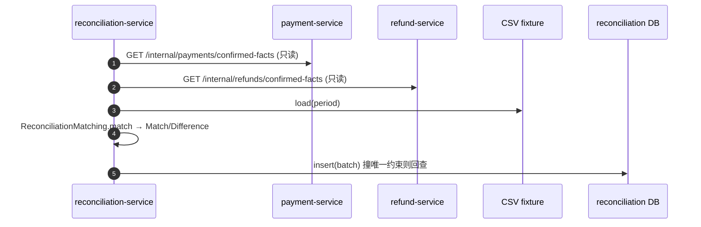

# reconciliation-service 系统设计

**服务**：reconciliation-service（对账：平台事实 vs 渠道账单，逐笔比对找差异）
**端口**：8088 | **Schema**：`reconciliation` | **包根**：`com.payment.reconciliation`

**上游依赖**：payment-service（读已确认支付事实）、payment-service（读已确认退款事实，`/internal/refunds/confirmed-facts` 已随退款域并入 8084，ADR-0064）、预置/ Mock 渠道账单（CSV fixture）
**下游依赖**：settlement-service（消费 `settlement-summary` 结算事实，仅读）

> 标注约定：无标记 = 已实现；`[目标]` = 建议值待确认；`[待定]` = 留待后续；`[Phase N 延后]` = 明确延后。

---

## 1. 设计目标与约束

### 1.1 职责边界（负责 / 不负责）

| 维度 | 说明 |
|---|---|
| **负责** | 拉取 Payment/Refund 已确认事实（只读 RPC）、加载渠道账单、逐笔匹配产出 `Match`/`Difference`、批次状态机、按周期幂等执行、差异处理标记（resolve）、结算事实汇总（settlement-summary） |
| **不负责** | 修改/回写原始 Payment/Refund 事实（Constitution 硬规则）；资金划转（归属 settlement-service）；真实渠道账单接入与自动调账；会计记账与真实资金修正 |

### 1.2 硬约束（Constitution / ADR）

- **Reconciliation ≠ Settlement**：对账只「比对→找差异→标记」，结算才做资金划转，二者解耦（technical-solution §4.3.5）。`settlementSummary` 仅输出匹配事实，不触发任何资金动作。
- **绝不修改原始事实**：出站 RPC 只调用 `confirmed-facts`（只读），落地为 `PlatformFact` 快照副本；领域层 `ReconciliationBatch` 只写自有 `reconciliation_batches` 表（technical-solution §4.3.5、§4.5 明确禁止跨服务直改他服务数据）。
- **金额铁律**：金额一律 `long` 最小货币单位（`amountMinor`），禁止浮点；`PlatformFact`/`ChannelStatement`/`Match` 均用 `long`（ReconciliationMatching.java:34 以 `==` 比较）。
- **显式状态机**：批次状态迁移集中在 `ReconciliationBatch`（`start`/`finish`/`beginProcessing`/`close`），禁止散落 `setStatus`（ReconciliationBatch.java:47）。
- **幂等**：按对账周期（`period`）幂等，数据库唯一约束兜底（见 §5.2）。
- **无跨服务 SQL**：仅经由 Feign RPC 读取 payment/refund，绝不直接连其库（no cross-service SQL）。

### 1.3 技术指标（`[目标]`，待确认）

| 指标 | 目标值 |
|---|---|
| 单周期对账执行 P99 | ≤ 1s（本地 CSV + 两次同步 RPC + 一次本地事务） |
| 对账差异识别准确率 | 100%（确定性逐笔匹配） |
| 对账达成率（可解释差异占比） | ≥ 99%（同 technical-solution §4.3 总目标） |
| 服务可用性 | ≥ 99.9%（只读面，不影响主资金链路） |

---

## 2. 核心数据模型（DDD）

### 2.1 聚合与值对象

| 类型 | 名称 | 位置 | 说明 |
|---|---|---|---|
| 聚合根 | `ReconciliationBatch` | [domain/ReconciliationBatch.java](../../reconciliation-service/src/main/java/com/payment/reconciliation/domain/ReconciliationBatch.java) | 某周期内平台事实与渠道账单的比对结果（匹配 + 差异），持有状态机 |
| 实体 | `Difference` | [domain/Difference.java](../../reconciliation-service/src/main/java/com/payment/reconciliation/domain/Difference.java) | 单侧/两侧不一致事实，含 `resolutionStatus`/`resolutionNote`，可标记已处理 |
| 值对象 | `Match` | [domain/Match.java](../../reconciliation-service/src/main/java/com/payment/reconciliation/domain/Match.java) | 一致匹配（reference + type + amountMinor + currencyCode），结算侧直接取金额 |
| 值对象 | `PlatformFact` | [domain/PlatformFact.java](../../reconciliation-service/src/main/java/com/payment/reconciliation/domain/PlatformFact.java) | 平台侧已确认事实快照（只读副本，type=PAYMENT/REFUND） |
| 值对象 | `ChannelStatement` | [domain/ChannelStatement.java](../../reconciliation-service/src/main/java/com/payment/reconciliation/domain/ChannelStatement.java) | 渠道账单条目（当前来自本地 Mock/CSV） |
| 值对象 | `ReconciliationMatchingResult` | [domain/ReconciliationMatchingResult.java](../../reconciliation-service/src/main/java/com/payment/reconciliation/domain/ReconciliationMatchingResult.java) | `match()` 的纯函数返回值（matches + differences） |
| 枚举 | `DifferenceType` | [domain/DifferenceType.java](../../reconciliation-service/src/main/java/com/payment/reconciliation/domain/DifferenceType.java) | `AMOUNT_MISMATCH` / `STATUS_MISMATCH` / `PLATFORM_ONLY` / `CHANNEL_ONLY` |
| 枚举 | `ReconciliationStatus` | [domain/ReconciliationStatus.java](../../reconciliation-service/src/main/java/com/payment/reconciliation/domain/ReconciliationStatus.java) | 批状态机枚举名 |

**基数关系（MVP）**：`ReconciliationBatch (1) ─ (N) Match`、`(1) ─ (N) Difference`；匹配/差异以 JSON 内嵌批次（见 §2.3），不拆表。

### 2.2 状态机

**ReconciliationBatch**（`ReconciliationStatus`，ReconciliationBatch.java:50-78）：

```text
PENDING --start--> RECONCILING --finish(无差异)--> CONSISTENT --close--> CLOSED
                         |
                         \--finish(有差异)--------> HAS_DIFFERENCE --beginProcessing--> PROCESSING --close--> CLOSED
```

- `start()`：PENDING → RECONCILING（ReconciliationBatch.java:50）。
- `finish(matches, diffs)`：RECONCILING → CONSISTENT（无差异）或 HAS_DIFFERENCE（有差异）；同时写入匹配/差异（ReconciliationBatch.java:56）。
- `beginProcessing()`：HAS_DIFFERENCE → PROCESSING（ReconciliationBatch.java:66）。
- `close()`：CONSISTENT 或 PROCESSING → CLOSED；非法来源抛 `STATE_TRANSITION_VIOLATION`（ReconciliationBatch.java:72）。
- 不变量：所有迁移经 `requireStatus` 校验（ReconciliationBatch.java:80），非法迁移抛 `STATE_TRANSITION_VIOLATION`。

> **状态机已全链路接线（ADR-0019）**：`start()`/`finish()`/`beginProcessing()`/`close()` 均已在应用层调用（`ReconciliationApplicationService`：差异标记后 `beginProcessing()` → `PROCESSING`，处理完毕 `close(operator, at)` → `CLOSED`）；关闭门禁 `unresolvedDifferenceCount>0` 时拒绝关闭（`UNRESOLVED_DIFFERENCES`），`CLOSED` 为只读终态。原「应用层未接线、批次停在 `HAS_DIFFERENCE`」已不准确，据此更新。

**匹配逻辑**（纯函数，ReconciliationMatching.java:18）：按 `reference` 索引双侧，同 ref 且 `amountMinor` 与 `status` 一致 → `Match`；否则按 `AMOUNT_MISMATCH`/`STATUS_MISMATCH` 记差异；仅单侧存在 → `PLATFORM_ONLY`/`CHANNEL_ONLY`。无副作用、无外部依赖。

### 2.3 表结构与索引策略

来源：[deployment/schema/07-reconciliation-schema.sql](../../deployment/schema/07-reconciliation-schema.sql)（权威 DDL）。

**`reconciliation_batches`**

| 列 | 类型 | 说明 |
|---|---|---|
| id | BIGINT PK AUTO_INCREMENT | 批次 ID |
| period | VARCHAR(32) NOT NULL | 对账周期，唯一 `uk_reconciliation_batches_period` |
| source | VARCHAR(32) NOT NULL | 渠道来源（当前固定 `mock-channel`） |
| status | VARCHAR(32) NOT NULL | 状态机枚举名 |
| matches_json | TEXT | 一致匹配 JSON（内嵌，避免拆表跨表一致性成本） |
| differences_json | TEXT | 差异 JSON（含 `resolutionStatus`/`resolutionNote`） |
| created_at / updated_at / created_by / updated_by / version | — | 审计 + 乐观锁（BaseEntity，version 用于并发更新保护） |

**索引策略（已实现）**：
- `uk_reconciliation_batches_period`：周期幂等兜底（同周期不重复建批）。
- 匹配/差异内嵌 JSON，省去 `matches`/`differences` 子表与跨表一致性成本（DDL 注释）。

**分库分表键**：`[Phase 10 延后]` 当前单库单表；候选分片键为 `period` 或 `source`，留待有真实负载证据后评估。

---

## 3. 接口详细定义（API 契约）

> 统一错误响应体 `ApiError`（common-core），错误码见 §3.7。所有接口位于内部 RPC 面 `/internal/reconciliation`。

### 3.1 执行对账（供调度/运维）

`POST /internal/reconciliation/batches` → `200`

**请求** `RunReconciliationRequest`：`{ period: String }`。

**响应** `ReconciliationBatchResponse`：`{ id, period, source, status, matchCount, differenceCount }`。

**规则**：按 `period` 幂等（见 §5.2）；同周期重复请求返回首次批次。下游 `confirmed-facts` 失败或 CSV 缺失会抛错（INTERNAL_ERROR / NOT_FOUND）。

### 3.2 查询批次

`GET /internal/reconciliation/batches/{id}` → `200`

**响应** `ReconciliationBatchResponse`。**错误**：`NOT_FOUND`。

### 3.3 查询批次差异

`GET /internal/reconciliation/batches/{id}/differences` → `200`

**响应** `List<DifferenceResponse>`：`{ reference, type, resolutionStatus, resolutionNote, platformAmountMinor, channelAmountMinor }`。**错误**：`NOT_FOUND`。

### 3.4 处理差异

`POST /internal/reconciliation/batches/{id}/differences/resolve` → `200`

**请求** `ResolveDifferenceRequest`：`{ reference: String, resolutionNote: String }`。

**响应** `DifferenceResponse`（标记后 `resolutionStatus=RESOLVED`）。

**规则**：仅标记差异为已处理（`Difference.resolve`，Difference.java:56），**不修改任何原始 Payment/Refund 事实**，也**不推进批次状态机**（见 §4.2）。

**错误**：`NOT_FOUND`（批次或差异不存在）。

### 3.5 结算汇总（供 settlement-service）

`GET /internal/reconciliation/settlement-summary?period=...` → `200`

**响应** `ReconciliationSettlementSummaryResponse`：`{ period, facts: List<ReconciliationSettlementFact>, unresolvedDifferenceCount }`；`facts` 由一致匹配映射（`reference/type/amountMinor/currencyCode`），结算侧据此算净额，**无需回查原始事实**（ReconciliationApplicationService.java:117）。

**错误**：`NOT_FOUND`（周期无批次）。

### 3.6 出站 RPC（reconciliation → payment / refund，只读）

**payment-service**：`GET /internal/payments/confirmed-facts`（Feign `PaymentFactsFeignClient`，[源码](../../reconciliation-service/src/main/java/com/payment/reconciliation/infra/client/PaymentFactsFeignClient.java)）
- 目标服务：`payment-service`，url `${services.payment.url:http://localhost:8084}`。
- 映射为 `PlatformFact(type=PAYMENT)`（FeignPaymentFactsClient.java:22）；payment 侧端点 [ReconciliationFactsController](../../payment-service/src/main/java/com/payment/payment/api/ReconciliationFactsController.java) 仅返回 `SUCCEEDED` 支付。

**refund-service**：`GET /internal/refunds/confirmed-facts`（Feign `RefundFactsFeignClient`）
- 目标服务：`refund-service`，url `${services.refund.url:http://localhost:8085}`。
- 映射为 `PlatformFact(type=REFUND)`（FeignRefundFactsClient.java:22）；refund 侧端点 [RefundFactsController](../../refund-service/src/main/java/com/payment/refund/api/RefundFactsController.java) 仅返回已确认退款。

> 两者均为**只读查询**，不触发任何写操作——满足「绝不修改原始事实」硬约束。

### 3.7 错误码枚举（全局，common-core `ErrorCodes`）

| 错误码 | 语义 | 本服务使用场景 |
|---|---|---|
| `INVALID_ARGUMENT` | 参数非法 | `period` 空（ReconciliationBatch.java:28） |
| `NOT_FOUND` | 资源不存在 | 批次/差异不存在、`settlementSummary` 周期无批 |
| `DUPLICATE` | 幂等冲突 | 周期唯一约束撞后回查仍失败（ReconciliationApplicationService.java:91） |
| `CONFLICT` | 并发状态冲突 | `updateById` 0 行命中（乐观锁，MybatisReconciliationRepository.java:77） |
| `STATE_TRANSITION_VIOLATION` | 非法状态迁移 | 非预期状态调用 `close` 等（ReconciliationBatch.java:77） |
| `INTERNAL_ERROR` | 内部错误 | 渠道账单 fixture 缺失/读取失败（CsvChannelStatementLoader.java:31） |

---

## 4. 关键流程链路剖析

### 4.1 执行对账（拉取 + 匹配 + 落库）

`ReconciliationController.runReconciliation` → `ReconciliationApplicationService.runReconciliation`（[源码](../../reconciliation-service/src/main/java/com/payment/reconciliation/application/ReconciliationApplicationService.java:60)）：

1. `repository.findByPeriod(period)` 回查；命中 → 直接返回首次批次（**周期幂等**，ReconciliationApplicationService.java:61）。
2. 拉取平台事实：`paymentFactsClient.fetchConfirmedFacts()` + `refundFactsClient.fetchConfirmedFacts()`（只读 RPC，ReconciliationApplicationService.java:66）。
3. `channelStatementLoader.load(period)` 加载渠道账单（当前固定 CSV fixture，见 §4.3）。
4. `ReconciliationMatching.match(platform, statements)` 纯函数逐笔比对 → `matches` + `differences`（ReconciliationApplicationService.java:70）。
5. `new ReconciliationBatch(...)` → `start()`（PENDING→RECONCILING）→ `finish(matches, diffs)`（→CONSISTENT/HAS_DIFFERENCE）。
6. `insertNew(batch)`：本地事务内 `save`；撞 `uk_reconciliation_batches_period` 时捕获 `DuplicateKeyException` 回查返回首次批次（ReconciliationApplicationService.java:86）。
7. 计数埋点 `reconciliation.run` 与按类型 `reconciliation.difference`（ReconciliationApplicationService.java:77）。



### 4.2 处理差异（resolve）

`ReconciliationController.resolveDifference` → `ReconciliationApplicationService.resolveDifference`（[源码](../../reconciliation-service/src/main/java/com/payment/reconciliation/application/ReconciliationApplicationService.java:104)）：

1. 加载批次（`NOT_FOUND`）。
2. 按 `reference` 定位 `Difference`（不存在 `NOT_FOUND`）。
3. `difference.resolve(note)` 标记 `RESOLVED`（Difference.java:56），`repository.save(batch)` 持久化。
4. **写入 `differences_json` 的 `resolutionStatus` 后调用 `beginProcessing()`（→`PROCESSING`），全部差异处理完毕调用 `close(operator, at)`（→`CLOSED`）**；`unresolvedDifferenceCount>0` 时 `close()` 抛 `UNRESOLVED_DIFFERENCES`，强制先清空差异再关闭（ADR-0019）。

### 4.3 渠道账单加载（当前 Mock）

`CsvChannelStatementLoader.load`（[源码](../../reconciliation-service/src/main/java/com/payment/reconciliation/infra/CsvChannelStatementLoader.java:27)）读取 `fixtures/channel-statements/sample.csv`（头 `reference,amountMinor,currencyCode,status`）。

> **渠道账单来源（ADR-0020，已落地）**：`[目标]`（roadmap Phase 6 不含真实渠道接入）当前由本地 Mock/预置 CSV fixture 实现。**`period` 为批次标识（非时间窗口），已全程参与**：作为 `uk_reconciliation_batches_period` 幂等键、传入 `ChannelStatementLoader.load(period)` 按 `{dir}/{period}.csv` 定位，未命中显式回退 `sample.csv` 并打 `reconciliation.statement_fallback` 指标 + WARN（**绝不静默**）；`period` 经 `[A-Za-z0-9._-]` 校验防路径穿越。平台侧事实经 `fetchConfirmedFacts()` 拉全量后按周期比对。

---

## 5. 存储与缓存设计 + 详细逻辑处理策略（Edge Cases）

### 5.1 存储读写策略

- **写路径**：`MybatisReconciliationRepository`（[源码](../../reconciliation-service/src/main/java/com/payment/reconciliation/infra/persistence/MybatisReconciliationRepository.java)）在 `@Transactional` 应用服务内写 `reconciliation_batches`；状态机逻辑在领域层，持久层只存枚举名 + JSON。
- **读路径**：`findById` / `findByPeriod` / `findByPeriodBetween`（周期区间，供结算/查询）。
- **JSON 内嵌**：`matches_json`/`differences_json` 由 `ObjectMapper` 序列化/反序列化（MybatisReconciliationRepository.java:102），避免拆表。
- **缓存**：`[已评估·本期不引入]` 当前无 Redis/本地缓存，全部直连 MySQL；对账批量为低频写、按需读，不强一致热点，暂不引入缓存。Redis 已在平台引入（ADR-0044），本服务经评估**不使用**（低频按需读）；未来若出现只读热点须另立 ADR。

### 5.2 幂等性方案

| 作用域 | 机制 |
|---|---|
| 按周期执行对账 | `uk_reconciliation_batches_period` 唯一约束 + 先 `findByPeriod` 回查 + `DuplicateKeyException` 捕获回查（数据库级，覆盖并发/重启，ReconciliationApplicationService.java:86） |
| 差异处理 | 仅 `Difference.resolve` 写 `resolutionStatus`；重复 resolve 幂等（已 RESOLVED 再次标记等价） |
| 禁止重复比对 | 同周期首次落库后即返回，不重复跑 `match` |

> 注意：应用层注释曾提及「`reconciliation:run` 作用域内存登记」，**实际实现为数据库周期唯一约束**（注释与代码一致，无内存登记）。

### 5.3 分布式事务方案

- 单服务内：`runReconciliation` 的「匹配结果 + 批次落库」在同一本地事务原子提交（MyBatis + Spring `@Transactional`）。
- 跨服务：读 payment/refund 为**只读 RPC**，不产生跨服务写；结算 RPC 由 settlement-service 主动拉 `settlement-summary`，reconciliation 不主动推送、不回写前序事实（Saga 语义，禁 2PC/XA，同 technical-solution §4.5）。

### 5.4 异常与边界场景

| 场景 | 处理 | 阈值/规则 |
|---|---|---|
| 同周期重复执行对账 | `findByPeriod` 命中返回首次批次；或撞唯一约束回查 | 数据库唯一约束兜底 |
| 支付/退款事实 RPC 失败 | Feign 抛错，对账整体失败（不入批） | 待测：未配置降级/熔断（`[目标]`） |
| 渠道账单 fixture 缺失 | 抛 `INTERNAL_ERROR` | 启动期 CSV 必须存在 |
| 并发更新批次（resolve 与落库竞争） | `updateById` 0 行命中抛 `CONFLICT`（乐观锁 version） | 调用方重试 |
| 差异类型 AMOUNT/STATUS/单方独有 | 记 `Difference`，不静默丢弃 | 差异独立处理状态 + 依据（Difference.java:56） |
| 试图修改原始 Payment/Refund | 设计上不可达（仅只读 RPC） | Constitution 硬规则，零回写路径 |
| 批次状态非法迁移 | `requireStatus` 抛 `STATE_TRANSITION_VIOLATION` | 状态机集中校验 |

**超时/重试/降级阈值（`[目标]`，待确认）**：
- 出站 Feign（payment/refund）超时：未显式配置（OpenFeign 默认）；`[目标]` connect 1s / read 3s。
- 重试：`[目标]` 仅对只读幂等调用有限退避（3 次、1s/2s/4s）；对账批次本身不自动重试（靠周期幂等重跑）。
- 熔断/降级：`[Phase 按需延后]` Resilience4j 延迟引入。

---

## 6. 部署拓扑与配置文件设计

### 6.1 运行态配置（application.yml）

来源：[application.yml](../../reconciliation-service/src/main/resources/application.yml)

```yaml
spring:
  application:
    name: reconciliation-service
  datasource:
    url: jdbc:mysql://localhost:3306/reconciliation?useSSL=false&serverTimezone=UTC&allowPublicKeyRetrieval=true
    username: root
    password: root
    driver-class-name: com.mysql.cj.jdbc.Driver

server:
  port: 8088

management:
  endpoints:
    web:
      exposure:
        include: health,info,metrics,prometheus
  endpoint:
    health:
      show-details: always

services:
  payment:
    url: http://localhost:8084
  refund:
    url: http://localhost:8085

mybatis-plus:
  configuration:
    map-underscore-to-camel-case: true
```

### 6.2 环境变量清单（dev / test / prod 差异化项，`[目标]` 建议）

| 配置项 | dev（默认） | test | prod（`[目标]`） |
|---|---|---|---|
| `spring.datasource.url` | `jdbc:mysql://localhost:3306/reconciliation` | Testcontainers MySQL | 环境变量/配置中心，指向生产实例 |
| `spring.datasource.username/password` | root/root | — | 环境变量注入，禁止硬编码 |
| `server.port` | 8088 | 随机 | 8088（或编排指定） |
| `services.payment.url` | `http://localhost:8084` | fake | Nacos 服务发现（去掉硬编码 url） |
| `services.refund.url` | `http://localhost:8085` | fake | Nacos 服务发现（去掉硬编码 url） |
| 连接池大小 `spring.datasource.hikari.maximum-pool-size` | 默认 10 | — | `[目标]` 按并发调优 |
| 出站 Feign 超时 | 未配置 | — | `[目标]` connect 1s / read 3s |

### 6.3 启动依赖顺序

```text
1. MySQL 8.0 就绪（reconciliation schema 由 deployment/schema/07-reconciliation-schema.sql 建库建表）
2. Nacos 就绪（注册 + 配置）  [目标：生产启用；当前本地直连 MySQL，未强制依赖 Nacos]
3. payment-service / refund-service 可就续（仅被对账只读查询，缺失时对账失败但不阻塞启动）
4. 启动 reconciliation-service（端口 8088），完成 Feign 客户端装配
5. 下游 settlement-service 可延后就绪（拉 settlement-summary，不阻塞启动）
```

### 6.4 埋点与日志键（本服务）

**业务指标（Micrometer，`BusinessMetrics`）**：

| 指标键 | 类型 | 维度 | 说明 |
|---|---|---|---|
| `reconciliation.run` | counter | module=reconciliation | 执行对账批次 |
| `reconciliation.difference` | counter | module=reconciliation, type=差异类型 | 对账产出差异（按 AMOUNT_MISMATCH/STATUS_MISMATCH/PLATFORM_ONLY/CHANNEL_ONLY） |

**资金审计 / 关联字段**：对账为只读、不落资金账，沿用 `traceId`（`TraceContext`）跨服务传播；差异处理记录 `resolutionNote` 作为人工跟进依据，满足 roadmap Phase 6 验收「原始事实不被静默改写」。
