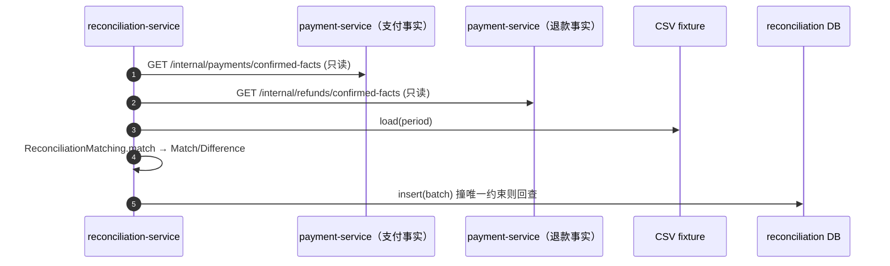

# reconciliation-service 系统设计

**服务**：reconciliation-service（对账：平台事实 vs 渠道账单，逐笔比对找差异）
**端口**：8088 | **Schema**：`reconciliation` | **包根**：`com.payment.reconciliation`

> 标注约定：无标记 = 已实现；`[目标]` = 建议值待确认；`[待定]` = 留待后续；`[Phase N 延后]` = 明确延后。

---

> **章节结构**：遵循 [system-design-standard](../../standards/system-design-standard.md) 的 15 章骨架。
> 2026-09-22 文档治理将原 6 章结构重排为标准章号，**正文内容未删改**。

---

## 1. 职责（Responsibility）

拉取 Payment/Refund/Ledger/Settlement 已确认事实（只读 RPC）、基础渠道对账、会计四核对、审计批次状态机、差异挂账/调账/recheck/close、SUSPENSE 对账与结算门禁；同时提供基础结算事实汇总（settlement-summary）

### 1.1 技术指标（`[目标]`，待确认）

| 指标 | 目标值 |
|---|---|
| 单周期对账执行 P99 | ≤ 1s（本地 CSV + 两次同步 RPC + 一次本地事务） |
| 对账差异识别准确率 | 100%（确定性逐笔匹配） |
| 对账达成率（可解释差异占比） | ≥ 99%（同 technical-solution §4.3 总目标） |
| 服务可用性 | ≥ 99.9%（只读面，不影响主资金链路） |

---

## 2. 不负责（Non-Responsibility）

修改/回写原始 Payment/Refund 事实（Constitution 硬规则）；资金划转（归属 settlement-service）；真实渠道账单接入与自动调账；会计记账与真实资金修正

## 3. 上下文与约束（Context）

### 3.1 上下游依赖方向

- **上游依赖**：payment-service（读已确认支付事实）、payment-service（读已确认退款事实，`/internal/refunds/confirmed-facts` 已随退款域并入 8084，ADR-0064）、预置/ Mock 渠道账单（CSV fixture）
- **下游依赖**：settlement-service（消费 `settlement-summary` 结算事实，仅读）

- **依赖方式**：跨服务交互一律经公开 REST / Feign RPC 或事件通道，**禁止**直接 SQL 他服务 Schema（Database-per-Service，见 [technical-solution.md §3.1](../technical-solution.md)）。

### 3.2 硬约束（Constitution / ADR）

- **Reconciliation ≠ Settlement**：对账只「比对→找差异→标记」，结算才做资金划转，二者解耦（technical-solution §4.3.5）。`settlementSummary` 仅输出匹配事实，不触发任何资金动作。
- **绝不修改原始事实**：出站 RPC 只调用 confirmed-facts / postings / audit-facts（只读），落地为本服务快照与审计表；挂账/调账只经 ledger 标准记账通道写入平衡、append-only 分录，不 UPDATE/DELETE Payment、Refund、Settlement 原始事实。
- **金额铁律**：金额一律 `long` 最小货币单位（`amountMinor`），禁止浮点；`PlatformFact`/`ChannelStatement`/`Match` 均用 `long`（ReconciliationMatching.java:34 以 `==` 比较）。
- **显式状态机**：批次状态迁移集中在 `ReconciliationBatch`（`start`/`finish`/`beginProcessing`/`close`），禁止散落 `setStatus`（ReconciliationBatch.java:47）。
- **幂等**：按对账周期（`period`）幂等，数据库唯一约束兜底（见 §9.1）。
- **无跨服务 SQL**：仅经由 Feign RPC 读取 payment/refund，绝不直接连其库（no cross-service SQL）。

## 4. 领域模型（Domain Model）

### 4.1 聚合与值对象

| 类型 | 名称 | 位置 | 说明 |
|---|---|---|---|
| 聚合根 | `ReconciliationBatch` | [domain/ReconciliationBatch.java](../../../reconciliation-service/src/main/java/com/payment/reconciliation/domain/ReconciliationBatch.java) | 某周期内平台事实与渠道账单的比对结果（匹配 + 差异），持有状态机 |
| 实体 | `Difference` | [domain/Difference.java](../../../reconciliation-service/src/main/java/com/payment/reconciliation/domain/Difference.java) | 单侧/两侧不一致事实，含 `resolutionStatus`/`resolutionNote`，可标记已处理 |
| 值对象 | `Match` | [domain/Match.java](../../../reconciliation-service/src/main/java/com/payment/reconciliation/domain/Match.java) | 一致匹配（reference + type + amountMinor + currencyCode），结算侧直接取金额 |
| 值对象 | `PlatformFact` | [domain/PlatformFact.java](../../../reconciliation-service/src/main/java/com/payment/reconciliation/domain/PlatformFact.java) | 平台侧已确认事实快照（只读副本，type=PAYMENT/REFUND） |
| 值对象 | `ChannelStatement` | [domain/ChannelStatement.java](../../../reconciliation-service/src/main/java/com/payment/reconciliation/domain/ChannelStatement.java) | 渠道账单条目（当前来自本地 Mock/CSV） |
| 值对象 | `ReconciliationMatchingResult` | [domain/ReconciliationMatchingResult.java](../../../reconciliation-service/src/main/java/com/payment/reconciliation/domain/ReconciliationMatchingResult.java) | `match()` 的纯函数返回值（matches + differences） |
| 枚举 | `DifferenceType` | [domain/DifferenceType.java](../../../reconciliation-service/src/main/java/com/payment/reconciliation/domain/DifferenceType.java) | `AMOUNT_MISMATCH` / `STATUS_MISMATCH` / `PLATFORM_ONLY` / `CHANNEL_ONLY` |
| 枚举 | `ReconciliationStatus` | [domain/ReconciliationStatus.java](../../../reconciliation-service/src/main/java/com/payment/reconciliation/domain/ReconciliationStatus.java) | 批状态机枚举名 |

**基数关系（MVP）**：`ReconciliationBatch (1) ─ (N) Match`、`(1) ─ (N) Difference`；匹配/差异以 JSON 内嵌批次（见 §4.2），不拆表。

### 4.2 表结构与索引策略

来源：[deployment/schema/07-reconciliation-schema.sql](../../../deployment/schema/07-reconciliation-schema.sql)（权威 DDL）。

**`reconciliation_batches`**

| 列 | 类型 | 说明 |
|---|---|---|
| id | BIGINT PK AUTO_INCREMENT | 批次 ID |
| period | VARCHAR(32) NOT NULL | 对账周期，唯一 `uk_reconciliation_batches_period` |
| source | VARCHAR(32) NOT NULL | 渠道来源（当前固定 `mock-channel`） |
| status | VARCHAR(32) NOT NULL | 状态机枚举名 |
| matches_json | TEXT | 一致匹配 JSON（内嵌，避免拆表跨表一致性成本） |
| differences_json | TEXT | 差异 JSON（含 `resolutionStatus`/`resolutionNote`） |
| created_at / updated_at / created_by / updated_by / version | — | 审计 + 乐观锁（BaseEntity，version 用于并发更新保护） |

**索引策略（已实现）**：
- `uk_reconciliation_batches_period`：周期幂等兜底（同周期不重复建批）。
- 匹配/差异内嵌 JSON，省去 `matches`/`differences` 子表与跨表一致性成本（DDL 注释）。

**分库分表键**：`[Phase 10 延后]` 当前单库单表；候选分片键为 `period` 或 `source`，留待有真实负载证据后评估。

---

## 5. 状态机（State Machine）

**ReconciliationBatch**（`ReconciliationStatus`，ReconciliationBatch.java:50-78）：

```text
PENDING --start--> RECONCILING --finish(无差异)--> CONSISTENT --close--> CLOSED
                         |
                         \--finish(有差异)--------> HAS_DIFFERENCE --beginProcessing--> PROCESSING --close--> CLOSED
```

- `start()`：PENDING → RECONCILING（ReconciliationBatch.java:50）。
- `finish(matches, diffs)`：RECONCILING → CONSISTENT（无差异）或 HAS_DIFFERENCE（有差异）；同时写入匹配/差异（ReconciliationBatch.java:56）。
- `beginProcessing()`：HAS_DIFFERENCE → PROCESSING（ReconciliationBatch.java:66）。
- `close()`：CONSISTENT 或 PROCESSING → CLOSED；非法来源抛 `STATE_TRANSITION_VIOLATION`（ReconciliationBatch.java:72）。
- 不变量：所有迁移经 `requireStatus` 校验（ReconciliationBatch.java:80），非法迁移抛 `STATE_TRANSITION_VIOLATION`。

> **状态机已全链路接线（ADR-0019）**：`start()`/`finish()`/`beginProcessing()`/`close()` 均已在应用层调用（`ReconciliationApplicationService`：差异标记后 `beginProcessing()` → `PROCESSING`，处理完毕 `close(operator, at)` → `CLOSED`）；关闭门禁 `unresolvedDifferenceCount>0` 时拒绝关闭（`UNRESOLVED_DIFFERENCES`），`CLOSED` 为只读终态。原「应用层未接线、批次停在 `HAS_DIFFERENCE`」已不准确，据此更新。

**匹配逻辑**（纯函数，ReconciliationMatching.java:18）：按 `reference` 索引双侧，同 ref 且 `amountMinor` 与 `status` 一致 → `Match`；否则按 `AMOUNT_MISMATCH`/`STATUS_MISMATCH` 记差异；仅单侧存在 → `PLATFORM_ONLY`/`CHANNEL_ONLY`。无副作用、无外部依赖。

## 6. 接口与事件契约（API / Event Contract）

### 6.1 执行对账（供调度/运维）

`POST /internal/reconciliation/run` → `200`（032 主入口，spec §10.1）

**请求** `RunReconciliationRequest`：`{ period: String, channelCode?: String, importNo?: String }`。

**响应** `ReconciliationBatchResponse`：`{ id, batchNo, period, source, status, matchCount, differenceCount }`。

**规则**：执行键 = `(channelCode, period, importId)`——缺省取该渠道该周期最新 `NORMALIZED` 导入，`importNo` 显式指定（更正账单重对入口）；同一导入重跑返回首次批次。**无可用导入 ⇒ 400 `STATEMENT_UNAVAILABLE`**（`sample.csv` 静默回退已于 032 删除）。兼容入口 `POST /internal/reconciliation/batches`（仅 `period`，缺省 LEGACY 渠道）语义不变。

**错误**：`STATEMENT_UNAVAILABLE`（无 NORMALIZED 导入）、`NOT_FOUND`（importNo 不存在）。

### 6.2 查询批次

`GET /internal/reconciliation/batches/{id}` → `200`

**响应** `ReconciliationBatchResponse`。**错误**：`NOT_FOUND`。

### 6.3 查询批次差异

`GET /internal/reconciliation/batches/{id}/differences` → `200`

**响应** `List<DifferenceResponse>`：`{ reference, type, resolutionStatus, resolutionNote, platformAmountMinor, channelAmountMinor }`。**错误**：`NOT_FOUND`。

### 6.4 处理差异

`POST /internal/reconciliation/batches/{id}/differences/resolve` → `200`

**请求** `ResolveDifferenceRequest`：`{ reference: String, resolutionNote: String }`。

**响应** `DifferenceResponse`（标记后 `resolutionStatus=RESOLVED`）。

**规则**：基础 reconciliation 批次的 `resolve` 仅标记渠道对账差异；会计差异必须走 `audit` 包的挂账、调账、recheck 和 close 流程，不以普通备注替代资金处置。

**错误**：`NOT_FOUND`（批次或差异不存在）。

### 6.5 结算汇总（供 settlement-service）

`GET /internal/reconciliation/settlement-summary?period=...` → `200`

**响应**（032/G4 口径，决策 5）`ReconciliationSettlementSummaryResponse`：`{ period, facts: List<ReconciliationSettlementFact{reference,type,amountMinor,currencyCode,merchantId}>, excludedFacts: List<ReconciliationExcludedFact{reference,side,impactMinor,kind}>, unresolvedDifferenceCount }`。

**规则**：`facts` = 该周期**全部已确认事实**（按期间拉取，不再只取匹配成功的 matches，关闭 C-13）；`excludedFacts` = 未收口差异（PENDING/SUSPENDED/ADJUSTING/ADJUSTED）对结算口径的显式净影响扣减（PLATFORM_ONLY/STATUS_MISMATCH=事实全额、AMOUNT_MISMATCH=|平台−渠道|，其余类型不进商户口径）；已 RESOLVED 差异不再扣减。批次取「最新批」语义（同周期可并存多份导入批次）。

**错误**：`NOT_FOUND`（周期无批次）。

### 6.6 出站 RPC（reconciliation → payment-service，只读）

**payment-service**：`GET /internal/payments/confirmed-facts`（Feign `PaymentFactsFeignClient`，[源码](../../../reconciliation-service/src/main/java/com/payment/reconciliation/infra/client/PaymentFactsFeignClient.java)）
- 目标服务：`payment-service`（Feign name 解析，Nacos 服务发现；本地默认 `http://localhost:8084`）。
- 映射为 `PlatformFact(type=PAYMENT)`（FeignPaymentFactsClient.java:22）；payment 侧端点 [ReconciliationFactsController](../../../payment-service/src/main/java/com/payment/payment/api/ReconciliationFactsController.java) 仅返回 `SUCCEEDED` 支付。

**payment-service（退款域）**：`GET /internal/refunds/confirmed-facts`（Feign `RefundFactsFeignClient`）
- 目标服务：同为 `payment-service`（Feature 015 / ADR-0064 起退款域并入，原 `refund-service` 已从 Nacos 注册表退役），本地默认 `http://localhost:8084`。
- 映射为 `PlatformFact(type=REFUND)`（FeignRefundFactsClient.java:22）；退款侧端点 [RefundFactsController](../../../payment-service/src/main/java/com/payment/refund/api/RefundFactsController.java) 仅返回已确认退款。

> 两者均为**只读查询**，不触发任何写操作——满足「绝不修改原始事实」硬约束。

### 6.7 错误码枚举（全局，common-core `ErrorCodes`）

| 错误码 | 语义 | 本服务使用场景 |
|---|---|---|
| `INVALID_ARGUMENT` | 参数非法 | `period` 空（ReconciliationBatch.java:28） |
| `NOT_FOUND` | 资源不存在 | 批次/差异不存在、`settlementSummary` 周期无批 |
| `DUPLICATE` | 幂等冲突 | 周期唯一约束撞后回查仍失败（ReconciliationApplicationService.java:91） |
| `CONFLICT` | 并发状态冲突 | `updateById` 0 行命中（乐观锁，MybatisReconciliationRepository.java:77） |
| `STATE_TRANSITION_VIOLATION` | 非法状态迁移 | 非预期状态调用 `close` 等（ReconciliationBatch.java:77） |
| `INTERNAL_ERROR` | 内部错误 | 渠道账单 fixture 缺失/读取失败（`CsvStatementParser.java`） |

---

## 7. 运行链路（Runtime Flow）

### 7.1 执行对账（拉取 + 匹配 + 落库）

`ReconciliationController.runReconciliation` → `ReconciliationApplicationService.runReconciliation`（[源码](../../../reconciliation-service/src/main/java/com/payment/reconciliation/application/ReconciliationApplicationService.java):60）：

1. `repository.findByPeriod(period)` 回查；命中 → 直接返回首次批次（**周期幂等**，ReconciliationApplicationService.java:61）。
2. 拉取平台事实：`paymentFactsClient.fetchConfirmedFacts()` + `refundFactsClient.fetchConfirmedFacts()`（只读 RPC，ReconciliationApplicationService.java:66）。
3. `channelStatementLoader.load(period)` 加载渠道账单（当前固定 CSV fixture，见 §4.3）。
4. `ReconciliationMatching.match(platform, statements)` 纯函数逐笔比对 → `matches` + `differences`（ReconciliationApplicationService.java:70）。
5. `new ReconciliationBatch(...)` → `start()`（PENDING→RECONCILING）→ `finish(matches, diffs)`（→CONSISTENT/HAS_DIFFERENCE）。
6. `insertNew(batch)`：本地事务内 `save`；撞 `uk_reconciliation_batches_period` 时捕获 `DuplicateKeyException` 回查返回首次批次（ReconciliationApplicationService.java:86）。
7. 计数埋点 `reconciliation.run` 与按类型 `reconciliation.difference`（ReconciliationApplicationService.java:77）。



### 7.2 处理差异（resolve）

`ReconciliationController.resolveDifference` → `ReconciliationApplicationService.resolveDifference`（[源码](../../../reconciliation-service/src/main/java/com/payment/reconciliation/application/ReconciliationApplicationService.java):104）：

1. 加载批次（`NOT_FOUND`）。
2. 按 `reference` 定位 `Difference`（不存在 `NOT_FOUND`）。
3. `difference.resolve(note)` 标记基础渠道对账差异已处理，`repository.save(batch)` 持久化；该路径不产生资金分录。
4. 会计审计差异由 `AuditApplicationService` 负责状态推进和资金处置，状态为 `PENDING → SUSPENDED → ADJUSTED → VERIFIED → RESOLVED`；存在未收口差异时审计批次不能关闭。

### 7.3 渠道账单加载（当前 Mock）

`StatementParser.parse(channelCode, period, content)`（实现：[infra/CsvStatementParser.java](../../../reconciliation-service/src/main/java/com/payment/reconciliation/infra/CsvStatementParser.java)）读取 `fixtures/channel-statements/{period}.csv`（legacy 4 列表头 `reference,amountMinor,currencyCode,status`；v2 9 列表头见 [ADR-0080](../../adr/0080-reconciliation-statement-and-fund-facts.md)）。
> **术语变更留痕**：本节原写 `CsvChannelStatementLoader.load(period)`；2026-09-22 文档治理按代码核实更正为 `StatementParser.parse(...)` / `CsvStatementParser`（未见 `ChannelStatementLoader` 类）。

> **渠道账单来源（ADR-0020，已落地）**：`[目标]`（roadmap Phase 6 不含真实渠道接入）当前由本地 Mock/预置 CSV fixture 实现。**`period` 为批次标识（非时间窗口），已全程参与**：作为 `uk_reconciliation_batches_period` 幂等键、传入 `StatementParser.parse(channelCode, period, content)` 按 `{dir}/{period}.csv` 定位，未命中显式回退 `sample.csv` 并打 `reconciliation.statement_fallback` 指标 + WARN（**绝不静默**）；`period` 经 `[A-Za-z0-9._-]` 校验防路径穿越。平台侧事实经 `fetchConfirmedFacts()` 拉全量后按周期比对。

---

## 8. 失败与恢复（Failure / Recovery）

### 8.1 异常与边界场景

| 场景 | 处理 | 阈值/规则 |
|---|---|---|
| 同周期重复执行对账 | `findByPeriod` 命中返回首次批次；或撞唯一约束回查 | 数据库唯一约束兜底 |
| 支付/退款事实 RPC 失败 | Feign 抛错，对账整体失败（不入批） | 待测：未配置降级/熔断（`[目标]`） |
| 渠道账单 fixture 缺失 | 抛 `INTERNAL_ERROR` | 启动期 CSV 必须存在 |
| 并发更新批次（resolve 与落库竞争） | `updateById` 0 行命中抛 `CONFLICT`（乐观锁 version） | 调用方重试 |
| 差异类型 AMOUNT/STATUS/单方独有 | 记 `Difference`，不静默丢弃 | 差异独立处理状态 + 依据（Difference.java:56） |
| 试图修改原始 Payment/Refund | 设计上不可达（仅只读 RPC） | Constitution 硬规则，零回写路径 |
| 批次状态非法迁移 | `requireStatus` 抛 `STATE_TRANSITION_VIOLATION` | 状态机集中校验 |

**超时/重试/降级阈值（`[目标]`，待确认）**：
- 出站 Feign（payment/refund）超时：未显式配置（OpenFeign 默认）；`[目标]` connect 1s / read 3s。
- 重试：`[目标]` 仅对只读幂等调用有限退避（3 次、1s/2s/4s）；对账批次本身不自动重试（靠周期幂等重跑）。
- 熔断/降级：`[Phase 按需延后]` Resilience4j 延迟引入。

---

## 9. 幂等 / 一致性 / 并发（Idempotency / Consistency / Concurrency）

### 9.1 幂等性方案

| 作用域 | 机制 |
|---|---|
| 按周期执行对账 | `uk_reconciliation_batches_period` 唯一约束 + 先 `findByPeriod` 回查 + `DuplicateKeyException` 捕获回查（数据库级，覆盖并发/重启，ReconciliationApplicationService.java:86） |
| 差异处理 | 仅 `Difference.resolve` 写 `resolutionStatus`；重复 resolve 幂等（已 RESOLVED 再次标记等价） |
| 禁止重复比对 | 同周期首次落库后即返回，不重复跑 `match` |

> 注意：应用层注释曾提及「`reconciliation:run` 作用域内存登记」，**实际实现为数据库周期唯一约束**（注释与代码一致，无内存登记）。

### 9.2 分布式事务方案

- 单服务内：`runReconciliation` 的「匹配结果 + 批次落库」在同一本地事务原子提交（MyBatis + Spring `@Transactional`）。
- 跨服务：读 payment/refund 为**只读 RPC**，不产生跨服务写；结算 RPC 由 settlement-service 主动拉 `settlement-summary`，reconciliation 不主动推送、不回写前序事实（Saga 语义，禁 2PC/XA，同 technical-solution §4.5）。

## 10. 数据与存储（Data / Storage）

### 10.1 存储读写策略

- **写路径**：`MybatisReconciliationRepository`（[源码](../../../reconciliation-service/src/main/java/com/payment/reconciliation/infra/persistence/MybatisReconciliationRepository.java)）在 `@Transactional` 应用服务内写 `reconciliation_batches`；状态机逻辑在领域层，持久层只存枚举名 + JSON。
- **读路径**：`findById` / `findByPeriod` / `findByPeriodBetween`（周期区间，供结算/查询）。
- **JSON 内嵌**：`matches_json`/`differences_json` 由 `ObjectMapper` 序列化/反序列化（MybatisReconciliationRepository.java:102），避免拆表。
- **缓存**：`[已评估·本期不引入]` 当前无 Redis/本地缓存，全部直连 MySQL；对账批量为低频写、按需读，不强一致热点，暂不引入缓存。Redis 已在平台引入（ADR-0044），本服务经评估**不使用**（低频按需读）；未来若出现只读热点须另立 ADR。

## 11. 可观测性与安全（Observability / Security）

### 11.1 埋点与日志键（本服务）

**业务指标（Micrometer，`BusinessMetrics`）**：

| 指标键 | 类型 | 维度 | 说明 |
|---|---|---|---|
| `reconciliation.run` | counter | module=reconciliation | 执行对账批次 |
| `reconciliation.difference` | counter | module=reconciliation, type=差异类型 | 对账产出差异（按 AMOUNT_MISMATCH/STATUS_MISMATCH/PLATFORM_ONLY/CHANNEL_ONLY） |
| `reconciliation.difference_amount_minor` | counter（金额累加） | module=reconciliation, period=周期 | 差异金额合计（分）：双侧都有取差额绝对值，仅单侧存在取该侧金额；无差异时不发指标（spec 006 T040） |
| `reconciliation.statement_fallback` | counter | module=reconciliation, period=周期 | 周期账单 fixture 未命中、回退默认 `sample.csv`（**绝不静默**，ADR-0020） |
| `reconciliation.fact_read_failed` | counter | module=reconciliation, target=payment\|refund | 事实读取失败（失败不入批，可安全重跑） |
| `reconciliation.difference_resolved` | counter | module=reconciliation | 差异被处理（含处理依据） |
| `reconciliation.batch_closed` | counter | module=reconciliation | 批次收口为 `CLOSED` |

**资金审计 / 关联字段**：对账为只读、不落资金账，沿用 `traceId`（`TraceContext`）跨服务传播；差异处理与批次关闭各写一条 `FINANCIAL_AUDIT`（含 traceId / 前后状态 / 实体 ID，不回显处理说明正文）。差异处理记录 `resolutionNote` 作为人工跟进依据，满足 roadmap Phase 6 验收「原始事实不被静默改写」。

**出站 RPC 弹性（ADR-0021）**：payment / refund facts 客户端经 `FactsClientConfig` 局部绑定——超时 `services.payment.connect-timeout-ms=1000` / `read-timeout-ms=3000`，重试 3 次（退避 1s/2s/4s，仅幂等只读 GET）。**错误解码器对 408/429/5xx 抛 `feign.RetryableException`**（Feign 只对它触发重试），重试耗尽后由 `FeignPaymentFactsClient`/`FeignRefundFactsClient` 归一化为 `INTERNAL_ERROR`；其余 4xx 直接归一化，不重试。

## 12. 部署（Deployment）

- **进程与端口**：`reconciliation-service` :8088；单机多进程部署，独立进程 / 独立端口 / 独立部署单元（整体部署形态见 [technical-solution.md §6](../technical-solution.md) 与 [diagrams/08-deployment](../diagrams/08-deployment.puml)）。

### 12.1 运行态配置（application.yml）

来源：[application.yml](../../../reconciliation-service/src/main/resources/application.yml)

```yaml
spring:
  application:
    name: reconciliation-service
  datasource:
    url: jdbc:mysql://localhost:3306/reconciliation?useSSL=false&serverTimezone=UTC&allowPublicKeyRetrieval=true
    username: root
    password: root
    driver-class-name: com.mysql.cj.jdbc.Driver

server:
  port: 8088

management:
  endpoints:
    web:
      exposure:
        include: health,info,metrics,prometheus
  endpoint:
    health:
      show-details: always

services:
  payment:
    connect-timeout-ms: 1000
    read-timeout-ms: 3000

mybatis-plus:
  configuration:
    map-underscore-to-camel-case: true
```

### 12.2 环境变量清单（dev / test / prod 差异化项，`[目标]` 建议）

| 配置项 | dev（默认） | test | prod（`[目标]`） |
|---|---|---|---|
| `spring.datasource.url` | `jdbc:mysql://localhost:3306/reconciliation` | Testcontainers MySQL | 环境变量/配置中心，指向生产实例 |
| `spring.datasource.username/password` | root/root | — | 环境变量注入，禁止硬编码 |
| `server.port` | 8088 | 随机 | 8088（或编排指定） |
| `services.payment.connect-timeout-ms` | 1000 | fake | — |
| `services.payment.read-timeout-ms` | 3000 | fake | — |
| 连接池大小 `spring.datasource.hikari.maximum-pool-size` | 默认 10 | — | `[目标]` 按并发调优 |
| 出站 Feign 超时 | 未配置 | — | `[目标]` connect 1s / read 3s |

### 12.3 启动依赖顺序

```text
1. MySQL 8.0 就绪（reconciliation schema 由 deployment/schema/07-reconciliation-schema.sql 建库建表）
2. Nacos 就绪（注册 + 配置）  [目标：生产启用；当前本地直连 MySQL，未强制依赖 Nacos]
3. payment-service 可就续（支付事实 + 退款事实两个只读端点，缺失时对账失败但不阻塞启动）
4. 启动 reconciliation-service（端口 8088），完成 Feign 客户端装配
5. 下游 settlement-service 可延后就绪（拉 settlement-summary，不阻塞启动）
```

## 13. 测试与验证（Testing / Verification）

### 13.1 验证方式

- **领域 / 单元测试**：金额、状态迁移、幂等等领域不变量以纯单测覆盖，源码位于 [`reconciliation-service/src/test/java/`](../../../reconciliation-service/src/test/java/)。
- **集成测试**：Spring Boot 上下文 + H2 载体（项目既定测试载体，见 [ADR-0081](../../adr/0081-test-carrier-and-schema-replayability.md)）；E2E 默认 `skipTests`，按需显式启用（见 [engineering-standards.md §测试](../../guides/engineering-standards.md)）。
- **架构不变量**：`deployment/architecture-tests` 的 ArchUnit 规则在 `./mvnw -B verify` 中执行。
- **端到端 / 演示验证**：`deployment/demo/*.sh` 与 `mock-channel-web`（:8091）演示控制台；全链路追踪用 `/demo/trace?orderId=`。

## 14. 相关文档（Related Documents）

### 14.1 本文明文引用的 ADR

`ADR-0019`、`ADR-0020`、`ADR-0021`、`ADR-0044`、`ADR-0064`、`ADR-0065`、`ADR-0080`、`ADR-0082`

> 完整索引见 [docs/adr/README.md](../../adr/README.md)，落点追溯见 [docs/adr/traceability.md](../../adr/traceability.md)。

### 14.2 本文明文引用的 Spec

`spec 006`、`spec 017`、`spec 031`、`spec 034`

> Spec 索引见 [docs/specs/README.md](../../specs/README.md)。

### 14.3 相关图

- [07-ledger-reconciliation-flow](../diagrams/07-ledger-reconciliation-flow.puml)（Dynamic / Domain）
- [01-system-context](../diagrams/01-system-context.puml)（C4 L1）
- [02-container-overview](../diagrams/02-container-overview.puml)（C4 L2）
- [08-deployment](../diagrams/08-deployment.puml)（C4 Deployment）

### 14.4 关联文档

- [technical-solution.md](../technical-solution.md)（全局当前事实）
- [roadmap.md](../roadmap.md)（阶段与状态）
- [system-design-standard.md](../../standards/system-design-standard.md)（本文件遵循的规范）
- [code-debt-backlog.md](../../operations/code-debt-backlog.md)（已知缺口台账）

## 15. 已知缺口（Known Gaps）

### 15.1 当前缺口登记

本节只登记**已确认的当前缺口与显式接受的风险**，不登记未来设计。与 reconciliation-service 相关的已知缺口见 [code-debt-backlog.md](../../operations/code-debt-backlog.md) 与 [stage-05 design-review.md](../../specs/stage-05-channel-and-finance-deepening/design-review.md)。

## 16. 审计四核对 + 挂账调账闭环（spec 017 / ADR-0065，2026-09-07 落地）

### 16.1 职责

在既有「台账 ↔ 渠道账单」对账（006 链路，契约不动）之外，新增 `audit` 包承载会计四核对与处置闭环：

| 核对 | 审计器 | 产出差异（11 类中的对应项） |
|---|---|---|
| A1 账证 | `CertificateAuditor` | MISSING_POSTING / ORPHAN_POSTING / AMOUNT_MISMATCH / CURRENCY_MISMATCH / DIRECTION_MISMATCH / DUPLICATE_POSTING |
| A2 账账 | `LedgerAuditor` | BALANCE_BREAK / ACCOUNT_RECON_BREAK（应付商户 + SUSPENSE 勾稽）/ CROSS_LEDGER_MISMATCH |
| A3 账实 | `RealAuditor` | LEDGER_VS_STATEMENT_BREAK |
| A4 账表 | `ReportAuditor` | REPORT_MISMATCH（006 批次匹配汇总 ↔ 业务回算） |

编排入口 `AuditApplicationService.runBatch(period, scope, triggeredBy)`：`(period, scope)` 唯一键幂等回查；scope ∈ CERTIFICATE / LEDGER / REAL / REPORT / ALL；`@Scheduled` 日切 T-1 自动触发（`audit.schedule.enabled` 可关）与手动端点并存。

### 16.2 处置闭环

- **挂账** `POST /internal/audit/batches/{batchNo}/differences/{id}/suspend`：生成平衡过渡分录（账少记 借 CUSTOMER_CASH / 贷 SUSPENSE；多记反向），台账 `audit_adjustments` 留痕，单号 AD 前缀。
- **调账** `POST .../{id}/adjust`：SUPPLEMENT / REVERSE / CORRECT / TRANSFER / WRITE_OFF 五类，经 ledger 标准记账通道（幂等键 `adjust:{adjustNo}`），硬规则（平衡 / 累计 ≤ 差异额 / operator+reason / 双人复核软约束 / append-only）由 `AdjustmentPolicy` 纯函数承载。
- **复核** 调账后自动 recheck，通过置 VERIFIED；`POST .../recheck` 可全批复核。
- **关批** `POST .../close`：存在 PENDING / SUSPENDED / ADJUSTED 差异时 409 拒绝。
- **结算门禁** `GET /internal/audit/settlement-gate?period=`：无未收口差异或已挂账留痕 → ALLOW；BLOCKING → BLOCK（settlement 侧 fail-closed）。

### 16.3 依赖与数据

只读拉取 payment/refunds（confirmed-facts）、settlement（audit-facts）、ledger（postings/all + balance）三路事实，均为 Feign + common-dto，不破坏服务间编译期零耦合。自有表 `audit_batches` / `audit_differences` / `audit_adjustments`（`deployment/schema/10-audit-schema.sql`，幂等可重放）。

### 16.4 演示

`deployment/demo/scenario-audit.sh`（fixture F1~F7 幂等注入 + 渠道账单 CSV）与控制台 `http://localhost:8091/audit`（MOCK / LIVE 双模式）覆盖「触发 → 差异 → 挂账 → 调账 → 复核 → 关批 → 试算平衡」全流程。

---

## 17. 账单实账化与差异台账（Feature 032 / ADR-0080，2026-09-21 落地）

> 本节为 032 增量事实源；与 §2/§6 冲突处以本节为准（§4.2 的 `matches_json`/`differences_json` 内嵌与 `uk(period)` 已被本节取代）。

### 17.1 账单导入（G1）

- 聚合 `StatementImport` + 实体 `StatementLine`（`statement/` 包）；`StatementParser` 端口 + `CsvStatementParser`（v2 表头 `referenceType,reference,channelTxnNo,merchantId,amountMinor,feeMinor,currencyCode,status,occurredAt`；legacy 4 列走 reference 单键通道）。
- 幂等三层之导入层：内容 SHA-256 指纹，`uk_import_identity(channel_code, period, fingerprint)` 回查重放返回首次导入；同周期更正账单 = 新指纹 = 新导入并存，旧批次不可变。
- 解析：结构性错误（表头/列数/金额/币种/状态）⇒ 整批 `REJECTED`（`errorReason` 行号+原因），不产半套差异；归一缺陷行（缺商户/缺键/类型不可识别）留档，由匹配层产 `UNKNOWN_MAPPING`。
- 端点：`POST /internal/reconciliation/statement-imports`（201）/ `GET .../statement-imports?period=&channelCode=` / `GET .../{id}`；指标 `reconciliation.statement_import{channel,result}`。

### 17.2 匹配与差异台账（G2）

- 匹配键升级 `(merchantId, referenceType, reference)` 三级降级（强键 → 回退键 → legacy 单键），弱匹配 `(merchantId, amountMinor)` 只出候选不改判；差异八类（+`FEE_MISMATCH`/`DUPLICATE_CHANNEL`/`UNKNOWN_MAPPING`）。
- 差异拆独立行表 `reconciliation_differences`（RD 单号，`uk_diff_identity(period,channel_code,reference_type,reference,kind)` 幂等吸收）；`differences_json` **停写不停读**（历史批次快照仍可查）。
- 批次唯一键 `uk_reconciliation_batches_period` → `uk(channel_code, period, import_id)`（更正账单可重对）；批次增 `channel_code`/`import_id` 列。
- 端点：`GET /internal/reconciliation/differences?period=&status=&merchantId=&kind=&page=&size=`（分页）、`GET .../differences/{diffNo}`、`POST .../differences/{diffNo}/resolve`（备注必填，同步批次内视图）。

### 17.3 渠道资金事实入账（G3）

- `ChannelFundPostingService`：以最新 NORMALIZED 账单聚合 `netReceived=ΣPAYMENT−ΣREFUND(+ΣSETTLEMENT)`、`channelFee=ΣFEE 行`（费用唯一合法来源），发 `CHANNEL_SETTLEMENT` / `CHANNEL_FEE` 事件入 ledger（spec 031 契约）。
- 幂等/双计防线：`sourceId` 周期级确定性派生 `CS-{channel}-{period}` / `CF-{channel}-{period}`（ledger 幂等键 `{eventType}:{sourceId}` 吸收重放）；零净额/零费用跳过不发空事件；`PERIOD_CLOSED` 原样上抛（更正走下一期间 ADJUSTMENT）。
- 端点：`POST /internal/reconciliation/channels/{channelCode}/fund-facts/{period}/post`；响应 `FundPostingResponse{netReceivedMinor, channelFeeMinor, postedEvents}`。

### 17.4 处置策略化与人工收口（G5）

- `AuditDifferenceStatus` 增 `ADJUSTING`（瞬时）/`ADJUST_FAILED`（可见、不计未收口）；处置 RPC 失败 ⇒ 独立事务写失败台账 + 差异 `ADJUST_FAILED`，不静默吞。
- audit 侧人工收口端点：`POST /internal/audit/batches/{batchNo}/differences/{id}/resolve`（备注必填；跨账等调账后 recheck 无法转绿的差异由人工确认直达 RESOLVED 后关批）。
- `AutoDispositionPolicy`（枚举 `SMALL_CHANNEL_ONLY_SUSPEND` + `enabled`/`max-amount-minor` 配置，默认双关）：run 后对满足策略门的 PENDING 渠道长款自动挂账，`audit_adjustments` 留痕 + recon 差异置 SUSPENDED/dispositionRef；指标 `reconciliation.autodisposition{policy,outcome}`。

---

## 18. 可靠性加固（spec 034 / ADR-0082）

- **audit 记账失败上抛语义保留**：`FeignAuditLedgerGateway`（AUDIT_ADJUSTMENT）失败仍上抛调用方，但**上抛前落 `pending_postings` 台账**（reconciliation 库，`com.payment.reconciliation.posting` 同构实现）——失败留痕、补投零双记（TT-8 真库回归）。
- **DLQ 管理**（common-redis-mq `dlq` 包）：`MqDlqAdminService` XRANGE 读/XADD+XDEL 回放/清空 + `mq_dlq_size` gauge；服务侧 `payment.mq.dlq-admin.enabled` 默认 false + admin token 守卫。
