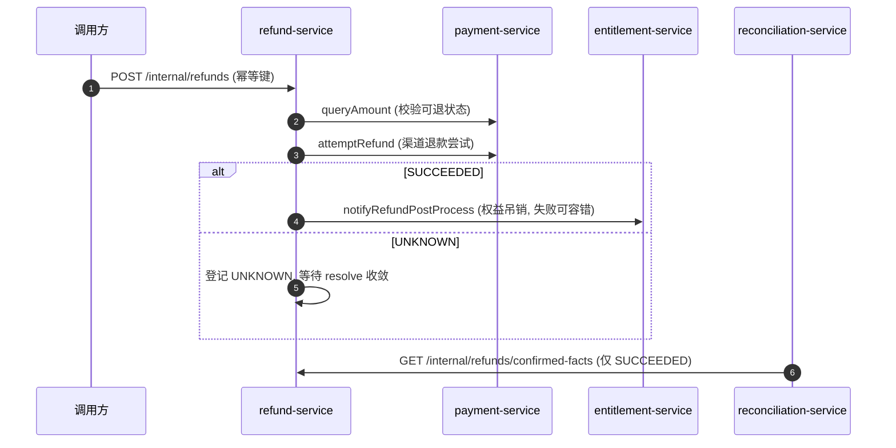

# refund-service 系统设计

> **⛔ 已退役（Status: merged）**：Feature 015（[ADR-0064](../../adr/0024-multi-payment-per-transaction.md)）将退款域整体并入
> **payment-service**（`payment-service/src/main/java/com/payment/refund/`，端口 8084）。
> 独立服务 refund-service 与 `refund` Schema、端口 8085 均已删除/退役；
> 退款事实端点 `/internal/refunds/confirmed-facts` 现由 payment-service 提供。
> 本文保留为退款域设计参考，文中代码路径 `../../refund-service/...` 应对应替换为
> `../../payment-service/src/main/java/com/payment/refund/...`，跨服务 RPC 描述现为进程内调用。

**服务**：refund-service（退款跨域编排）→ 已并入 payment-service
**端口**：~~8085~~（退役） | **Schema**：~~`refund`~~（表并入 payment 库） | **包根**：`com.payment.refund`（现位于 payment-service）

**上游依赖**：order-service / 调用方（发起退款申请，内部 RPC）
**下游依赖**：payment-service（金额查询 + 渠道退款尝试）、entitlement-service（退款后权益吊销）、reconciliation-service（拉取退款事实供对账）

> 标注约定：无标记 = 已实现；`[目标]` = 建议值待确认；`[待定]` = 留待后续；`[Phase N 延后]` = 明确延后。

---

## 1. 设计目标与约束

### 1.1 职责边界（负责 / 不负责）

| 维度 | 说明 |
|---|---|
| **负责** | 退款申请幂等受理、可退款金额/资格校验（RefundPolicy）、退款状态机、向 payment-service 发起渠道退款尝试、退款后权益吊销 RPC、UNKNOWN 退款收敛、向 reconciliation 暴露已确认退款事实、退款受理悲观锁（防超退） |
| **不负责** | 真实资金出款（归属 Channel，经 payment-service）、支付/履约/权益内部状态的最终判定；退款后 **履约撤销**（见 §3.6 矛盾）；对账差异处理（归属 reconciliation-service）；Ledger 记账（`[Phase 8 延后]`） |

> **成熟度说明（与 Roadmap / technical-solution 不符，已核实）**：`technical-solution.md:101` 与 `roadmap.md:11` 将 refund-service 标注为「骨架」。**但实测代码已超出骨架**——领域状态机（`Refund`/`RefundStatus`）、资格策略（`RefundPolicy`）、MyBatis 持久化、幂等兜底、悲观锁、出站 RPC（payment / entitlement）、对账事实接口及一整套测试均已落地。本服务应按「核心链路已实现、部分编排面与后处理待补」描述，详见 §3.6、§4 矛盾项。

### 1.2 硬约束（Constitution / ADR）

- **Refund ≠ Payment Refund**（Constitution §2.3 边界 5、technical-solution §4.1）：Refund 是**跨多域编排**，不是「调一次渠道退款」。本服务经 payment-service 退款、经 entitlement-service 吊销权益、向 reconciliation 提供事实，对 Channel 零直接依赖（全额透传 payment-service 的退款尝试）。
- **金额铁律**：金额一律最小货币单位 `long`（`amountMinor`），禁止 `float`/`double`；不变量 `amountMinor > 0`（[Refund.java:39](../../refund-service/src/main/java/com/payment/refund/domain/Refund.java)）。
- **幂等**：退款受理入口必须有幂等键，数据库唯一约束兜底（`uk_refunds_idempotency_key`）；重复请求返回首次结果。
- **UNKNOWN 不猜成败**：渠道未知结果进 `UNKNOWN`，绝不臆断成功/失败；收敛仅依据权威结果（[RefundApplicationService.java:102](../../refund-service/src/main/java/com/payment/refund/application/RefundApplicationService.java)）。
- **终态不可覆盖**：SUCCEEDED/PARTIALLY_SUCCEEDED/FAILED/REJECTED/CLOSED 吸收一切迟到冲突结果。
- **无跨服务 SQL**：本服务只读自有 `refund` schema；payment / entitlement / reconciliation 数据一律经对方公开 RPC / 接口获取。
- **禁止超退款（H1）**：同一支付下的受理以 `refund_intake_locks` 行锁串行化「读累计退款 + 写受理」，杜绝并发竞态超退。

### 1.3 技术指标（`[目标]`，待确认）

| 指标 | 目标值 |
|---|---|
| 创建退款受理 P99 | ≤ 500ms（本地 Mock Channel + 单次 MySQL 写 + 悲观锁） |
| 退款收敛处理 P99 | ≤ 300ms |
| 退款事实查询 P99 | ≤ 300ms |
| 资金入口可用性 | ≥ 99.9% |

---

## 2. 核心数据模型（DDD）

### 2.1 聚合与值对象

| 类型 | 名称 | 位置 | 说明 |
|---|---|---|---|
| 聚合根 | `Refund` | [domain/Refund.java](../../refund-service/src/main/java/com/payment/refund/domain/Refund.java) | 一次退款申请 + 平台退款状态；不保存渠道内部状态 |
| 实体（值对象列表） | `RefundItem` | [domain/RefundItem.java](../../refund-service/src/main/java/com/payment/refund/domain/RefundItem.java) | 退款明细（orderItemId + 金额，最小货币单位） |
| 值对象 | `RefundDecision` | [domain/RefundDecision.java](../../refund-service/src/main/java/com/payment/refund/domain/RefundDecision.java) | 资格决策（APPROVED / REJECTED + 原因） |
| 领域服务（纯函数） | `RefundPolicy` | [domain/RefundPolicy.java](../../refund-service/src/main/java/com/payment/refund/domain/RefundPolicy.java) | 可退款金额计算 + 资格判定 |
| 仓储接口 | `RefundRepository` | [domain/RefundRepository.java](../../refund-service/src/main/java/com/payment/refund/domain/RefundRepository.java) | 领域不依赖持久化实现 |
| 应用命令 | `CreateRefundCommand` | [application/CreateRefundCommand.java](../../refund-service/src/main/java/com/payment/refund/application/CreateRefundCommand.java) | 创建退款输入（独立于 API DTO） |
| 出站端口 | `PaymentRefundGateway` | [application/PaymentRefundGateway.java](../../refund-service/src/main/java/com/payment/refund/application/PaymentRefundGateway.java) | → payment-service |
| 出站端口 | `EntitlementGateway` | [application/EntitlementGateway.java](../../refund-service/src/main/java/com/payment/refund/application/EntitlementGateway.java) | → entitlement-service |

**基数关系（MVP）**：`Refund (1) ─ (N) RefundItem`（明细随聚合读写）。同一 `paymentId` 可对应多笔 `Refund`，累计金额受 `RefundPolicy` 约束。

### 2.2 状态机

**Refund**（`RefundStatus`，[domain/RefundStatus.java](../../refund-service/src/main/java/com/payment/refund/domain/RefundStatus.java)）：

```text
REQUESTED --process()--> PROCESSING --succeed()--------> SUCCEEDED
                              |    （\--partiallySucceed()-> PARTIALLY_SUCCEEDED  ⛔ 无调用方）
                              |      \--fail()-------------> FAILED
                              \--markUnknown()----------> UNKNOWN --succeed/fail--> SUCCEEDED/FAILED
REQUESTED --reject()--------> REJECTED
SUCCEEDED / FAILED / REJECTED --close()--> CLOSED
```

- `process()`：REQUESTED → PROCESSING（唯一发起渠道尝试入口，[Refund.java:68](../../refund-service/src/main/java/com/payment/refund/domain/Refund.java)）。
- `reject(reason)`：REQUESTED → REJECTED（资格/超退拒绝，[Refund.java:74](../../refund-service/src/main/java/com/payment/refund/domain/Refund.java)）。
- `succeed()` / `partiallySucceed()` / `fail(reason)` / `markUnknown(reason)`：PROCESSING/UNKNOWN 可迁移；终态冲突返回 `false`（迟到结果被吸收，[Refund.java:81](../../refund-service/src/main/java/com/payment/refund/domain/Refund.java) 等）。
- `close()`：仅终态可关闭，否则抛 `STATE_TRANSITION_VIOLATION`（[Refund.java:110](../../refund-service/src/main/java/com/payment/refund/domain/Refund.java)）。
- 所有迁移经唯一入口 `transitionTo(...)`（[Refund.java:119](../../refund-service/src/main/java/com/payment/refund/domain/Refund.java)），终态由 `isTerminal()` 吸收，禁止散落 `setStatus`。

> **⛔ 已裁决（ADR-0016，2026-08-30 裁决 / 2026-08-31 回退落地）**：`PARTIALLY_SUCCEEDED` 状态与 `partiallySucceed()` **保留但无任何调用方、本期不可达**。渠道只回 `SUCCEEDED/FAILED/UNKNOWN` 三态，成功恒为全额；真实发生部分退回时按 `UNKNOWN` 处理并走对账收敛。原 `refundedAmountMinor` 字段与 DDL 列**已回退删除**。
>
> **为何保留枚举而非删除**：`MybatisRefundRepository` 用 `RefundStatus.valueOf(entity.getStatus())` 反序列化，删除枚举会让任何历史 `status='PARTIALLY_SUCCEEDED'` 行抛 `IllegalArgumentException`，进而打断 `findByPaymentId` → 整条退款受理链路。同理 `partiallySucceed()` 一并保留。
>
> **金额校验口径（ADR-0047）**：`RefundPolicy.decide` 只做「币种一致 / 金额为正 / **累计申请额 + 本次申请额 ≤ 已支付金额**」，**不做**「申请额 = 可退全额」的等值校验。同一支付允许多笔退款（每笔独立幂等键），累计超额落 `REJECTED` 且不发起渠道尝试。

### 2.3 表结构与索引策略

来源：[deployment/schema/06-refund-schema.sql](../../deployment/schema/06-refund-schema.sql)（权威 DDL）。

**`refunds`**

| 列 | 类型 | 说明 |
|---|---|---|
| id | BIGINT PK AUTO_INCREMENT | 退款 ID |
| order_id | VARCHAR(64) NOT NULL | 订单引用，`idx_refunds_order_id` |
| payment_id | BIGINT NOT NULL | 支付引用，`idx_refunds_payment_id` |
| user_id | VARCHAR(64) NOT NULL | 用户引用 |
| amount_minor | BIGINT NOT NULL | 金额（最小货币单位） |
| currency_code | VARCHAR(8) NOT NULL | 币种 |
| reason | VARCHAR(255) NOT NULL | 退款原因 |
| idempotency_key | VARCHAR(128) NOT NULL | 幂等键，唯一 `uk_refunds_idempotency_key` |
| status | VARCHAR(32) NOT NULL | 状态机枚举名 |
| failure_reason | VARCHAR(255) | 失败/拒绝原因 |
| created_at / updated_at / created_by / updated_by / version | — | 审计 + 乐观锁（BaseEntity） |

**`refund_items`**

| 列 | 类型 | 说明 |
|---|---|---|
| id | BIGINT PK AUTO_INCREMENT | 明细 ID |
| refund_id | BIGINT NOT NULL | 退款引用，`idx_refund_items_refund_id` |
| order_item_id | VARCHAR(64) NOT NULL | 订单明细引用 |
| amount_minor | BIGINT NOT NULL | 明细金额（最小货币单位） |

**`refund_intake_locks`**

| 列 | 类型 | 说明 |
|---|---|---|
| payment_id | BIGINT NOT NULL | 受理悲观锁行键，PK；`INSERT ... ON DUPLICATE KEY UPDATE` 持有行锁直至事务提交/回滚（[RefundIntakeLockMapper.java:15](../../refund-service/src/main/java/com/payment/refund/infra/persistence/refund/RefundIntakeLockMapper.java)） |

**索引策略（已实现）**：
- `refunds`：`uk_refunds_idempotency_key`（幂等兜底）、`idx_refunds_payment_id`（按支付查累计退款）、`idx_refunds_order_id`（按订单查）。
- `refund_items`：`idx_refund_items_refund_id`（按退款查明细）。
- 并发控制双保险：`refund_intake_locks` 悲观行锁（串行化受理）+ `version` 乐观锁（[MybatisRefundRepository.java:91](../../refund-service/src/main/java/com/payment/refund/infra/persistence/refund/MybatisRefundRepository.java) 更新 0 行抛 `CONFLICT`）。

---

## 3. 接口详细定义（API 契约）

> 统一错误响应体 `ApiError`（common-core），错误码见 §3.7。响应成功体均为 JSON。

### 3.1 创建退款受理（内部 RPC）

`POST /internal/refunds` → `200`

**请求** `CreateRefundCommand`：`{ orderId, paymentId, userId, amountMinor(long), currencyCode, reason, idempotencyKey, items: List<RefundItem> }`（[CreateRefundCommand.java:10](../../refund-service/src/main/java/com/payment/refund/application/CreateRefundCommand.java)）。

**响应** `RefundResponse`：`{ id, paymentId, orderId, amountMinor, currencyCode, status, failureReason }`（[RefundResponse.java](../../refund-service/src/main/java/com/payment/refund/api/RefundResponse.java)）。

**错误**：`AMOUNT_INVARIANT_VIOLATION`（amount ≤ 0）、`NOT_FOUND`（支付不存在由下游透传）、`DUPLICATE`（幂等键撞唯一约束且回查失败）、`STATE_TRANSITION_VIOLATION`（下游退款状态非法）。

### 3.2 查询退款

`GET /internal/refunds/{id}` → `200`

**响应** `RefundResponse`（同上）。**错误**：`NOT_FOUND`。

### 3.3 收敛未知退款

`POST /internal/refunds/{id}/resolve` → `200`

**请求** `ResolveRefundRequest`：`{ status: "SUCCEEDED"|"FAILED"|"UNKNOWN" }`（[ResolveRefundRequest.java](../../refund-service/src/main/java/com/payment/refund/api/ResolveRefundRequest.java)）。

**响应**：收敛后的 `RefundResponse`。**规则**：仅 `UNKNOWN` 状态可被收敛为成功/失败；已终态视为幂等重复（返回当前状态，不重复触发后处理），由状态机吸收；非法的 `status` 字符串 → `INVALID_ARGUMENT`。

> **已核实（边界）**：`resolveRefund` 直接驱动状态机（[RefundRpcCallbackService.java:24](../../refund-service/src/main/java/com/payment/refund/application/RefundRpcCallbackService.java)）。若退款仍处于 `REQUESTED`（尚未 `process()`）即被收敛，状态机抛 `STATE_TRANSITION_VIOLATION`——正常链路中 `UNKNOWN` 必由 `PROCESSING` 而来，故该路径仅防御性存在（`[待定]`：可加 `requireStatus(UNKNOWN)` 前置断言）。

### 3.4 出站 RPC（refund → payment-service）

经 `PaymentRefundFeignClient`（[PaymentRefundFeignClient.java](../../refund-service/src/main/java/com/payment/refund/infra/client/PaymentRefundFeignClient.java)，Feign `payment-service`，默认 `http://localhost:8084`）：

- `POST /internal/payments/query-amount`（`queryAmount`，[PaymentRefundFeignClient.java:18](../../refund-service/src/main/java/com/payment/refund/infra/client/PaymentRefundFeignClient.java)）→ 校验支付可退状态 + 取 `paidAmountMinor`。
- `POST /internal/payments/refund-attempt`（`attemptRefund`，[PaymentRefundFeignClient.java:22](../../refund-service/src/main/java/com/payment/refund/infra/client/PaymentRefundFeignClient.java)）→ 触发渠道退款尝试，返回 `SUCCEEDED/FAILED/UNKNOWN` + `channelReference`。

### 3.5 出站 RPC（refund → entitlement-service）

经 `EntitlementFeignClient`（[EntitlementFeignClient.java:16](../../refund-service/src/main/java/com/payment/refund/infra/client/EntitlementFeignClient.java)，Feign `entitlement-service`，默认 `http://localhost:8087`）：

- `POST /internal/entitlements/on-refund`（`notifyRefundPostProcess`）→ 退款成功后请求权益吊销。请求 `RefundPostProcessRequest { refundId, paymentId, orderId, userId, reason }`；**失败 catch 忽略，不回滚退款成功**（[RefundApplicationService.java:109](../../refund-service/src/main/java/com/payment/refund/application/RefundApplicationService.java)）。

### 3.6 对账事实接口（供 reconciliation-service 拉取）

`GET /internal/refunds/confirmed-facts` → `200`（[RefundFactsController.java:21](../../refund-service/src/main/java/com/payment/refund/api/RefundFactsController.java)）

**响应**：`List<RefundFactResponse>`，每项 `{ refundId, channelReference: "refund-{id}", amountMinor, currencyCode, status }`；仅返回 `SUCCEEDED` 退款（[RefundFactsService.java:26](../../refund-service/src/main/java/com/payment/refund/application/RefundFactsService.java)）。**单向拉取**，refund-service 不主动推送；reconciliation 永不直接改写 `refunds`。

> **矛盾项 A（已核实，需roadmap/文档修正）**：`technical-solution.md §4.3.3 退款链路` 标注 `C --> D["履约/权益处理 (refund→fulfillment/entitlement RPC)"]`，即退款后**既调 fulfillment 又调 entitlement**。但**实测代码中 refund-service 仅有 `EntitlementGateway` / `EntitlementFeignClient`，不存在 fulfillment 网关或任何 refund→fulfillment 调用**。退款后履约撤销当前为 `[待定]`/缺失。文档与代码不一致，建议要么补 fulfillment 网关，要么将 §4.3.3 改为「refund→entitlement（MVP）；fulfillment 撤销 [待定]」。

### 3.7 错误码枚举（全局，common-core `ErrorCodes`）

| 错误码 | 语义 | 本服务使用场景 |
|---|---|---|
| `INVALID_ARGUMENT` | 参数非法 | resolve 状态字符串非法、字段缺失 |
| `NOT_FOUND` | 资源不存在 | 退款不存在（query/resolve） |
| `DUPLICATE` | 幂等冲突 | 幂等键撞唯一约束且回查失败（[RefundApplicationService.java:169](../../refund-service/src/main/java/com/payment/refund/application/RefundApplicationService.java)） |
| `STATE_TRANSITION_VIOLATION` | 非法状态迁移 | 非 PROCESSING/UNKNOWN 收敛、非法 close/process |
| `AMOUNT_INVARIANT_VIOLATION` | 金额不变量 | amount ≤ 0（[Refund.java:40](../../refund-service/src/main/java/com/payment/refund/domain/Refund.java)） |
| `CONFLICT` | 并发冲突 | 乐观锁更新 0 行（[MybatisRefundRepository.java:92](../../refund-service/src/main/java/com/payment/refund/infra/persistence/refund/MybatisRefundRepository.java)） |
| `INTERNAL_ERROR` | 内部错误 | （预留） |

---

## 4. 关键流程链路剖析

### 4.1 创建退款受理（含跨域编排）

`RefundController.createRefund` → `RefundApplicationService.createRefund`（[RefundApplicationService.java:55](../../refund-service/src/main/java/com/payment/refund/application/RefundApplicationService.java)，`@Transactional`）：

1. `findByIdempotencyKey` 回查；命中 → 计数 `refund.duplicate` 并返回首次结果（幂等）。
2. `lockForIntake(paymentId)`：以 `refund_intake_locks` 行锁串行化同一支付受理（H1 防超退）。
3. `paymentRefundGateway.queryAmount(...)`：取支付状态 + `paidAmountMinor`；非 `SUCCEEDED` → 落 `REJECTED` 并登记原因后 `insertNew`（幂等同样兜底）。
4. 累计该支付下所有「计额状态」（`SUCCEEDED/PROCESSING/UNKNOWN`；`PARTIALLY_SUCCEEDED` 虽在枚举中但**无调用方、不可达**，见 §2.2）的退款金额 —— **一律按「申请额 `amountMinor`」计**（终态与在途一视同仁，在途保守占用防并发超退；ADR-0016 回退 / ADR-0047 定稿），代码见 [RefundApplicationService.java:133](../../refund-service/src/main/java/com/payment/refund/application/RefundApplicationService.java)。
5. `RefundPolicy.decide(...)`（[RefundPolicy.java:28](../../refund-service/src/main/java/com/payment/refund/domain/RefundPolicy.java)）：币种一致 + 金额为正 + **累计申请额 + 本次申请额 ≤ 已支付金额**（H1 防超退）；不通过 → 落 `REJECTED` 且**不发起渠道尝试**。**不做**「申请额 = 可退全额」的等值校验（ADR-0047）。
6. `insertNew(refund)` → `refund.process()`（REQUESTED → PROCESSING）。
7. `paymentRefundGateway.attemptRefund(...)`：调 payment-service 渠道退款，按 `SUCCEEDED/FAILED/UNKNOWN` 驱动状态机（UNKNOWN 原样登记，不臆断）。
8. `save`（本地事务提交，悲观锁随事务释放）；`recordFinalTransition` 记指标 + `FINANCIAL_AUDIT`。
9. 若 `SUCCEEDED`：`entitlementGateway.notifyRefundPostProcess(...)`；**失败 catch 忽略，不回滚退款成功**。

### 4.2 未知退款收敛

`RefundRpcCallbackService.resolveRefund`（[RefundRpcCallbackService.java:24](../../refund-service/src/main/java/com/payment/refund/application/RefundRpcCallbackService.java)）复用领域状态机：

1. 加载 `Refund`（`NOT_FOUND`）。
2. 按权威 `status` 调 `succeed()/fail()/markUnknown()`；终态冲突返回 `false`（不重复触发后处理、不重复记审计）。
3. `save` 持久化。

### 4.3 退款后处理与对账事实（编排边界）



> 与 Constitution 边界 5 一致：Refund 仅**编排**，渠道退款、权益吊销、对账差异各自归位；refund-service 直接依赖的只有 `payment-service` RPC、`entitlement-service` RPC 与自有 schema，**不直接依赖 Channel / fulfillment / Ledger**（见 §3.6 矛盾 A）。

---

## 5. 存储与缓存设计 + 详细逻辑处理策略（Edge Cases）

### 5.1 存储读写策略

- **写路径**：`MybatisRefundRepository`（[MybatisRefundRepository.java](../../refund-service/src/main/java/com/payment/refund/infra/persistence/refund/MybatisRefundRepository.java)）在 `@Transactional` 应用服务内写 `refunds` + `refund_items`；状态机逻辑在领域层，持久层只存枚举名 + 乐观锁 `version`。
- **读路径**：`findById` / `findByIdempotencyKey` / `findByPaymentId`（累计校验）/ `findByStatus`（对账事实）。
- **缓存**：`[已评估·本期不引入]` 当前**无 Redis/本地缓存**，全部直连 MySQL；退款事实需强一致。Redis 已在平台引入（ADR-0044），本服务经评估**不使用**（状态需强一致）；未来若出现只读热点须另立 ADR。

### 5.2 幂等性方案

| 作用域 | 机制 |
|---|---|
| 创建退款受理 | `uk_refunds_idempotency_key` 唯一约束 + 先回查（[RefundApplicationService.java:57](../../refund-service/src/main/java/com/payment/refund/application/RefundApplicationService.java)）+ `DuplicateKeyException` 捕获回查（[RefundApplicationService.java:164](../../refund-service/src/main/java/com/payment/refund/application/RefundApplicationService.java)），覆盖并发/重启 |
| 防超退款（H1） | `refund_intake_locks` 悲观行锁串行化同一支付受理（[RefundIntakeLockMapper.java:15](../../refund-service/src/main/java/com/payment/refund/infra/persistence/refund/RefundIntakeLockMapper.java)） |
| 并发状态迁移 | `version` 乐观锁，更新 0 行抛 `CONFLICT`（[MybatisRefundRepository.java:91](../../refund-service/src/main/java/com/payment/refund/infra/persistence/refund/MybatisRefundRepository.java)） |
| 重复/乱序收敛 | 状态机终态吸收（`succeed/fail/markUnknown` 对终态返回 `false`） |

### 5.3 分布式事务方案

- 单服务内：`createRefund` 的「退款 + 明细 + 受理锁」在同一本地事务原子提交；受理锁随事务提交/回滚释放。
- 跨服务：entitlement RPC 为后置副作用，**失败不回滚退款成功事实**（catch 忽略），靠对账/重试/人工收敛最终一致（Saga 语义，禁 2PC/XA）。

### 5.4 异常与边界场景

| 场景 | 处理 | 阈值/规则 |
|---|---|---|
| 支付非 SUCCEEDED 退款 | 落 `REJECTED` + 原因 | 资格前置拒绝，仍登记幂等 |
| 超可退金额 / 币种不符 | 落 `REJECTED` | `RefundPolicy.decide` 拒绝（[RefundPolicy.java:38](../../refund-service/src/main/java/com/payment/refund/domain/RefundPolicy.java)） |
| 渠道超时/断连/不完整 | payment 返回 `UNKNOWN`；refund 登记 `UNKNOWN` | 不猜成败；等 resolve 收敛 |
| 并发受理同支付 | `refund_intake_locks` 行锁串行 | 防累计读改写竞态超退 |
| 迟到成功覆盖失败 | 状态机终态吸收 | FAILED 后 `succeed()` 返回 `false` |
| 并发乐观锁冲突 | 更新 0 行抛 `CONFLICT` | 由调用方重试（凭幂等键） |
| 权益吊销 RPC 失败 | 捕获忽略，不回滚退款成功 | 靠对账/人工收敛，不重复退款 |
| 幂等键冲突且回查失败 | 抛 `DUPLICATE` | 数据不一致时显式报错 |

**超时/重试/降级阈值（`[目标]`，待确认）**：
- 出站 Feign（payment / entitlement）超时：当前未显式配置（用 OpenFeign 默认值）；`[目标]` connectTimeout=1s、readTimeout=3s。
- 重试：仅对幂等调用允许重试；entitlement 后处理 `[目标]` 有限退避重试（3 次、1s/2s/4s），耗尽进入对账/人工。
- 熔断/降级：`[Phase 按需延后]` Resilience4j/Sentinel 延迟引入。

---

## 6. 部署拓扑与配置文件设计

### 6.1 运行态配置（application.yml）

来源：[application.yml](../../refund-service/src/main/resources/application.yml)

```yaml
spring:
  application:
    name: refund-service
  datasource:
    url: jdbc:mysql://localhost:3306/refund?useSSL=false&serverTimezone=UTC&allowPublicKeyRetrieval=true
    username: root
    password: root
    driver-class-name: com.mysql.cj.jdbc.Driver
server:
  port: 8085
services:
  payment:
    url: http://localhost:8084
  entitlement:
    url: http://localhost:8087
mybatis-plus:
  configuration:
    map-underscore-to-camel-case: true
```

### 6.2 环境变量清单（dev / test / prod 差异化项，`[目标]` 建议）

| 配置项 | dev（默认） | test | prod（`[目标]`） |
|---|---|---|---|
| `spring.datasource.url` | `jdbc:mysql://localhost:3306/refund` | Testcontainers MySQL | 环境变量/配置中心，指向生产实例 |
| `spring.datasource.username/password` | root/root | — | 环境变量注入，禁止硬编码 |
| `server.port` | 8085 | 随机 | 8085（或编排指定） |
| `services.payment.url` | `http://localhost:8084` | fake | Nacos 服务发现（去掉硬编码 url） |
| `services.entitlement.url` | `http://localhost:8087` | fake | Nacos 服务发现（去掉硬编码 url） |
| 连接池大小 | 默认 10 | — | `[目标]` 按并发调优（如 20） |
| 出站 Feign 超时 | 未配置 | — | `[目标]` connect 1s / read 3s |

### 6.3 启动依赖顺序

```text
1. MySQL 8.0 就绪（refund schema 由 deployment/schema/06-refund-schema.sql 建库建表）
2. Nacos 就绪（注册 + 配置）  [目标：生产启用；当前本地直连 MySQL，未强制依赖 Nacos]
3. 启动 refund-service（端口 8085），完成 Feign 客户端装配
4. 下游 payment-service / entitlement-service 可延后就绪（RPC 失败可容错，不阻塞启动）
```

### 6.4 埋点与日志键（本服务）

**业务指标（Micrometer，`BusinessMetrics`）**：

| 指标键 | 类型 | 维度 | 说明 |
|---|---|---|---|
| `refund.initiated` | counter | module=refund | 创建退款受理 |
| `refund.duplicate` | counter | module=refund | 幂等命中（重复请求） |
| `refund.rejected` | counter | module=refund | 资格/超退拒绝 |
| `refund.succeeded` | counter | module=refund | 退款成功 |
| `refund.failed` | counter | module=refund | 退款失败 |
| `refund.unknown` | counter | module=refund | 退款未知 |

**资金审计日志（`FINANCIAL_AUDIT` logger，`StructuredAuditLogger`）**：

单行 JSON，`action` 取值 `refund.succeeded` / `refund.failed` / `refund.unknown`（[RefundApplicationService.java:154](../../refund-service/src/main/java/com/payment/refund/application/RefundApplicationService.java)），字段键：

```json
{"action":"refund.succeeded","traceId":"...","idempotencyKey":"...","amountMinor":100,
 "currencyCode":"CNY","fromStatus":"PROCESSING","toStatus":"SUCCEEDED","entityType":"refund","entityId":"42"}
```

**关联字段**：`traceId`（`TraceContext` / `TraceIdFilter` 跨服务传播，`TraceIdRequestInterceptor` 透传 Feign）。
