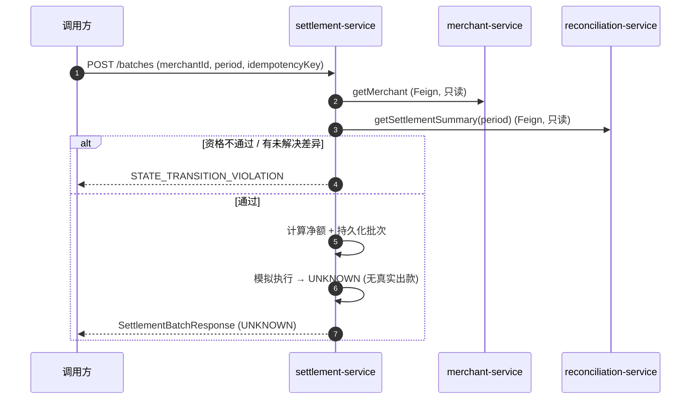

# settlement-service 系统设计

**服务**：settlement-service（结算批次 + 净额计算 + 模拟执行）
**端口**：8089 | **Schema**：`settlement` | **包根**：`com.payment.settlement`

**上游依赖**：merchant-service（查询商户状态与结算资格）、reconciliation-service（读已确认 Payment/Refund 事实与差异计数，只读 RPC）
**下游依赖**：无真实出款（MVP 模拟执行）；不调用银行 / Ledger / 支付渠道

> 标注约定：无标记 = 已实现；`[目标]` = 建议值待确认；`[待定]` = 留待后续；`[Phase N 延后]` = 明确延后。

---

## 1. 设计目标与约束

### 1.1 职责边界（负责 / 不负责）

| 维度 | 说明 |
|---|---|
| **负责** | 商户结算资格校验、基于已确认事实的净额计算（收入 − 退款 − 调整）、结算批次（SettlementBatch）与明细（SettlementItem）聚合、批次状态机、批次幂等（幂等键 + 商户+周期双唯一约束）、模拟执行与结果收敛 |
| **不负责** | 真实出款 / 银行对接 / Ledger 复式记账 / 多币种清分 / 税费分账；发现原始对账差异（归属 reconciliation-service）；修改 Payment/Refund 原始事实；支付成功与否的最终判断 |

### 1.2 硬约束（Constitution / ADR）

- **Settlement ≠ Reconciliation**：结算只消费对账产出的「已确认且差异可解释」财务事实（读 `ReconciliationClient`，只读 RPC），绝不改写原始 Payment/Refund 事实（`SettlementApplicationService` 仅查询，无写回）。
- **绝不结算未确认/未知事实**：净额计算仅基于 reconciliation-service 返回的已确认事实；若 `unresolvedDifferenceCount > 0` 直接拒绝生成批次（`SettlementEligibility.evaluate`）。
- **模拟执行 ≠ 真实打款**：`createBatch` 执行后强制进入 `UNKNOWN`，不臆断成功（`SettlementApplicationService:93-96`）。
- **金额铁律**：金额一律最小货币单位 `long`（`*Minor`），禁止 `float`/`double`；不变量 `income/refund/adjustment ≥ 0`（`SettlementBatch.compute`）。
- **幂等**：资金入口（`createBatch`）必须带幂等键，数据库唯一约束兜底；同键 / 同商户+周期重复请求返回同一批次。
- **显式状态机**：批次状态流转集中在 `SettlementBatch` 转换函数，禁止散落 `set`（`SettlementBatch:131-158`）。
- **无跨服务 SQL**：Database-per-Service，只读写自有 `settlement` schema；商户/对账数据经 Feign RPC 获取。

### 1.3 技术指标（`[目标]`，待确认）

| 指标 | 目标值 |
|---|---|
| 创建结算批次 P99 | `[目标]` ≤ 500ms（2 次同步 RPC + 单次 MySQL 写） |
| 批次查询 P99 | `[目标]` ≤ 300ms |
| 批次幂等命中率 | 100%（唯一约束兜底） |
| 资金入口可用性 | ≥ 99.9% |

---

## 2. 核心数据模型（DDD）

### 2.1 聚合与值对象

| 类型 | 名称 | 位置 | 说明 |
|---|---|---|---|
| 聚合根 | `SettlementBatch` | [domain/SettlementBatch.java](../../settlement-service/src/main/java/com/payment/settlement/domain/SettlementBatch.java) | 商户某周期结算事实（收入/退款/调整/净额）与生命周期；不发起真实打款 |
| 值对象 | `SettlementItem` | [domain/SettlementItem.java](../../settlement-service/src/main/java/com/payment/settlement/domain/SettlementItem.java) | 单条财务事实明细（PAYMENT/REFUND/ADJUSTMENT），随聚合 1:N 读写 |
| 值对象 | `Adjustment` | [domain/Adjustment.java](../../settlement-service/src/main/java/com/payment/settlement/domain/Adjustment.java) | 调整项契约（MVP 不参与计算，保留） |
| 值对象 | `EligibilityDecision` | [domain/EligibilityDecision.java](../../settlement-service/src/main/java/com/payment/settlement/domain/EligibilityDecision.java) | 资格判定结果（eligible + reason） |
| 工厂/函数 | `SettlementEligibility` | [domain/SettlementEligibility.java](../../settlement-service/src/main/java/com/payment/settlement/domain/SettlementEligibility.java) | 纯函数式资格判定（无副作用） |
| 值对象 | `SettlementFact` | [application/SettlementFact.java](../../settlement-service/src/main/java/com/payment/settlement/application/SettlementFact.java) | 对账确认事实（本地端口值对象） |
| 值对象 | `ReconciliationSummary` | [application/ReconciliationSummary.java](../../settlement-service/src/main/java/com/payment/settlement/application/ReconciliationSummary.java) | 周期汇总（facts + unresolvedDifferenceCount） |
| 值对象 | `MerchantView` | [application/MerchantView.java](../../settlement-service/src/main/java/com/payment/settlement/application/MerchantView.java) | 商户视图（id/status/settlementEligible） |
| 仓储接口 | `SettlementRepository` | [domain/SettlementRepository.java](../../settlement-service/src/main/java/com/payment/settlement/domain/SettlementRepository.java) | 领域仓储边界（不依赖持久化实现） |

**基数关系（MVP）**：`SettlementBatch (1) ─ (N) SettlementItem`，明细随聚合读写，无独立生命周期。

### 2.2 状态机

**SettlementBatch**（`SettlementStatus`）：

```text
PENDING --calculate--> CALCULATING --markReady--> READY --execute--> EXECUTING
       EXECUTING --succeed--> SUCCEEDED
       EXECUTING --fail------> FAILED
       EXECUTING --markUnknown--> UNKNOWN --succeed/fail--> SUCCEEDED/FAILED
       SUCCEEDED/FAILED --close--> CLOSED
```

- 流转集中在 `SettlementBatch`：`calculate`(PENDING→CALCULATING)、`markReady`(→READY)、`execute`(→EXECUTING)、`succeed`/`fail`(EXECUTING/UNKNOWN→SUCCEEDED/FAILED)、`markUnknown`(EXECUTING→UNKNOWN)、`close`(SUCCEEDED/FAILED→CLOSED)。
- `transitionTo`（[源码](../../settlement-service/src/main/java/com/payment/settlement/domain/SettlementBatch.java)）：同态返回 `false`（幂等），终态（SUCCEEDED/FAILED/CLOSED）吸收迟到冲突结果；非法迁移抛 `STATE_TRANSITION_VIOLATION`。
- 与 Spec 状态机一致：待结算 → 计算中 → 待执行 → 执行中 → 成功/失败/未知/关闭（`technical-solution.md:194`）。

### 2.3 表结构与索引策略

来源：[deployment/schema/08-settlement-schema.sql](../../deployment/schema/08-settlement-schema.sql)（权威 DDL）。

**`settlement_batches`**

| 列 | 类型 | 说明 |
|---|---|---|
| id | BIGINT PK AUTO_INCREMENT | 批次 ID |
| merchant_id | VARCHAR(32) NOT NULL | 商户引用 |
| period | VARCHAR(32) NOT NULL | 结算周期 |
| currency_code | VARCHAR(8) NOT NULL | 币种（MVP 固定 CNY） |
| income_minor | BIGINT NOT NULL | 收入（最小货币单位） |
| refund_minor | BIGINT NOT NULL | 退款 |
| adjustment_minor | BIGINT NOT NULL | 调整（MVP=0） |
| net_minor | BIGINT NOT NULL | 净额 = 收入 − 退款 − 调整（可为负） |
| status | VARCHAR(32) NOT NULL | 状态机枚举名 |
| idempotency_key | VARCHAR(128) NOT NULL | 幂等键，唯一 `uk_settlement_batches_idempotency_key` |
| created_at / updated_at / created_by / updated_by / version | — | 审计 + 乐观锁（BaseEntity） |

**`settlement_items`**

| 列 | 类型 | 说明 |
|---|---|---|
| id | BIGINT PK AUTO_INCREMENT | 明细 ID |
| batch_id | BIGINT NOT NULL | 批次引用，索引 `idx_settlement_items_batch_id` |
| reference | VARCHAR(64) NOT NULL | 事实引用（如支付/退款 ID） |
| type | VARCHAR(16) NOT NULL | PAYMENT / REFUND / ADJUSTMENT |
| amount_minor | BIGINT NOT NULL | 金额（最小货币单位） |
| currency_code | VARCHAR(8) NOT NULL | 币种 |

**索引策略（已实现）**：
- `uk_settlement_batches_merchant_period`（merchant_id, period）杜绝同商户+周期重复批次。
- `uk_settlement_batches_idempotency_key` 幂等兜底。
- `idx_settlement_items_batch_id` 按批次查明细。

**分库分表键**：`[Phase 10 延后]` 当前单库单表，不引入分库分表。

---

## 3. 接口详细定义（API 契约）

> 统一错误响应体 `ApiError`（common-core），错误码见 §3.7。响应成功体均为 JSON。

### 3.1 创建结算批次（内部 RPC）

`POST /internal/settlements/batches` → `200`（[SettlementController:25-30](../../settlement-service/src/main/java/com/payment/settlement/api/SettlementController.java)）

**请求** `CreateSettlementBatchRequest`：`{ merchantId: String, period: String, idempotencyKey: String }`

**响应** `SettlementBatchResponse`：`{ id, merchantId, period, currencyCode, incomeMinor, refundMinor, adjustmentMinor, netMinor, status }`。

**规则**：先回查幂等键 → 回查商户+周期 → 校验资格 → 计算净额 → 持久化 → 模拟执行进 `UNKNOWN`（详见 §4.1）。
**错误**：`STATE_TRANSITION_VIOLATION`（资格不通过）、`NOT_FOUND`（商户不存在）、`DUPLICATE`（幂等冲突且回查失败）。

### 3.2 查询结算批次

`GET /internal/settlements/batches/{id}` → `200`（[SettlementController:32-35](../../settlement-service/src/main/java/com/payment/settlement/api/SettlementController.java)）

**响应**：`SettlementBatchResponse`。**错误**：`NOT_FOUND`。

### 3.3 收敛未知批次

`POST /internal/settlements/batches/{id}/resolve` → `200`（[SettlementController:37-41](../../settlement-service/src/main/java/com/payment/settlement/api/SettlementController.java)）

**请求** `ResolveSettlementRequest`：`{ status: "SUCCEEDED"|"FAILED"|"UNKNOWN" }`。

**响应**：收敛后 `SettlementBatchResponse`。

**规则**：携带权威结果驱动状态机；`SUCCEEDED`→`succeed()`、`FAILED`→`fail()`、其它→`markUnknown()`；终态冲突被吸收（返回当前状态）。
**错误**：`NOT_FOUND`、`STATE_TRANSITION_VIOLATION`（非法来源迁移）。

### 3.4 出站 RPC（settlement → merchant / reconciliation）

**merchant-service**：`GET /merchants/{id}`（Feign `MerchantFeignClient`，默认 `http://localhost:8081`）
**响应** `MerchantDto`：`{ id, code, name, status, settlementEligible }`；404 转 `NOT_FOUND`（`FeignMerchantClient:23-30`）。

**reconciliation-service**：`GET /internal/reconciliation/settlement-summary?period=` （Feign `ReconciliationFeignClient`，默认 `http://localhost:8088`）
**响应** `ReconciliationSummaryDto`：`{ period, facts: List<SettlementFactDto>, unresolvedDifferenceCount }`（`FeignReconciliationClient:23-29`）。只读，不写回。

### 3.5 错误码枚举（全局，common-core `ErrorCodes`）

| 错误码 | 语义 | 本服务使用场景 |
|---|---|---|
| `INVALID_ARGUMENT` | 参数非法 | （预留） |
| `NOT_FOUND` | 资源不存在 | 批次不存在、商户 404 |
| `CONFLICT` | 并发更新冲突 | 乐观锁更新 0 行（`MybatisSettlementRepository:65`） |
| `DUPLICATE` | 幂等冲突 | 幂等键撞唯一约束且回查失败（`SettlementApplicationService:140`） |
| `STATE_TRANSITION_VIOLATION` | 非法状态迁移 | 资格不通过、非法 close/resolve |
| `AMOUNT_INVARIANT_VIOLATION` | 金额不变量 | 收入/退款/调整 < 0（`SettlementBatch:48`） |
| `INTERNAL_ERROR` | 内部错误 | — |

---

## 4. 关键流程链路剖析

### 4.1 创建结算批次（含资格校验与净额计算）

`SettlementController.createBatch` → `SettlementApplicationService.createBatch`（[源码](../../settlement-service/src/main/java/com/payment/settlement/application/SettlementApplicationService.java)）：

1. `findByIdempotencyKey` 回查；命中 → 直接返回（幂等）。
2. `findByMerchantAndPeriod` 回查；命中 → 直接返回（同商户+周期不重复批次）。
3. `merchantClient.getMerchant` 取商户；`"ACTIVE".equals(status) && settlementEligible` 得 `merchantActiveAndEligible`（`:59-60`）。
4. `reconciliationClient.getSettlementSummary(period)` 取已确认事实与差异计数（`:62`）。
5. `SettlementEligibility.evaluate(merchantActiveAndEligible, unresolvedDifferenceCount)`；不通过抛 `STATE_TRANSITION_VIOLATION`（`:64-68`）。此即「绝不结算未确认/未知事实」的硬闸门。
6. 按 `type` 聚合：PAYMENT 求和入 `income`，REFUND 求和入 `refund`（`:70-77`）。**调整额 MVP 固定 0**。
7. `batch.calculate(income, refund, 0, "CNY")` → CALCULATING；`batch.markReady()` → READY（`:79-81`）。
8. 逐条 `addItem(new SettlementItem(...))` 写入明细（`:82-84`）。
9. `insertNew(batch)` 持久化（撞唯一约束回查，见 §5.2）；记 `settlement.created` 指标 + 审计（`:86-91`）。
10. **模拟执行**：`batch.execute()` → EXECUTING；`batch.markUnknown("mock settlement payout unknown")` → UNKNOWN（`:93-96`）。无真实打款，绝不进 SUCCEEDED。

### 4.2 未知批次收敛

`SettlementController.resolveBatch` → `SettlementApplicationService.resolveBatch`（[源码](../../settlement-service/src/main/java/com/payment/settlement/application/SettlementApplicationService.java)）：

1. `requireBatch(id)` 加载（`NOT_FOUND`）。
2. 按权威 `status` 驱动：SUCCEEDED→`succeed()`、FAILED→`fail()`（记失败指标+审计）、其它→`markUnknown()`（`:112-124`）。
3. `save` 持久化（乐观锁）。终态冲突被 `transitionTo` 吸收，不重复触发。



### 4.3 调整项与多币种（保留）

- `Adjustment` 值与 `SettlementItem` 的 `ADJUSTMENT` 类型已定义，但 MVP 净额计算中 `adjustment` 恒为 0（`SettlementApplicationService:80`），不参与实算——属 `[待定]`/保留契约。
- 币种 MVP 固定 `CNY`，`currencyCode` 字段存在但不做多币种清分（`[Phase 后续延后]`）。

---

## 5. 存储与缓存设计 + 详细逻辑处理策略（Edge Cases）

### 5.1 存储读写策略

- **写路径**：`MybatisSettlementRepository`（[源码](../../settlement-service/src/main/java/com/payment/settlement/infra/persistence/MybatisSettlementRepository.java)）在 `@Transactional` 应用服务内写 `settlement_batches` / `settlement_items`；状态机逻辑在领域层，持久层只存枚举名。
- **读路径**：`findById` / `findByIdempotencyKey` / `findByMerchantAndPeriod`（按商户+周期查重）。
- **缓存**：`[待定]` 当前**无 Redis/本地缓存**，全部直连 MySQL；批次需强一致，不引入 Cache-Aside。

### 5.2 幂等性方案

| 作用域 | 机制 |
|---|---|
| 创建结算批次（幂等键） | `uk_settlement_batches_idempotency_key` 唯一约束 + 先回查 + `DuplicateKeyException` 捕获后回查（`insertNew:134-143`，数据库级，覆盖并发/重启） |
| 创建结算批次（商户+周期） | `uk_settlement_batches_merchant_period` 唯一约束 + `findByMerchantAndPeriod` 先回查，杜绝同周期重复批次 |
| 重复/乱序收敛 | 状态机终态吸收（`succeed/fail/markUnknown` 对终态返回 `false`） |

### 5.3 分布式事务方案

- 单服务内：`createBatch` 的「批次 + 明细」在同一本地事务原子提交（`@Transactional`）。
- 跨服务：仅**读** merchant/reconciliation（同步 RPC），无跨服务写副作用；无真实出款，不涉及 Saga/2PC。模拟执行结果收敛经 `resolveBatch` 本地事务持久化。

### 5.4 异常与边界场景

| 场景 | 处理 | 规则 |
|---|---|---|
| 商户不存在 | `FeignMerchantClient` 捕获 404 转 `NOT_FOUND` | 显式报错 |
| 商户非 ACTIVE 或不可结算 | `SettlementEligibility` 拒绝 | 抛 `STATE_TRANSITION_VIOLATION` |
| 对账存在未解决差异 | `unresolvedDifferenceCount > 0` 拒绝 | 不结算未确认事实 |
| 收入/退款/调整 < 0 | `compute` 抛 `AMOUNT_INVARIANT_VIOLATION` | 金额不变量 |
| 并发重复创建批次 | `DuplicateKeyException` → 回查返回首次结果 | 数据库唯一约束兜底 |
| 并发更新批次 | `updateById` 0 行命中抛 `CONFLICT` | 乐观锁防状态覆盖 |
| 迟到成功/失败覆盖终态 | 状态机终态吸收 | SUCCEEDED 后 `fail()` 返回 `false` |
| 模拟执行结果 | 强制进 `UNKNOWN`，绝不臆断成功 | 无真实出款 |

**超时/重试/降级阈值（`[目标]`，待确认）**：
- 出站 Feign（merchant/reconciliation）超时：当前未显式配置（用 OpenFeign 默认值）；`[目标]` connectTimeout=1s、readTimeout=3s。
- 重试：`[目标]` 仅对幂等读调用有限退避重试；创建批次不自动重试（靠幂等键 + 调用方重试）。
- 熔断/降级：`[Phase 按需延后]` Resilience4j/Sentinel 延迟引入。

---

## 6. 部署拓扑与配置文件设计

### 6.1 运行态配置（application.yml）

来源：[application.yml](../../settlement-service/src/main/resources/application.yml)

```yaml
spring:
  application:
    name: settlement-service
  datasource:
    url: jdbc:mysql://localhost:3306/settlement?useSSL=false&serverTimezone=UTC&allowPublicKeyRetrieval=true
    username: root
    password: root
    driver-class-name: com.mysql.cj.jdbc.Driver
server:
  port: 8089
management:
  endpoints:
    web:
      exposure:
        include: health,info,metrics,prometheus
services:
  merchant:
    url: http://localhost:8081
  reconciliation:
    url: http://localhost:8088
mybatis-plus:
  configuration:
    map-underscore-to-camel-case: true
```

### 6.2 环境变量清单（dev / test / prod 差异化项，`[目标]` 建议）

| 配置项 | dev（默认） | test | prod（`[目标]`） |
|---|---|---|---|
| `spring.datasource.url` | `jdbc:mysql://localhost:3306/settlement` | Testcontainers MySQL | 环境变量/配置中心，指向生产实例 |
| `spring.datasource.username/password` | root/root | — | 环境变量注入，禁止硬编码 |
| `server.port` | 8089 | 随机 | 8089（或编排指定） |
| `services.merchant.url` | `http://localhost:8081` | fake | Nacos 服务发现（去掉硬编码 url） |
| `services.reconciliation.url` | `http://localhost:8088` | fake | Nacos 服务发现（去掉硬编码 url） |
| 连接池大小 | 默认 10 | — | `[目标]` 按并发调优（如 20） |
| 出站 Feign 超时 | 未配置 | — | `[目标]` connect 1s / read 3s |

### 6.3 启动依赖顺序

```text
1. MySQL 8.0 就绪（settlement schema 由 deployment/schema/08-settlement-schema.sql 建库建表）
2. merchant-service 就绪（资格校验 RPC）
3. reconciliation-service 就绪（已确认事实 RPC）
4. 启动 settlement-service（端口 8089），完成 Feign 客户端装配
```

### 6.4 埋点与日志键（本服务）

**业务指标（Micrometer，`BusinessMetrics`）**：

| 指标键 | 类型 | 维度 | 说明 |
|---|---|---|---|
| `settlement.created` | counter | module=settlement | 成功受理批次 |
| `settlement.unknown` | counter | module=settlement | 模拟执行进 UNKNOWN |
| `settlement.failed` | counter | module=settlement | 收敛为 FAILED |

**资金审计日志（`StructuredAuditLogger`）**：

单行 JSON，`action` 取值 `settlement.created` / `settlement.unknown` / `settlement.failed`，字段键：`traceId`、`idempotencyKey`、`amountMinor`、`currencyCode`、`fromStatus`、`toStatus`、`entityType`、`entityId`。

**关联字段**：`traceId` 经 `TraceContext` / `TraceIdFilter` 跨服务传播，Feign 透传。
