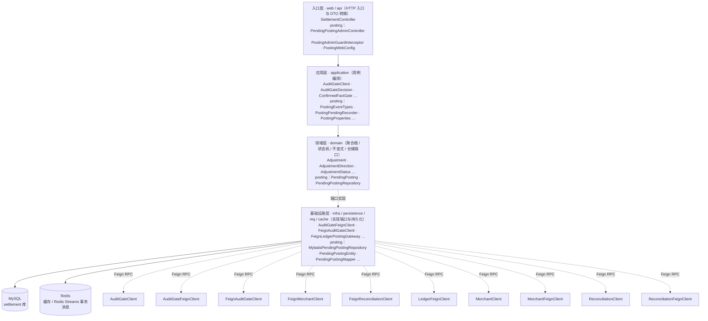
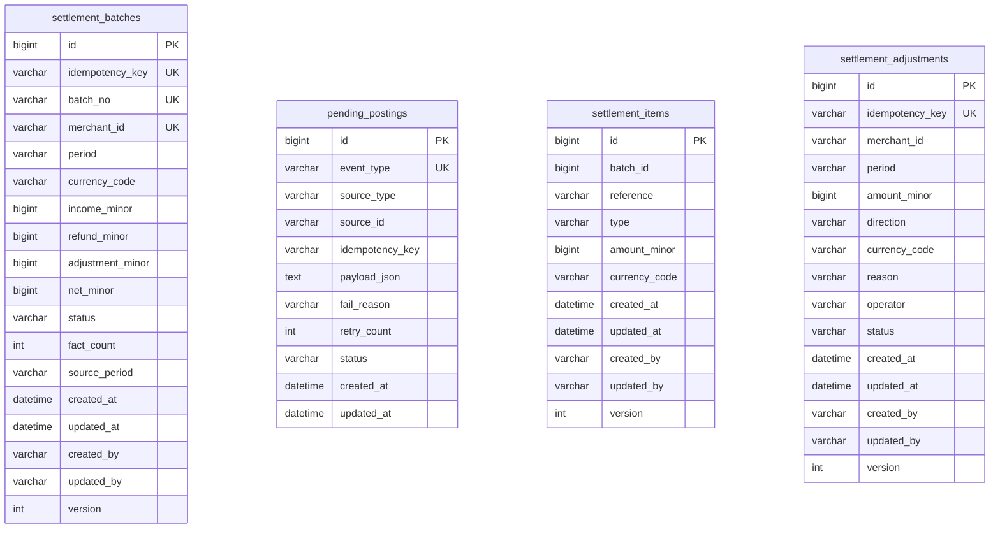
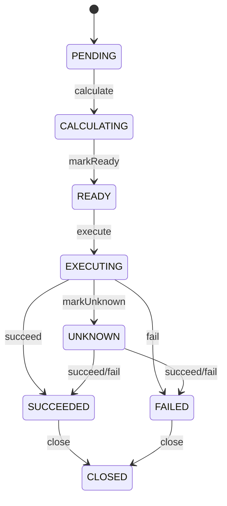
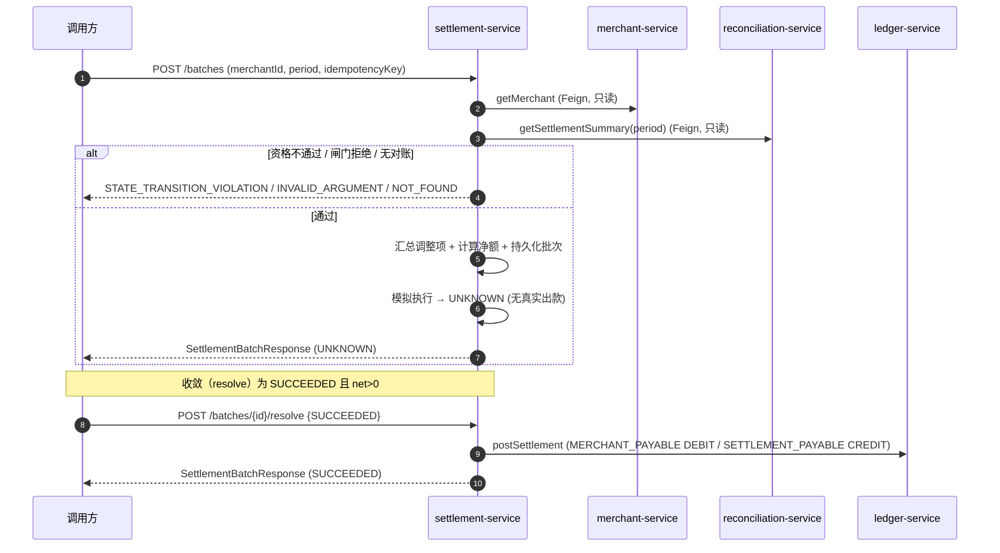
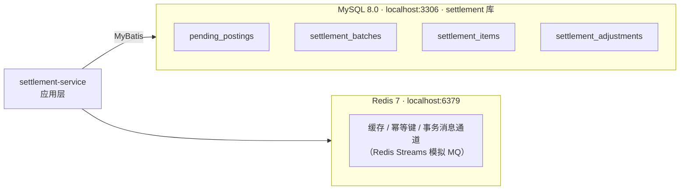

# settlement-service 系统设计

**服务**：settlement-service（结算批次 + 调整项 + 净额计算 + 已确认事实闸门 + 收敛/关闭 + 结算侧记账）
**端口**：8089 | **Schema**：`settlement` | **包根**：`com.payment.settlement`

> 标注约定：无标记 = 已实现；`[目标]` = 建议值待确认；`[待定]` = 留待后续；`[Phase N 延后]` = 明确延后。
> 结算当前基于已确认事实和 reconciliation audit gate；ADR 仅作为历史决策依据，当前行为以本设计和代码为准。

---

> **章节结构**：遵循 [system-design-standard](../../standards/system-design-standard.md) 的 15 章骨架。
> 2026-09-22 文档治理将原 6 章结构重排为标准章号，**正文内容未删改**。

---

## 1. 职责（Responsibility）

商户结算资格校验；基于已确认事实的净额计算（**收入 − 退款 + 调整项带符号求和**）；调整项登记（幂等 + 审计）；结算批次（SettlementBatch）与明细（SettlementItem）聚合；已确认事实本地闸门（type / 币种 / 金额 / 周期）；批次幂等（幂等键 + 商户+周期双唯一约束）；收敛 / 关闭；收敛为 SUCCEEDED 且净额 > 0 时向 ledger-service 发起记账

### 1.1 技术指标（`[目标]`，待确认）

| 指标 | 目标值 |
|---|---|
| 创建结算批次 P99 | `[目标]` ≤ 500ms（2 次同步 RPC + 单次 MySQL 写） |
| 批次查询 P99 | `[目标]` ≤ 300ms |
| 批次幂等命中率 | 100%（唯一约束兜底） |
| 资金入口可用性 | ≥ 99.9% |

---

## 2. 不负责（Non-Responsibility）

真实出款 / 银行对接 / 多币种清分 / 税费分账；修改 Payment/Refund 原始事实；支付成功与否的最终判断；发现原始对账差异（归属 reconciliation-service）；ledger-service 的领域模型与端点契约（归 004-ledger，本服务只消费）

## 3. 上下文与约束（Context）

### 3.1 上下游依赖方向

- **上游依赖**：merchant-service（查询商户状态与结算资格）、reconciliation-service（读已确认 Payment/Refund 事实与差异计数，只读 RPC）
- **下游依赖**：ledger-service（收敛为 SUCCEEDED 且净额 > 0 时记账，只读/写 RPC，不真实出款）；不调用银行 / 支付渠道

- **依赖方式**：跨服务交互一律经公开 REST / Feign RPC 或事件通道，**禁止**直接 SQL 他服务 Schema（Database-per-Service，见 [technical-solution.md §3.1](../technical-solution.md)）。

### 3.2 硬约束（Constitution / ADR）

- **Settlement ≠ Reconciliation**：结算只消费对账产出的「已确认且差异可解释」财务事实（读 `ReconciliationClient`，只读 RPC），绝不改写原始 Payment/Refund 事实（`SettlementApplicationService` 仅查询，无写回）。
- **绝不结算未确认/未知事实（纵深防御）**：
  - `SettlementEligibility.evaluate` 仍先校验 `unresolvedDifferenceCount > 0` 直接拒绝（`SettlementApplicationService`）。
  - `ConfirmedFactGate`（纯函数、可单测）再逐条校验：`type ∈ {PAYMENT, REFUND}`、`currencyCode == 批次币种`、`amountMinor >= 0`、`summary.period == 请求 period`；任一不满足 ⇒ 拒绝建批且**不落任何批次记录**，递增 `settlement.gate_rejected{reason}` 并打印含 `traceId`/`merchantId`/`period` 的 WARN。
- **模拟执行 ≠ 真实打款**：`createBatch` 执行后强制进入 `UNKNOWN`，不臆断成功（`SettlementApplicationService`）。
- **金额铁律**：金额一律最小货币单位 `long`（`*Minor`），禁止 `float`/`double`；不变量 `income/refund ≥ 0`、`adjustment == sum(ADJUSTMENT 明细带符号金额)`，违反 `AMOUNT_INVARIANT_VIOLATION`。
- **调整项方向语义**：`SettlementAdjustment.amountMinor` **恒 > 0**，方向由 `AdjustmentDirection` 枚举表达——`CREDIT`（补差，增加净额）/ `DEBIT`（扣款，减少净额）；**禁止**用负数金额表达方向。
- **调整项登记门禁**：该 `(merchant, period)` **已存在结算批次** ⇒ 新登记被拒（`STATE_TRANSITION_VIOLATION` + `settlement.adjustment_rejected{reason=batch_exists}`），批次是创建时的事实快照，MUST NOT 被追溯篡改；`reason`/`operator` MUST 非空白；同键同参返回首次、同键不同参报 `DUPLICATE`。
- **幂等**：资金入口（`createBatch`）必须带幂等键，数据库唯一约束兜底；同键 / 同商户+周期重复请求返回同一批次；**幂等键命中后 MUST 校验 `merchantId`/`period` 一致，不一致报 `DUPLICATE`，MUST NOT 静默返回他商户/他周期批次（FR-012 / N5）**。
- **结算侧记账（Constitution §II.3）**：仅收敛为 `SUCCEEDED` 且 `netMinor > 0` 时经 `LedgerPostingGateway` 发起；`netMinor <= 0` 不发起；RPC 失败**不回滚**批次状态（禁 2PC/XA），递增 `ledger.posting_failed` 交对账/重试兜底。
- **显式状态机**：批次状态流转集中在 `SettlementBatch` 转换函数，禁止散落 `set`。
- **无跨服务 SQL**：Database-per-Service，只读写自有 `settlement` schema；商户/对账/账本数据经 Feign RPC 获取。

### 3.3 Audit Gate（当前结算前置）

创建结算批次前，settlement-service 通过 `GET /internal/audit/settlement-gate?period=` 查询 reconciliation-service。`BLOCK` 时拒绝建批；`ALLOW` 表示不存在未隔离的阻塞差异，已挂账的差异可在留痕条件下继续。随后仍由 `ConfirmedFactGate` 逐条校验事实类型、币种、金额和周期。

**结算事实口径（spec 032 / G4，决策 5）**：批次事实来源为 reconciliation `GET /internal/reconciliation/settlement-summary` 的 `facts` = **该周期全部已确认事实**（不再只取匹配成功的 matches，关闭 C-13 静默漏结算）；未收口差异（PENDING/SUSPENDED/ADJUSTING/ADJUSTED）以 `excludedFacts` 显式扣减净影响（PLATFORM_ONLY/STATUS_MISMATCH=事实全额、AMOUNT_MISMATCH=|平台−渠道|），事实本身仍保留在 `facts` 中（挂账后放行仍含事实、只扣净影响）。`ConfirmedFactGate` 另行强制商户校验：事实缺 `merchantId`（归属未知）⇒ 拒绝落批；归属他商户的事实过滤出本商户结算口径。

Audit 的挂账/调账只通过 ledger 标准记账通道产生平衡、append-only 调整分录；不修改 Payment、Refund 或 Settlement 原始事实。`SUSPENSE` 是 reconciliation audit 使用的待处理差错款过渡科目，结算只消费审计门禁允许的已确认事实。


### 3.4 内部分层与模块

下图由 `deployment/tools/gen-module-diagrams.py` 扫描 `settlement-service/src/main/java` **自动生成**，反映真实的包与类分布（DTO 不计入）。


### 3.5 内部分层与模块

下图由 `deployment/tools/gen-module-diagrams.py` 扫描 `settlement-service/src/main/java` **自动生成**，反映真实的包与类分布（DTO 不计入）。


<!-- diagram:module -->
<!-- AUTO-GENERATED by deployment/tools/gen-module-diagrams.py — 请勿手改 -->

<!-- /diagram:module -->


## 4. 领域模型（Domain Model）

### 4.1 聚合与值对象

| 类型 | 名称 | 位置 | 说明 |
|---|---|---|---|
| 聚合根 | `SettlementBatch` | [domain/SettlementBatch.java](../../../settlement-service/src/main/java/com/payment/settlement/domain/SettlementBatch.java) | 商户某周期结算事实（收入/退款/调整/净额）与生命周期；不发起真实打款 |
| 值对象 | `SettlementItem` | [domain/SettlementItem.java](../../../settlement-service/src/main/java/com/payment/settlement/domain/SettlementItem.java) | 单条财务事实明细（PAYMENT/REFUND/ADJUSTMENT），随聚合 1:N 读写 |
| 聚合根 | `SettlementAdjustment` | [domain/SettlementAdjustment.java](../../../settlement-service/src/main/java/com/payment/settlement/domain/SettlementAdjustment.java) | 调整项（ADR-0022）：`amountMinor > 0` + `AdjustmentDirection` + `reason`/`operator` 非空；`ACTIVE`/`REVOKED` 状态；先于批次登记 |
| 枚举 | `AdjustmentDirection` | [domain/AdjustmentDirection.java](../../../settlement-service/src/main/java/com/payment/settlement/domain/AdjustmentDirection.java) | `CREDIT`（补差，增净额）/ `DEBIT`（扣款，减净额） |
| 值对象（废弃） | `Adjustment` | [domain/Adjustment.java](../../../settlement-service/src/main/java/com/payment/settlement/domain/Adjustment.java) | **`@Deprecated`**（since=007-settlement），全项目零引用；保留指向上方 `SettlementAdjustment`，本 Feature 不删除 |
| 值对象 | `EligibilityDecision` | [domain/EligibilityDecision.java](../../../settlement-service/src/main/java/com/payment/settlement/domain/EligibilityDecision.java) | 资格判定结果（eligible + reason） |
| 工厂/函数 | `SettlementEligibility` | [domain/SettlementEligibility.java](../../../settlement-service/src/main/java/com/payment/settlement/domain/SettlementEligibility.java) | 纯函数式资格判定（无副作用） |
| 值对象 | `SettlementFact` | [application/SettlementFact.java](../../../settlement-service/src/main/java/com/payment/settlement/application/SettlementFact.java) | 对账确认事实（本地端口值对象） |
| 值对象 | `ReconciliationSummary` | [application/ReconciliationSummary.java](../../../settlement-service/src/main/java/com/payment/settlement/application/ReconciliationSummary.java) | 周期汇总（facts + unresolvedDifferenceCount） |
| 值对象 | `MerchantView` | [application/MerchantView.java](../../../settlement-service/src/main/java/com/payment/settlement/application/MerchantView.java) | 商户视图（id/status/settlementEligible） |
| 纯函数闸门 | `ConfirmedFactGate` | [application/ConfirmedFactGate.java](../../../settlement-service/src/main/java/com/payment/settlement/application/ConfirmedFactGate.java) | 逐条校验事实合法性，产出 `GateResult(passed, reason)` |
| 出站端口 | `SettlementRepository` | [domain/SettlementRepository.java](../../../settlement-service/src/main/java/com/payment/settlement/domain/SettlementRepository.java) | 领域仓储边界（不依赖持久化实现）；含 `listBatches(merchantId, period)` |
| 出站端口 | `SettlementAdjustmentRepository` | [domain/SettlementAdjustmentRepository.java](../../../settlement-service/src/main/java/com/payment/settlement/domain/SettlementAdjustmentRepository.java) | `findByIdempotencyKey` / `findActiveByMerchantAndPeriod` / `save` |
| 出站端口 | `MerchantClient` / `ReconciliationClient` | [application/](../../../settlement-service/src/main/java/com/payment/settlement/application/) | 出站 RPC 端口（Feign 实现，测试 fake） |
| 出站端口 | `LedgerPostingGateway` | [application/LedgerPostingGateway.java](../../../settlement-service/src/main/java/com/payment/settlement/application/LedgerPostingGateway.java) | 结算 → ledger 记账端口（Feign 实现 `FeignLedgerPostingGateway`） |

**基数关系**：`SettlementBatch (1) ─ (N) SettlementItem`；`SettlementAdjustment` 独立聚合根，先于批次登记，建批时按 `(merchant, period, ACTIVE)` 汇总进净额与明细。

### 4.2 表结构与索引策略

来源：[deployment/schema/08-settlement-schema.sql](../../../deployment/schema/08-settlement-schema.sql)（权威 DDL）。

**`settlement_batches`**

| 列 | 类型 | 说明 |
|---|---|---|
| id | BIGINT PK AUTO_INCREMENT | 批次 ID |
| merchant_id | VARCHAR(32) NOT NULL | 商户引用 |
| period | VARCHAR(32) NOT NULL | 结算周期 |
| currency_code | VARCHAR(8) NOT NULL | 币种（MVP 固定 CNY） |
| income_minor | BIGINT NOT NULL | 收入（最小货币单位） |
| refund_minor | BIGINT NOT NULL | 退款 |
| adjustment_minor | BIGINT NOT NULL | 调整（带符号合计：`CREDIT` 取正、`DEBIT` 取负） |
| net_minor | BIGINT NOT NULL | 净额 = **收入 − 退款 + 调整**（可为负） |
| status | VARCHAR(32) NOT NULL | 状态机枚举名 |
| fact_count | INT NOT NULL DEFAULT 0 | 参与计算的事实条数（闸门证据，INV-5） |
| source_period | VARCHAR(32) | 来源周期（与请求 period 一致，留痕） |
| idempotency_key | VARCHAR(128) NOT NULL | 幂等键，唯一 `uk_settlement_batches_idempotency_key` |
| created_at / updated_at / created_by / updated_by / version | — | 审计 + 乐观锁（BaseEntity） |

**`settlement_items`**

| 列 | 类型 | 说明 |
|---|---|---|
| id | BIGINT PK AUTO_INCREMENT | 明细 ID |
| batch_id | BIGINT NOT NULL | 批次引用，索引 `idx_settlement_items_batch_id` |
| reference | VARCHAR(64) NOT NULL | 事实引用（支付/退款 ID 或调整项业务编号） |
| type | VARCHAR(16) NOT NULL | PAYMENT / REFUND / ADJUSTMENT |
| amount_minor | BIGINT NOT NULL | 金额（最小货币单位，ADJUSTMENT 带符号） |
| currency_code | VARCHAR(8) NOT NULL | 币种 |

**`settlement_adjustments`**（ADR-0022 新增）

| 列 | 类型 | 说明 |
|---|---|---|
| id | BIGINT PK AUTO_INCREMENT | 调整项 ID |
| idempotency_key | VARCHAR(128) NOT NULL | 幂等键，唯一 `uk_settlement_adjustments_idem` |
| merchant_id | VARCHAR(32) NOT NULL | 商户引用 |
| period | VARCHAR(32) NOT NULL | 结算周期 |
| amount_minor | BIGINT NOT NULL | 金额（**恒 > 0**） |
| direction | VARCHAR(8) NOT NULL | CREDIT / DEBIT |
| currency_code | VARCHAR(8) NOT NULL | 币种（MVP 固定 CNY） |
| reason | VARCHAR(255) NOT NULL | 登记理由（非空） |
| operator | VARCHAR(64) NOT NULL | 操作人（非空） |
| status | VARCHAR(16) NOT NULL | ACTIVE / REVOKED |
| created_at / updated_at / created_by / updated_by / version | — | 审计 + 乐观锁（BaseEntity） |

**索引策略（已实现）**：
- `uk_settlement_batches_merchant_period`（merchant_id, period）杜绝同商户+周期重复批次。
- `uk_settlement_batches_idempotency_key` 幂等兜底。
- `uk_settlement_adjustments_idem` 调整项幂等兜底。
- `idx_settlement_adjustments_scope (merchant_id, period, status)` 建批时按 (merchant, period, ACTIVE) 汇总。
- `idx_settlement_items_batch_id` 按批次查明细。

**分库分表键**：`[Phase 10 延后]` 当前单库单表，不引入分库分表。

---


### 4.3 表关系（ER 图）

由 `deployment/tools/gen-er-diagrams.py` 从 `deployment/schema/*.sql` 解析**自动生成**，字段与真实 Schema 一致。
⚠️ 图内只出现**同库**关系：跨服务引用一律走业务单号、不建外键（[ADR-0063](../../adr/0063-cross-service-reference-by-business-no.md)），因此不存在跨库连线。


### 4.4 表关系（ER 图）

由 `deployment/tools/gen-er-diagrams.py` 从 `deployment/schema/*.sql` 解析**自动生成**，字段与真实 Schema 一致。
⚠️ 图内只出现**同库**关系：跨服务引用一律走业务单号、不建外键（[ADR-0063](../../adr/0063-cross-service-reference-by-business-no.md)），因此不存在跨库连线。


<!-- diagram:er -->
<!-- AUTO-GENERATED by deployment/tools/gen-er-diagrams.py — 请勿手改 -->

<!-- /diagram:er -->


## 5. 状态机（State Machine）

**SettlementBatch**（`SettlementStatus`）：

```text
PENDING --calculate--> CALCULATING --markReady--> READY --execute--> EXECUTING
       EXECUTING --succeed--> SUCCEEDED
       EXECUTING --fail------> FAILED
       EXECUTING --markUnknown--> UNKNOWN --succeed/fail--> SUCCEEDED/FAILED
       SUCCEEDED/FAILED --close--> CLOSED
```

- 流转集中在 `SettlementBatch`：`calculate`(PENDING→CALCULATING)、`markReady`(→READY)、`execute`(→EXECUTING)、`succeed`/`fail`(EXECUTING/UNKNOWN→SUCCEEDED/FAILED)、`markUnknown`(EXECUTING→UNKNOWN)、`close`(SUCCEEDED/FAILED→CLOSED)。
- `transitionTo`：同态返回 `false`（幂等），终态（SUCCEEDED/FAILED/CLOSED）吸收迟到冲突结果；非法迁移抛 `STATE_TRANSITION_VIOLATION`。
- `resolveBatch` 收敛为 `SUCCEEDED` 且 `netMinor > 0` 时，在 `close` 之前经 `LedgerPostingGateway` 触发记账（**不**在 UNKNOWN/FAILED/CLOSED 触发）。
- 与 Spec 状态机一致：待结算 → 计算中 → 待执行 → 执行中 → 成功/失败/未知/关闭。


### 5.1 状态迁移图

由 `deployment/tools/gen-sysdoc-diagrams.py` 从**本章上文的迁移文本**转换而来，不引入文中没有的状态或迁移。


### 5.2 状态迁移图

由 `deployment/tools/gen-sysdoc-diagrams.py` 从**本章上文的迁移文本**转换而来，不引入文中没有的状态或迁移。


<!-- diagram:state -->
<!-- AUTO-GENERATED by deployment/tools/gen-sysdoc-diagrams.py — 请勿手改 -->

<!-- /diagram:state -->


## 6. 接口与事件契约（API / Event Contract）

### 6.1 创建结算批次（内部 RPC）

`POST /internal/settlements/batches` → `200`（[SettlementController](../../../settlement-service/src/main/java/com/payment/settlement/api/SettlementController.java)）

**请求** `CreateSettlementBatchRequest`：`{ merchantId: String, period: String, idempotencyKey: String }`

**响应** `SettlementBatchResponse`：`{ id, merchantId, period, currencyCode, incomeMinor, refundMinor, adjustmentMinor, netMinor, status, factCount, sourcePeriod }`。

**规则**（详见 §4.1）：先回查幂等键（命中校验商户+周期一致，否则 `DUPLICATE`）→ 回查商户+周期 → 校验资格 → **已确认事实闸门** → 加载 ACTIVE 调整项并带符号汇总 → 计算净额 → 持久化（含 `fact_count`/`source_period`）→ 模拟执行进 `UNKNOWN`。
**错误**：`STATE_TRANSITION_VIOLATION`（资格不通过 / 闸门拒绝 / 调整项登记门禁）、`NOT_FOUND`（商户不存在 / 该周期无对账批次）、`INVALID_ARGUMENT`（闸门拒绝：未知 type / 混币种 / 负金额 / 周期不一致）、`DUPLICATE`（幂等键错配）。

### 6.2 查询结算批次

`GET /internal/settlements/batches/{id}` → `200`。**响应**：`SettlementBatchResponse`。**错误**：`NOT_FOUND`。

### 6.3 按商户+周期列出批次

`GET /internal/settlements/batches?merchantId=&period=` → `200`（[SettlementController](../../../settlement-service/src/main/java/com/payment/settlement/api/SettlementController.java)）。
**响应**：`SettlementBatchResponse[]`（按 merchantId/period 过滤，二者均可为空表示全部）。

### 6.4 收敛未知批次

`POST /internal/settlements/batches/{id}/resolve` → `200`。

**请求** `ResolveSettlementRequest`：`{ status: "SUCCEEDED"|"FAILED"|"UNKNOWN" }`。

**响应**：收敛后 `SettlementBatchResponse`。
**规则**：携带权威结果驱动状态机；`SUCCEEDED`→`succeed()` 且 **`netMinor > 0` 时触发 ledger 记账**（见 §4.2）、`FAILED`→`fail()`、其它→`markUnknown()`；终态冲突被吸收（返回当前状态）。
**错误**：`NOT_FOUND`、`STATE_TRANSITION_VIOLATION`（非法来源迁移）。

### 6.5 登记调整项

`POST /internal/settlements/adjustments` → `200`（[SettlementController](../../../settlement-service/src/main/java/com/payment/settlement/api/SettlementController.java)）。

**请求** `RegisterAdjustmentRequest`：`{ merchantId, period, idempotencyKey, amountMinor, direction, currencyCode, reason, operator }`。

**响应** `SettlementAdjustmentResponse`：`{ id, merchantId, period, amountMinor, direction, currencyCode, reason, operator, status, createdAt }`。
**规则**：批次已存在 ⇒ 拒（`STATE_TRANSITION_VIOLATION` + `adjustment_rejected{reason=batch_exists}`）；`reason`/`operator` 非空校验；币种与批次币种一致（MVP 仅 CNY）；同键同参返回首次、同键不同参报 `DUPLICATE`；写 `settlement.adjustment_registered{direction}` + FINANCIAL_AUDIT。
**错误**：`STATE_TRANSITION_VIOLATION`（批次已存在 / 币种不一致）、`INVALID_ARGUMENT`（金额 ≤ 0 / 空 reason/operator）、`DUPLICATE`（同键不同参）。

### 6.6 关闭批次

`POST /internal/settlements/batches/{id}/close` → `200`（[SettlementController](../../../settlement-service/src/main/java/com/payment/settlement/api/SettlementController.java)）。

**请求** `CloseBatchRequest`：`{ operator: String }`。

**响应**：关闭后 `SettlementBatchResponse`（`CLOSED`）。
**规则**：`SUCCEEDED`/`FAILED` → `CLOSED`，幂等吸收；写 `settlement.closed` + FINANCIAL_AUDIT。
**错误**：`NOT_FOUND`、`STATE_TRANSITION_VIOLATION`（非终态关闭）。

### 6.7 出站 RPC（settlement → merchant / reconciliation / ledger）

**merchant-service**：`GET /merchants/{id}`（Feign `MerchantFeignClient`，`services.merchant.url` 默认 `http://localhost:8081`）；404 转 `NOT_FOUND`。

**reconciliation-service**：`GET /internal/reconciliation/settlement-summary?period=` （Feign `ReconciliationFeignClient`，`services.reconciliation.url` 默认 `http://localhost:8088`）；只读，不写回；**404（该周期无对账批次）转 `NOT_FOUND`（N2）**，其他出站失败归一化 `INTERNAL_ERROR`，MUST NOT 冒泡。

**ledger-service**：`POST /internal/ledger/postings`（Feign `LedgerFeignClient`，`services.ledger.url` 默认 `http://localhost:8090`）；仅 `resolveBatch` 收敛为 `SUCCEEDED` 且 `netMinor > 0` 时调用，幂等键 `SETTLEMENT:<batchIdempotencyKey>`。

### 6.8 错误码枚举（全局，common-core `ErrorCodes`）

| 错误码 | 语义 | 本服务使用场景 |
|---|---|---|
| `INVALID_ARGUMENT` | 参数非法 | 闸门拒绝（未知 type / 混币种 / 负金额 / 周期不一致）、调整项金额 ≤ 0 / 空 reason/operator |
| `NOT_FOUND` | 资源不存在 | 批次不存在、商户 404、该周期无对账批次（N2） |
| `CONFLICT` | 并发更新冲突 | 乐观锁更新 0 行 |
| `DUPLICATE` | 幂等冲突 | 幂等键错配（商户/周期不一致）、调整项同键不同参 |
| `STATE_TRANSITION_VIOLATION` | 非法状态迁移 | 资格不通过、非法 close/resolve、批次已存在时登记调整项、币种不一致 |
| `AMOUNT_INVARIANT_VIOLATION` | 金额不变量 | 收入/退款 < 0 |
| `INTERNAL_ERROR` | 内部错误 | 出站 RPC 失败归一化（非 404） |

---

## 7. 运行链路（Runtime Flow）

### 7.1 创建结算批次（资格 + 闸门 + 调整项 + 净额）

`SettlementController.createBatch` → `SettlementApplicationService.createBatch`：

1. `findByIdempotencyKey` 回查；命中 → **校验 `merchantId`/`period` 与请求一致**，不一致抛 `DUPLICATE`（N5，MUST NOT 静默返回他商户批次）。
2. `findByMerchantAndPeriod` 回查；命中 → 直接返回（同商户+周期不重复批次）。
3. `merchantClient.getMerchant` 取商户；`"ACTIVE".equals(status) && settlementEligible` 得 `merchantActiveAndEligible`。
4. `reconciliationClient.getSettlementSummary(period)` 取已确认事实与差异计数；**404 ⇒ `NOT_FOUND`（N2）**。
5. `SettlementEligibility.evaluate(merchantActiveAndEligible, unresolvedDifferenceCount)`；不通过抛 `STATE_TRANSITION_VIOLATION`。
6. **`ConfirmedFactGate.gate(summary, period, currency)`** 逐条校验 type/币种/金额/周期；不通过抛 `INVALID_ARGUMENT` + `settlement.gate_rejected{reason}` + WARN，**不落批次**。
7. 按 `type` 聚合：PAYMENT 求和入 `income`，REFUND 求和入 `refund`。
8. `adjustmentRepository.findActiveByMerchantAndPeriod(merchant, period)` 取 ACTIVE 调整项，`CREDIT` 取正、`DEBIT` 取负，求和得 `signedAdjustment`。
9. `batch.calculate(income, refund, signedAdjustment, currency)` → CALCULATING；`batch.markReady()` → READY；`net = income - refund + signedAdjustment`，`income/refund < 0` 抛 `AMOUNT_INVARIANT_VIOLATION`；`net < 0` 仅递增 `settlement.negative_net`（不拒绝、不记账）。
10. 为每条 ACTIVE 调整项生成一条 `ADJUSTMENT` 明细（`amountMinor` 带符号）。
11. `batch.recordSource(factCount, period)` 记录事实条数与来源周期。
12. `insertNew(batch)` 持久化（撞唯一约束回查，见 §9.1）；记 `settlement.batch_initiated` 指标 + 审计。
13. **模拟执行**：`batch.execute()` → EXECUTING；`batch.markUnknown(...)` → UNKNOWN。无真实打款，绝不进 SUCCEEDED。

### 7.2 未知批次收敛与记账

`SettlementController.resolveBatch` → `SettlementApplicationService.resolveBatch`：

1. `requireBatch(id)` 加载（`NOT_FOUND`）。
2. 按权威 `status` 驱动：SUCCEEDED→`succeed()`、FAILED→`fail()`（记失败指标+审计）、其它→`markUnknown()`。
3. `save` 持久化（乐观锁）。终态冲突被 `transitionTo` 吸收，不重复触发。
4. **若为 `SUCCEEDED` 且 `netMinor > 0`**：经 `LedgerPostingGateway.postSettlement(idempotencyKey, batchId, netMinor, currency)` 记账（科目 `MERCHANT_PAYABLE`=2 DEBIT / `SETTLEMENT_PAYABLE`=4 CREDIT，幂等键 `SETTLEMENT:<batchIdempotencyKey>`）。`netMinor <= 0` ⇒ 跳过并记 `ledger.posting_skipped{reason=nonpositive_net}`。
5. **记账失败**：捕获异常，递增 `ledger.posting_failed`，**不回滚**批次状态（禁 2PC/XA），交重试/对账兜底。



### 7.3 调整项语义与多币种

- 调整项 `SettlementAdjustment` 独立建表、**先于批次登记**，建批时按 `(merchant, period, ACTIVE)` 汇总进净额：`net = income − refund + Σ(signed adjustment)`，`CREDIT` 取正、`DEBIT` 取负。
- 每条 ACTIVE 调整项生成一条 `ADJUSTMENT` 明细（带符号 `amountMinor`），保证「明细 = 金额」可对账（INV-4/INV-5）。
- **批次即事实快照**：建批后禁止追登调整项（快照语义，防追溯篡改）；发现漏登只能走下周期反向调整项。
- 撤销：`SettlementAdjustment.revoke()` 置 `REVOKED`，不参与后续计算；反向调整项归属新周期。
- 币种 MVP 固定 `CNY`，`currencyCode` 字段存在但不做多币种清分（`[Phase 后续延后]`）；调整项币种与批次不一致 ⇒ 拒绝（G3）。
- 死代码 `Adjustment` 已标注 `@Deprecated`，指向 `SettlementAdjustment`，本 Feature 不删除。

---

## 8. 失败与恢复（Failure / Recovery）

### 8.1 异常与边界场景

| 场景 | 处理 | 规则 |
|---|---|---|
| 商户不存在 | `FeignMerchantClient` 捕获 404 转 `NOT_FOUND` | 显式报错 |
| 商户非 ACTIVE 或不可结算 | `SettlementEligibility` 拒绝 | 抛 `STATE_TRANSITION_VIOLATION` |
| 对账存在未解决差异 | `unresolvedDifferenceCount > 0` 拒绝 | 不结算未确认事实 |
| 该周期无对账批次 | `FeignReconciliationClient` 404 转 `NOT_FOUND`（N2） | 显式报错 |
| 未知事实 type / 混币种 / 负金额 / 周期不一致 | `ConfirmedFactGate` 拒绝 | 抛 `INVALID_ARGUMENT` + `gate_rejected{reason}`，**不落批次** |
| 幂等键错配（商户/周期不一致） | 命中后校验 | 抛 `DUPLICATE`，MUST NOT 静默返回 |
| 批次已存在时登记调整项 | `registerAdjustment` 拒绝 | `STATE_TRANSITION_VIOLATION` + `adjustment_rejected{reason=batch_exists}` |
| 调整项同键不同参 | `registerAdjustment` 拒绝 | 抛 `DUPLICATE` |
| 收入/退款 < 0 | `compute` 抛 `AMOUNT_INVARIANT_VIOLATION` | 金额不变量 |
| 净额 < 0 | 仅递增 `settlement.negative_net` | 不拒绝、不记账 |
| 记账 net ≤ 0 | 跳过 | 记 `ledger.posting_skipped{reason=nonpositive_net}` |
| 记账 RPC 失败 | 不回滚批次 | 递增 `ledger.posting_failed`，交对账/重试兜底 |
| 并发重复创建批次 | `DuplicateKeyException` → 回查返回首次结果 | 数据库唯一约束兜底 |
| 并发更新批次 | `updateById` 0 行命中抛 `CONFLICT` | 乐观锁防状态覆盖 |
| 迟到成功/失败覆盖终态 | 状态机终态吸收 | SUCCEEDED 后 `fail()` 返回 `false` |
| 模拟执行结果 | 强制进 `UNKNOWN`，绝不臆断成功 | 无真实出款 |

**超时/重试/降级（已实现，ADR-0023 §4）**：
- 出站 Feign（`merchant` / `reconciliation` / `ledger`）显式 `Request.Options`（connect 1s / read 3s）。
- 仅对**幂等只读 GET**（merchant 查询、reconciliation summary）配置 `Retryer`（3 次 / 1s-2s-4s）；**不**对写操作（记账 POST）重试。
- 自定义 `ErrorDecoder`：保留 404，≥400 归一化 `INTERNAL_ERROR`。
- 未引入 Resilience4j（无故障证据，Constitution §IV 门槛未过）。

---

## 9. 幂等 / 一致性 / 并发（Idempotency / Consistency / Concurrency）

### 9.1 幂等性方案

| 作用域 | 机制 |
|---|---|
| 创建结算批次（幂等键） | `uk_settlement_batches_idempotency_key` 唯一约束 + 先回查 + `DuplicateKeyException` 捕获后回查；**命中后校验 merchant/period 一致，否则 `DUPLICATE`** |
| 创建结算批次（商户+周期） | `uk_settlement_batches_merchant_period` 唯一约束 + `findByMerchantAndPeriod` 先回查 |
| 登记调整项（幂等键） | `uk_settlement_adjustments_idem` 唯一约束 + 同键同参返回首次、同键不同参 `DUPLICATE` |
| 重复/乱序收敛 | 状态机终态吸收（`succeed/fail/markUnknown` 对终态返回 `false`） |
| 结算记账 | 幂等键 `SETTLEMENT:<batchIdempotencyKey>`，ledger-service 侧去重，重复收敛只产生一份分录 |

### 9.2 分布式事务方案

- 单服务内：`createBatch` 的「批次 + 明细 + 调整项读」在同一本地事务原子提交（`@Transactional`）。
- 跨服务：**结算记账走同步 RPC，失败不回滚批次**（Saga 思想，禁 2PC/XA）；账本无分录由 `ledger.posting_failed` + 对账兜底补齐。

## 10. 数据与存储（Data / Storage）

### 10.1 存储读写策略

- **写路径**：`MybatisSettlementRepository` / `MybatisSettlementAdjustmentRepository` 在 `@Transactional` 应用服务内写 `settlement_batches` / `settlement_items` / `settlement_adjustments`；状态机逻辑在领域层，持久层只存枚举名。
- **读路径**：`findById` / `findByIdempotencyKey` / `findByMerchantAndPeriod` / `listBatches`；`findActiveByMerchantAndPeriod`（调整项汇总）。
- **缓存**：`[已评估·本期不引入]` 当前**无 Redis/本地缓存**，全部直连 MySQL；批次需强一致，不引入 Cache-Aside。Redis 已在平台引入（ADR-0044），本服务经评估**不使用**（状态需强一致）；未来若出现只读热点须另立 ADR。


### 10.2 存储拓扑

由 `deployment/tools/gen-sysdoc-diagrams.py` 依据 `application.yml` 的数据源/Redis 配置与 `deployment/schema/*.sql` 的表清单**自动生成**。


### 10.3 存储拓扑

由 `deployment/tools/gen-sysdoc-diagrams.py` 依据 `application.yml` 的数据源/Redis 配置与 `deployment/schema/*.sql` 的表清单**自动生成**。


<!-- diagram:storage -->
<!-- AUTO-GENERATED by deployment/tools/gen-sysdoc-diagrams.py — 请勿手改 -->

<!-- /diagram:storage -->


## 11. 可观测性与安全（Observability / Security）

### 11.1 埋点与日志键（本服务）

**业务指标（Micrometer，`BusinessMetrics`，`module=settlement`）**：

| 指标键 | 类型 | 维度 | 说明 |
|---|---|---|---|
| `settlement.batch_initiated` | counter | module=settlement | 成功受理批次 |
| `settlement.unknown` | counter | module=settlement | 模拟执行进 UNKNOWN |
| `settlement.failed` | counter | module=settlement | 收敛为 FAILED |
| `settlement.negative_net` | counter | module=settlement | 净额为负（人工关注，不拒绝/不记账） |
| `settlement.adjustment_registered` | counter | module=settlement, direction | 调整项登记（CREDIT/DEBIT） |
| `settlement.adjustment_rejected` | counter | module=settlement, reason | 调整项登记被拒（如 batch_exists） |
| `settlement.gate_rejected` | counter | module=settlement, reason | 已确认事实闸门拒绝（unknown_fact_type / currency_mismatch / negative_amount / period_mismatch / no_reconciliation） |
| `settlement.closed` | counter | module=settlement | 批次关闭 |
| `ledger.posting_succeeded` | counter | module=settlement | 结算记账成功 |
| `ledger.posting_failed` | counter | module=settlement | 结算记账失败（不回滚批次） |
| `ledger.posting_skipped` | counter | module=settlement, reason | 记账跳过（如 nonpositive_net） |

**资金审计日志（`StructuredAuditLogger`）**：

单行 JSON，`action` 取值 `settlement.batch_initiated` / `settlement.unknown` / `settlement.failed` / `settlement.adjustment_registered` / `settlement.batch_closed` / `settlement.resolved`，字段键：`traceId`、`idempotencyKey`、`amountMinor`、`currencyCode`、`fromStatus`、`toStatus`、`entityType`、`entityId`。

**关联字段**：`traceId` 经 `TraceContext` / `TraceIdFilter` 跨服务传播，Feign 透传。

## 12. 部署（Deployment）

- **进程与端口**：`settlement-service` :8089；单机多进程部署，独立进程 / 独立端口 / 独立部署单元（整体部署形态见 [technical-solution.md §6](../technical-solution.md) 与 [diagrams/08-deployment](../diagrams/08-deployment.puml)）。

### 12.1 运行态配置（application.yml）

来源：[application.yml](../../../settlement-service/src/main/resources/application.yml)

```yaml
spring:
  application:
    name: settlement-service
  datasource:
    url: jdbc:mysql://localhost:3306/settlement?useSSL=false&serverTimezone=UTC&allowPublicKeyRetrieval=true
    username: root
    password: root
    driver-class-name: com.mysql.cj.jdbc.Driver
server:
  port: 8089
management:
  endpoints:
    web:
      exposure:
        include: health,info,metrics,prometheus
services:
  merchant:
    url: http://localhost:8081
  reconciliation:
    url: http://localhost:8088
  ledger:
    url: http://localhost:8090
mybatis-plus:
  configuration:
    map-underscore-to-camel-case: true
```

### 12.2 环境变量清单（dev / test / prod 差异化项，`[目标]` 建议）

| 配置项 | dev（默认） | test | prod（`[目标]`） |
|---|---|---|---|
| `spring.datasource.url` | `jdbc:mysql://localhost:3306/settlement` | Testcontainers MySQL | 环境变量/配置中心，指向生产实例 |
| `spring.datasource.username/password` | root/root | — | 环境变量注入，禁止硬编码 |
| `server.port` | 8089 | 随机 | 8089（或编排指定） |
| `services.merchant.url` | `http://localhost:8081` | fake | Nacos 服务发现 |
| `services.reconciliation.url` | `http://localhost:8088` | fake | Nacos 服务发现 |
| `services.ledger.url` | `http://localhost:8090` | fake | Nacos 服务发现 |
| 连接池大小 | 默认 10 | — | `[目标]` 按并发调优（如 20） |
| 出站 Feign 超时 | connect 1s / read 3s（已实现） | — | 同上 |

### 12.3 启动依赖顺序

```text
1. MySQL 8.0 就绪（settlement schema 由 deployment/schema/08-settlement-schema.sql 建库建表）
2. merchant-service 就绪（资格校验 RPC）
3. reconciliation-service 就绪（已确认事实 RPC）
4. ledger-service 就绪（8090，结算侧记账 RPC）
5. 启动 settlement-service（端口 8089），完成 Feign 客户端装配
```

## 13. 测试与验证（Testing / Verification）

### 13.1 验证方式

- **领域 / 单元测试**：金额、状态迁移、幂等等领域不变量以纯单测覆盖，源码位于 [`settlement-service/src/test/java/`](../../../settlement-service/src/test/java/)。
- **集成测试**：Spring Boot 上下文 + H2 载体（项目既定测试载体，见 [ADR-0081](../../adr/0081-test-carrier-and-schema-replayability.md)）；E2E 默认 `skipTests`，按需显式启用（见 [engineering-standards.md §测试](../../guides/engineering-standards.md)）。
- **架构不变量**：`deployment/architecture-tests` 的 ArchUnit 规则在 `./mvnw -B verify` 中执行。
- **端到端 / 演示验证**：`deployment/demo/*.sh` 与 `mock-channel-web`（:8091）演示控制台；全链路追踪用 `/demo/trace?orderId=`。

## 14. 相关文档（Related Documents）

### 14.1 本文明文引用的 ADR

`ADR-0022`、`ADR-0023`、`ADR-0044`、`ADR-0082`

> 完整索引见 [docs/adr/README.md](../../adr/README.md)，落点追溯见 [docs/adr/traceability.md](../../adr/traceability.md)。

### 14.2 本文明文引用的 Spec

`spec 032`、`spec 034`

> Spec 索引见 [docs/specs/README.md](../../specs/README.md)。

### 14.3 相关图

- [07-ledger-reconciliation-flow](../diagrams/07-ledger-reconciliation-flow.puml)（Dynamic / Domain）
- [01-system-context](../diagrams/01-system-context.puml)（C4 L1）
- [02-container-overview](../diagrams/02-container-overview.puml)（C4 L2）
- [08-deployment](../diagrams/08-deployment.puml)（C4 Deployment）

### 14.4 关联文档

- [technical-solution.md](../technical-solution.md)（全局当前事实）
- [roadmap.md](../roadmap.md)（阶段与状态）
- [system-design-standard.md](../../standards/system-design-standard.md)（本文件遵循的规范）
- [code-debt-backlog.md](../../operations/code-debt-backlog.md)（已知缺口台账）

## 15. 已知缺口（Known Gaps）

### 15.1 当前缺口登记

本节只登记**已确认的当前缺口与显式接受的风险**，不登记未来设计。与 settlement-service 相关的已知缺口见 [code-debt-backlog.md](../../operations/code-debt-backlog.md) 与 [stage-05 design-review.md](../../specs/stage-05-channel-and-finance-deepening/design-review.md)。
