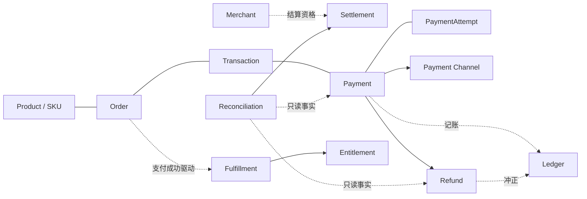
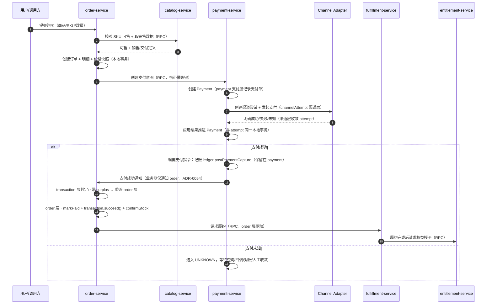
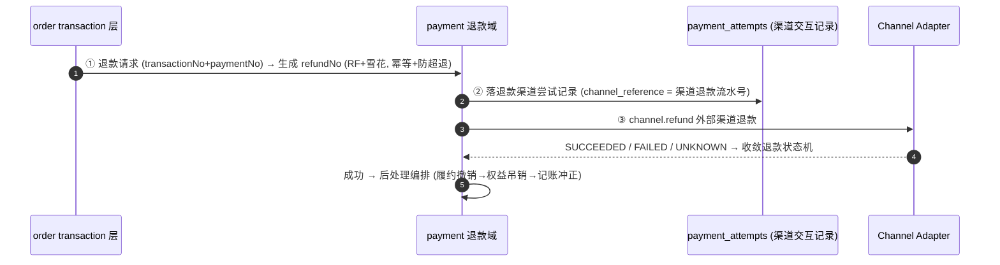
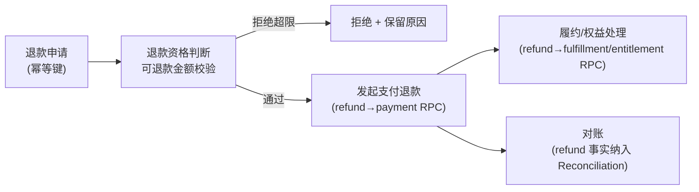

# PaymentArch 技术方案

**状态**：已确认，作为当前实现基线（综合性总体技术方案，指导后续所有 Feature）

**生效日期**：2026-08-26

**最近修订**：2026-09-14（文档治理：本方案收敛为**只描述系统现状** —— §2.4 范围裁剪精简、§7 计划精简并指向 `roadmap.md`、原 §9 ADR 追溯索引移出至 [docs/adr/traceability.md](../adr/traceability.md)（原 §10 顺延为 §9）、并入原 `project-structure.md` 为 §3.6；§3 重排 —— 原 §3.4「领域边界与数据架构」改写并上移为 §3.1，新增「3.1.1 领域模型」聚合根视图，其后原 §3.1~§3.3 顺延为 §3.2~§3.4）

**历史修订**：2026-08-31（2026-08-30 负责人裁决的**落地同步**：鉴权 / 验签 = 预留空函数；出站令牌 / 风控 / 脱敏 = 代码已删除；部分退款 = 代码已回退；退款金额校验口径新增 ADR-0047 —— 见 §2.4、§4.3.3）

**关联决策**：[ADR-0001](../adr/0001-adopt-spring-cloud-microservices.md)、[ADR-0002](../adr/0002-technology-stack.md)、[ADR-0006](../adr/0016-refund-decisions.md)、[ADR-0009](../adr/0024-risk-security-decisions.md)、[ADR-0011](../adr/0034-internal-token-decisions.md)

**权威来源**：本文是 Constitution（最高约束）、ADR（决策日志）、Spec 001（业务模型）在「当前系统」层面的**落地化综合**。本文不得与 [Constitution](../../.specify/memory/constitution.md) 冲突；若需调整领域边界、服务边界、状态机或数据层，属于 Constitution §8 人类决策边界，须另立 ADR / 提案并经人类确认。

> 本文是「全局」视角的技术方案。各子系统的字段级、状态机级、接口级细节见 [systems/](systems/) 下对应文档。

---

## 1. 背景与现状

### 1.1 项目定位

PaymentArch 是一个 **Production-Oriented 的 Commerce & Payment Platform**（Java / Spring Cloud 微服务），用于学习并实践支付、交易、履约、权益、对账、结算体系与高质量后端工程。**不是 CRUD Demo、不是玩具脚本。**

落地到工程，任何功能须同时满足八性（Constitution §1）：业务模型真实（Realistic）、架构合理（Sound）、工程完整（Complete）、可运行（Runnable）、可测试（Testable）、可观测（Observable）、可部署（Deployable）、可演进（Evolvable）。

### 1.2 当前现状（Phase 0 — Foundation）

- 架构基线已确认：**Spring Cloud 微服务**，按限界上下文划分（ADR-0001），技术栈 Java 21 + Spring Boot 3.x + MyBatis-Plus + Nacos + OpenFeign（ADR-0002）。
- 已建 **10 个服务模块 + 3 个共享库**（见 §3），`gateway` 不在本 MVP 范围；`ledger-service`（8090）已按 `004-ledger` 实现并接入 payment/refund/settlement 三处复式记账（ADR-0008~0011 已于 2026-08-29 Accepted）；2026-09-21 起（Feature 031，ADR-0077~0079）入站契约升级为 Accounting Event——调用方只报财务事实，科目与分录由账本 Posting Rule 决定（详见 `systems/ledger-service.md`）。
- 根 Maven 工程 `validate` 已通过；各服务有启动类与上下文测试，部分服务已有领域/应用/契约/集成测试。
- 当前 Feature `001-core-business-model` 已有 Spec/Plan/Tasks；业务主链路（下单→支付→回调/收敛→履约→权益）与资金闭环（对账→结算）**均已落地**，Ledger 复式记账已接入，形成完整业务闭环（roadmap 主链走至 `014-seckill-and-cache`）。
- **尚未引入**：真实支付渠道（当前 Mock Channel）、独立 MQ 中间件、API 网关、K8s/服务网格（Ledger 复式记账已按 `004-ledger` 前置实现；熔断组件 Resilience4j 已在 payment-service 引入并保留）。
- **已实现**：跨服务异步事件——以 **Redis 事务消息通道**实现（[ADR-0074](../adr/0074-redis-transactional-message.md#adr-0074) / spec 029，🟢 Accepted，2026-09-20 落地），不引入 MQ 中间件。

---

## 2. 目标

### 2.1 总目标

建立一个可运行、可测试、可观测、可部署、可演进的**真实支付/交易/履约/对账/结算技术基线**，在清晰边界内逐步扩展，而非一次性堆砌。

**首要态度**：宁可**正确地实现一个较小的范围**，也不做**范围大但不真实、不可验证的表面功能** —— 真实 > 全面。

### 2.2 最高优先级

**资金正确性 > 一切**：幂等、复式记账、未知状态不猜成败。其他优先级与冲突裁决见 Constitution §10。

### 2.3 非目标（MVP 明确不做）

- 不接真实支付机构、不做真实出款/入账（当前仅 Mock Channel + 模拟业务事实）。
- （注：Ledger 复式记账已按 `004-ledger` 前置实现，结算侧记账由 `007-settlement` 承接，详见 §4.3.5；本 MVP 仍不接真实出款/银行。）
- 不引入 MQ / Kafka / ES / K8s / Service Mesh / 2PC-XA（除非对应阶段有真实需要且经 ADR 论证）。**例外一：Redis 已随 `014-seckill-and-cache` 引入（ADR-0044/0045），仅用于入口幂等 / SKU 缓存 / 秒杀预扣 / 超时时间轮，非数据源**；**例外二：Redis 事务消息通道（ADR-0074 / spec 029，🟢 Accepted 已实现）——复用同一 Redis 实例的 Streams 承载跨服务通知，不引入任何 MQ 中间件，仍遵守「非数据源」定位；通道承载半消息/位点/DLQ，须开 AOF 且 `noeviction`（FR-501）**；熔断组件（Resilience4j）在 payment-service 已引入并保留（2026-09-04 裁决），缺独立 ADR（见 backlog #5），对账侧按 ADR-0021 明确不引入。
- 不做多币种清分、税费、复杂分账、多级商户、复杂风控平台。

**本阶段范围裁剪（2026-08-30 负责人裁决）**：以下能力**明确不做**，只保留预留挂点，落地形态与启用条件见 §2.4：

- 不做**出站内部服务令牌**（`X-Service-Token` 传播）—— 代码已清理（ADR-0034）。
- ⭕ **入站内部鉴权**（`/internal/**` 守卫）只**预留空函数**、恒放行，不推广到其余服务（ADR-0024 / 0035）。
- 不做**对外 API 鉴权 / 身份体系**（Spring Security、OAuth2、用户态 API Key）—— 预留空实现函数。
- 不做**部分退款**—— 本期只支持**全额退款**，代码已回退（§4.3.3 / ADR-0016）。
- 不做**敏感数据脱敏治理**—— 类与配置一并删除（ADR-0027）。
- 不做**风控规则与判定**—— `RiskCheckService` 已删除，不留挂点（ADR-0028）。
- ⭕ **渠道回调验签**只**预留空函数**、恒通过（ADR-0025）。

---

### 2.4 本阶段范围裁剪与预留契约

> 2026-08-30 负责人裁决的落地口径；相关 ADR 状态见 [ADR 索引](../adr/README.md)、落点见 [ADR 追溯索引](../adr/traceability.md)。

五类能力**明确不做或只留预留挂点**：

- **不做（代码已删）**：出站内部令牌（ADR-0034）、风控（ADR-0028）、敏感数据脱敏（ADR-0027）。
- **预留空函数、恒放行**：入站内部鉴权 `verifyServiceToken()`（ADR-0024）、渠道回调验签 `verifySignature()`（ADR-0025/0052）、对外 API 鉴权（ADR-0024）。
- **不做（代码已回退）**：部分退款 —— 单笔退款只回三态、成功恒为全额；`PARTIALLY_SUCCEEDED` 仅作不可达枚举保留（ADR-0016 / ADR-0047）。

**spec 030 新增预留挂点（2026-09-20）**：
- **已实现（非预留）**：支付宝异步通知验签 `AlipayGateway#verifyNotify` —— 走真实 RSA2 验签（`AlipaySdkGateway`），**不是**空实现；这是「接入真实渠道」这一前提成立后的对应实现。
- **仍恒放行**：渠道回调验签 `ChannelCallbackSignatureFilter#verifySignature`（ADR-0025/0052）**保持不变**（JSON 回调路径），与本 Feature 无关。
- **风险口径**：前者自带验签 + 语义校验，**不依赖「不暴露公网」**作为唯一保护（FR-297）；后者的既有风险敞口不变（ADR-0024/0025）。

**预留契约（防隐性故障源）**：「预留空实现」MUST 为纯 no-op、不干扰主流程、不得留下"假绿"（测试名与 Javadoc 显式标注空实现、留 `TODO(ADR-00xx)`），且**挂点位置单一明确**：

- 入站内部鉴权 → `payment-service/web/InternalServiceAuthInterceptor#verifyServiceToken`
- 渠道回调验签 → `payment-service/web/ChannelCallbackSignatureFilter#verifySignature`
- 对外 API 鉴权 → `payment-service/web/ResolveAuthorizationInterceptor`

**部署前置条件**：payment-service 不得暴露公网，仅内网 / VPC 可达；`/internal/**` 依赖网络层隔离。**当前伪造渠道回调可翻转支付状态，是已知且已被负责人接受的风险**；接入真实渠道或生产部署前 MUST 先补齐实现。

---

## 3. 总体架构设计

> 本节组织顺序：先划**领域边界与领域模型**（系统由什么组成、如何划分），再谈分层、模块职责、通讯协议与目录结构。

### 3.1 领域边界与数据架构

**领域边界（六条关键区分，Constitution §2.3）**：

| # | 区分 | 含义 |
|---|---|---|
| 1 | Order ≠ Payment | Order 是商业意图，Payment 是资金动作，独立生命周期与状态机 |
| 2 | Payment ≠ Channel | Payment 是编排层，Channel 是渠道技术适配；Payment 只依赖接口抽象 |
| 3 | Payment Success ≠ Entitlement Granted | 支付成功是财务事件，权益是消费权利，成功只「触发」授予 |
| 4 | Reconciliation ≠ Settlement | 对账是比对找差异，结算是资金划转，二者解耦 |
| 5 | Refund ≠ Payment Refund | Refund 是跨多领域编排，不是「调一次渠道退款」 |
| 6 | Fulfillment 不强耦合 Payment | 履约有自己的状态机，不被支付状态反向阻塞 |

#### 3.1.1 领域模型

模型按**聚合根（Aggregate Root）**组织：每个聚合根是不变式与事务的边界，聚合内一致性由本地事务保证；**跨聚合只经业务单号引用或公开 RPC**，禁止共享表 / 共享实体（[ADR-0023](../adr/0063-cross-service-reference-by-business-no.md)）。



| 聚合根 | 关键实体 / 值对象 | 归属服务 |
|---|---|---|
| Merchant | Merchant、Settlement Account（仅字符串引用） | merchant-service |
| Product | Product、Product Version | catalog-service |
| SKU | SKU、Price、Delivery Definition | catalog-service |
| Order | Order、Order Item、Price Snapshot | order-service |
| Transaction | Transaction、Transaction Relation | order-service |
| Payment（**payment 支付层**） | Payment、Payment Result、幂等键 | payment-service |
| Payment Attempt（**channelAttempt 渠道层**） | PaymentAttempt、Channel Reference、Error Type | payment-service |
| Payment Channel（**channelAttempt 渠道层**） | Channel / Adapter 实现族（接口 + 模块，不单独部署） | payment-service |
| Refund | Refund、Refund Item、Refund Decision | payment-service（退款域，见 [§8](systems/payment-service.md)） |
| Fulfillment | Fulfillment（按 `order_item_no` 明细粒度） | fulfillment-service |
| Entitlement | Entitlement、Grant、Consumption | entitlement-service |
| Ledger | AccountingEvent（入站契约）→ PostingRule → 两级科目（Definition/Instance）→ Posting、Entry（复式，借贷平衡）→ 余额投影/账期（ADR-0077~0079） | ledger-service |
| Reconciliation | Batch、Match、Difference | reconciliation-service |
| Settlement | Batch、Item、Adjustment | settlement-service |

> 各领域「负责 / 不负责」见 [§4.1](#41-领域职责)；**基数关系、状态机与金额铁律**见 [§4.2](#42-核心基数关系与状态机)。

**payment-service 内部的两层结构**（[ADR-0072](../adr/0072-two-layer-channel-architecture.md)）：payment-service 内部分 **payment 支付层**与 **channelAttempt 渠道层**，各有自己的聚合、表与写入口——`payments` 表只由 payment 层写（支付单生命周期 + 支付指令编排：选路 → 调渠道 → 记账 → 扇出 order）；`payment_attempts` 表只由渠道层写（渠道交互生命周期 + 渠道实现族 Alipay / Wechat / Douyin / Mock）。payment 层经 `PaymentChannel` 端口调用渠道层，**不关心渠道如何实现**（`Payment ≠ Channel`）。两层**共享同一本地事务**——分层是**职责切分**，不是分布式拆分、不是拆数据源。

#### 3.1.2 依赖方向与数据所有权

**依赖方向**：领域依赖 MUST **单向、向内**——编排层（Order/Payment/Refund）可依赖底层领域，底层领域不得反向依赖编排层；`Ledger` 只被依赖；`Channel` 只依赖外部协议。

**数据所有权**：每服务独占自己的 Schema（`merchant` / `catalog` / `order` / `payment` / `refund` / `fulfillment` / `entitlement` / `reconciliation` / `settlement`；实际命名以 [deployment/schema/](../../deployment/schema/) DDL 为准；`merchant` 无独立数据源，使用内存 `ConcurrentHashMap`）。跨服务读写一律经对方公开 API/RPC，**禁止**任何服务直接 SQL 他服务 Schema 的表。单机/Compose 阶段多服务可共用一个物理库，但必须独立 Schema。

### 3.2 分层架构


> 该图的 PlantUML 源码：[diagrams/01-system-architecture.puml](diagrams/01-system-architecture.puml)（供 AI 阅读与后续编辑，改动后需重新渲染为 SVG）

- **接入层**：`gateway` 作为统一入口/鉴权/限流，本 MVP **延后**（虚线）；当前调用方直连各服务暴露的 REST。
- **编排层**：order / payment / refund 承接业务意图并编排跨域流程（§3.3），可调用下游；独立进程、独立端口、独立部署单元。
- **执行层**：catalog / fulfillment / entitlement 自持状态机，**不得反向依赖编排层**。
- **资金层**：ledger / reconciliation / settlement / merchant 承载账务事实、核对与结算。其中 `ledger-service` 已按 `004-ledger` **前置实现**（原定 Roadmap Phase 8），只被依赖、不调用任何业务服务。
- **数据层**：MySQL 8.0，Database-per-Service 的**访问边界**（§3.1）；Nacos（注册 + 配置）为 `[目标]`，生产启用前本地直连。

> **注**：reconciliation / settlement 对 payment / refund 的依赖是**只读事实抽取**（读已确认业务事实，不回写、不修改），不构成对编排层的反向业务依赖，不违反 §3.1 的单向依赖原则。

### 3.3 核心模块职责

| 服务 | 负责领域 | 核心职责 | 状态 |
|---|---|---|---|
| gateway | 接入层 | 统一入口、路由、鉴权、限流 | 延后 |
| merchant-service | Merchant | 商户注册、资质、结算账户 | 已实现 |
| catalog-service | Product / SKU | 商品、SKU、价格、可售性 | 已实现 |
| order-service | Order / Transaction | 订单、明细、价格快照、交易状态机 | 已实现 |
| payment-service | Payment + Channel | 支付编排、幂等、渠道适配、回调、UNKNOWN 收敛 | 已实现 |
| ~~refund-service~~ | Refund | **Feature 015 已并入 `payment-service`**（`com.payment.refund` 包，端口 8085 退役）；退款编排（渠道退款 + 权益撤销 + 对账）由 payment-service 提供 | 已并入（ADR-0016/0017/0018，[ADR-0064](../adr/0064-multi-payment-per-transaction.md)） |
| fulfillment-service | Fulfillment | 履约、发货 | 已实现 |
| entitlement-service | Entitlement | 权益授予 / 撤销 / 查询 | 已实现 |
| ledger-service | Ledger | 复式记账（资金核心；031 起记账决策权归账本） | 已实现（`004-ledger` 前置 + `031` 重构，8090） |
| reconciliation-service | Reconciliation | 异步对账（状态机全链路；032 起渠道账单为导入对象——SHA-256 指纹幂等 + typed 三级匹配 + 差异台账拆表 + 渠道资金事实入账 CHANNEL_SETTLEMENT/CHANNEL_FEE） | 已实现（ADR-0019/0020/0021 + 032/ADR-0080） |
| settlement-service | Settlement | 结算批次、调整项、已确认事实闸门、收敛/关闭与结算侧记账（不真实出款） | 已实现（ADR-0022/0023 缺口补齐） |

> Channel 不单独成服务：以「接口 + 模块」内聚在 payment-service（`application/channel` 接口 + `infra/channel` 实现），落实 Payment ≠ Channel。

> **状态列口径**：上表基于本文 2026-08-26 基线。`ledger-service` 已按 `004-ledger` 前置实现并接入 payment 侧记账；refund / reconciliation / settlement 的进展以 [roadmap.md](roadmap.md) Current Status 与 `docs/specs/005~007` 为准，本文相关表述待下次基线刷新时统一修订。

### 3.4 系统间通讯协议

- **服务内**：本地事务保证原子。
- **跨服务（同步）**：统一走**公开的同步 HTTP/RPC 用例**（Spring Cloud OpenFeign + LoadBalancer），契约 DTO 集中在 `common-dto`。适用于**必须取返回值**的查询与命令（查 SKU 价、建支付单取 paymentNo、发起退款取 refundNo）。
- **跨服务（异步）**：**Redis 事务消息通道**（[ADR-0074](../adr/0074-redis-transactional-message.md#adr-0074)，spec 029，🟢 Accepted 已实现）。用 `redis:7` 的 Streams 承载，实现半消息（prepare → 本地事务 → commit/rollback → 5s 回查真相表）语义；消费语义 at-least-once，重复由下游幂等吸收。落点：`common/common-redis-mq` starter + 五服务 `{service}/mq` 包；键名契约见 `MqKeys`（`mq:stream:{topic}` / `mq:half:*` / `mq:dlq:{topic}`）。`payment.mq.enabled=false` 回落同步 Feign（FR-306）。
  - **适用**：事实已发生、下游可幂等的**通知/扇出**（支付成功 → 库存确认 / 履约；退款成功 → 回补 / 终止履约；订单取消 → 释放库存 / 拒收支付）。
  - **不适用**：必须取返回值的命令，以及**记账链路**（payment→ledger、refund→ledger、settlement→ledger 维持同步——借贷平衡审计对顺序敏感，且有 T+1 账证核对兜底）。
  - **拓扑**：混合。`payment.succeeded` 点对点（order 做事实判定与明细富化，ADR-0066）；`order.paid` / `refund.succeeded` / `order.cancelled` **广播**（多个消费者组各自独立位点）；`fulfillment.completed` / `fulfillment.revoked` 点对点。
  - **定位**：仅作通知与解耦，**不承载资金事实真相**（ADR-0031 约束继承）；Redis 非数据源（ADR-0045），全丢时系统仍正确，只是需人工重放。
  - **链路追踪**：traceId 写入事件信封并在消费端恢复进 MDC，保证跨异步边界连续（ADR-0074 D14）。
- **对外渠道**：通过 Channel Adapter 抽象与第三方交互（当前 Mock Channel）。
- **后置流程**：当前由负责方通过公开同步 RPC 调用下游，失败不回滚前序事实，依靠幂等重试、查询/对账和人工收敛完成最终一致。跨领域调用不要求一次请求完成全链路。

### 3.5 技术栈

| 维度 | 选择 | 说明 |
|---|---|---|
| 语言 / JDK | Java 21 LTS | Spring Boot 3.x 全面支持 |
| 框架 | Spring Boot 3.x + Spring Cloud | 主流企业级 |
| 构建 | Maven（mvnw Wrapper 锁版本） | 父 POM + `dependencyManagement` 统一版本 |
| ORM | MyBatis / MyBatis-Plus | SQL 显式可控，适合资金/对账复杂查询 |
| 注册 + 配置 | Nacos | 同时提供注册与配置能力（**[目标] 未启用**，0 依赖 0 配置，见 ADR-0056） |
| 服务调用 | Spring Cloud OpenFeign + LoadBalancer | 声明式服务间调用 |
| API 网关 | Spring Cloud Gateway | 响应式网关（本 MVP 延后启用） |
| 熔断 | Resilience4j 或 Sentinel | 延迟到需要时再引入 |
| 可观测 | Micrometer + Micrometer Tracing | 指标与链路追踪（**[目标] 未落地**：当前 0 依赖，实际为 `TraceIdFilter` + MDC，见宪法 §Obs.3） |
| 测试 | JUnit 5 + Mockito + AssertJ；Testcontainers | 集成测试用容器（**[目标] 未落地**：实际全 H2 MySQL 兼容模式，见 backlog。⚠️ spec 030 / T131：B1/B7 **并发**用例在 H2 上**可能假绿**，需 Testcontainers-MySQL 真库） |
| 代码质量 | Checkstyle + Spotless | CI 强制（**[目标] 未落地**：根 pom 与 CI 均无插件） |
| 第三方 SDK | 支付宝 `alipay-sdk-java`（沙箱渠道） | spec 030 / [ADR-0076](../adr/0076-traffic-dyeing-and-alipay-sandbox.md)：**端口收口**——只允许 `infra/channel/alipay/AlipaySdkGateway` 一个类 import SDK 的 **Java 包 `com.alipay.api`**（⚠️ Maven 坐标是 `com.alipay.sdk:alipay-sdk-java`，门禁匹配的是包名，写错会空转；ArchUnit 构建期强制 + 阳性对照，INV-7）；SDK 供应链风险已显式接受 |

### 3.6 项目目录结构（Maven 多模块单仓库）

采用**单一 Git 仓库 + Maven 多模块**：一个父 POM 统一管理版本与依赖，每个服务一个 Maven 模块，共享代码抽为 `common-*`。

```text
PaymentArch/
├── pom.xml                      # 父 POM：dependencyManagement 统一版本
├── mvnw / mvnw.cmd              # Maven Wrapper（锁定 Maven 版本）
├── AGENTS.md                    # AI 编码代理指令（唯一事实源；CLAUDE.md 为兼容指针）
├── README.md / CHANGELOG.md / VERSION
├── docs/                        # 工程文档（见 docs/README.md）
│   ├── architecture/            # 总体技术方案、模块结构、Roadmap、systems/、AI 预研
│   │   └── systems/             # 每服务一篇系统设计
│   ├── adr/                     # 架构决策（索引 README + 落点追溯 traceability）
│   ├── guides/                  # 三规范：AI 流程 / 技术流程 / 业务流程
│   ├── operations/              # 运维手册、代码债清单、拆分模板
│   ├── design/                  # 演示页设计系统
│   ├── specs/                   # Feature 文档（Spec/Plan/Tasks）
│   └── archive/audits/          # 归档审计报告
├── .specify/                    # Spec Kit：宪法、模板、脚本、工作流
├── common/                      # 共享库（被依赖，不独立部署）
│   ├── common-core/             # 通用工具、异常、统一返回体、结果码、可观测
│   ├── common-dto/              # 跨服务 RPC DTO
│   └── common-mybatis/          # MyBatis 通用配置、拦截器、审计字段
├── merchant-service/            # 商户
├── catalog-service/             # 商品 / SKU（含 SKU 缓存 + Redis）
├── order-service/               # 订单 / 交易（幂等键 + 超时库存释放）
├── payment-service/             # 支付编排 + 渠道适配 + 退款（com.payment.refund，8084）
├── fulfillment-service/         # 履约
├── entitlement-service/         # 权益
├── reconciliation-service/      # 对账 + 会计审计中心
├── settlement-service/          # 结算
├── ledger-service/              # 复式记账（资金核心，8090）
└── deployment/                  # 非领域组件：mock-channel-web(8091)、e2e-tests、architecture-tests、demo、performance、schema、output
```

> `gateway` 本 MVP **不创建**（接入层延后，见 §3.2）；`refund-service` 已并入 `payment-service`（Feature 015）。测试 / 演示 / 压测组件一律收口在 `deployment/`（见根 [AGENTS.md](../../AGENTS.md)「目录与产物纪律」）。

**单服务内部分层**（包根 `com.payment.<service>`）：

```text
<service>/src/main/java/com/payment/<service>/
├── <Service>Application.java   # 启动类
├── api/                        # 对外接口层：Controller + DTO + 入参校验
├── application/                # 应用服务层：用例编排、事务边界、RPC 客户端
│   └── channel/                # 渠道接口（Payment ≠ Channel 边界）
├── domain/                     # 领域模型：实体、值对象、领域服务、状态机
├── infra/                      # 基础设施：Repository、MyBatis mapper、RPC 客户端
│   └── channel/                # 渠道具体实现（Mock/支付宝/微信等适配器）
└── config/                     # 装配配置
```

**分层依赖方向（单向）**：`api → application → domain ← infra`。`domain` 不依赖任何层；`infra` 实现 `domain` 声明的仓储接口（依赖倒置）。禁止 `domain` 反向依赖 `infra` 或 `api`。

**关键约定**：

1. **包名**：统一 `com.payment.<service>.<layer>`，禁止在 `com.payment.common` 之外随意新建顶层包。
2. **渠道适配**：`application/channel`（接口）与 `infra/channel`（实现）分离，落实 Payment ≠ Channel。
3. **common 模块**：只放**跨服务共享**的稳定契约（DTO、事件、结果码），不放业务逻辑。
4. **不建空模块**：一个服务只在对应阶段启动时才创建，避免空壳目录。
5. **文档分层（Diátaxis）**：架构 / ADR / 指南 / 运维 / Spec 分目录；权威决策以 [docs/adr/README.md](../adr/README.md) 跳转表与 [traceability.md](../adr/traceability.md) 为准。
6. **账本唯一事实源**：所有资金变动经 `ledger-service`（8090），业务服务不得自记资金（ADR-0008）。

---

## 4. 详细功能和流程设计

### 4.1 领域职责

| 领域 | 解决的问题 | 不负责的问题 | 核心实体 | 核心状态 |
|---|---|---|---|---|
| Merchant | 谁可经营商品、接收交易并参与结算 | 订单、支付执行、履约、对账差异 | Merchant、Settlement Account | 待审核 → 有效 → 暂停/终止 |
| Product | 面向用户与商家的商品概念与生命周期 | 销售价格快照、订单、支付 | Product、Product Version | 草稿 → 上架 → 下架 → 归档 |
| SKU | 哪个具体销售单元可被购买、以何属性交付 | 订单金额确认、支付状态 | SKU、Price、Delivery Definition | 草稿 → 可售 → 暂停 → 失效 |
| Order | 用户买什么、向谁买、订单金额与购买生命周期；支付成功后的订单侧动作（markPaid/confirmStock/履约驱动，ADR-0054） | 渠道协议、资金收取、退款执行 | Order、Order Item、Price Snapshot | 待确认 → 待支付 → 已支付 → 履约中 → 已完成/取消/关闭 |
| Transaction | 商业交易如何关联订单与支付、是否完成；交易动作编排（正常/surplus 判定 + 自动退款发起，ADR-0054） | 渠道通信、履约交付、权益管理、退款执行 | Transaction、Transaction Relation | 待处理 → 处理中 → 成功/失败/取消/未知 |
| Payment | 一次资金收取意图与支付尝试的生命周期；支付指令编排（渠道支付 + 记账，记账保留在 payment，ADR-0054） | 商品、履约、具体渠道协议、退款决策与发起 | Payment、Payment Attempt、Payment Result | 待支付 → 处理中 → 成功/失败/未知 → 已关闭 |
| Payment Channel | 如何与外部支付机构交互并解释其结果 | 平台订单、履约、权益、最终业务判断 | Channel、Channel Attempt、Channel Reference | 可用 → 不可用/停用 |
| Refund | 为什么退、退多少、是否可退、退款整体进度 | 单独替代支付退款、履约撤销、对账 | Refund、Refund Item、Refund Decision | 申请中 → 处理中 → 成功/部分/失败/未知/拒绝/关闭（**本期只做全额退款，「部分」不开放，见 §2.4**） |
| Fulfillment | 如何交付商品或服务、交付是否完成 | 支付结果确认、权益内部生命周期 | Fulfillment、Fulfillment Item、Delivery | 待履约 → 履约中 → 已交付/部分/失败/取消 |
| Entitlement | 用户获得什么消费权利、如何用与撤销 | 判断是否已付款、渠道退款 | Entitlement、Grant、Consumption | 待授予 → 可用 → 部分/已用尽 → 过期/撤销/失败 |
| Reconciliation | 平台事实与外部事实是否一致、差异如何处理 | 资金划转、修改原始交易事实 | Batch、Match、Difference | 待处理 → 对账中 → 一致/有差异 → 处理中/关闭 |
| Settlement | 商户应结算多少、批次是否完成 | 发现全部原始差异、代替支付成功判断 | Batch、Item、Adjustment | 待结算 → 计算中 → 待执行 → 执行中 → 成功/失败/未知/关闭 |

### 4.2 核心基数关系与状态机

**MVP 基数关系**：

```text
Order (1) ───── (1) Transaction (1) ───── (N) Payment ───── (1+N) PaymentAttempt
   │                                                                  │
   └─ Order Items / Price Snapshots        PAYMENT 1 + REFUND N；每次尝试 ≤ 1 个渠道引用
```

> **基数修订**：`Transaction : Payment = 1:N`（ADR-0064：一交易多支付单，用户每选一个支付方式即新建一张支付单，`payments.attempt_seq` 区分）；
> `Payment : PaymentAttempt = 1:1（支付尝试）+ 1:N（退款尝试）`——`payment_attempts` 以 `attempt_type` 区分 `PAYMENT` / `REFUND`
> （Feature 016 / FR-017），同一 `payment_no` 可有 **1 条 PAYMENT 尝试 + N 条 REFUND 尝试**，故整体记为 **`1+N`**
> （图式中 `Payment ── (1+N) PaymentAttempt` 即此意）。渠道重试在同一 attempt 行内 `retry_count` 递增、**不新建行**（ADR-0054）。
>
> **口径一致性**：本表述与 [systems/payment-service.md §2.3](systems/payment-service.md#23-表结构与索引策略) 的
> `payment_attempts` 说明同源——**`attempt_type` 是两类尝试的唯一区分维度**；任一侧修改基数口径时另一侧 **MUST** 同步。
>
> ⚠️ **ADR-0054 原文的「`payment_no : payment_attempts = 1:1`」已过时**：该约定写于退款尝试复用本表（Feature 016）之前，只覆盖支付尝试。引用时须按本行的修订口径理解。

**核心状态机**（领域自持，集中状态转换函数，禁止散落 set）：

| 实体 | 允许的状态流 |
|---|---|
| Order | 待确认 → 待支付 → 已支付 → 履约中 → 已完成；取消/关闭仅当业务允许 |
| Transaction | 待处理 → 处理中 → 成功/失败/取消/未知 |
| Payment | 待支付 → 处理中 → 成功/失败/未知 → 已关闭 |
| PaymentAttempt | 待处理 → 已受理 → 成功/失败/未知 |
| Fulfillment | 待履约 → 履约中 → 已交付/部分交付/失败/取消 |
| Entitlement | 待授予 → 可用 → 部分使用/已用尽 → 已过期/已撤销/失败 |
| Refund | 申请中 → 处理中 → 成功/部分成功/失败/未知/拒绝/关闭（**部分成功本期不开放**，见 §2.4 #6） |
| Reconciliation | 待处理 → 对账中 → 一致/有差异 → 处理中/关闭 |
| Settlement | 待结算 → 计算中 → 待执行 → 执行中 → 成功/失败/未知/关闭 |

**金额铁律**：金额一律用最小货币单位（`long` 分）+ 独立 `currencyCode` 字段，或 `BigDecimal`（明确 scale）；`Money` 值对象**不启用**（ADR-0010，已由 Constitution v2.3.0 追认）；全库禁止 `float`/`double`；任何真实资金变动须经 Ledger 复式记账。

### 4.3 核心业务流程

> **异步化改造（spec 029 / [ADR-0074](../adr/0074-redis-transactional-message.md#adr-0074)，🟢 Accepted 已实现）**
> 本节时序中「订单/支付**同步 RPC 通知**下游」的步骤，将改为「**本地事务提交后发布事件，下游各自订阅消费**」。改造只影响**通知通道**，不改变任何状态机语义、幂等口径与事实不回滚原则。
>
> | 原同步通知 | 改为事件 | 生产方 | 订阅方 |
> |---|---|---|---|
> | payment → order 支付成功 | `payment.succeeded` | payment | order（点对点） |
> | order → catalog 确认库存 | `order.paid` | order | catalog（广播） |
> | order → fulfillment 驱动履约 | `order.paid` | order | fulfillment（广播） |
> | payment → order 退款结果 | `refund.result` | payment | order（点对点） |
> | order → catalog 秒杀回补 | `refund.succeeded` | order | catalog（广播） |
> | order → fulfillment 终止履约 | `refund.succeeded` | order | fulfillment（广播） |
> | 关单后（当前无任何通知） | `order.cancelled` | order | catalog / payment / fulfillment（广播） |
> | fulfillment → entitlement 授予·回收 | `fulfillment.completed` / `fulfillment.revoked` | fulfillment | entitlement（点对点） |
>
> **记账三条（payment/refund/settlement → ledger）维持同步**，理由见 §3.4。
> **已落地（2026-09-20）**：本节时序图按真实代码同步如下——「同步 RPC 通知」的箭头一律替换为
> 「本地事务提交 → 发布事件 → 订阅方各自消费」；生产/消费代码位于各服务 `{service}/mq` 包，
> 通道实现于 `common/common-redis-mq`。状态机语义、幂等口径与「事实不回滚（INV-1）」均未变。
> 回查真相表判据见 [order-service §3.5](systems/order-service.md) 与 [payment-service §3.10](systems/payment-service.md)。
#### 4.3.1 购买主链路



> 当前实现：payment 仅通知 order；order 的 transaction 层判定正常到账或 surplus，order 层推进订单/交易并确认库存、请求 fulfillment；payment 保留支付/退款记账和渠道事实处理。

#### 4.3.2 支付回调与 UNKNOWN 收敛

渠道通知**可能重复、乱序、延迟**到达。payment-service 依据「渠道交易引用 + 支付尝试」幂等吸收重复通知，不回退已确认的合法状态；终态成功不被后到的失败回调覆盖。回调只更新 Payment/PaymentAttempt；payment 完成自身支付指令编排（含记账，保留在 payment 内）后，**业务侧仅通过同步 RPC 通知 order-service**，由 order 编排下游（回写订单/交易状态、履约触发），不直接改写其他领域内部数据。

渠道超时/断连/响应不完整时，Payment/Refund **进入 UNKNOWN**（不是失败别名）。收敛路径：主动查询接口、后续回调、对账、人工处理；在未收敛前**不得重复执行不可确认的资金动作**。

**支付宝异步通知端点（spec 030 / FR-201~FR-213，✅ 已实现）**：`POST /internal/channels/alipay/notify` 走**三段式校验**——① 验签（RSA2，失败 ⇒ **403** 且**不触达**收敛，INV-10）→ ② 渠道引用归属（防串号）→ ③ 金额 / 币种。响应体 **MUST 恰好**为纯文本 `success`；校验失败返回非 `success` 触发渠道重试，并留下**三件套**（不推进 + 指标 `payment.notify_rejected` + `FINANCIAL_AUDIT`），**缺一不可**。收敛**复用**既有 `PaymentCallbackService.handleCallback`（终态吸收 / 乱序 / 幂等），**不新建链路**。状态映射与查询路径同口径（`WAIT_BUYER_PAY` ⇒ UNKNOWN **不推进**）。

> 两条回调路径（JSON `/internal/payments/{no}/channel-callback` 与支付宝 notify）**收敛语义一致**，差异仅在报文形态与验签层位（SC-B2-06，`PaymentCallbackPathParityTest` 锁定）。

> **决策记录（Feature 003 / ADR 集合 `docs/adr/0003-payment-reliability-decisions.md`）**：
> - 超时进 UNKNOWN、主动查询收敛、有限重试、终态冲突策略（迟到成功不覆盖已失败）已 **Accept**（ADR-0003/0004/0005/0007）。
> - **人工收敛端点（原 ADR-0006 / spec US4）已实现**：`POST /payments/{id}/resolve` + `ResolveAuthorizationInterceptor`（未配置 `PAYMENT_ADMIN_TOKEN` 时返回 503 拒绝，不放行），详见 `runbook.md`。高危资金操作由 admin-token 守卫 + 审计日志兜底；完整权限体系仍待路线图 Phase 9 统一建设。自动收敛（主动查询 + 超时 + 重试）覆盖绝大多数 UNKNOWN，剩余保持 UNKNOWN 依赖对账流程兜底（ADR-0007）。

#### 4.3.3 退款链路

**退款编排三步链**（负责人 2026-09-06 明确，ADR-0054 / spec 016 FR-017）：



- 常规退款入口与 surplus 自动退款共用此链（发起方不同：用户申请 vs order transaction 层）。order/transaction 生成 `TXRF`，payment 生成 `PMRF` 执行单并互记；payment 持有渠道退款尝试和真实 `channel_reference`，退款终态经统一后处理通知 order 收口。



**本期范围：单笔退款无「部分成功」，只支持「整笔全额」结果**（§2.4 #6，2026-08-30 负责人裁决；金额校验口径见 **ADR-0047**）：

- **单笔退款只有两种终局：全额成功或失败**。渠道只回 `SUCCEEDED / FAILED / UNKNOWN` 三态，成功即视为该笔申请额全额退回；若真实发生部分退回，按 `UNKNOWN` 处理并走对账收敛，**不得**落 `PARTIALLY_SUCCEEDED`、不记 `refundedAmountMinor`。
- **不做**「申请额 = 可退全额」的等值校验（ADR-0047 决策）：`RefundPolicy.decide` 只做三条校验——币种一致 / 金额为正 / **累计申请额 + 本次申请额 ≤ 已支付金额**（H1 防超退，超额 `REJECTED` 且不发起渠道尝试）。同一支付**允许多笔退款**（每笔独立幂等键），由 `refund_intake_locks` 行锁串行化受理。
  > **为何不强制全额等值**：`001-core-business-model/spec.md` 第 66–67、289 行明确「退款默认支持部分退款和多次退款，累计不得超过已支付且尚未退款金额」，强制等值会与这条已 Accepted 的基线冲突，并使现有防超退测试（300 + 400 + 400 / paid=1000）失效。取舍全记录见 [ADR-0047](../adr/0016-refund-decisions.md#adr-0047-退款金额校验口径adr-0016-回退后是否强制申请额--可退全额)。
- `RefundStatus.PARTIALLY_SUCCEEDED` 与 `partiallySucceed()` 仅作为**状态机枚举/方法保留**，本期无任何入口可到达该状态（枚举删除会导致历史行 `valueOf` 抛异常，故保留）。
- 后续若要开放**单笔退款的部分成功追踪**，须先解决：退款单与支付尝试的拆分模型、多次退的累计口径、权益/履约的按比例回收、Ledger 冲正的部分金额分录 —— 属 Constitution §8 人类决策边界，须另立 ADR。

#### 4.3.4 履约与权益

`PaymentSucceeded`（Payment 服务内部事实）→ payment 业务侧仅通知 **order-service**（ADR-0054）；由 order transaction 层判定「正常到账 / surplus」后**委派 order 层**执行 markPaid + confirmStock 并通过 RPC 请求 fulfillment-service 履约（**confirmStock 与履约驱动属 order 层**）；履约完成后再请求 entitlement-service 授予权益（`fulfillment → entitlement` 链保留）。支付成功只**触发**履约，不决定履约最终状态；履约失败不回写支付为失败；权益授予失败保留履约事实、可重试/人工补发，不重复扣款。重复/超额支付（surplus）由 order transaction 层以 `transactionNo + paymentNo` 发起自动退款（payment 仅执行）。

#### 4.3.5 资金闭环：记账、对账与结算

资金链路只有一条准入门槛：**未确认的事实不得进入账务与结算**。


> 该图的 PlantUML 源码：[diagrams/03-funds-closed-loop.puml](diagrams/03-funds-closed-loop.puml)（供 AI 阅读与后续编辑，改动后需重新渲染为 SVG）

**复式记账映射**（`ledger-service`，四个预置科目，MVP 仅 CNY）：

| 场景 | 借方 DEBIT | 贷方 CREDIT | 平衡 |
|---|---|---|---|
| 支付成功（金额 A，手续费 F，净额 N = A − F） | `CUSTOMER_CASH` A | `MERCHANT_PAYABLE` N ＋ `PLATFORM_FEE_REVENUE` F | A = N + F |
| 退款成功（实退金额 R） | `MERCHANT_PAYABLE` R | `CUSTOMER_CASH` R | 与支付方向相反 |
| 结算批次（净额 S） | `MERCHANT_PAYABLE` S | `SETTLEMENT_PAYABLE` S | 借贷相等 |

- **记账**：仅对**已确认**的支付/退款/结算事实记账，`UNKNOWN` / 处理中 / 失败 / 拒绝**一律不记账**（Constitution §V.7）。幂等键 `PAYMENT:<key>` / `REFUND:<key>` / `SETTLEMENT:<batchId>` 保证重复请求只产生一份分录；借贷不平衡由 Posting 聚合根强校验拒绝，不落任何分录。记账 RPC 失败**不回滚**业务事实，记 `ledger.posting_failed` 并进入「待记账」清单由对账补齐。
- **对账与审计**：reconciliation-service 读取已确认的 Payment/Refund/Ledger/Settlement 事实，基础对账之外执行账证、账账、账实、账表四类 Audit，产生差异并通过挂账/调账/recheck/close 收口。挂账使用 `SUSPENSE` 过渡科目，调整通过 ledger 平衡、append-only 分录完成，绝不修改原始 Payment/Refund/Settlement 事实。
- **结算门禁**：settlement-service 建批前调用 reconciliation 的 `settlement-gate`；阻塞差异拒绝建批，已确认且可解释或已隔离的事实才进入 `ConfirmedFactGate` 和结算计算。
- **结算**：settlement-service 只消费「已确认且差异可解释」的财务事实（校验商户结算资格 → 净额计算 → 生成结算批次）。同一商户周期不重复生成批次；未知执行结果不等于成功。
- **分录不可变**：已提交分录禁止 UPDATE/DELETE，更正只能新增反向分录（冲正）。

> **注**：`ledger-service` 已按 `004-ledger` **前置实现**（原定 Roadmap Phase 8），设计决策见 [ADR-0004](../adr/0008-ledger-design-decisions.md)；§2.3 非目标中「不实现 Ledger 复式记账」的表述应以 Roadmap Current Status 为准。

#### 4.3.6 典型跨服务调用

```text
order-service → catalog-service               校验 SKU + 取销售数据
order-service → payment-service               创建支付意图
payment-service → Channel Adapter             发起支付 / 查询渠道结果
payment-service → ledger-service              支付/退款记账（支付指令编排的一部分，保留在 payment）
payment-service → order-service               支付成功通知（业务侧仅通知 order，ADR-0054）
order-service → fulfillment-service           支付成功后由 order 层请求履约（ADR-0054）
fulfillment-service → entitlement-service     履约完成后请求权益授予
order-service → payment-service               退款命令（surplus 自动退款，transactionNo+paymentNo，ADR-0054）
payment-service（refund 包）→ 渠道            退款渠道尝试（进程内，Feature 015 起退款域并入 payment）
reconciliation-service → payment-service      读已确认支付/退款事实
settlement-service → merchant/reconciliation  校验结算资格 + 生成结算批次
```

> 当前链路：order→fulfillment 由 order 层请求，order/transaction→payment 发起退款命令；payment→order 通过退款结果通知完成收口。

### 4.4 一致性模型（幂等 / 状态机 / 重试 / UNKNOWN）

| 机制 | 落地 |
|---|---|
| **幂等** | 支付、退款、结算等资金入口 MUST 有幂等键；幂等键由调用方提供、服务端持久化并唯一约束；同键重复请求返回同一业务结果，不产生重复资金动作 |
| **状态机** | Order/Payment/Refund/Fulfillment/Entitlement/Settlement 均显式、单向；状态流转集中在状态转换函数，禁止散落 set |
| **本地事务** | 单服务内部状态变更用本地事务保证原子 |
| **最终一致** | 跨服务通过同步 RPC 编排 + 幂等重试实现最终一致；对外部系统（渠道）采用最终一致；当前未实现跨服务异步事件通道，ADR-0074 / spec 029 保持 Active Proposal；资金事实仍以 ledger DB 为准，差异由对账兜底 |
| **重试** | 仅对幂等的外部调用允许自动重试，须有退避与上限；非幂等调用禁止盲目重试 |
| **重复消息/回调** | 处理侧假设消息与回调会重复，靠幂等键 + 状态机幂等吸收，不重复入账 |
| **超时** | 所有外部调用有超时；超时 ≠ 失败/成功，进入未知状态 |
| **UNKNOWN** | 结果不确定时不猜成败直接落账，靠查询/对账/人工收敛 —— 支付系统最核心的正确性保障 |

**「渠道事实 / 平台事实可合法不一致」口径**（终态吸收的解释）：

渠道侧事实（`payment_attempts` 记录的渠道结果、渠道交易号、渠道状态）与平台侧事实（`payments.status`）是
**两套不同主体各自认定**的事实，**允许在一段时间内不一致**，这不是数据缺陷而是**分布式协作的固有形态**：

| 场景 | 渠道事实 | 平台事实 | 是否合法 | 处置 |
|---|---|---|---|---|
| 渠道受理、买家未付款 | 已受理（`WAIT_BUYER_PAY`） | `PROCESSING` | ✅ 合法 | 等回调（凭证非空即停 `PROCESSING`，INV-6） |
| 回调先于主动查询到达 | 成功 | `PROCESSING` → `SUCCEEDED` | ✅ 合法 | 回调收敛 |
| 渠道成功但平台记账未完成 | 成功 | `SUCCEEDED` | ✅ 合法 | 记账失败**不回滚**支付成功事实（只记指标 + ERROR 日志，ADR-0009） |
| 渠道返回 `UNKNOWN` | 未知 | 维持 `UNKNOWN` | ✅ 合法 | **不推进**；等主动查询 / 人工 `resolve` |
| 终态后再收到相反回调 | 失败（迟到） | 仍 `SUCCEEDED` | ✅ 合法 | **终态吸收**：终态成功不被后到的失败回调覆盖 |

**纪律**：一致性**不靠「让两边立刻相同」达成**，而靠
① **单向收敛**（只从非终态 → 终态，终态不可逆）；
② **权威来源优先**（渠道明确结果 > 平台推测）；
③ **差异可发现**（对账 / 审计 / 指标），而非「静默抹平」。
**MUST NOT** 为了让两边「看起来一致」而回退已确认的平台终态，也 **MUST NOT** 把渠道超时自动终态化为 `FAILED`（INV-9 / 宪法 §V.7）。

### 4.4.1 Payment Limit（当前支付入口能力）

payment-service 当前提供用户日/月/年支付限额能力。限额属于支付事实边界，不新增服务：配置、周期用量和幂等操作分别落在 `user_payment_limits`、`user_limit_usage`、`limit_operations` 三张 payment Schema 表中。

- 建单前执行 `RESERVE`，支付成功执行 `CONFIRM`，失败/关闭执行 `RELEASE`，TTL 到期执行 `EXPIRED`；重复回调和补偿重跑由状态机终态吸收与操作唯一键共同保证幂等。
- `used_minor` / `pending_minor` 的权威数据在 MySQL；超限返回 `409 LIMIT_EXCEEDED`，且支付单不创建。
- Redis 仅作为在途预占的 TTL 索引，不参与额度计数；Redis 不可用时保守保留占用，不阻断支付事实写入。

### 4.5 分布式事务处理策略

**不使用 2PC/XA 分布式事务**。跨服务资金流转用 **Saga + 同步 RPC + 幂等** 实现最终一致：

- 每个服务只在自己的本地事务内原子提交自身事实（如 Payment 成功只在 payment-service 内落库）。
- 跨服务副作用通过幂等的同步 RPC 逐段推进（支付成功 → 履约 → 权益），每段失败**不回滚前序已成功事实**，而是靠幂等重试 / 对账 / 人工收敛补齐。
- 后置 RPC 失败**不得回写前序成功事实**（如履约失败不回写支付为失败），只记录独立失败并重试。
- 金额/币种/累计金额校验在支付、退款、对账、结算**各边界分别执行**，不依赖上游校验。

**明确禁止**：2PC/XA 分布式事务；跨服务直接改他服务数据；散落直改 `status` 绕过状态机。

---

## 5. 非功能性设计

### 5.1 性能与容量目标（`[目标]`，待确认）

> 以下为**建议目标值**，非已实现/已测得事实；面向 MVP 单机部署，不做生产级压测承诺。

| 指标 | 目标值 | 说明 |
|---|---|---|
| 同步查询接口 P99 延迟 | ≤ 500ms | 本地 MySQL 单机、单次查询 |
| 同步命令接口 P99 延迟 | ≤ 1s | 含单次跨服务 RPC 编排（如下单含 catalog+payment 两次 RPC） |
| 资金入口可用性 | ≥ 99.9% | 支付/退款入口 |
| 对账达成率 | ≥ 99% | 对账周期内可解释差异占比 |

### 5.2 安全

> **本节口径已按 2026-08-30 负责人裁决修订**：鉴权、内部令牌、敏感数据脱敏 **本阶段不做**，仅保留预留挂点（§2.4）。下文分「本期强制」与「本期不做（有意接受）」两组，避免把未实现能力写成现状。

**本期强制（MUST）**：

- 密钥、签名、金额等禁止硬编码，走环境变量 / 配置中心 / 密钥管理（ADR-0026）。
- **渠道回调 MUST 验证签名与来源**（HMAC-SHA256 + 防重放），**当前为预留空函数恒放行**（ADR-0025 / 0052）：`verifySignature()` 恒返回 `true`，伪造回调可翻转支付状态。**已知且负责人已接受的风险**；接入真实渠道前 MUST 实现，此前 payment-service 不得暴露公网（详见 §2.4 #7）。
- 对外入参 MUST 做输入校验（Bean Validation）。
- 资金动作 MUST 有审计日志（§5.3）。

**本期不做（有意接受的风险，见 §8）**：

- **对外 API 鉴权 / 身份体系**：不做，预留空实现函数（§2.4 #3）。所有 REST 端点当前**无身份校验**，任何人可直连服务端口调用。
- **内部服务间鉴权令牌**：不做，出站不发、入站不校验，且**不推广**（§2.4 #1 / #2）。8 个服务的 `/internal/**` 端点全部裸奔，防护完全依赖网络层隔离（同 VPC、不对公网暴露）。
- **敏感数据脱敏**：本阶段不管（§2.4 #5），不新增脱敏点、不做响应层统一脱敏。当前项目无真实卡号/凭证，风险敞口有限；接入真实渠道前 MUST 重新评估。
- **风控**：只预留空实现挂点，不启用任何规则（§2.4 #4）。

**运维前提**：上述「本期不做」成立的前提是**部署环境不对公网暴露**（当前为单机/Compose 本地部署，§6）。一旦服务暴露到不可信网络，鉴权 MUST 先于功能上线补齐。

**spec 030 补充（2026-09-20）**：

- **支付宝沙箱密钥**：`app-private-key` / `alipay-public-key` 一律 env 注入（`PAYMENT_ALIPAY_SANDBOX_*`），**禁硬编码 / 禁入库**；`AlipaySandboxProperties.toString()` 省略密钥（INV-2）。配置仅在 `enabled=true` 时生效，默认关闭。
- **染色头 `X-Dye-Tag` 不是安全边界**：它只决定**协议实现**（mock / 沙箱），**未被**用作鉴权、权限或路由判定（FR-296 / INV-3）。篡改它最坏只是让本次调用走另一条协议路径，不改变资金事实归属。
- **notify 端点自带验签**：不依赖「不暴露公网」作为唯一保护（FR-297）——验签 + 语义校验是端点的内在能力，公网暴露不改变其安全语义。
- **SDK 供应链风险显式接受**：`alipay-sdk-java` 传递依赖多、带已知 CVE，风险由 [ADR-0076](../adr/0076-traffic-dyeing-and-alipay-sandbox.md) 显式接受；收口手段是端口约束（INV-7，ArchUnit 强制），将来可换纯 JDK 实现（`HttpClient` + `SHA256withRSA`）而**零扩散**。
- **凭证不落库 / 不进日志**（INV-2）：`PayCredential.payload`（签名跳转 URL / **自动提交表单 HTML** 等）MUST NOT 入库、MUST NOT 打印明文；持久化渠道标识恒为 `payment_attempts.channel_reference`。

### 5.3 可观测性（全局）

- **Metrics（Micrometer）**：请求量、延迟、错误率 + 关键业务计数（支付成功率/失败率/超时率/渠道成功率/渠道耗时；退款成功率/失败率；履约/权益失败率；对账差异数量/金额；结算成功率/失败数）。
- **Logs**：结构化日志（logback），关联字段含 `traceId` / `orderId` / `paymentId`；**资金动作 MUST 有审计日志**（`FINANCIAL_AUDIT` logger）。**敏感数据脱敏本期不做**（ADR-0027，`StructuredAuditLogger.mask()` 保留但生产零调用）；当前无真实卡号/凭证，接入真实渠道前 MUST 重新引入。
- **Trace 关联**：当前使用 `TraceIdFilter`、Feign 头透传和 MDC 关联 `traceId`；Micrometer Tracing / `spanId` 标准化尚未落地，当前不上独立分布式追踪基础设施。
- **告警/SLO**：对「支付状态未知堆积」「对账差异」「退款失败」「重试耗尽」等业务异常 MUST 告警，而非只告警基础设施；核心接口定义可用性、P99、对账达成率目标。

- **统一访问日志**：common-core 的 `AccessLogFilter` 在请求结束时输出单条 `ACCESS_LOG`，包含 method、URI、status、duration、受限 request/response payload，并通过 MDC 关联 `traceId`；logback 追加 `service` 字段。payload 有大小上限并保留 masking hook，但当前安全策略不启用真实脱敏。

> 各服务的**精确埋点键 / 日志键**见 [systems/](systems/) 下对应文档（要素 6）。

---

## 6. 实施与部署策略

**当前部署形态：单机多进程 + 单 MySQL 独立 Schema**（不是模块化单体）：


> 该图的 PlantUML 源码：[diagrams/02-deployment-topology.puml](diagrams/02-deployment-topology.puml)（供 AI 阅读与后续编辑，改动后需重新渲染为 SVG）

- 服务是**独立进程、独立端口、独立部署单元**；单机只是多个进程跑在同一台服务器，不改变服务边界。
- `gateway` 本 MVP **不创建、不部署**；`ledger-service`（8090）已按 `004-ledger` 前置创建并纳入部署。
- **双模式运行（spec 026 / ADR-0070，替代了 ADR-0057「服务未容器化」）**：

  | 模式 | 入口 | 应用形态 | 说明 |
  |---|---|---|---|
  | 容器模式 | `deployment/start-container.sh` | 10 个 Docker 容器 | 镜像由 `deployment/docker/Dockerfile` 生成（宿主打 jar，镜像只 COPY） |
  | 宿主模式 | `deployment/start-all.sh` | 宿主 JVM 进程（`./mvnw spring-boot:run`） | IDE 断点调试、改码热重启 |

  两种模式**对外端口完全一致（8081–8091）**，因此**互斥、二选一**，由 `deployment/lib-mode-guard.sh`
  提供双向守卫（冲突即中止，不静默抢占）。e2e / 压测 / 演示脚本在两种模式下均无需改动。
  容器模式不依赖宿主 JDK 版本——这正是引入它的原因（`RunMojo` 要求 Java 17+，宿主默认 java 11 会报
  `UnsupportedClassVersionError`）。
- 基础设施（MySQL / Redis / Nacos / Prometheus / Grafana / Loki / Promtail）由 `docker compose` 承载，
  两种模式共用同一份 compose（`--profile infra` 只起中间件，`--profile full` 起全栈）。
- 每个服务暴露 Swagger UI、`/actuator/health`、`/actuator/prometheus`；`deployment/stop-all.sh` 双模感知一键停止，
  宿主模式日志落 `deployment/logs/<service>.log`，容器模式写同一挂载卷供 Promtail 采集（详见 [deployment/README.md](../../deployment/README.md)）。
- **配置适配不改源码**：容器内 `127.0.0.1` 指向容器自身，故由 compose `environment` 覆盖 Nacos / MySQL / Redis
  地址（Spring Boot 环境变量优先级高于 `application.yml`），业务源码零变更（ADR-0070 D4）。
- **明确不做 K8s**：单机学习项目，K8s 的调度/自愈/扩缩收益为零而认知成本为正（ADR-0070 D1）。
- **演进路径**：本地多服务 → **Docker Compose（已达成）** → 单机部署 → CI/CD → 可观测增强 → 有证据的部分服务独立数据库迁移（Roadmap Phase 10）。

- **E2E 验证层**：`deployment/e2e-tests` 通过 HTTP API 与多 Schema JDBC 断言真实栈，覆盖退款、超退、对账/结算门禁、业务单号链、幂等回放和 API 快照；默认本地/PR 构建跳过 live E2E，显式 `e2e.env=local|ci` 执行，失败产出 surefire 报告和诊断 dump。

> 各服务的**运行态配置**（环境变量、启动依赖顺序、端口）见 [systems/](systems/) 下对应文档（要素 6），与本节「物理机部署」区分。

---

## 7. 项目计划与资源

**当前阶段**：Roadmap 主链 Phase 0~10 已走完，终点 `014-seckill-and-cache`（含 Phase 4 压测）；当前处于演示 / 打磨期。

> **阶段划分、Feature 依赖图、每 Feature 完成后的 SOP 一律以 [roadmap.md](roadmap.md) 为准**，本节不再重复。`008` 为历史缺口（有意保留不补号）。

**演进路径**：本地多服务 → Docker Compose → 单机部署 → CI/CD → 可观测增强 → 有证据的部分服务独立数据库迁移（Phase 10）。

---

## 8. 风险评估与应急预案

> 下表综合 Constitution 约束与当前架构推导的既有风险，**不新造决策**；涉及领域边界/状态机/Schema/API 的处置须走 §8 人类决策边界。

| 风险 | 影响 | 缓解（设计约束） | 应急（异常处置） |
|---|---|---|---|
| **支付状态 UNKNOWN 堆积** | 资金事实悬空，无法结算 | 超时/断连/不完整响应一律进 UNKNOWN，不猜成败；配 `payment.unknown` 业务指标与告警 | 主动查询 / 后续回调 / 对账 / 人工收敛；未收敛前不重复执行不可确认资金动作 |
| **跨服务最终一致断裂** | 前序成功、后序失败造成链路断点 | 每段本地事务原子提交 + 幂等重试；后置失败不回写前序成功 | 独立记录后序失败、可查询、可重试、可补偿或人工补发 |
| **无 Ledger 的资金风险** | 用状态替代账务事实，无法复式审计 | Phase 0-7 只模拟业务事实；金额铁律（long/BigDecimal+Money）全程生效 | 任何真实资金变动必须先引入 Ledger（Phase 8），禁止直改余额 |
| **渠道回调伪造/重复/乱序** | 错误入账、重复入账 | 幂等键 + 状态机幂等吸收；终态成功不被迟到失败覆盖 | 回调查签名（Phase 9）；重复回调映射同一渠道引用去重 |
| **对账差异** | 漏单、重复、金额/状态差异被静默 | 对账只产生匹配/差异事实，永不修改原始 Payment/Refund | 差异记录独立处理状态与依据，人工跟进 |
| **结算基于未确认事实** | 错误结算批次 | 结算只消费已确认且差异可解释的事实；商户-周期批次幂等 | 未确认/重大差异暂停批次或进 UNKNOWN，禁止重复结算 |
| **单服务故障** | 影响该链路，不拖垮全局 | 服务独立进程/端口，故障隔离 | 依赖同步 RPC 超时 + 幂等重试，跨服务不共享状态 |
| **金额溢出/浮点** | 资金计算错误 | 金额用 long 分 + `Math.addExact/multiplyExact` 防溢出；禁 float/double | 金额不变量校验（AMOUNT_INVARIANT_VIOLATION）拒绝非法金额 |
| **服务无鉴权（本期有意接受，§2.4 #1~#3）** | 任何能触达端口者可调用资金入口与 `/internal/**`，含伪造退款请求 | 仅本地 / 内网部署，**不对公网暴露**（§5.2 运维前提）；预留鉴权挂点待启用 | 暴露到不可信网络前 MUST 先补齐鉴权或加网络层 ACL；怀疑越权时以审计日志 + 对账差异兜底核对 |
| **单笔退款无部分成功（§2.4 #6 / ADR-0047）** | 渠道实际只退回一部分时，系统会按 `UNKNOWN` 挂起而非记为部分成功 | 渠道只回三态；部分退回按 `UNKNOWN` 收敛；**累计一律按申请额**占位，超额显式 `REJECTED` 且**不静默截断** | 靠对账差异发现并人工收敛（与支付侧 UNKNOWN 同一口径）；**禁止**绕过状态机直改退款金额/状态 |
| **风控缺失（§2.4 #4，代码已删）** | 异常交易模式无拦截、无埋点 | 资金正确性由幂等 + 状态机 + 对账保障 | 靠对账差异与人工复核发现异常；需风控时重新立项（ADR-0028） |
| **鉴权/验签为空实现（§2.4 #2 / #7）** | 伪造渠道回调可翻转支付状态；`/internal/**` 可越权调用 | 仅内网/VPC 部署，**payment-service 不得暴露公网**；`/internal/**` 依赖安全组/服务网格隔离 | 接入真实渠道前 MUST 先实现 `verifySignature` 与 `verifyServiceToken`；怀疑越权时以审计日志 + 对账差异兜底核对 |

---

> 本文是「当前有效总体架构」的**综合快照**，随 Roadmap 阶段与 ADR 演进而更新。任何修改若触及领域边界、服务边界、状态机、数据库 Schema 或公共 API，须遵循 Constitution §8，先立提案并经人类确认。

---

## 9. Feature 017：审计四核对 + 挂账调账闭环（ADR-0065）

**职责变化**：reconciliation-service 从「渠道对账 + 差异记录」升级为「会计审计中心」——账证（业务事实 ↔ 账本分录）、账账（借贷平衡 + 科目勾稽 + 跨账）、账实（账本 ↔ 渠道账单）、账表（006 报表 ↔ 业务回算）四核对，以及挂账 → 调账 → 复核 → 关批处置闭环。ledger 新增第 5 科目 `SUSPENSE`（待处理差错款，ASSET）；settlement 建批前接入审计门禁（fail-closed）。

**新增调用清单**（全部只读 + 标准记账通道，Feign + common-dto）：

| 调用 | 端点 | 用途 |
|---|---|---|
| reconciliation → payment / refund | GET /internal/payments|refunds/confirmed-facts | 账证事实（032 起支持 `period` 过滤，出参含 `merchantId`） |
| reconciliation → settlement | GET /internal/settlements/audit-facts?period= | 账证 + 跨账事实（sourceId = 批次号，031 M1 收编） |
| reconciliation → ledger | GET /internal/ledger/postings/all、GET /internal/ledger/balance | 分录与平衡视图 |
| reconciliation → ledger | POST /internal/ledger/postings | 挂账/调账记账（source_type=ADJUSTMENT，幂等键 adjust:{adjustNo}） |
| reconciliation → ledger | POST /internal/ledger/accounting-events | **032 渠道资金事实入账**（CHANNEL_SETTLEMENT/CHANNEL_FEE，`LedgerEventFeignClient`，spec 032 §10.2；已入 rpc-edges.txt 允许清单） |
| settlement → reconciliation | GET /internal/audit/settlement-gate?period= | 结算门禁 |

**数据模型 delta**：reconciliation 库 `audit_batches` / `audit_differences`（11 类差异 × 三级 severity × 5 态状态机）/ `audit_adjustments`（处置台账）；ledger `accounts` 新增 id=5 SUSPENSE seed；业务单号新增 AB（审计批）/ AD（调账）前缀（ADR-0062 扩展）。

**关联文档**：spec/plan/tasks → `docs/specs/stage-03-evolution-consolidation/017-accounting-audit/`；服务视角 → `docs/architecture/systems/reconciliation-service.md` §7。
