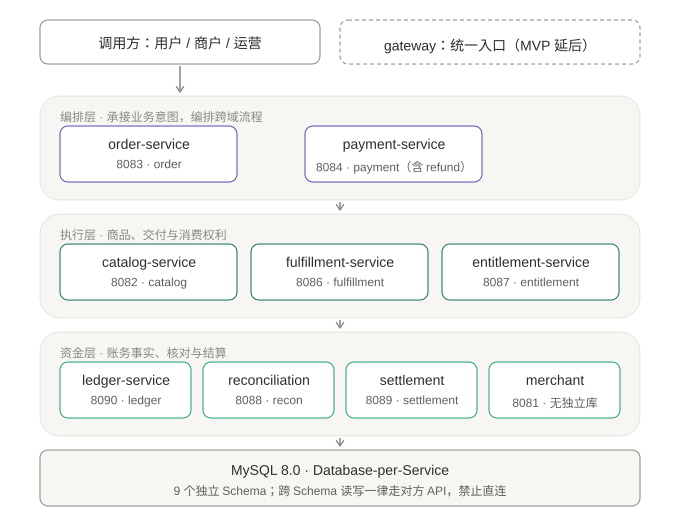
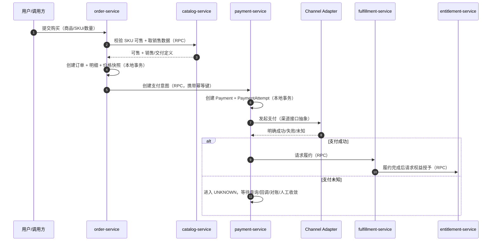
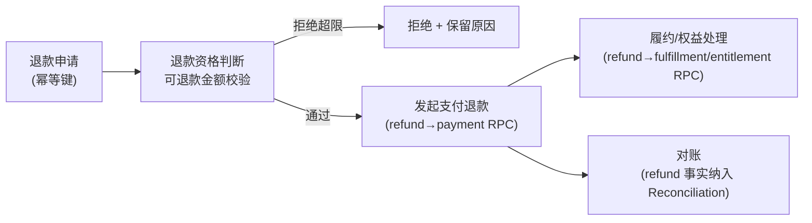
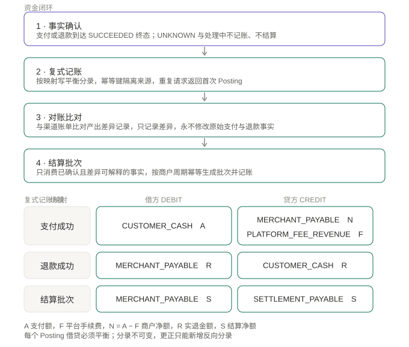
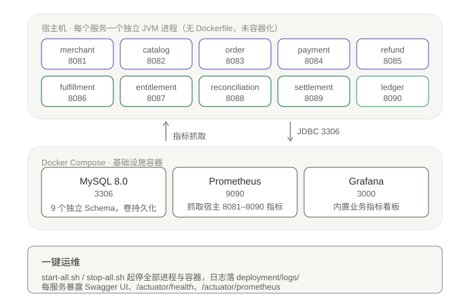

# PaymentArch 技术方案

**状态**：已确认，作为当前实现基线（综合性总体技术方案，指导后续所有 Feature）

**生效日期**：2026-08-26

**关联决策**：[ADR-0001](../adr/0001-adopt-spring-cloud-microservices.md)、[ADR-0002](../adr/0002-technology-stack.md)

**权威来源**：本文是 Constitution（最高约束）、ADR（决策日志）、Spec 001（业务模型）在「当前系统」层面的**落地化综合**。本文不得与 [Constitution](../../.specify/memory/constitution.md) 冲突；若需调整领域边界、服务边界、状态机或数据层，属于 Constitution §8 人类决策边界，须另立 ADR / 提案并经人类确认。

> 本文是「全局」视角的技术方案。各子系统的字段级、状态机级、接口级细节见 [systems/](systems/) 下对应文档。

---

## 1. 背景与现状

### 1.1 项目定位

PaymentArch 是一个 **Production-Oriented 的 Commerce & Payment Platform**（Java / Spring Cloud 微服务），用于学习并实践支付、交易、履约、权益、对账、结算体系与高质量后端工程。**不是 CRUD Demo、不是玩具脚本。**

落地到工程，任何功能须同时满足八性（Constitution §1）：业务模型真实（Realistic）、架构合理（Sound）、工程完整（Complete）、可运行（Runnable）、可测试（Testable）、可观测（Observable）、可部署（Deployable）、可演进（Evolvable）。

### 1.2 当前现状（Phase 0 — Foundation）

- 架构基线已确认：**Spring Cloud 微服务**，按限界上下文划分（ADR-0001），技术栈 Java 21 + Spring Boot 3.x + MyBatis-Plus + Nacos + OpenFeign（ADR-0002）。
- 已建 **9 个服务模块 + 3 个共享库**（见 §3），`gateway` 本 MVP 延后；`ledger-service` 已按 `004-ledger` 前置实现并接入 payment/refund/settlement 侧记账（ADR-0008~0011 已于 2026-08-29 Accepted）。
- 根 Maven 工程 `validate` 已通过；各服务有启动类与上下文测试，部分服务已有领域/应用/契约/集成测试。
- 当前 Feature `001-core-business-model` 已有 Spec/Plan/Tasks；业务主链路（下单→支付→回调/收敛→履约→权益）与资金闭环（对账→结算）**部分已落地**，退款/对账/结算多数仍是骨架，未形成完整业务闭环。
- **尚未引入**：真实支付渠道（当前 Mock Channel）、MQ / 跨服务异步事件、API 网关、熔断组件、K8s/服务网格（Ledger 复式记账已按 `004-ledger` 前置实现）。

---

## 2. 目标

### 2.1 总目标

建立一个可运行、可测试、可观测、可部署、可演进的**真实支付/交易/履约/对账/结算技术基线**，在清晰边界内逐步扩展，而非一次性堆砌。

**首要态度**：宁可**正确地实现一个较小的范围**，也不做**范围大但不真实、不可验证的表面功能** —— 真实 > 全面。

### 2.2 最高优先级

**资金正确性 > 一切**：幂等、复式记账、未知状态不猜成败。其他优先级与冲突裁决见 Constitution §10。

### 2.3 非目标（MVP 明确不做）

- 不接真实支付机构、不做真实出款/入账（当前仅 Mock Channel + 模拟业务事实）。
- （注：Ledger 复式记账已按 `004-ledger` 前置实现，结算侧记账由 `007-settlement` 承接，详见 §4.3.5；本 MVP 仍不接真实出款/银行。）
- 不引入 MQ / Kafka / Redis / ES / K8s / Service Mesh / 2PC-XA（除非对应阶段有真实需要且经 ADR 论证）。
- 不做多币种清分、税费、复杂分账、多级商户、复杂风控平台。

---

## 3. 总体架构设计

### 3.1 分层架构



> 该图的 PlantUML 源码：[diagrams/01-system-architecture.puml](diagrams/01-system-architecture.puml)（供 AI 阅读与后续编辑，改动后需重新渲染为 SVG）

- **接入层**：`gateway` 作为统一入口/鉴权/限流，本 MVP **延后**（虚线）；当前调用方直连各服务暴露的 REST。
- **编排层**：order / payment / refund 承接业务意图并编排跨域流程（§3.2），可调用下游；独立进程、独立端口、独立部署单元。
- **执行层**：catalog / fulfillment / entitlement 自持状态机，**不得反向依赖编排层**。
- **资金层**：ledger / reconciliation / settlement / merchant 承载账务事实、核对与结算。其中 `ledger-service` 已按 `004-ledger` **前置实现**（原定 Roadmap Phase 8），只被依赖、不调用任何业务服务。
- **数据层**：MySQL 8.0，Database-per-Service 的**访问边界**（§3.4）；Nacos（注册 + 配置）为 `[目标]`，生产启用前本地直连。

> **注**：reconciliation / settlement 对 payment / refund 的依赖是**只读事实抽取**（读已确认业务事实，不回写、不修改），不构成对编排层的反向业务依赖，不违反 §3.4 的单向依赖原则。

### 3.2 核心模块职责

| 服务 | 负责领域 | 核心职责 | 状态 |
|---|---|---|---|
| gateway | 接入层 | 统一入口、路由、鉴权、限流 | 延后 |
| merchant-service | Merchant | 商户注册、资质、结算账户 | 骨架 |
| catalog-service | Product / SKU | 商品、SKU、价格、可售性 | 已实现 |
| order-service | Order / Transaction | 订单、明细、价格快照、交易状态机 | 已实现 |
| payment-service | Payment + Channel | 支付编排、幂等、渠道适配、回调、UNKNOWN 收敛 | 已实现 |
| refund-service | Refund | 退款编排（渠道退款 + 权益撤销 + 对账） | 骨架 |
| fulfillment-service | Fulfillment | 履约、发货 | 已实现 |
| entitlement-service | Entitlement | 权益授予 / 撤销 / 查询 | 已实现 |
| ledger-service | Ledger | 复式记账（资金核心） | 已实现（`004-ledger` 前置，8090） |
| reconciliation-service | Reconciliation | 异步对账 | 骨架 |
| settlement-service | Settlement | 结算批次、调整项、已确认事实闸门、收敛/关闭与结算侧记账（不真实出款） | 已实现（ADR-0022/0023 缺口补齐） |

> Channel 不单独成服务：以「接口 + 模块」内聚在 payment-service（`application/channel` 接口 + `infra/channel` 实现），落实 Payment ≠ Channel。

> **状态列口径**：上表基于本文 2026-08-26 基线。`ledger-service` 已按 `004-ledger` 前置实现并接入 payment 侧记账；refund / reconciliation / settlement 的进展以 [roadmap.md](roadmap.md) Current Status 与 `docs/specs/005~007` 为准，本文相关表述待下次基线刷新时统一修订。

### 3.3 系统间通讯协议

- **服务内**：本地事务保证原子。
- **跨服务**：统一走**公开的同步 HTTP/RPC 用例**（Spring Cloud OpenFeign + LoadBalancer），契约 DTO 集中在 `common-dto`。
- **对外渠道**：通过 Channel Adapter 抽象与第三方交互（当前 Mock Channel）。
- **MQ / 跨服务异步事件**：当前**不引入**（Constitution §4）；服务内部可用事件表达本地状态变化，但**不跨服务发布**。
- **后置流程**：由负责方通过同步 RPC 调用下游公开用例（如 Payment 成功 → 请求履约），任何同步边界不得要求一次调用完成跨领域全链路。

### 3.4 领域边界与数据架构

**12 领域 + 六条关键边界 + 依赖方向**（Constitution §2.3）：

| # | 区分 | 含义 |
|---|---|---|
| 1 | Order ≠ Payment | Order 是商业意图，Payment 是资金动作，独立生命周期与状态机 |
| 2 | Payment ≠ Channel | Payment 是编排层，Channel 是渠道技术适配；Payment 只依赖接口抽象 |
| 3 | Payment Success ≠ Entitlement Granted | 支付成功是财务事件，权益是消费权利，成功只「触发」授予 |
| 4 | Reconciliation ≠ Settlement | 对账是比对找差异，结算是资金划转，二者解耦 |
| 5 | Refund ≠ Payment Refund | Refund 是跨多领域编排，不是「调一次渠道退款」 |
| 6 | Fulfillment 不强耦合 Payment | 履约有自己的状态机，不被支付状态反向阻塞 |

**依赖方向**：领域依赖 MUST **单向、向内**——编排层（Order/Payment/Refund）可依赖底层领域，底层领域不得反向依赖编排层；`Ledger` 只被依赖；`Channel` 只依赖外部协议。

**数据所有权**：每服务独占自己的 Schema（`merchant_schema` / `catalog_schema` / `order_schema` / `payment_schema` / `refund_schema` / `fulfillment_schema` / `entitlement_schema` / `reconciliation_schema` / `settlement_schema`，实际命名以 [deployment/schema/](../../deployment/schema/) DDL 为准）。跨服务读写一律经对方公开 API/RPC，**禁止**任何服务直接 SQL 他服务 Schema 的表。单机/Compose 阶段多服务可共用一个物理库，但必须独立 Schema。

### 3.5 技术栈

| 维度 | 选择 | 说明 |
|---|---|---|
| 语言 / JDK | Java 21 LTS | Spring Boot 3.x 全面支持 |
| 框架 | Spring Boot 3.x + Spring Cloud | 主流企业级 |
| 构建 | Maven（mvnw Wrapper 锁版本） | 父 POM + `dependencyManagement` 统一版本 |
| ORM | MyBatis / MyBatis-Plus | SQL 显式可控，适合资金/对账复杂查询 |
| 注册 + 配置 | Nacos | 同时提供注册与配置能力 |
| 服务调用 | Spring Cloud OpenFeign + LoadBalancer | 声明式服务间调用 |
| API 网关 | Spring Cloud Gateway | 响应式网关（本 MVP 延后启用） |
| 熔断 | Resilience4j 或 Sentinel | 延迟到需要时再引入 |
| 可观测 | Micrometer + Micrometer Tracing | 指标与链路追踪 |
| 测试 | JUnit 5 + Mockito + AssertJ；Testcontainers | 集成测试用容器 |
| 代码质量 | Checkstyle + Spotless | CI 强制 |

---

## 4. 详细功能和流程设计

### 4.1 领域职责

| 领域 | 解决的问题 | 不负责的问题 | 核心实体 | 核心状态 |
|---|---|---|---|---|
| Merchant | 谁可经营商品、接收交易并参与结算 | 订单、支付执行、履约、对账差异 | Merchant、Settlement Account | 待审核 → 有效 → 暂停/终止 |
| Product | 面向用户与商家的商品概念与生命周期 | 销售价格快照、订单、支付 | Product、Product Version | 草稿 → 上架 → 下架 → 归档 |
| SKU | 哪个具体销售单元可被购买、以何属性交付 | 订单金额确认、支付状态 | SKU、Price、Delivery Definition | 草稿 → 可售 → 暂停 → 失效 |
| Order | 用户买什么、向谁买、订单金额与购买生命周期 | 渠道协议、资金收取、直接发权益 | Order、Order Item、Price Snapshot | 待确认 → 待支付 → 已支付 → 履约中 → 已完成/取消/关闭 |
| Transaction | 商业交易如何关联订单与支付、是否完成 | 渠道通信、履约交付、权益管理 | Transaction、Transaction Relation | 待处理 → 处理中 → 成功/失败/取消/未知 |
| Payment | 一次资金收取意图与支付尝试的生命周期 | 商品、履约、具体渠道协议 | Payment、Payment Attempt、Payment Result | 待支付 → 处理中 → 成功/失败/未知 → 已关闭 |
| Payment Channel | 如何与外部支付机构交互并解释其结果 | 平台订单、履约、权益、最终业务判断 | Channel、Channel Attempt、Channel Reference | 可用 → 不可用/停用 |
| Refund | 为什么退、退多少、是否可退、退款整体进度 | 单独替代支付退款、履约撤销、对账 | Refund、Refund Item、Refund Decision | 申请中 → 处理中 → 成功/部分/失败/未知/拒绝/关闭 |
| Fulfillment | 如何交付商品或服务、交付是否完成 | 支付结果确认、权益内部生命周期 | Fulfillment、Fulfillment Item、Delivery | 待履约 → 履约中 → 已交付/部分/失败/取消 |
| Entitlement | 用户获得什么消费权利、如何用与撤销 | 判断是否已付款、渠道退款 | Entitlement、Grant、Consumption | 待授予 → 可用 → 部分/已用尽 → 过期/撤销/失败 |
| Reconciliation | 平台事实与外部事实是否一致、差异如何处理 | 资金划转、修改原始交易事实 | Batch、Match、Difference | 待处理 → 对账中 → 一致/有差异 → 处理中/关闭 |
| Settlement | 商户应结算多少、批次是否完成 | 发现全部原始差异、代替支付成功判断 | Batch、Item、Adjustment | 待结算 → 计算中 → 待执行 → 执行中 → 成功/失败/未知/关闭 |

### 4.2 核心基数关系与状态机

**MVP 基数关系**：

```text
Order (1) ───── (1) Transaction (1) ───── (1) Payment (1) ───── (N) PaymentAttempt
   │                                                                      │
   └─ Order Items / Price Snapshots                             每次尝试 ≤ 1 个渠道引用
```

**核心状态机**（领域自持，集中状态转换函数，禁止散落 set）：

| 实体 | 允许的状态流 |
|---|---|
| Order | 待确认 → 待支付 → 已支付 → 履约中 → 已完成；取消/关闭仅当业务允许 |
| Transaction | 待处理 → 处理中 → 成功/失败/取消/未知 |
| Payment | 待支付 → 处理中 → 成功/失败/未知 → 已关闭 |
| PaymentAttempt | 待处理 → 已受理 → 成功/失败/未知 |
| Fulfillment | 待履约 → 履约中 → 已交付/部分交付/失败/取消 |
| Entitlement | 待授予 → 可用 → 部分使用/已用尽 → 已过期/已撤销/失败 |
| Refund | 申请中 → 处理中 → 成功/部分成功/失败/未知/拒绝/关闭 |
| Reconciliation | 待处理 → 对账中 → 一致/有差异 → 处理中/关闭 |
| Settlement | 待结算 → 计算中 → 待执行 → 执行中 → 成功/失败/未知/关闭 |

**金额铁律**：金额一律用最小货币单位（`long` 分）或 `BigDecimal`（明确 scale），封装 `Money` 值对象；全库禁止 `float`/`double`；任何真实资金变动须经 Ledger 复式记账。

### 4.3 核心业务流程

#### 4.3.1 购买主链路



#### 4.3.2 支付回调与 UNKNOWN 收敛

渠道通知**可能重复、乱序、延迟**到达。payment-service 依据「渠道交易引用 + 支付尝试」幂等吸收重复通知，不回退已确认的合法状态；终态成功不被后到的失败回调覆盖。回调只更新 Payment/PaymentAttempt，并通过同步 RPC 触发 order-service 回写订单/交易状态（Order `PENDING_PAYMENT → PAID`、Transaction `PROCESSING → SUCCEEDED`）、fulfillment-service 履约，不直接改写其他领域内部数据。

渠道超时/断连/响应不完整时，Payment/Refund **进入 UNKNOWN**（不是失败别名）。收敛路径：主动查询接口、后续回调、对账、人工处理；在未收敛前**不得重复执行不可确认的资金动作**。

> **决策记录（Feature 003 / ADR 集合 `docs/adr/0003-payment-reliability-decisions.md`）**：
> - 超时进 UNKNOWN、主动查询收敛、有限重试、终态冲突策略（迟到成功不覆盖已失败）已 **Accept**（ADR-0003/0004/0005/0007）。
> - **人工收敛端点（原 ADR-0006 / spec US4）本阶段不做**：高危资金操作须配套完整权限/审计，该体系在路线图 Phase 9（Risk / Security）统一建设。本阶段的自动收敛（主动查询 + 超时 + 重试）已覆盖绝大多数 UNKNOWN；剩余无法自动收敛者保持 UNKNOWN，依赖既有对账流程兜底，不阻塞本 Feature 交付。误判修正统一走对账，不自动覆盖终态（ADR-0007）。

#### 4.3.3 退款链路



#### 4.3.4 履约与权益

`PaymentSucceeded`（Payment 服务内部事实）→ 通过 RPC 请求 fulfillment-service 履约；履约完成后再请求 entitlement-service 授予权益。支付成功只**触发**履约，不决定履约最终状态；履约失败不回写支付为失败；权益授予失败保留履约事实、可重试/人工补发，不重复扣款。

#### 4.3.5 资金闭环：记账、对账与结算

资金链路只有一条准入门槛：**未确认的事实不得进入账务与结算**。



> 该图的 PlantUML 源码：[diagrams/03-funds-closed-loop.puml](diagrams/03-funds-closed-loop.puml)（供 AI 阅读与后续编辑，改动后需重新渲染为 SVG）

**复式记账映射**（`ledger-service`，四个预置科目，MVP 仅 CNY）：

| 场景 | 借方 DEBIT | 贷方 CREDIT | 平衡 |
|---|---|---|---|
| 支付成功（金额 A，手续费 F，净额 N = A − F） | `CUSTOMER_CASH` A | `MERCHANT_PAYABLE` N ＋ `PLATFORM_FEE_REVENUE` F | A = N + F |
| 退款成功（实退金额 R） | `MERCHANT_PAYABLE` R | `CUSTOMER_CASH` R | 与支付方向相反 |
| 结算批次（净额 S） | `MERCHANT_PAYABLE` S | `SETTLEMENT_PAYABLE` S | 借贷相等 |

- **记账**：仅对**已确认**的支付/退款/结算事实记账，`UNKNOWN` / 处理中 / 失败 / 拒绝**一律不记账**（Constitution §V.7）。幂等键 `PAYMENT:<key>` / `REFUND:<key>` / `SETTLEMENT:<batchId>` 保证重复请求只产生一份分录；借贷不平衡由 Posting 聚合根强校验拒绝，不落任何分录。记账 RPC 失败**不回滚**业务事实，记 `ledger.posting_failed` 并进入「待记账」清单由对账补齐。
- **对账**：reconciliation-service 读取已确认的 Payment/Refund 事实，与 Mock/预置渠道账单比对，产出一致/金额差异/状态差异/平台独有/渠道独有。**对账只产生匹配/差异事实，永不修改原始 Payment/Refund 事实。**
- **结算**：settlement-service 只消费「已确认且差异可解释」的财务事实（校验商户结算资格 → 净额计算 → 生成结算批次）。同一商户周期不重复生成批次；未知执行结果不等于成功。
- **分录不可变**：已提交分录禁止 UPDATE/DELETE，更正只能新增反向分录（冲正）。

> **注**：`ledger-service` 已按 `004-ledger` **前置实现**（原定 Roadmap Phase 8），设计决策见 [ADR-0004](../adr/0004-ledger-design-decisions.md)；§2.3 非目标中「不实现 Ledger 复式记账」的表述应以 Roadmap Current Status 为准。

#### 4.3.6 典型跨服务调用

```text
order-service → catalog-service               校验 SKU + 取销售数据
order-service → payment-service               创建支付意图
payment-service → Channel Adapter             发起支付 / 查询渠道结果
payment-service → fulfillment-service         支付成功后请求履约
fulfillment-service → entitlement-service     履约完成后请求权益授予
refund-service → payment-service              发起支付退款（金额查询 + 退款尝试）
refund-service → fulfillment/entitlement      退款后处理
reconciliation-service → payment/refund       读已确认业务事实
settlement-service → merchant/reconciliation  校验结算资格 + 生成结算批次
```

### 4.4 一致性模型（幂等 / 状态机 / 重试 / UNKNOWN）

| 机制 | 落地 |
|---|---|
| **幂等** | 支付、退款、结算等资金入口 MUST 有幂等键；幂等键由调用方提供、服务端持久化并唯一约束；同键重复请求返回同一业务结果，不产生重复资金动作 |
| **状态机** | Order/Payment/Refund/Fulfillment/Entitlement/Settlement 均显式、单向；状态流转集中在状态转换函数，禁止散落 set |
| **本地事务** | 单服务内部状态变更用本地事务保证原子 |
| **最终一致** | 跨服务通过同步 RPC 编排 + 幂等重试实现最终一致；对外部系统（渠道）采用最终一致；暂不引入 MQ / 跨服务异步事件 |
| **重试** | 仅对幂等的外部调用允许自动重试，须有退避与上限；非幂等调用禁止盲目重试 |
| **重复消息/回调** | 处理侧假设消息与回调会重复，靠幂等键 + 状态机幂等吸收，不重复入账 |
| **超时** | 所有外部调用有超时；超时 ≠ 失败/成功，进入未知状态 |
| **UNKNOWN** | 结果不确定时不猜成败直接落账，靠查询/对账/人工收敛 —— 支付系统最核心的正确性保障 |

### 4.5 分布式事务处理策略

**不使用 2PC/XA 分布式事务**。跨服务资金流转用 **Saga + 同步 RPC + 幂等** 实现最终一致：

- 每个服务只在自己的本地事务内原子提交自身事实（如 Payment 成功只在 payment-service 内落库）。
- 跨服务副作用通过幂等的同步 RPC 逐段推进（支付成功 → 履约 → 权益），每段失败**不回滚前序已成功事实**，而是靠幂等重试 / 对账 / 人工收敛补齐。
- 后置 RPC 失败**不得回写前序成功事实**（如履约失败不回写支付为失败），只记录独立失败并重试。
- 金额/币种/累计金额校验在支付、退款、对账、结算**各边界分别执行**，不依赖上游校验。

**明确禁止**：2PC/XA 分布式事务；跨服务直接改他服务数据；散落直改 `status` 绕过状态机。

---

## 5. 非功能性设计

### 5.1 性能与容量目标（`[目标]`，待确认）

> 以下为**建议目标值**，非已实现/已测得事实；面向 MVP 单机部署，不做生产级压测承诺。

| 指标 | 目标值 | 说明 |
|---|---|---|
| 同步查询接口 P99 延迟 | ≤ 500ms | 本地 MySQL 单机、单次查询 |
| 同步命令接口 P99 延迟 | ≤ 1s | 含单次跨服务 RPC 编排（如下单含 catalog+payment 两次 RPC） |
| 资金入口可用性 | ≥ 99.9% | 支付/退款入口 |
| 对账达成率 | ≥ 99% | 对账周期内可解释差异占比 |

### 5.2 安全

- 密钥、签名、金额等禁止硬编码，走环境变量 / 配置中心 / 密钥管理。
- 渠道回调 MUST 验证签名与来源，防止伪造回调（当前 Mock Channel 未接真实签名，Phase 9 落地）。
- 对外 API 有鉴权（Spring Security / OAuth2）与输入校验（Bean Validation）。
- 敏感信息（卡号、密钥）进日志前脱敏（`StructuredAuditLogger.mask`）。

### 5.3 可观测性（全局）

- **Metrics（Micrometer）**：请求量、延迟、错误率 + 关键业务计数（支付成功率/失败率/超时率/渠道成功率/渠道耗时；退款成功率/失败率；履约/权益失败率；对账差异数量/金额；结算成功率/失败数）。
- **Logs**：结构化日志（logback），关联字段含 `traceId` / `orderId` / `paymentId`；**资金动作 MUST 有审计日志**（`FINANCIAL_AUDIT` logger）；敏感信息脱敏。
- **Traces**：Micrometer Tracing 跨服务传播 `traceId`/`spanId`，初期不上独立分布式追踪基础设施。
- **告警/SLO**：对「支付状态未知堆积」「对账差异」「退款失败」「重试耗尽」等业务异常 MUST 告警，而非只告警基础设施；核心接口定义可用性、P99、对账达成率目标。

> 各服务的**精确埋点键 / 日志键**见 [systems/](systems/) 下对应文档（要素 6）。

---

## 6. 实施与部署策略

**当前部署形态：单机多进程 + 单 MySQL 独立 Schema**（不是模块化单体）：



> 该图的 PlantUML 源码：[diagrams/02-deployment-topology.puml](diagrams/02-deployment-topology.puml)（供 AI 阅读与后续编辑，改动后需重新渲染为 SVG）

- 服务是**独立进程、独立端口、独立部署单元**；单机只是多个进程跑在同一台服务器，不改变服务边界。
- `gateway` 本 MVP **不创建、不部署**；`ledger-service`（8090）已按 `004-ledger` 前置创建并纳入部署。
- 服务当前**未容器化**（无 Dockerfile），以宿主进程运行；只有 MySQL / Prometheus / Grafana 由 `docker compose` 承载，Prometheus 经 `host.docker.internal` 回抓宿主端口的 `/actuator/prometheus`。
- 每个服务暴露 Swagger UI、`/actuator/health`、`/actuator/prometheus`；`deployment/start-all.sh` / `stop-all.sh` 一键起停，日志落 `deployment/logs/<service>.log`（详见 [deployment/README.md](../../deployment/README.md)）。
- **演进路径**：本地多服务 → Docker Compose → 单机部署 → CI/CD → 可观测增强 → 有证据的部分服务独立数据库迁移（Roadmap Phase 10）。

> 各服务的**运行态配置**（环境变量、启动依赖顺序、端口）见 [systems/](systems/) 下对应文档（要素 6），与本节「物理机部署」区分。

---

## 7. 项目计划与资源

**当前阶段**：Phase 0 — Foundation；当前 Feature `001-core-business-model`。

| 阶段 | 目标 | 交付边界 |
|---|---|---|
| Phase 0 · Foundation | 收口架构裁决、服务目录、端口、Schema、Spec Kit 入口 | 不实现业务、不接真实支付、不建 Ledger、不引 MQ/K8s |
| Phase 1 · Commerce Core | Merchant/Product/SKU/Order/Transaction 最小可运行 | 不含 Payment、退款、权益、结算、库存/促销/税费 |
| Phase 2 · Payment Core | Payment/Attempt/Channel Adapter + Mock Channel | 不含真实渠道、Ledger、路由/风控/多币种 |
| Phase 3 · Payment Reliability | UNKNOWN 收敛、重复/乱序/延迟回调、有限重试、审计 | 不含生产级 SLA、多活、复杂风控、自动补偿 |
| Phase 4 · Fulfillment & Entitlement | 支付成功后履约 → 权益授予 | 不含复杂仓储物流、权益商城、退款回收政策 |
| Phase 5 · Refund | 部分/全部退款、幂等、退款后处理 | 不含审批、权益回收政策、真实出款、Ledger 冲正 |
| Phase 6 · Reconciliation | 平台事实与渠道账单比对、差异处理 | 不含真实账单、自动调账、真实资金修正 |
| Phase 7 · Settlement | 商户周期结算批次、调整项、模拟结算结果 | 不真实出款、不接银行、不接多币种清分（结算侧记账经 ledger-service，见 §4.3.5） |
| Phase 8 · Ledger | 复式记账、科目、分录、记账幂等 | 不含复杂会计准则、多币种清分、总账 |
| Phase 9 · Risk / Security | 认证、授权、签名校验、敏感数据、最小风控 | 不含全量合规、复杂风控平台 |
| Phase 10 · Distributed Evolution | 有证据地独立数据库/服务治理演进 | 不默认引入 Service Mesh/K8s/CQRS/ES |

**Feature 依赖图**：

```text
Phase 0 Foundation → 001 Core Business Model → 002 Payment Reliability → 003 Refund
→ 004 Reconciliation → 005 Settlement → 006 Ledger → 007 Risk/Security → 008 Distributed Evolution
```

可并行不阻塞主链路：`009 Observability Baseline`、`010 Delivery/CI-CD Baseline`。

**每个 Feature 完成后的 SOP**：Spec → Clarify → Plan → 确认 → Tasks → Implement → 测试/verify/quickstart → Review → 更新 Roadmap（详见 [roadmap.md](roadmap.md)）。

---

## 8. 风险评估与应急预案

> 下表综合 Constitution 约束与当前架构推导的既有风险，**不新造决策**；涉及领域边界/状态机/Schema/API 的处置须走 §8 人类决策边界。

| 风险 | 影响 | 缓解（设计约束） | 应急（异常处置） |
|---|---|---|---|
| **支付状态 UNKNOWN 堆积** | 资金事实悬空，无法结算 | 超时/断连/不完整响应一律进 UNKNOWN，不猜成败；配 `payment.unknown` 业务指标与告警 | 主动查询 / 后续回调 / 对账 / 人工收敛；未收敛前不重复执行不可确认资金动作 |
| **跨服务最终一致断裂** | 前序成功、后序失败造成链路断点 | 每段本地事务原子提交 + 幂等重试；后置失败不回写前序成功 | 独立记录后序失败、可查询、可重试、可补偿或人工补发 |
| **无 Ledger 的资金风险** | 用状态替代账务事实，无法复式审计 | Phase 0-7 只模拟业务事实；金额铁律（long/BigDecimal+Money）全程生效 | 任何真实资金变动必须先引入 Ledger（Phase 8），禁止直改余额 |
| **渠道回调伪造/重复/乱序** | 错误入账、重复入账 | 幂等键 + 状态机幂等吸收；终态成功不被迟到失败覆盖 | 回调查签名（Phase 9）；重复回调映射同一渠道引用去重 |
| **对账差异** | 漏单、重复、金额/状态差异被静默 | 对账只产生匹配/差异事实，永不修改原始 Payment/Refund | 差异记录独立处理状态与依据，人工跟进 |
| **结算基于未确认事实** | 错误结算批次 | 结算只消费已确认且差异可解释的事实；商户-周期批次幂等 | 未确认/重大差异暂停批次或进 UNKNOWN，禁止重复结算 |
| **单服务故障** | 影响该链路，不拖垮全局 | 服务独立进程/端口，故障隔离 | 依赖同步 RPC 超时 + 幂等重试，跨服务不共享状态 |
| **金额溢出/浮点** | 资金计算错误 | 金额用 long 分 + `Math.addExact/multiplyExact` 防溢出；禁 float/double | 金额不变量校验（AMOUNT_INVARIANT_VIOLATION）拒绝非法金额 |

---

> 本文是「当前有效总体架构」的**综合快照**，随 Roadmap 阶段与 ADR 演进而更新。任何修改若触及领域边界、服务边界、状态机、数据库 Schema 或公共 API，须遵循 Constitution §8，先立提案并经人类确认。
