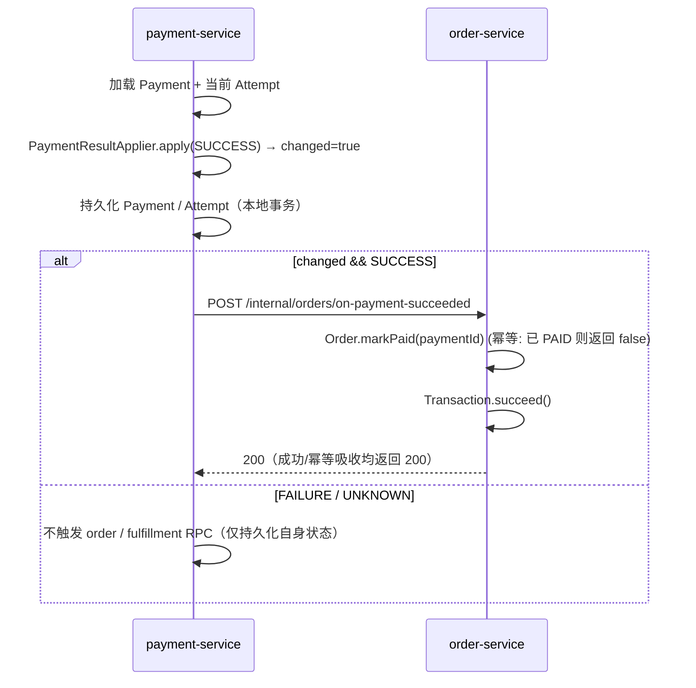

# Implementation Plan: 支付成功回写订单与交易状态

**Branch**: `002-payment-order-callback` | **Date**: 2026-08-28 | **Spec**: [spec.md](spec.md)

**Input**: Feature specification from `docs/specs/002-payment-order-callback/spec.md`（当前 Feature，状态 Draft；实现已在 `001-core-business-model` 主线内落地，本 Plan 用于补齐规划产物、对齐实现与验收）。

## Summary

补齐「支付成功 → 订单 / 交易」的状态回写闭环。当一笔支付被**明确确认为成功**时，payment-service 通过同步 RPC 通知 order-service，由 order-service 在自己的领域内驱动：

- `Order`：`PENDING_PAYMENT → PAID`，整单支付（`paidMinor = totalMinor`），并记录下游支付单号 `paymentId`；
- `Transaction`：`PROCESSING → SUCCEEDED`（必要时先 `start()` 到 PROCESSING）。

回写的关键正确性约束（来自 spec FR-001~FR-010）：

- **幂等吸收**：重复 / 乱序 / 延迟到达的同一支付成功事实，订单与交易只推进一次，不重复累加、不二次推进；
- **仅明确成功才回写**：支付 `FAILURE` / `UNKNOWN` **绝不**触发订单 / 交易的成功推进；
- **最多一次**：无论成功结果来自即时返回、渠道回调还是查询收敛，下游动作只发生一次；
- **失败不回滚**：回写 RPC 失败不得把支付成功事实回写为失败；
- **非法前态拒绝**：订单处于 `CANCELLED` / `CLOSED` 等非法前态时，拒绝推进、不伪造成功（异常留痕待补，见 §Deferred / Known Gaps）。

本 Plan 复用 `001` 已建立的服务边界、状态机、幂等与同步 RPC 机制，**不新增服务、不新增 Schema / 表、不引入 MQ / Ledger**。

## Technical Context

**语言/版本**：Java 21 LTS

**主要依赖**：Spring Boot 3.x、Spring Cloud OpenFeign + LoadBalancer、MyBatis-Plus、Micrometer。版本统一由 Maven 父工程 `dependencyManagement` 管理。

**存储**：沿用既有 `order_schema` 与 `payment_schema`；本 Feature **不新增任何表或字段**（订单的 `paymentId` 字段与 `paidMinor` / `refundedMinor` 已在 001 落地）。

**测试**：JUnit 5 + Mockito + AssertJ；跨服务 RPC 用记录式 fake（`PaymentTestStack.RecordingOrderGateway` / `RecordingFulfillmentGateway`）断言调用次数；持久化与状态机用内存 / H2 仓储；集成测试随 `./mvnw verify` 在 H2 上运行（不依赖 MySQL）。

**目标平台**：本地 JVM 开发、Docker Compose（单 MySQL 8）与单机部署。

**项目类型**：多服务 Web 平台（`payment-service` 8084 → `order-service` 8083 的同步 RPC）。

**性能目标**：回写为同步 RPC 内的本地事务，P99 沿用 001 命令接口 ≤ 1s 目标；不引入额外网络跳转（payment→order 一次 RPC）。

**约束**：不引入 MQ / 跨服务异步事件、Ledger、2PC/XA；跨服务只通过公开同步 RPC；金额全程 `long` 分，禁止浮点。

**规模/范围**：本 Feature 只覆盖「支付成功」这一事实的回写（订单 + 交易）；不包含支付失败 / 未知的处理与收敛（沿用既有支付状态机与对账能力），不包含履约 / 权益回收。

## Constitution Check

*GATE: Must pass before Plan finalization.*

### Pre-Phase Gate: PASS（无人类决策边界变更）

- **面向生产实践**：通过。真实幂等、显式状态机、UNKNOWN 不猜成败、审计日志齐备。
- **资金正确性**：通过（阶段性）。本 Feature 不引入真实资金记账；订单 `paidMinor` 仅置为已确认支付金额，不涉及余额或 Ledger。
- **领域边界**：通过。payment-service 仅通过 `OrderGateway` 接口（Feign 实现）触发回写；订单 / 交易状态完全由 order-service 自身状态机驱动，payment-service 不直接改 order 数据。
- **架构**：通过。跨服务同步 RPC，无跨 Schema 直连 SQL，无新增中间件。
- **一致性**：通过。幂等（`Order.markPaid` 返回 `changed` + `PaymentResultApplier.apply` 的 `changed` 标志双控）、状态机（集中转换函数）、UNKNOWN（FAILURE/UNKNOWN 不触发成功回写）。
- **实现前无需人类确认**：本 Feature 未触碰宪法 §8 人类决策边界（无新服务、无破坏性 Schema 迁移、无已发布 API 的破坏性变更、无支付状态机变更——仅在既有成功路径上新增一个内部 RPC 触发点）。

## Project Structure

### Documentation (this feature)

```text
docs/specs/002-payment-order-callback/
├── spec.md              # 已存在（用户故事 + FR-001~010 + SC-001~004）
├── checklists/
│   └── requirements.md  # 已存在（质量校验全通过）
├── plan.md              # 本文件
├── tasks.md             # 任务清单（已落地标 [X]，关闭项标 [ ]）
├── quickstart.md        # 可跑通验证步骤
└── acceptance.md        # 验收结论与证据
```

### Source Code （仅改动既有文件，不新增模块）

```text
payment-service/src/main/java/com/payment/payment/
├── application/
│   ├── PaymentResultProcessor.java   # 已实现：applyAndNotify，changed && SUCCESS 才触发回写
│   ├── PaymentResultApplier.java     # 已实现：状态机 apply，返回 changed
│   ├── PaymentCallbackService.java   # 已实现：回调去重 / 终态保护 / 重复计数
│   ├── PaymentUnknownResolutionService.java  # 已实现：UNKNOWN→SUCCESS 收敛同样走 applyAndNotify
│   ├── OrderGateway.java             # 已实现：出站 RPC 端口（支付成功回写）
│   └── PaymentMetrics.java           # 已实现：payment.duplicate_callback 等
└── infra/client/
    └── OrderFeignClient.java         # 已实现：@FeignClient("order-service") → POST /internal/orders/on-payment-succeeded

order-service/src/main/java/com/payment/order/
├── application/
│   └── OrderApplicationService.java  # 已实现：onPaymentSucceeded（@Transactional）
├── api/
│   └── OrderPaymentRpcController.java # 已实现：POST /internal/orders/on-payment-succeeded
└── domain/
    ├── Order.java                    # 已实现：markPaid（PENDING_PAYMENT→PAID，幂等）
    └── Transaction.java              # 已实现：succeed（PROCESSING/UNKNOWN→SUCCEEDED）
```

**结构决策**：仅扩展既有 payment-service / order-service 的内部编排与 RPC 契约，不新增服务、包或表。回写方向严格单向：`payment → order`（通过 `OrderGateway` 接口，Feign 实现在 `infra/client`），order 内部按自身状态机推进。

## 1. Architecture Overview

payment-service 在「支付真正迁移为成功」的瞬间，通过同步 RPC 触发 order-service 的回写端点；order-service 在自己的本地事务内驱动 `Order` 与 `Transaction` 状态机推进。两个领域各自拥有状态机与数据所有权，payment-service 不持有、不修改 order 的内部状态。

```text
payment-service                order-service
      │                              │
      │  PaymentResultProcessor     │
      │   .applyAndNotify(id, SUCCESS)
      │      └─ changed && SUCCESS ──┼── POST /internal/orders/on-payment-succeeded
      │                              │      │
      │                              │      ├─ Order.markPaid(paymentId)   PENDING_PAYMENT→PAID
      │                              │      └─ Transaction.succeed()      PROCESSING→SUCCEEDED
      │                              │
      (失败/未知不触发上述 RPC)         (RPC 失败被 payment 侧 catch，不回滚支付成功)
```

## 2. Module Boundaries

| 模块 | 本 Feature 职责 | 状态 |
|---|---|---|
| payment-service | 在支付成功时通过 `OrderGateway` 触发回写；仅依赖接口，不感知 order 内部 | 已实现 |
| order-service | 暴露内部 RPC 端点，按自身状态机推进 Order / Transaction | 已实现 |
| 其他服务（catalog / merchant / fulfillment / entitlement / refund / reconciliation / settlement） | 不直接参与本 Feature；履约 / 权益仍由 payment→fulfillment RPC 独立触发 | 不变 |

## 3. Core Domain Model（本 Feature 涉及的状态）

- **Payment**：`PENDING → PROCESSING → SUCCEEDED / FAILED / UNKNOWN → CLOSED`（本 Feature 只关心其 `SUCCEEDED` 作为回写触发事实）。
- **Order**：`PENDING_CONFIRMATION → PENDING_PAYMENT → PAID → FULFILLING → COMPLETED / CANCELLED / CLOSED`；本 Feature 关注 `PENDING_PAYMENT → PAID`（整单支付）。
- **Transaction**：`PENDING → PROCESSING → SUCCEEDED / FAILED / UNKNOWN / CANCELLED`；本 Feature 关注 `PROCESSING → SUCCEEDED`。

## 4. Business Flow



## 5. Sync / Async Boundary

跨服务**仅同步 HTTP/RPC**：`payment-service` → `order-service`（`OrderFeignClient` → `OrderPaymentRpcController`）。无跨服务异步事件、无 MQ。回写是支付成功处理的最后一步，运行在支付自身持久化事务之外（避免 DB 连接被 RPC 占用），RPC 异常被捕获且不影响已落库的支付成功事实。

## 6. Persistence Strategy

无 Schema / 表变更。复用 `order_schema`（`orders`、`transactions` 既有列：`payment_id`、`paid_minor`、`status`、`version` 乐观锁）。乐观锁保护并发状态迁移。

## 7. Event Strategy

本 Feature 不引入新事件。回写是「支付成功」这一已存在事实的同步 RPC 副作用；履约 / 权益仍由既有的 `payment → fulfillment → entitlement` 链路独立触发，与订单回写解耦。

## 8. Idempotency Strategy

两道幂等关卡，保证「最多一次」且重复吸收：

1. **payment 侧**：`PaymentResultApplier.apply` 返回 `changed`（终态冲突 / 重复回调返回 `false`）；`PaymentResultProcessor.applyAndNotify` 仅在 `changed && result.status()==SUCCESS` 时触发回写。
2. **order 侧**：`Order.markPaid(paymentId)` 若已是 `PAID` 直接返回 `false`；`OrderApplicationService.onPaymentSucceeded` 据此提前返回，不重复累加。

重复回调在 payment 侧记 `payment.duplicate_callback` 指标，且不产生第二次下游 RPC。

## 9. State Machine Strategy

状态转换集中在领域方法（`Order.markPaid` / `Transaction.succeed` / `PaymentResultApplier.apply`），禁止 Controller / RPC 适配器直改状态：

- `Order`：`PENDING_PAYMENT → PAID`（`markPaid` 内 `requireStatus` 单向前态校验；非法前态抛 `STATE_TRANSITION_VIOLATION`）。
- `Transaction`：`PENDING → PROCESSING`（`start()`）后 `PROCESSING/UNKNOWN → SUCCEEDED`（`succeed()`，已 SUCCEEDED 返回 `false`）。
- `Payment`：本 Feature 不新增支付状态转换；只消费其 `SUCCEEDED` 终态作为触发事实。

## 10. Error Handling

- **业务拒绝**：非法前态（如订单已 `CANCELLED`/`CLOSED`）由 `Order.markPaid` 抛 `STATE_TRANSITION_VIOLATION`，支付侧 catch 吸收，不伪造成功、不回滚支付成功（异常留痕待补，见 Known Gaps）。
- **外部失败**：`OrderGateway.notifyPaymentSucceeded` 调用失败被 `PaymentResultProcessor.applyAndNotify` 的 try/catch 吞掉，支付成功事实保留，订单侧可经重试 / 对账收敛。
- **未知**：`FAILURE` / `UNKNOWN` 不触发回写，订单 / 交易保持可收敛状态。

## 11. Observability

- **Metrics（Micrometer）**：`payment.succeeded_total` / `payment.failed_total` / `payment.unknown_total` / `payment.duplicate_callback_total`；`order.created_total` / `order.create_failed_total`。
- **Logs**：资金动作经 `StructuredAuditLogger.audit`（`FINANCIAL_AUDIT`）记录 `from→to` 状态迁移；关联 `traceId` / `orderId` / `paymentId`。
- **告警**：`payment.duplicate_callback` 异常堆积可纳入既有 `prometheus/rules/payment-alerts.yml` 思路（重复回调异常告警）。

## 12. Testing Strategy

- **领域测试**：`OrderStateMachineTest.markPaid`（转换 + 幂等）、`OrderInvariantTest`（整单支付 `paidMinor=totalMinor`）、`Transaction` 状态机。
- **契约 / 集成测试**：`PaymentCallbackContractTest`（成功 / 失败 / 重复 / 延迟 / 终态保护）、`PaymentMetricsTest`（重复回调计数一次）、`PaymentUnknownResolutionTest`（UNKNOWN 收敛只触发一次）。
- **场景测试**：`SuccessfulPurchaseScenarioTest`（订单侧端到端编排）。
- **已知缺口（见 tasks.md Phase 6）**：`OrderApplicationService.onPaymentSucceeded` 应用层缺直接单测；payment 侧契约测试未断言 `RecordingOrderGateway` 在 SUCCESS/FAILURE/UNKNOWN 下的调用次数。两者将在关闭本 Feature 时补齐。

## 13. Deployment Strategy

沿用 001：本地 `./mvnw -pl <svc> spring-boot:run`（8081–8089）、`deployment/start-all.sh` 或 Docker Compose。本 Feature 无部署形态变化。payment-service 通过 `services.order.url`（默认 `http://localhost:8083`）定位 order-service。

## 14. AI Development Workflow

唯一开发流程入口是 Spec Kit：`/speckit-specify`（已完成，spec.md）→ `/speckit-clarify`（已完成，无遗留）→ `/speckit-plan`（本文件）→ 负责人确认 → `/speckit-tasks`（tasks.md）→ 实现对齐（已实现）→ 测试 / verify / quickstart → `/review`（支付相关 `/payment-review`）→ 更新 Roadmap。涉及支付 / 订单时加载 `payment-domain` / `architecture` / `observability`。

## 15. Implementation Phases（本 Feature 已落地，以下为补齐规划产物时的回顾）

1. **Setup / Foundational**：沿用 001（服务边界、幂等、状态机、同步 RPC 基座均已具备）。
2. **US1 — 支付成功后订单与交易同步推进（P1）**：`Order.markPaid` + `OrderApplicationService.onPaymentSucceeded` + `OrderPaymentRpcController` + `PaymentResultProcessor.applyAndNotify` 触发。
3. **US2 — 重复回调幂等且不重复累加（P2）**：`changed` 标志 + `markPaid` 幂等 + `payment.duplicate_callback` 计数。
4. **US3 — 仅明确成功才回写，失败 / 未知不回写（P3）**：`applyAndNotify` 的 `changed && SUCCESS` 双控。
5. **Polish & Closing**：补齐应用层单测、OrderGateway 断言、FR-009 异常留痕、本地 MySQL e2e 与 review，更新 Roadmap。

## Deferred Decisions / Known Gaps

- **FR-009 异常留痕**：非法前态（`CANCELLED`/`CLOSED`）目前由 `markPaid` 抛 `STATE_TRANSITION_VIOLATION`，被 `applyAndNotify` 的 catch 吞掉——「拒绝伪造成功」已满足，但**未显式记录异常**供人工 / 对账跟进。关闭本 Feature 时补充结构化告警 / 审计留痕（不回滚支付成功）。
- **应用层单测缺口**：`OrderApplicationService.onPaymentSucceeded` 缺直接单元测试；payment 侧契约测试仅断言 `RecordingFulfillmentGateway`，未断言 `RecordingOrderGateway` 调用次数。补齐后验收更完整。
- **支付失败是否回写交易 FAILED**：按 spec US3，「交易保持可重试状态（PROCESSING）」为当前选择（与「未知不猜成败」一致）；本 Feature 不实现支付失败→交易 FAILED 的回写，留待后续可靠性 Feature。

## Complexity Tracking

> 本 Plan 无需要额外豁免的复杂度；仅新增一个单向同步 RPC 触发点，未改变服务边界、状态机或数据所有权。

| Violation | Why Needed | Simpler Alternative Rejected Because |
|-----------|------------|-------------------------------------|
| 无 | 不适用 | 不适用 |
