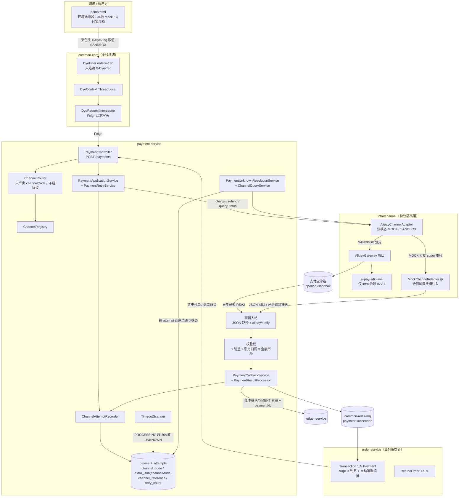
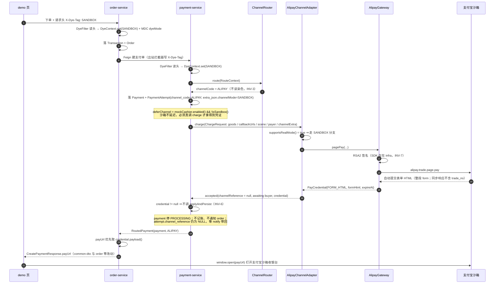
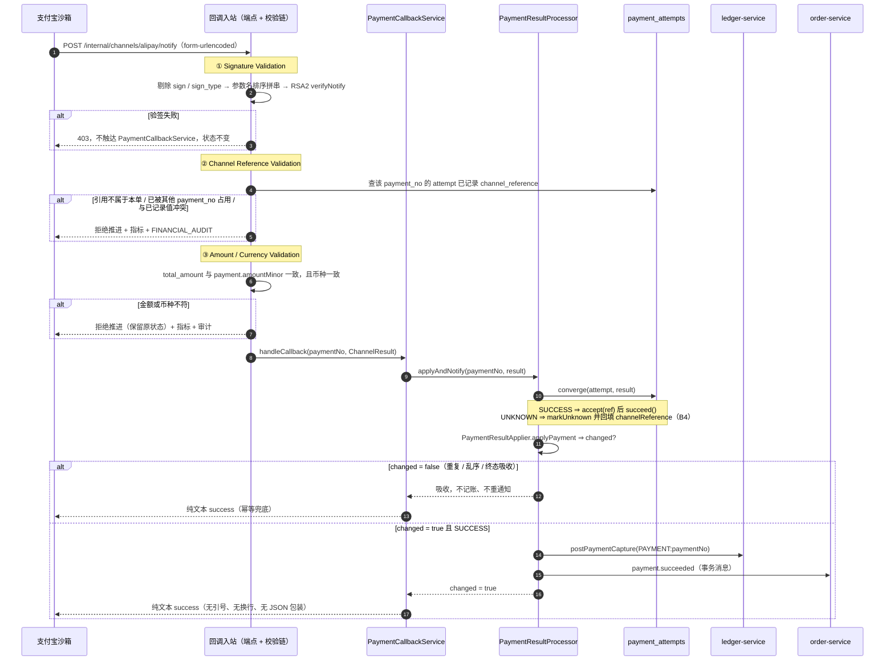
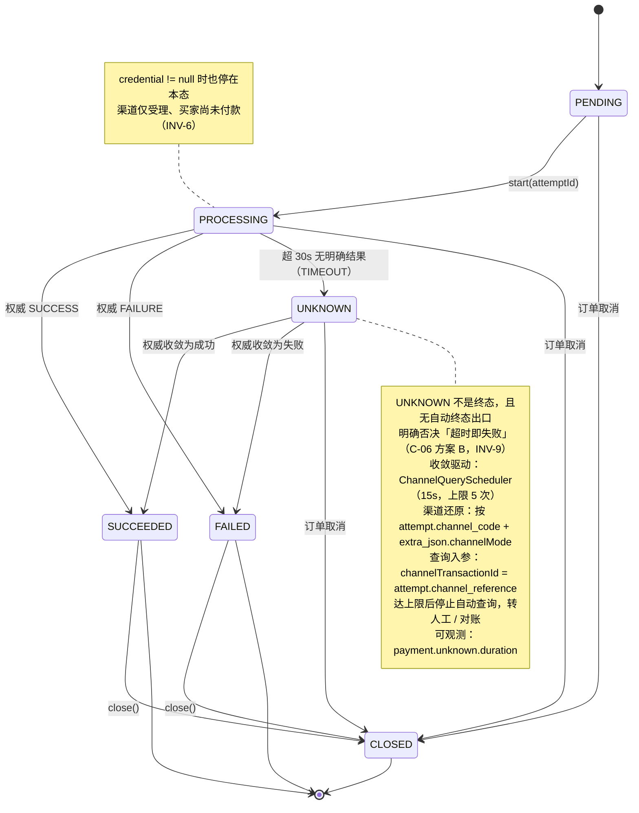

# Spec: 030-channel-contract-sandbox-callback（统一渠道契约 + Mock/沙箱双模态 + 回调基础闭环）

**版本**：1.1
**日期**：2026-09-19
**状态**：Draft —— **本轮只写 Spec，不写代码**；生成后停止，等待 Plan 指令
**阶段**：`stage-05-channel-and-finance-deepening`（**提案中**；阶段命名与 Feature 编号属宪法 §Governance 人类决策边界）
**编号与取代关系**：本 Feature 编号 **`030`**，落在 **stage-05**。原 stage-04 的 `030-channel-contract-dye-alipay-sandbox` 四件套**已于 2026-09-19 整目录删除**（纯文档、零代码实现，其设计已被本 Spec 全量吸收）——见 [§0.3](#03-编号裁决与旧-030-的处置)
**依赖决策**：[ADR-0075](../../../adr/0075-unified-channel-contract.md)（🟢 **Accepted**）、[ADR-0076](../../../adr/0076-traffic-dyeing-and-alipay-sandbox.md)（🟢 **Accepted**）——**两者已于 2026-09-19 由 Proposed 升级为 Accepted，门 1 通过**；已登记进 `adr/README.md` 索引表 + 编号速查表 + `adr/traceability.md`
**上游事实来源**：[`design-review.md`](../design-review.md)（v1.1）、[`stage-design.md`](../stage-design.md)（Draft）

## 修订记录

### v1.1（2026-09-19）—— 负责人裁决 4 项

| # | 项 | 裁决 | 本 Spec 的相应改动 |
|---|---|---|---|
| **H1** | ADR-0075 / ADR-0076 是否由 Proposed 转 Accepted | ✅ **同意升级为 Accepted** | 两份 ADR 状态已改；已登记进 `adr/README.md` 索引表 + 编号速查表（标题改 `0001–0076`）+ `traceability.md`；`下一可用编号` 更新为 **ADR-0077**。**门 1 通过** |
| **H2** | 渠道模态如何落库 | ✅ **采用通用 JSON 列承载**（**不新增**专用 `channel_mode` 列） | §14.1 改为 `payment_attempts.extra_json TEXT NULL`，模态以键 `channelMode` 承载；**沿用项目既有 `payload_json` / `matches_json` 的「TEXT 存 JSON」先例**（不用 MySQL 原生 `JSON` 类型，避开 H2 方言）；新增**写入侧强制**（FR-303）与**读取侧 fail-safe**（FR-304）两条约束 + 风险 **R17** |
| **H3** | 支付宝 SDK 引入 | ✅ **A 引入官方 SDK** | FR-135 保持；H3 由「待裁决」转为**已批准**（CVE 与体积风险**显式接受**，已记入 ADR-0076） |
| **H4** | 回调金额不符的处理 | ✅ **A 拒绝推进 + 记差异** | FR-210 / FR-211 的口径**确认为「拒绝推进 + 保留原状态 + 记指标与审计」**；H4 由「待裁决」转为**已批准** |

**v1.1 后仍未裁决**：**H9/H15**（阶段命名与 Feature 编号重排）、**H13**（`UNKNOWN → ACCEPTED` 是否放行）、**H17**（B7 是否加兜底扫描器）、**H20**（C-23 / 渠道 `close` 归属）。
**这 4 项均不阻塞本 Spec 的主体实现**（详见 §18 附 A）。

> **本 Spec 的输入不是「通用支付系统经验」，而是两份已定稿文档 + 当前代码**：
> `stage-design.md`（方向）→ `design-review.md` v1.1（以代码为事实来源的冲突清单）→ 本 Spec（Feature 需求）。
> 所有现状断言都带 `文件:行号` 证据；所有推断都显式标注。

---

## 0. 定位、范围切分与取代关系

### 0.1 一句话目标

把**内部渠道契约从「极简 mock 契约」升级为「能容纳真实渠道的契约」**，并在这条链路上**真正打通一次真实渠道的完整闭环**（下单 → 拿凭证 → 回调 → 收敛 → 可追溯），
同时把 `design-review` 已确认的 **4 项一致性与安全缺陷**就地收口。

### 0.2 本 Spec 的两类内容（**必须严格区分**）

本 Spec 包含两类性质完全不同的工作。**不得混为一谈**，验收与风险也分别评估。

| 类别 | 定义 | 本 Spec 中的项 | 性质 |
|---|---|---|---|
| **A · Feature 新增能力** | 今天不存在的能力 | 统一契约、类型化凭证、染色分流、模态落库、支付宝沙箱适配器、notify 端点、demo 开关 | 新功能 |
| **B · Existing behavior correctness closure** | 今天已存在但**有已确认缺陷**的行为 | **B1**（C-01 账本幂等键双口径）、**B2**（C-04/C-05 回调语义校验）、**B4**（C-10 渠道受理流水号回填）、**B7**（C-18 在途守卫区分重放/重试） | **缺陷修复**，不是新业务功能 |

**边界纪律（负责人 2026-09-19 明确）**：

1. B 类**只修复上述 4 项已确认的 correctness gap**，**不重新设计** Ledger / Refund / Reconciliation / Settlement；
2. B 类**不引入**新的独立业务功能、不引入 MQ / Seata / 新服务 / 新中间件；
3. B 类的**行为约束、边界条件、验收标准**必须在 §9 / §10 / §14 / §16 中显式给出，不能只写「顺手修一下」；
4. B 类与 A 类**在同一批文件上落地**（`ChannelResult` / `ChargeRequest` / `PaymentResultProcessor` / `PaymentApplicationService` / `doCreateRefund`），
   这是把它们并入本 Spec 的唯一理由——**不是范围扩张，是避免同一段代码改两遍并夹带旧缺陷**（`design-review` §14.2 关键理由 1 / 5）。

### 0.3 编号裁决与旧 030 的处置

**事实（已核实）**：

| # | 事实 | 证据 |
|---|---|---|
| 1 | stage-04 的 `030-channel-contract-dye-alipay-sandbox` 四件套**曾存在**，范围与本 Feature 高度重叠 | 已于 2026-09-19 **整目录删除**（`git log --diff-filter=D` 可回溯） |
| 2 | **旧 030 从未实现**：全仓 `channel_mode`（schema）0 命中、`channelMode` / `DyeContext` / `PayCredential`（Java）0 命中、无 alipay notify 端点 | `grep -rn "channel_mode" deployment/schema/`；`grep -rln "DyeContext\|PayCredential" --include=*.java .`（均空） |
| 3 | 旧 030 的 `tasks.md` T31/T32 仍是**已被 H2 裁决废弃的 `channel_mode` 专用列**口径 | 与 §14.1 的 `extra_json.channelMode` 直接冲突 ⇒ 保留即误用风险 |
| 4 | **两份 stage-05 文档对渠道 Feature 的编号自相矛盾** | `stage-design.md §9.2` 称 `031-channel-contract-dye-sandbox`（「spec 030 的实现轮」，编号自 031 起）；`design-review.md 附 A` 称 `030 · channel-contract-dye-sandbox` |

**负责人裁决（2026-09-19）**：**删除旧 030，渠道 Feature 统一编号为 `030`**。即：

- 本 Feature 编号 **030**，落在 **stage-05** 下；
- 旧 030 的**全部已定稿设计**（全部 FR 需求 / INV-1~INV-8 / SC-001~SC-016 / D1~D11）**作为契约基线被本 Spec 吸收**，
  不重新推导、不推翻；
- 旧 030 的四件套**整目录删除**（**不是**「加横幅保留」）——其内容已被本 Spec 全量吸收，且含与 H2 裁决冲突的旧口径；
- 删除的**决策痕迹**由三处承载：① [ADR-0075](../../../adr/0075-unified-channel-contract.md) / [ADR-0076](../../../adr/0076-traffic-dyeing-and-alipay-sandbox.md)（真正的决策记录）；
  ② 本节；③ git 历史（`git log` 可完整回溯四份文件）；
- **后续 Feature 编号是否顺移**（`design-review 附 A` 的门 3 序列原为 031 ledger / 032 recon / …）**本轮不决定**，记为待裁决项（见 §18 附 A 的 H9/H15）。

> ⚠️ **仍需人工确认（H9 / H15）**：stage-05 的阶段命名、以及**后续 Feature 的编号重排**。
> 渠道 Feature 占用 `030` 后，`design-review 附 A` 的门 3 序列（031 ledger / 032 recon / 033 test / 034 reliability / 035 observability）
> **是否需要整体前移一位**，本 Spec **不自行决定**，只在 §18 附 C 记录待办。

### 0.4 本 Spec 与 L0 文档的关系

- 本 Spec **不是** L0 当前系统事实源；所有 `【目标】` 项在实现完成前 **MUST NOT** 写入 `technical-solution.md` / `systems/*.md`；
- **字段级契约权威定义**仍在 [`payment-service.md §3.11`](../../../architecture/systems/payment-service.md#311-渠道内部契约spec-030--adr-0075)（**该节待门 0 补齐，见 D-1**），本 Spec 只承载**需求与验收**，不复制字段表；
- 本 Spec 中的**新决策**（若有）MUST 先立 ADR，不得以 Spec 替代 ADR。

---

## 1. Background / 背景

### 1.1 三个「文档许诺过、代码装不下」的缺口

**缺口 A（契约装不下真实渠道）**

| 出处 | 现状原文 | 性质 |
|---|---|---|
| `ChargeRequest.java:8` | `record ChargeRequest(String paymentNo, Long attemptId, long amountMinor, String currencyCode, String channelCode)` —— 5 参数、零校验 | 事实 |
| `ChannelResult.java:22` | `record ChannelResult(Status, channelReference, reason, transportCode, businessCode)` —— **无付款凭证载体** | 事实 |
| `QueryStatusRequest.java:8` | `record QueryStatusRequest(String paymentNo, String transactionId, String idempotencyKey)` —— **`transactionId` 是平台侧交易号，不是渠道交易号**（C-12） | 事实 |
| `RefundRequest.java:8` | `(paymentNo, refundNo, amountMinor, currencyCode, channelCode)` —— **无渠道交易号、无原支付金额** | 事实 |

后果：支付宝要 `subject`（必填）、微信要 `description` + `payer.openid`、Stripe 要 `payment_method_types` —— **一个字段都放不下**；
渠道下单返回的「怎么把用户带去付款」（二维码 / 表单 / `client_secret`）**无处承载**。

**缺口 B（无分流机制）**

全项目**不存在任何「环境 / 染色 / 灰度」机制**：演示页下单**硬编码 `channelCode:'MOCK'`**，没有「走本地 mock 还是走真实沙箱」的选择入口。
（`stage-design §1.4` 与 030 §1.1 缺口 B 一致。）

**缺口 C（模态不可追溯）**

`payment_attempts` **没有渠道模态列**（`deployment/schema/03-payment-schema.sql:34-58` 已逐列核对）。
一旦同一 `channel_code` 下存在两种协议实现（mock / 真实），
**退款 / 主动查询 / 超时扫描**这三条**没有入站请求上下文**的反向路径就无从判断该用哪一种——
它们的调用方是调度器，不经入站 Filter，`ThreadLocal` 为空。

### 1.2 代码现状（2026-09-19 复核真实代码）

> 本节是 030 §1.2 的**复核版**：沿用 030 的 S1~S17 结论，并补上 v1.1 新发现的事实（S18~S22）。

| # | 事实 | 证据 |
|---|---|---|
| S1 | 端口 `PaymentChannel` 只有 4 个方法（`channelCode` / `charge` / `refund` / `queryStatus`），**无任何 `default` 方法、无 `close`** | `application/channel/PaymentChannel.java:11-39` |
| S2 | `ChannelResult` 的 7 个静态工厂 + 私有 `of(...)` + `withReason`，**全部不携带付款凭证** | `ChannelResult.java:37-120` |
| S3 | 直接实现 `PaymentChannel` 的测试桩共 **6 处** | `ChannelQueryTest:32`、`PaymentRetryTest:42`、`ReliabilityMetricsTest:37`、`PaymentDeferredChannelTest:25/75`、`ConfiguredChannelRouterTest:27` |
| S4 | 直接 `new ChargeRequest(...)` 共 **4 处**（生产 1 + 测试 3） | `PaymentApplicationService.java:187`、`PaymentChannelContractTest:16`、`MockChannelAdapterScenarioTest:23-24`、`PaymentRetryTest:39` |
| S5 | `ChannelResult` 被 **21 个测试文件**引用，**全部走静态工厂**，无外部 `new ChannelResult(...)` | 全量检索 |
| S6 | 订单编排的延迟分支**不调 charge、不落渠道结果** | `PaymentApplicationService.java:177-182` |
| S7 | 延迟开关是**全局**的：`boolean defer = mockCashier.isEnabled()`，一开就对**所有渠道**跳过 charge | `PaymentController`、`payment.mock-cashier.enabled` 默认 `true` |
| S8 | `payUrl` 由 `PaymentController.buildPayUrl` **硬编码**拼 mock 收银台地址，空渠道码回落字面量 `"MOCK"` | `PaymentController` |
| S9 | `CreatePaymentResponse(paymentNo, status, payUrl, attemptSeq, channelCode)` 定义在 **common-dto**，order-service 侧**透明透传** | `common/common-dto/.../rpc/CreatePaymentResponse.java` |
| S10 | **traceId 三段式骨架完整可照抄**：`TraceIdFilter`(-200) + `TraceContext`(ThreadLocal) + `TraceIdRequestInterceptor`（全仓唯一 Feign `RequestInterceptor`） | `common-core/.../trace/`、`config/` |
| S11 | `common-core` 被 **9 个业务服务 + common-dto + common-mybatis + mock-channel-web** 依赖 ⇒ 在 common-core 加 Filter/Interceptor **天然覆盖全栈，无需改任何服务 pom** | 各服务 pom |
| S12 | 演示页经 `mock-channel-web`(8091) 的 `/proxy/{service}/**` **黑名单式逐头透传** ⇒ 任意自定义头都能原样到 order-service，**代理零改动** | `DemoProxyController.copyRequestHeaders` |
| S13 | `payment_attempts.channel_reference` 是 **`VARCHAR(128)` + 唯一约束** `uk_attempts_channel_reference`；`payment_no` / `(payment_no, attempt_type)` 索引**非唯一** | `03-payment-schema.sql:34-58` |
| S14 | schema **无 Flyway / 无 ddl-auto**，靠 `deployment/demo/reset.sh` 重放建表；建表用 `CREATE TABLE IF NOT EXISTS`（**存量库不会补列**） | `deployment/schema/`、`deployment/demo/reset.sh` |
| S15 | payment-service pom **无 alipay-sdk / okhttp / httpclient**；根 pom `dependencyManagement` 也无 | `payment-service/pom.xml` |
| S16 | 支付回调入站只有 **HMAC 占位**：`ChannelCallbackSignatureFilter#verifySignature` **恒 `return true`**（`web/ChannelCallbackSignatureFilter.java:91-94`） | 同文件 |
| S17 | **先例教训**：`InternalTokenRequestInterceptor` + 入站校验曾因「入站校验上线但调用方未同步补出站头」导致**全线 403**，被整体删除（ADR-0024 / ADR-0034） | `0034-internal-token-decisions.md` |
| **S18** | **`PaymentStatus` 有 5 个非终态/终态值**：`PENDING / PROCESSING / SUCCEEDED / FAILED / UNKNOWN / CLOSED`；终态 = `SUCCEEDED / FAILED / CLOSED` | `domain/PaymentStatus.java:8-15`、`Payment.java:141-160` |
| **S19** | **`PaymentAttemptStatus` = `PENDING / ACCEPTED / SUCCEEDED / FAILED / UNKNOWN`**；`markUnknown` 允许 `PENDING/ACCEPTED → UNKNOWN`；`accept` **只接受 `PENDING`**（⇒ `UNKNOWN → ACCEPTED` 不被允许，C-10②） | `domain/PaymentAttemptStatus.java`、`PaymentAttempt.java:98-167` |
| **S20** | `converge` 的 `UNKNOWN` 分支**只 `markUnknown`、不 `accept`/不回填** `channelReference`（C-10①） | `infra/persistence/ChannelAttemptRecorderImpl.java:69` |
| **S21** | `ChannelQueryService.queryRound` 调 `channel.queryStatus(new QueryStatusRequest(paymentNo, transactionId, idempotencyKey))` —— **不传 `attempt.channelReference`**（C-12 的直接后果） | `application/reliability/ChannelQueryService.java:95-96` |
| **S22** | `ChannelQueryService.resolveRecordedChannel` 用 `findByPaymentNo(...).filter(TYPE_PAYMENT).filter(status != PENDING).findFirst()` —— **无 `ORDER BY`、不读模态** | 同文件 `:116-132` |

### 1.3 为什么必须同一个 Spec

- **凭证必须挂在契约上**：先加凭证字段再做染色 = 把 `ChannelResult` 动两遍；
- **染色的消费者就是适配器的双模态分发**，没有契约变更，双模态无处产出凭证；
- **模态落库是染色在异步/无请求上下文场景下的唯一闭环手段**：不做落库，染色只覆盖「下单付款」一条链，
  退款与超时扫描会**静默走错协议**——比不做更危险；
- **B 类收口必须与 A 类同批**：B1/B7 的改动点（`PaymentResultProcessor` / `PaymentApplicationService` / `doCreateRefund`）
  与 A 类的契约改造点**高度重叠**；分两批会在同一批文件上改两次，且**存在把旧缺陷语义带进新代码的风险**
  （`design-review §14.2` 关键理由 1 / 5）。

---

## 2. Goals / 目标

### 2.1 A 类：Feature 新增能力（7 项）

| # | 目标 | 可验证产出 |
|---|---|---|
| G1 | **契约能容纳四家**：内部统一契约同时兼容支付宝 / 微信 v3 / 抖音 / Stripe，渠道私有参数有处可放且不污染通用字段 | 四家参数映射表驱动单测；既有 4 处构造点 / 6 处测试桩**零改动编译** |
| G2 | **凭证能回到浏览器**：渠道返回的「怎么付款」有类型化载体，经现有 `payUrl` 链路回到前端 | `payUrl` = 支付宝沙箱**自动提交表单 HTML**（`PayCredential.Kind = FORM_HTML`，**不是 URL**；见 §2.5 实况修正） |
| G3 | **沙箱下单真的跳第三方**：染色为 `SANDBOX` 时真调渠道，**不再跳我们的 mock 收银台** | 手工 live：把凭证渲染成页面后打开支付宝沙箱收银台（表单 HTML 需先包装，**直接 `window.open` 会得到空白页**） |
| G4 | **模态可追溯**：`payment_attempts` 记录本次交互模态，**反向三条路径据此还原** | 沙箱单的退款 / 主动查询断言 `extra_json.channelMode='SANDBOX'` |
| G5 | **回调基础闭环**：`Signature Validation → Channel Reference Validation → Amount/Currency Validation` 三段式可执行、可验收 | 验签失败 403；金额不符拒绝推进；串号引用被拒 |
| G6 | **UNKNOWN 语义纪律**：超时**不转 FAILED**，只进 UNKNOWN，且**仅经权威结果收敛** | 超时单收敛路径单测 + `payment.unknown_age` 可观测 |
| G7 | **Payment Domain 不依赖具体渠道 SDK**：SDK / 签名 / 参数映射 / 错误码全部隔离在 `infra` 之后 | ArchUnit：`application/**` MUST NOT 依赖 **Java 包** `com.alipay.api`（Maven 坐标 `com.alipay.sdk:alipay-sdk-java`，两者不可混用） |
| G8 | **demo 可选环境**：演示页选「本地 mock / 支付宝沙箱」，经全链路染色传到适配器 | demo 页环境选择器 + 全链路透传 E2E |

### 2.2 B 类：Existing behavior correctness closure（4 项，**受控范围**）

| # | 收口项 | 对应冲突 | 一句话 |
|---|---|---|---|
| **B1** | 账本幂等键口径统一 | **C-01** 🔴 | 同一支付单的同步路径与回调路径必须产生**同一个** posting 键 |
| **B2** | 回调语义校验（金额 + 渠道引用归属） | **C-04** / **C-05** 🟠 | 两条回调路径**同口径**校验金额与 `channelReference` 归属 |
| **B4** | `channelReference` 正确回填与持久化 | **C-10** 🟠 | `converge` 的 UNKNOWN 分支补回填，受理流水号不丢 |
| **B7** | `doCreateRefund` 在途守卫区分「重放 / 重试」 | **C-18** 🟠 | 重试**不被在途守卫吞掉**，重复支付的钱不会永久不退 |

**B 类的红线**：

- ❌ **不重新设计** Ledger / Refund / Reconciliation / Settlement 的模型或流程；
- ❌ **不引入** MQ / Seata / 新微服务 / 新中间件 / 分布式事务；
- ❌ **不新增**独立业务功能（B2/B4 是回调链路的**必要安全与一致性约束**，B1/B7 是**现有能力的 correctness closure**）；
- ❌ **不触碰 C-11**（重复支付自动退款是**既有正确能力**，见 §4.4）。

### 2.3 目标链路

```
Transaction (order-service)
      ↓
   Payment
      ↓
PaymentAttempt ──（落 channel_code / extra_json(channelMode) / channel_reference）
      ↓
Channel Router ──（只产出 channelCode，不碰协议）
      ↓
PaymentChannel（端口）
      ↓
Mock / Sandbox Channel（Adapter，双模态）
      ↓
   Callback ──（验签 → 引用归属 → 金额币种 → 收敛）
      ↓
PaymentAttempt
      ↓
   Payment
      ↓
Transaction
```

---

### 2.4 目标架构图



**读图要点**：

- **`ChannelRouter` 与协议层完全解耦**：它只产出 `channelCode`，不引用 `infra/channel/**`（INV-4）；
- **`common-core` 是染色的唯一落点**：一处实现即覆盖 9 个服务（S10 / S11），**order-service 与代理零改动**；
- **`payment_attempts` 是反向路径的唯一事实来源**：`UNK` 与 `TS` 都从它还原渠道与模态（§4.2）；
- **SDK 只出现在 `INFRA` 子图**：`application/**` 不依赖 **Java 包** `com.alipay.api`（INV-7）。

### 2.5 实现期实况修正（2026-09-20，两处「声明 ≠ 实况」）

> 本 Spec 的 G2/G3/FR-122/FR-136 与 SC-A-04/SC-A-09 在实现与联调后被证明与真实 SDK 行为/门禁实况不符。
> 修正**不改变任何决策语义**（凭证仍类型化、SDK 仍收口），只是把声明对齐到实况。两处均为**发现的缺陷**，不是范围变更。

| # | 项 | 原声明 | 实况（证据） | 处置 |
|---|---|---|---|---|
| **F1** | 沙箱凭证**形态** | 「**GET 签名 URL**」，`PayCredential.redirectUrl(url, …)` ⇒ `Kind = REDIRECT_URL` | SDK 的 `client.pageExecute(request).getBody()` 返回**整段自动提交表单 HTML**（`<form method="post">` + `document.forms[0].submit()`）——官方示例的用法即「把表单 HTML 输出到页面」；联调实况 `payUrl` 首字符为 `<`（`demo.html` 为此加了 `isFormHtmlCredential` 兜底） | `Kind.FORM_HTML`（该枚举本就为此而设，此前**从未被使用**）+ 新增 `PayCredential.formHtml(...)` 工厂；`AlipayChannelAdapter.sandboxCharge` 改用之 |
| **F2** | INV-7 的 ArchUnit 门禁 | 「`application/**` MUST NOT 依赖 `com.alipay.sdk`」由 ArchUnit 构建期强制 | 该 **Java 包不存在**（`com.alipay.sdk` 只是 Maven groupId）；真实包是 `com.alipay.api`，全仓仅 `AlipaySdkGateway` 引用（1 个 class）。`resideInAPackage("com.alipay.sdk..")` ⇒ 规则**恒通过**，是**空转的假绿门禁** | 规则改为 `com.alipay.api..`，并加**阳性对照**（断言 `AlipaySdkGateway` 真实依赖该包），使同类笔误立即红 |

**F1 的连锁影响（为何必须修）**：`PayCredential.isRedirectFamily()` 的契约语义是「消费端可直接 `window.open(payload)`」。
把表单 HTML 标成 `REDIRECT_URL` 让该判据对被误标的凭证返回 `true` ⇒ 调用方按「可直接跳转」处理 ⇒
浏览器把 HTML 当相对地址解析 ⇒ **空白页**。这正是 spec 030 联调时「点了弹出空白收银台」的根因之一。
**纪律**：形态判据恒用 `Kind`，**不得**靠 payload 首字符嗅探（`demo.html` 的兜底属展示层防御，不是契约）。

---

## 3. Non-Goals / 非目标

**明确不做**（本轮范围外，**不得顺手做**）：

| # | 不做 | 依据 |
|---|---|---|
| N1 | **完整 Ledger 重构**（余额视图 / 期间 / 试算平衡 / 待记账台账） | `stage-design §4`（→ 后续 Feature） |
| N2 | **完整 Reconciliation 改造**（真实账单来源 / 商户维度 / 差异处置策略化） | `stage-design §5`、C-13 / C-20（→ 后续 Feature） |
| N3 | **完整 Settlement 改造**（负净额会计 / 真实出款） | `stage-design §5.2 R3`、C-07（→ 后续 Feature） |
| N4 | **AI Agent** | 非本阶段方向 |
| N5 | **不新增 MQ / 新主题** | 既有 `common-redis-mq` 语义**不变**；B 类不引入新消息 |
| N6 | **不引入 Seata / 2PC / XA 分布式事务** | 宪法：跨服务用 Saga + Outbox + 幂等 |
| N7 | **不引入 ES / 新存储** | 保持当前架构 |
| N8 | **不新增微服务** | 保持 9 个服务 |
| N9 | **不引入 Kubernetes / Service Mesh / API 网关** | `stage-design §2.4` |
| N10 | **不接微信 / 抖音 / Stripe 的真实协议** | 契约先兼容四家，**实现只做支付宝沙箱** |
| N11 | **不新建 `AlipaySandboxChannelAdapter`** | 单 Adapter 双模态（030 D8） |
| N12 | **不改渠道码**（不把 mock 三兄弟改成 `ALIPAY_MOCK`） | 避免波及演示脚本 / 前端 / 测试 |
| N13 | **不做二维码 / 表单 / JSAPI 参数的端到端承载** | 030 L1 / FR-018（需改 `common-dto`，属 API 变更） |
| N14 | **不改支付状态机**（待付款复用 `PROCESSING`，不新增 `AWAITING_PAYMENT`） | 030 D7 |
| N15 | **不实现渠道 `close`（关单）** | 见 §7.2 —— 属**行为变更**，已由 C-23 / H20 挂起 |
| N16 | **任何「超时即失败」的自动终态化** | 宪法 §V.7；`design-review §14.3` |
| N17 | **为「渠道切换双成功」新增任何自动退款编排** | **该能力已存在**；`design-review §14.3` 明确禁止 |
| N18 | **新增「禁止多个 Payment SUCCESS」的约束** | 同上（v1.0 方案已撤销） |
| N19 | **新增「换渠道前先关闭旧 Payment」的编排规则** | 同上 |
| N20 | **引入 Nacos 配置中心 / `@RefreshScope`** | 染色靠请求头，不靠动态配置 |
| N21 | **把 `stage-design` 的 `【目标】` 项写入 L0 文档** | 会造成虚假合规 |

---

## 4. Domain Model / 领域模型

### 4.1 核心模型（**不改动**，硬约束）

```
Transaction 1 ──── N Payment
Payment     1 ──── 1 PaymentAttempt（PAYMENT 型）
```

| 项 | 归属 | 说明 |
|---|---|---|
| `Transaction`（聚合根） | **order-service** | 表 `transactions`；`TransactionApplicationService` 承载 surplus 判定与自动退款编排 |
| `Payment` | **payment-service** | 表 `payments`；持 `transaction_id` **仅作引用列**，payment-service **不持有 Transaction 聚合** |
| `PaymentAttempt` | **payment-service** | 表 `payment_attempts`；**复用承载** `PAYMENT` / `REFUND` 两类尝试（spec 016 的 Feature / FR-017） |

**MUST NOT**：

- ❌ 修改上述基数关系；
- ❌ 让 payment-service 拥有 Transaction 的业务编排权；
- ❌ 让 `Payment` 依赖具体渠道实现（`Payment ≠ Channel`）；
- ❌ 引入 `Payment 1:N PAYMENT-type attempt` 语义。

> ⚠️ **既有文档漂移（不在本 Spec 修复范围，仅记录）**：`technical-solution.md §4.2` 写「1:1」、`systems/payment-service.md §2.1` 写「1:N」，
> 且 schema **无** `UNIQUE(payment_no, attempt_type)` ⇒ **C-02 / C-03**。修复落点为 `design-review 附 A.2` 的「门 0（文档）+ 030-P/本 Spec 应用层断言」。
> **本 Spec 只做「应用层强断言 + 文档口径统一」，不做 schema 唯一约束**（方案 B 需人工决策 H9）。

### 4.2 `PaymentAttempt` 必须自足（**本 Feature 的硬要求**）

**要求**：**后续 Query / Refund / Timeout Scanner 不依赖原始请求上下文，也必须能根据 `PaymentAttempt` 恢复渠道信息。**

今天 `payment_attempts` **已有**的列（`03-payment-schema.sql:34-58`）：

| 列 | 作用 | 是否满足「自足」 |
|---|---|---|
| `payment_no` | 所属支付单 | ✅ |
| `channel_code` | **渠道身份**（反向路径的解析依据，INV-4/INV-6） | ✅ |
| `attempt_type` | `PAYMENT` / `REFUND` | ✅ |
| `channel_reference` | **渠道流水号**（`VARCHAR(128)` + 唯一约束） | ⚠️ **回填缺口**（B4） |
| `status` | `PENDING/ACCEPTED/SUCCEEDED/FAILED/UNKNOWN` | ✅ |
| `retry_count` | 实际重放轮次 | ✅ |
| `error_type` | 双响应码派生分类（仅观测） | ✅ |
| `amount_minor` / `currency_code` | 本次交互资金口径 | ✅ |
| `requested_at` / `responded_at` | 请求/响应时间（TimeoutScanner 依赖 `requested_at`） | ✅ |
| **`extra_json.channelMode`** | **渠道模态（MOCK / SANDBOX）**（通用 JSON 列承载，§14.1） | ❌ **缺失** ⇒ 本 Feature 新增（§14.1） |

**结论**：自足性的唯一结构缺口是 **`extra_json` 的 `channelMode` 键**；另有两处**使用侧**缺口必须同时修：

| 缺口 | 现状 | 修法 |
|---|---|---|
| 反向查询**不用**已落库的 `channel_reference` | `ChannelQueryService:95-96` 传平台 `transactionId`（C-12 / S21） | 契约补 `channelTransactionId` 入参，调用侧传 `attempt.getChannelReference()` |
| 反向解析**不读**模态、**不排序** | `resolveRecordedChannel:116-132`（S22） | 读 `extra_json.channelMode` 并以 `DyeContext.runWith(...)` 包裹渠道调用；取行加确定性排序 |

### 4.3 两层退款单模型（**不改动**）

`TXRF`（order-service，`transaction_refunds`，幂等键 = `refundNo`）→ `PMRF`（payment-service，`refunds`，幂等键 = TXRF），双号互记。
本 Spec **不改**该模型（ADR-0067 / spec 019）。

### 4.4 重复支付自动退款（**既有能力，不改动**）

> **本 Feature 只需确保「新 Channel Contract 能支持既有重复支付自动退款流程」，不重新设计。**

- **入口**：`TransactionApplicationService.onPaymentSucceeded:93-116` 按 `order.getStatus()` 分派；
  `:98-106` 已 PAID + 不同支付单 ⇒ `surplusRefund(..., "DUPLICATE_PAYMENT")`；`:107-112` 非可支付态 ⇒ `surplusRefund(..., "ORDER_NOT_PAYABLE")`。
- **生效支付权威源** = **`Order.paymentNo`**（首张成功者为准），**不是** `Transaction.paymentNo`（C-24 影权威）。
- **幂等三层**：order 在途守卫 → payment TXRF 幂等键 → `RefundPolicy` 累计上限。
- **判定**：`design-review` v1.1 已将其从 🟠 降级为 **⚪ 验证通过**，10 点逐条结论见 `design-review §11 C-11`。

**本 Feature 的接口义务（唯一）**：

| # | 义务 | 说明 |
|---|---|---|
| O1 | 新契约的 `RefundRequest` 扩展后**必须仍能被 `PaymentAutoRefundService` 的调用链使用** | 即 `PaymentRefundService` → `refund(RefundRequest)` 路径零语义变化 |
| O2 | `channelReference` 的回填（B4）**不得改变** surplus 退款单的账务口径 | surplus TXRF 仍**不累加** `refunded_minor`、不改订单状态、不终止履约 |
| O3 | 模态还原（§7.4）**不得让 surplus 退款改换渠道** | INV-4：反向路径按 `attempt.channel_code` 解析，禁止重新路由 |

> ⚠️ **明确禁止**：任何「禁止多 Payment SUCCESS」「换渠道前关闭旧 Payment」的改造——**会破坏当前正确的行为**（`design-review §14.3` / §14 尾注）。

---

## 5. API / 接口

### 5.1 对外（跨服务 / 前端可见）接口 —— **零破坏**

| 端点 | 方法 | 现状 | 本 Feature |
|---|---|---|---|
| `POST /payments` | 建支付单（order → payment） | 存在（`PaymentController`） | **请求/响应体不变**；`payUrl` 语义改为「优先取凭证」（§7.3） |
| `POST /internal/payments/refund-command` | 自动退款命令（order → payment） | 存在（`PaymentRefundCommandController`） | **不变** |
| `POST /internal/payments/{paymentNo}/channel-callback` | 渠道 JSON 回调 | 存在（`ChannelCallbackController`） | **路径与请求体不变**；**新增语义校验**（B2） |
| `POST /internal/refunds/{refundNo}/channel-callback` | 退款渠道回调 | 存在 | **不变** |
| `GET /internal/payments/confirmed-facts` | 对账事实 | 存在 | **不变**（C-20 的期间/商户维度属后续 Feature，N2） |
| `GET /internal/channels` / `/route-preview` / `POST /internal/channels/{code}/status` | 渠道管理 | 存在（`ChannelAdminController`） | **不变** |

**硬约束**：**`common-dto` 与 order-service 一字不改**（030 D6 / S9）；`CreatePaymentResponse` 字段集**不变**。

### 5.2 新增接口

| 端点 | 方法 | 形态 | 说明 |
|---|---|---|---|
| `POST /internal/channels/alipay/notify` | 支付宝异步通知 | `application/x-www-form-urlencoded` | RSA2 验签；**响应体必须恰好是纯文本 `success`** |

> 路径**天然不在** `ChannelCallbackSignatureFilter` 的 urlPatterns（`/internal/payments/*/channel-callback`、`/internal/refunds/*/channel-callback`）内，
> 与 HMAC 占位过滤器**不冲突、不复用**（算法与报文形态都不同：支付宝是 RSA2 + 表单）。

### 5.3 服务内契约（非跨服务 RPC）

`ChargeRequest` / `RefundRequest` / `QueryStatusRequest` / `ChannelResult` 均为**服务内契约**，
不触发宪法「API Breaking Change」人类决策边界；**靠兼容构造器 + `default` 方法保证零中断编译**。

---

## 6. State Machine / 状态机

### 6.1 `PaymentStatus`（**不改**）

```
PENDING ──start(attemptId)──► PROCESSING ──┬──► SUCCEEDED  (终态)
                                            ├──► FAILED     (终态)
                                            ├──► UNKNOWN ──(权威结果)──► SUCCEEDED / FAILED
                                            └──► CLOSED     (终态，订单取消 / 显式 close)
SUCCEEDED / FAILED ──close()──► CLOSED
```

**不变量**：

- `UNKNOWN` **不是**终态；`markUnknown` 只允许 `PROCESSING → UNKNOWN`（`Payment.java:102-109`）；
- 终态（`SUCCEEDED/FAILED/CLOSED`）**吸收**迟到的冲突结果（`transitionTo` 返回 `false`）；
- **超时不得写 `FAILED`**（宪法 §V.7）：`TimeoutScanner` 只写 `UNKNOWN`（`TimeoutScanner.java:54-58`）；
- `closeByOrderCancelled`：`PENDING/PROCESSING/UNKNOWN → CLOSED`；**`SUCCEEDED` 不关闭**（事实不回滚，由 order 侧 surplus 处置）。

> ⚠️ **已知缺陷（不在本 Spec 范围）**：订单取消后渠道迟到成功 ⇒ 终态吸收 ⇒ **不发 `payment.succeeded`** ⇒ order 侧 `surplusRefund` **不可能触发** ⇒ 钱收下了、无追回（**C-23**，落点 034 / H20）。本 Spec **不修**。

### 6.2 `PaymentAttemptStatus`（**本 Feature 需明确 `UNKNOWN → ACCEPTED` 口径**）

```
PENDING ──accept(ref)──► ACCEPTED ──┬──► SUCCEEDED (终态)
                                    └──► FAILED    (终态)
PENDING / ACCEPTED ──markUnknown──► UNKNOWN ──(权威结果)──► SUCCEEDED / FAILED
```

| 迁移 | 现状 | 本 Feature 动作 |
|---|---|---|
| `PENDING → ACCEPTED` | ✅ 允许（`accept`） | 不变 |
| `PENDING/ACCEPTED → UNKNOWN` | ✅ 允许（`markUnknown`） | 不变 |
| `UNKNOWN/PENDING/ACCEPTED → SUCCEEDED/FAILED` | ✅ 允许（`succeed()` / `fail()` 的 from 集含三者） | 不变 |
| `UNKNOWN → ACCEPTED` | ❌ **不允许**（`accept` 只接受 `PENDING`）⇒ `ACCEPTED` **无任何路径能停留** | **NEEDS HUMAN DECISION**（见下） |
| 终态吸收 | ✅ | 不变 |

**关于 `UNKNOWN → ACCEPTED`（C-10②）**：

- 支付宝 `WAIT_BUYER_PAY` 场景需要表达「**已受理、买家未付**」。今天只能 `markUnknown`，语义是「不知道」，**丢失了「已受理」这一信息**；
- **候选方案**：**A** 允许 `UNKNOWN → ACCEPTED`（状态机变更）；**B** 承认 `ACCEPTED` 为预留态并在本 Feature **删除该状态**；
- **推荐**：**A**（语义更准确，且 `backfillChannelReference` 已允许在 `UNKNOWN` 行生效，二者一致）；
- **是否人工决策**：**是** —— 状态机变更属宪法 §Governance 人类决策边界（`design-review` H13 / C-10(B/C)）。

> 本 Feature **B4 只做 `UNKNOWN` 分支的 `channelReference` 回填**（不涉及状态迁移，方案 A/B 之外的确定性修复），
> `UNKNOWN → ACCEPTED` 的口径**留待裁决**；裁决前实现**不得**自行放行该迁移。

---

## 7. Channel Contract / 渠道契约

### 7.1 契约切分判据（唯一标准）

| 情形 | 归属 |
|---|---|
| 四家**语义一致**且支付必需的字段 | **结构化字段**（顶层或分组 record） |
| 仅 1~2 家有、语义不统一、或非必需 | **`channelExtra` 扩展袋**（键值对） |
| **仅与「在哪个端、以什么方式付款」有关** | **`PaymentScene` 枚举**（渠道能力声明的载体） |

**严禁**把渠道私有参数塞进通用字段；**严禁**把通用语义降级成扩展袋（否则等于放弃抽象）。

**四组结构化字段**：`Goods(title, description)` / `CallbackUrls(notifyUrl, returnUrl)` / `Payer(payerId, clientIp)` / `PaymentScene`。
**金额保持扁平**（`amountMinor`(long) + `currencyCode`(String)），不封装 `Amount`。

### 7.2 端口方法逐项审问：「当前真实渠道场景是否真的需要？」

> 本 Feature **不为了抽象而抽象**。对 `PaymentChannel` 的每一个候选方法，必须先回答这个问题。

| 候选方法 | 真实渠道是否需要？ | 证据 | 本 Feature 决策 |
|---|---|---|---|
| `charge`（下单/支付） | ✅ **需要** | 支付宝 `alipay.trade.page.pay`、微信统一下单、Stripe `PaymentIntent` | **保留并扩展**（§7.3） |
| `queryStatus`（主动查询） | ✅ **需要** | 支付宝 `alipay.trade.query`、微信 `GET /v3/pay/transactions/...`、Stripe `GET /v1/payment_intents/{id}` | **保留并扩展**（补渠道交易号，C-12） |
| `refund`（退款） | ✅ **需要** | 支付宝 `alipay.trade.refund`、微信退款、Stripe Refund | **保留并扩展**（补渠道交易号 + `outRequestNo`） |
| `close`（关单） | ⚠️ **真实渠道确实有**（支付宝 `alipay.trade.close`、微信 `.../close`） | 同上 | ❌ **本 Feature 不做** —— 见下方说明 |
| `callback`（回调） | ✅ **需要**，但**不应作为端口方法** | 回调是**入站**方向（渠道 → 平台），不是出站能力 | **落在独立端点 + 验签/解析端口**，**MUST NOT** 加入 `PaymentChannel` |

**关于 `close` 的完整判断（避免「为了抽象而抽象」）**：

- **渠道侧确实需要**：不关单 ⇒ 订单已取消但买家仍可在渠道收银台完成支付 ⇒ **直接放大 C-23**（钱收下、平台无追回）；
- **但引入 `close` 是行为变更**，不是纯契约扩展：它要求 order 侧在**订单取消**时新增一次跨服务渠道调用，
  并定义「关单失败 / 关单 UNKNOWN / 关单与回调竞态」三套语义；
- 该行为变更**已被 `design-review` 挂起**：**C-23 🟠** + **H20**（订单取消后迟到成功的追回路径），落点 **034 reliability-hardening**；
- 因此本 Feature **只在契约中预留（不实现）**，并把它登记为 **NEEDS HUMAN DECISION**（见 §18）。

> **结论**：`PaymentChannel` 本 Feature **保持 4 个方法 + 2 个 `default`**（`supportedScenes()` / `supportsRealMode()`），
> **不新增 `close`**、**不新增 `callback`**。这是刻意的「不做」。

### 7.3 契约扩展（吸收 030 FR-001~FR-018）

| # | 需求 | 兼容性要求 |
|---|---|---|
| FR-101 | 新增 `PaymentScene` 枚举：`WEB / H5 / NATIVE / JSAPI / MINI_PROGRAM / APP`；与四家映射写入 Javadoc 对照表 | 新增类型 |
| FR-102 | 新增 `Goods(String title, String description)` | 新增类型 |
| FR-103 | 新增 `CallbackUrls(String notifyUrl, String returnUrl)`；Javadoc **显式声明**「`returnUrl` 不承载资金事实，MUST NOT 据其推进支付状态」 | 新增类型 |
| FR-104 | 新增 `Payer(String payerId, String clientIp)` | 新增类型 |
| FR-105 | `ChargeRequest` 扩展为 `(paymentNo, attemptId, amountMinor, currencyCode, channelCode, scene, goods, callbackUrls, expireAt, payer, attach, channelExtra)`；**保留 5 参兼容构造器** | **S4 的 4 处构造点零改动** |
| FR-106 | `RefundRequest` 扩展为 `(..., channelTransactionId, outRequestNo, reason, refundNotifyUrl)`；**保留 5 参兼容构造器**。真实渠道退款 **MUST 带渠道交易号** | 兼容构造器 |
| FR-107 | `QueryStatusRequest` 扩展为 `(paymentNo, transactionId, idempotencyKey, channelTransactionId)`；**保留 3 参兼容构造器** | **S21 的调用侧同步改为传 `attempt.channelReference`** |
| FR-108 | `channelExtra` 为 `Map<String,String>`，**可空**；键名用渠道原生参数名（便于排障比对） | — |
| FR-109 | `PaymentChannel` 新增两个 `default` 方法：`supportedScenes()`（默认全支持）、`supportsRealMode()`（默认 `false`） | **S3 的 6 处测试桩零改动** |
| FR-110 | 场景校验落在 payment 层编排（调 `charge` **之前**）：`scene != null` 且不在 `supportedScenes()` ⇒ `400 INVALID_ARGUMENT`；`scene == null` 不校验 | 零回归 |
| FR-111 | 新增 `PayCredential(Kind kind, String payload, Instant expiresAt)`，`Kind ∈ {REDIRECT_URL, FORM_HTML, QR_CODE, H5_URL, JSAPI_PARAMS, CLIENT_SECRET}`；`REDIRECT_URL` 与 `H5_URL` **刻意不合并** | 新增类型 |
| FR-112 | `ChannelResult` 新增**可空** `credential`；新增工厂 `accepted(ref, reason, credential)`；既有 7 个工厂语义不变（`credential = null`）；`withReason(...)` **MUST 保留** `credential` | 5 参构造重载保留 |
| FR-113 | 凭证**不落库**（INV-2）；`payment_attempts` **不新增凭证列** | — |
| FR-114 | 凭证透传：`ChannelResult.credential` → 重试结果 → `RoutedPayment` → `PaymentController` 填进**现有** `CreatePaymentResponse.payUrl`；`payUrl` **优先取凭证**，无凭证则沿用 mock 收银台链接 | **`common-dto` / order-service 零改动** |
| FR-115 | `credential != null` ⇒ **不调 `applyAndPersist`**，payment 停 `PROCESSING`（不记账、不通知 order） | INV-6 |

### 7.4 Channel Router（渠道选择 / 模态 / 配置）

**现状（已存在，spec 028 / ADR-0073，本 Feature 不改其规则）**：

| 项 | 现状 | 证据 |
|---|---|---|
| 端口 | `ChannelRouter.route(RouteContext) → String`，**只产出渠道码，不接触协议** | `ChannelRouter.java:19-32` |
| 输入 | `RouteContext(amountMinor, currencyCode, requestedChannelCode)`；**一期只有 `requestedChannelCode` 参与决策** | `RouteContext.java:6-16` |
| 实现 | `ConfiguredChannelRouter`：显式优先 → 自动选路（`enabled=true` 且 `priority` 最小，同优先级按码字典序）；`DOWN` 排除、`DEGRADED` 降级 | `ConfiguredChannelRouter.java:66-168` |
| 确定性 | 禁止随机数 / 时间 / 进程计数器（INV-3） | `:138-168` |
| 配置 | `payment.routing.enabled` + `channels.{CODE}.{enabled,priority}` + `availability`（**静态桩，不做真实探测**） | `application.yml:54-68` |
| 不改选 | 渠道调用失败后 MUST NOT 改选（spec 015 FR-022） | `ChannelRouter.java:13-14` |
| 不反向使用 | 退款 / 重试 / 主动查询 **MUST NOT** 调 Router（INV-6） | `:15-16` |

**本 Feature 的 Router 相关需求**：

| # | 需求 |
|---|---|
| FR-120 | **染色 MUST NOT 参与选路**（INV-3）：`ChannelRouter` **MUST NOT** 读取 `DyeContext`；相同 `RouteContext` 在两种染色下选出**同一** `channelCode`（ArchUnit 或单测固化） |
| FR-121 | **染色 MUST NOT 让反向路径改换渠道**（INV-4）；反向路径的模态来源是**落库列**而非请求头 |
| FR-122 | **Payment Domain MUST NOT 依赖具体渠道 SDK**：`application/channel/**` MUST NOT 依赖 **Java 包 `com.alipay.api`**（ArchUnit 断言；⚠️ 规则包名必须用真实 Java 包，写 Maven groupId `com.alipay.sdk` 会**恒通过**——见 §2.5 空转门禁修正） |
| FR-123 | 渠道配置**语义不变**：`payment.channel.*`（`http-timeout-ms` / `mock-scenario` / `refund-async*` / `adapters.{ALIPAY,WECHAT,DOUYIN}.scenario`）与 `payment.routing.*` 默认值**全部不变**（等价于旧 030 的既有配置口径） |

### 7.5 Channel Adapter（SDK / 签名 / 参数映射 / 错误码全部隔离）

| # | 需求 |
|---|---|
| FR-130 | **不新建** `AlipaySandboxChannelAdapter`：在既有 `AlipayChannelAdapter` 内双模态分发；`MOCK` 分支 **MUST** `super` 委托（保证基类 4 件横切行为口径 100% 不变） |
| FR-131 | `AlipayChannelAdapter.supportsRealMode()` 返回 `true`；其余三个渠道维持 `default false` |
| FR-132 | 新增端口 `application/channel/AlipayGateway`：`pagePay(...)` / `query(...)` / `refund(...)` / `verifyNotify(...)`；实现 `infra/channel/alipay/AlipaySdkGateway` **收口 SDK**（INV-7） |
| FR-133 | 新增 `AlipaySandboxProperties`（`@ConfigurationProperties("payment.channel.adapters.alipay.sandbox")`）：`enabled` / `gateway-url` / `app-id` / `merchant-private-key` / `alipay-public-key` / `notify-url` / `return-url` / `http-timeout-ms` / `sign-type` |
| FR-134 | `enabled` 默认 **`false`**（既是装配门控，也是**一键 kill switch**）；`enabled=true` 时**启动期强校验**必需项非空，缺失 ⇒ **启动失败并列出缺失项** |
| FR-135 | 新增依赖 `com.alipay.sdk:alipay-sdk-java`（版本在根 pom `dependencyManagement` 锁定）；**CVE 与体积风险显式接受并记入 ADR-0076** |
| FR-136 | `charge`（沙箱分支）调 `alipay.trade.page.pay`，用 **自动提交表单 HTML** 作为凭证：`accepted(null, "awaiting buyer", PayCredential.formHtml(payload, expireAt))` —— ⚠️ **实况修正（2026-09-20）**：`pageExecute().getBody()` 返回的是整段 `<form>` HTML（**不是 URL**），故此处的 `Kind` 为 **`FORM_HTML`** 而非 `REDIRECT_URL`；原文按「GET 签名 URL」实现导致消费端误按可直接跳转处理（空白页） |
| FR-137 | `queryStatus`（沙箱分支）调 `alipay.trade.query`：`TRADE_SUCCESS`/`TRADE_FINISHED` → `success(trade_no)`；`TRADE_CLOSED` → `businessFailure`；`WAIT_BUYER_PAY` → `businessUnknown`（**不臆断**） |
| FR-138 | `refund`（沙箱分支）调 `alipay.trade.refund`（**同步返回**，`code=10000` 即 `success(refund_no)`） |
| FR-139 | 金额换算 **MUST** 用 `BigDecimal.valueOf(amountMinor, 2).toPlainString()`；**禁止 `double` / `float`**（INV-1） |
| FR-140 | 沙箱 HTTP 超时独立配置（默认 `10000ms`），与全局 `payment.channel.http-timeout-ms`(1500ms) 解耦；且 **MUST** 小于 `payment.reliability.timeout`(30s) |
| FR-141 | **错误码映射全部在 Adapter 内**：渠道业务错误码 → `BusinessCode`；通信错误 → `TransportCode`；**MUST NOT** 泄漏渠道错误码到 `application/**` |

### 7.6 模态落库与反向还原

> **载体（H2 裁决）**：模态**不新增专用列**，落在通用 JSON 列 **`payment_attempts.extra_json`** 的 **`channelMode`** 键上（`MOCK` / `SANDBOX`）。DDL 与完整约束见 **§14.1**（FR-300~FR-309）。

| # | 需求 |
|---|---|
| FR-150 | `payment_attempts` 新增列 **`extra_json TEXT NULL`**（**TEXT 存 JSON**，沿用 `payload_json` 先例），模态以键 **`channelMode`** 承载（详见 §14.1） |
| FR-151 | 写入时机：`ChannelAttemptRecorder` 创建 attempt 时读 `DyeContext`（空 → `MOCK`）写入 `channelMode` 键；**接口方法签名不变**（调用点零改动）。**新写入行 MUST NOT 缺失该键**（FR-303） |
| FR-152 | 幂等重复（同 `paymentNo` 回放）取**库内值**，**不覆盖** |
| FR-153 | 反向路径还原：退款 / 主动查询取到 PAYMENT attempt 后，以 `DyeContext.runWith(attempt.getChannelMode(), () -> channel.xxx(req))` 包裹渠道调用；**超时扫描经 `ChannelQueryService` 同路径**。`getChannelMode()` 是领域对象的**只读派生访问器**（由 `extra` 解析，缺失 / 非法一律 `MOCK`，FR-304） |
| FR-154 | 反向解析**确定性**：取 attempt 行 MUST 有确定性排序（禁止无 `ORDER BY` 的 `findFirst`，S22）；解析 MUST **不回落默认渠道**（找不到即 `INTERNAL_ERROR`，不污染别的渠道事实） |
| FR-155 | 存量行向后兼容：`extra_json` 为 `NULL` ⇒ 读为 `MOCK`，**不回填、不修正**（历史事实） |

### 7.7 染色分流（全链路）

| 项 | 取值 |
|---|---|
| 头名 | `X-Dye-Tag` |
| 取值 | `MOCK` / `SANDBOX`（大小写不敏感） |
| **缺省语义** | **不染色 = `MOCK`** —— 安全默认，**绝不误连真实渠道** |
| 非法值 | **400 fail fast** + 指标（ADR-0049 第 2 条：「配错不许静默走默认」） |
| 与配置的关系 | `sandbox.enabled=false` 时，染色 `SANDBOX` → **明确失败**，**不静默回落 mock** |
| 是否参与选路 | **不参与**（INV-3） |
| 透传 | `common-core` 三段式（仿 traceId）：入站 `DyeFilter`（order `-190`）+ `DyeContext`（ThreadLocal）+ 出站 `DyeRequestInterceptor`（Feign 全局） |
| MDC / 响应头 | MDC key `dyeMode`；响应头回写；`finally` 清理 |

| # | 需求 |
|---|---|
| FR-160 | `DyeMode` 枚举（`MOCK`/`SANDBOX`）+ **大小写不敏感严格解析** `parse(String)`：`null`/空白 → `MOCK`；非法 → 抛异常 |
| FR-161 | `DyeContext`：ThreadLocal，提供 `isSandbox()` / `current()` / `set` / `clear` / `runWith(DyeMode, Runnable)` |
| FR-162 | `DyeFilter`（`OncePerRequestFilter`）：读头 → 解析 → `DyeContext.set` + `MDC.put("dyeMode", ...)` → 响应头回写 → `finally` 清理；非法值 → `400` + 指标 `dye_tag_rejected_total{reason=invalid}` |
| FR-163 | `DyeRequestInterceptor`（`feign.RequestInterceptor`）：`DyeContext` 非空时写 `X-Dye-Tag`；**空则不写**（不把缺省语义硬编码进协议） |
| FR-164 | 装配：`CommonCoreAutoConfiguration` 增加 `dyeFilter` + `dyeFilterRegistration(order = -190)`；`FeignTraceAutoConfiguration` 增加 `dyeRequestInterceptor`。**两者必须同批落地（INV-5）** |
| FR-165 | 过滤链定序：`TraceIdFilter(-200)` → `DyeFilter(-190)` → `AccessLogFilter(-100)` |
| FR-166 | `AutoConfiguration.imports` **无需改动**（新增的是已有自动配置类中的 Bean） |
| FR-167 | `payment.mock-cashier.enabled` 语义收窄为「**仅对 mock 模态生效**」：`deferChannel = mockCashier.isEnabled() && !DyeContext.isSandbox()`（沙箱**不延迟**，必须真调 charge 才拿得到凭证） |

### 7.8 契约不变量（不可破坏）

| # | 不变量 |
|---|---|
| INV-1 | 内部一律 `amountMinor`(long) + `currencyCode`(String)；「元字符串」**只在支付宝适配器内部换算**，MUST 用 `BigDecimal.valueOf(minor, 2).toPlainString()`，**禁止 `double`/`float`** |
| INV-2 | `PayCredential.payload` 与任何密钥 **MUST NOT** 入库、**MUST NOT** 进 git、**MUST NOT** 进明文日志；持久化渠道标识恒为 `payment_attempts.channel_reference` |
| INV-3 | `ChannelRouter` **MUST NOT** 读取染色上下文；染色只决定「同 code 下的协议实现」 |
| INV-4 | 退款 / 重试 / 主动查询 **MUST** 用 `payment_attempts.channel_code` 解析渠道，**禁止重新路由**；染色 **MUST NOT** 让反向路径改换渠道 |
| INV-5 | 染色的 `DyeFilter`（入站）与 `DyeRequestInterceptor`（出站）**MUST 在同一批落地**（依据 S17：`InternalToken` 曾因只做入站校验导致**全线 403**） |
| INV-6 | `ChannelResult.credential != null` ⇒ 渠道仅**受理**、买家尚未付款 ⇒ payment **MUST 停在 `PROCESSING`**，**MUST NOT** 走成功收敛路径 |
| INV-7 | `application/**` **MUST NOT** 依赖 SDK 的 **Java 包 `com.alipay.api`**（构建期 ArchUnit 断言；⚠️ 原写 Maven 坐标 `com.alipay.sdk` 会因该包不存在而**恒通过**——见 §2.5 F2） |
| INV-8 | **不静默降级**：染色值非法 / 染色 `SANDBOX` 但渠道未启用真实模式 / 请求了渠道未声明的 `PaymentScene` ⇒ **MUST 明确失败（`400 INVALID_ARGUMENT`）** |
| **INV-9** | **超时 MUST NOT 转 `FAILED`**：`TimeoutScanner` 只写 `UNKNOWN`（宪法 §V.7） |
| **INV-10** | **回调 MUST NOT 在校验失败时推进状态**：验签 / 引用归属 / 金额币种任一失败 ⇒ 拒绝且**原状态不变** |

---

### 7.9 支付时序图（下单 → 凭证 → 回到浏览器）



**读图要点**：

- **`channelReference = null` 是正常状态**：`page.pay` 同步响应不含 `trade_no`，`trade_no` 由异步通知带入（L7）；
- **`credential != null` 不等于成功**：payment 停 `PROCESSING`，**不记账、不通知 order**（INV-6）；
- **染色在 order 与 payment 两侧各读一次**：由 `common-core` 一处实现，两侧零业务代码（S10 / S11）。

---

## 8. Callback / 回调闭环

### 8.1 三段式校验链（**本 Feature 的核心新增**）

```
① Signature Validation  →  ② Channel Reference Validation  →  ③ Amount / Currency Validation
   （身份：这条通知是不是渠道发的）    （归属：这个流水号是不是这笔单的）    （事实：金额币种是否一致）
```

**分层原则**：**验签解决「身份」，②③ 解决「语义」**。二者**不可互相替代**——
验签通过不代表流水号属于本单（C-05），流水号归属正确也不代表金额正确（C-04）。

**回调时序图（含三段式校验与收敛分支）**：



**读图要点**：

- **校验链在收敛之前**：任一步失败 ⇒ **不触达** `PaymentCallbackService`，**状态不变**（INV-10）；
- **两条路径共用校验链**：JSON 回调与 notify 端点**同口径**（§8.2），消除「新端点严、老端点松」；
- **`changed = false` 是幂等吸收**，不是失败：重复 / 乱序回调仍返回 `success`（避免渠道无限重推）。

### 8.2 两条回调路径与各自口径

| 路径 | 端点 | 报文形态 | 验签 | ②③ 语义校验 |
|---|---|---|---|---|
| **JSON 回调**（mock / 本地） | `POST /internal/payments/{paymentNo}/channel-callback` | JSON（`ChannelCallbackRequest`） | HMAC **占位保留**（`verifySignature` 恒 `true`，ADR-0025 决议） | **本 Feature 新增**（B2） |
| **支付宝 notify**（真实） | `POST /internal/channels/alipay/notify` | `form-urlencoded` | **RSA2 真实验签** | **本 Feature 新增**（B2，同口径） |

> ⚠️ **不许留下「新端点严、老端点松」的长期不一致**（C-04 的直接后果）。
> ②③ 是**业务语义校验**，与验签算法无关，因此**两条路径 MUST 同口径落地**。
> HMAC 占位**保持不变**（等价于旧 030 的既有验签占位口径）：`ChannelCallbackSecurityTest` 的占位断言不改。

### 8.3 支付宝 notify 端点

| # | 需求 |
|---|---|
| FR-201 | 新增 `POST /internal/channels/alipay/notify`（`form-urlencoded`）；**不复用** HMAC 过滤器 |
| FR-202 | 验签：剔除 `sign`/`sign_type` → 按参数名排序拼串 → `AlipayGateway.verifyNotify(...)`（SDK RSA2 + 支付宝公钥）；失败 → **`403`**，**不触达** `PaymentCallbackService` |
| FR-203 | 业务校验：`app_id` / `seller_id` / `out_trade_no` / `total_amount` 四者一致；任一不符 ⇒ 记录并拒绝（**不推进状态**） |
| FR-204 | `trade_status` 映射：`TRADE_SUCCESS`/`TRADE_FINISHED` → `success(trade_no)`；`TRADE_CLOSED` → `businessFailure`；`WAIT_BUYER_PAY` → `businessUnknown`（**不推进**） |
| FR-205 | 收敛**复用**现有 `PaymentCallbackService.handleCallback`（终态吸收 + 乱序保护 + 幂等），**不新建收敛链路** |
| FR-206 | HTTP 响应体 **MUST 恰好为纯文本 `success`**（无引号、无换行、无 JSON 包装）；处理异常 → 返回非 `success` 触发支付宝重试；重复通知由终态吸收兜底 |
| FR-207 | 本期**同步处理**；若实测耗时逼近支付宝超时窗口，改为「先应答后异步处理」（记入已知限制） |
| FR-208 | 记录 `out_trade_no` / `trade_status` / 验签结果 / 是否推进（INFO + 审计）；**禁止打印完整通知报文** |

### 8.4 回调异常场景矩阵（**必须逐条有行为定义与验收**）

| # | 场景 | 期望行为 | 依据 |
|---|---|---|---|
| CB-1 | **重复回调**（同 `paymentNo` + 同结果） | **幂等吸收**：`applyPayment` 命中 `status == target` ⇒ `changed=false` ⇒ **不记账、不重通知**；计 `payment.duplicate_callback` | 既有（`PaymentCallbackService:44-49`） |
| CB-2 | **乱序回调**（先成功后失败） | **终态吸收**：`SUCCEEDED` 不被迟到的 `FAILURE` 覆盖（`transitionTo` 返回 `false`） | 既有 |
| CB-3 | **非法报文**（`status` 不在 `SUCCESS\|FAILURE\|UNKNOWN`） | `400`（Bean Validation `@Pattern`） | 既有（`ChannelCallbackRequest:20-22`） |
| CB-4 | **验签失败** | `403`；**不触达** `PaymentCallbackService`；**不写任何状态** | 新增（FR-202） |
| CB-5 | **金额不一致**（回调 `amountMinor` ≠ `payment.amountMinor`） | **拒绝推进 + 记差异 + 保留原状态**（`businessFailure` 语义）+ 指标 | **新增（B2 / C-04）** |
| CB-6 | **币种不一致** | 同 CB-5 | **新增（B2）** |
| CB-7 | **`channelReference` 不属于本单**（或已被其他 `payment_no` 占用） | **拒绝推进** + 指标 + 审计 | **新增（B2 / C-05）** |
| CB-8 | **`channelReference` 与 attempt 已记录值冲突** | 拒绝；若 attempt 值为空则**回填**（B4） | **新增（B2 + B4）** |
| CB-9 | **已处理**（支付已终态） | 吸收；`changed=false`；不重复记账 | 既有 |
| CB-10 | **`WAIT_BUYER_PAY`（无结论）** | 映射 `businessUnknown`，**不推进** payment 状态 | 新增（FR-204） |

### 8.5 回调语义校验需求（B2）

| # | 需求 | 边界条件 |
|---|---|---|
| **FR-210（B2-金额）** | 回调携带 `amountMinor` 且 `payment.amountMinor` 已知时：**不等 ⇒ 拒绝推进**（`businessFailure` 语义），保留原状态，记指标 + 审计 | `amountMinor == null` 时**不校验**（向后兼容既有 mock 回调，避免误拒）；**不做「仅记差异」的静默放行** |
| **FR-211（B2-币种）** | 回调携带币种时：与 `payment.currencyCode` 不等 ⇒ 拒绝推进 | 同上 |
| **FR-212（B2-引用归属）** | `channelReference` 非空时：① 若 attempt 已记录引用且**不一致** ⇒ 拒绝；② 若该引用**已被其他 `payment_no` 占用** ⇒ 拒绝 | 唯一约束 `uk_attempts_channel_reference` 只挡「同 ref 第二条」，**不挡串号**，故需应用层校验 |
| **FR-213** | 校验失败**必须**：① 不推进任何状态；② 计指标；③ 写审计（`FINANCIAL_AUDIT`） | 三者缺一不可——**静默拒绝不可接受** |

> **是否人工决策**：C-04 的「金额不符时**拒绝回调**还是**仅记差异**」**是业务口径**。
> 本 Spec 采用 **「拒绝推进 + 记差异 + 保留原状态」**（`design-review` 推荐口径），
> 但该口径 **MUST 由负责人确认**（H4，见 §18）。

---

## 9. Idempotency / 幂等

### 9.1 幂等键全景

| 层 | 键 | 位置 | 现状 | 本 Feature |
|---|---|---|---|---|
| 建单 | `payment:{orderNo}:{channelCode}:{attemptSeq}` | `payments.idempotency_key`（`uk_payments_idempotency_key`） | ✅ 正确 | 不变 |
| 渠道引用 | `channel_reference` | `payment_attempts`（`uk_attempts_channel_reference`） | ⚠️ 回填缺口（B4） | **补回填** |
| **账本（支付）** | **`PAYMENT:{paymentNo}`** | ledger `postings.idempotency_key` | ❌ **双口径（C-01）** | **统一（B1）** |
| 账本（退款） | `REFUND:{PMRF}` | 同上 | ✅ 已修（G5） | 不变 |
| 交易退款单 | `refundNo`（TXRF） | `transaction_refunds` | ✅ | 不变 |
| 支付层退款单 | `transactionRefundNo`（TXRF） | `refunds` | ✅ | 不变 |
| 回调 | 终态吸收（无键） | `Payment` / `PaymentAttempt` 状态机 | ✅ | 不变 |

### 9.2 B1 · 账本幂等键口径统一（C-01 🔴）

**问题（已核实）**：同一支付单，两条路径产生**不同**的 posting 键：

| 路径 | 调用点 | 传入键 | 网关加前缀后 |
|---|---|---|---|
| **同步**（建单内联 charge 成功） | `PaymentApplicationService.java:222` 传 `payment.getIdempotencyKey()` | `payment:{orderNo}:{code}:{seq}` | **`PAYMENT:payment:{orderNo}:{code}:{seq}`** |
| **回调/收敛** | `PaymentResultProcessor.java:188` 传 `"PAYMENT:" + paymentNo` | `PAYMENT:{paymentNo}` | **`PAYMENT:PAYMENT:{paymentNo}`** |
| （对照）退款侧**已修** | `RefundResultProcessor.java:131` 只传 `refundNo` | `{PMRF}` | `REFUND:{PMRF}` |

网关 `FeignLedgerPostingGateway.java:42` **恒定加一次** `"PAYMENT:"` 前缀。

**影响**：账本幂等保护从「两层」退化为「一层」（唯一防线只剩终态吸收）；
若两条路径都尝试记账，账本**不去重** ⇒ **潜在双记账 / `CUSTOMER_CASH` 双倍借记**。

**候选方案**：**A** 统一为「**调用方只传业务键、前缀由网关加**」（与已修复的退款侧同构）；B 网关不加前缀、调用点传完整键；C 仅加注释。

**推荐 / 采用**：**A**（零 schema 变更、与退款侧一致、与既有测试断言一致）。

| # | 需求 | 边界条件 |
|---|---|---|
| **FR-220（B1）** | `PaymentApplicationService` 与 `PaymentResultProcessor` **两个调用点**均只传业务键 `paymentNo`；`FeignLedgerPostingGateway` **独占**前缀拼接 | 前缀拼接**只能有一处**（网关），**MUST NOT** 在调用点再拼 |
| **FR-221（B1）** | 同一支付单的同步路径与回调路径 **MUST** 产生**同一** posting 键 `PAYMENT:{paymentNo}` | 由单测**钉死**（两条路径各调一次，断言键相同） |
| **FR-222（B1）** | **存量旧键 posting 保留为历史事实，不迁移、不修正** | 需在 `ledger` 侧文档写明两种历史键并存，避免排障时误判 |
| **FR-223（B1）** | 若两条路径**都**尝试记账，账本侧 **MUST** 因同键而去重（不产生第二条分录） | 需一条测试：同键两次 post ⇒ 分录数 = 1 |

**并发与幂等测试要求（B1）**：

- T-B1-1：同步路径 posting 键 == `PAYMENT:{paymentNo}`；
- T-B1-2：回调路径 posting 键 == 同一值；
- T-B1-3：同一支付单先同步成功再收到回调 ⇒ **账本分录数 = 1**（不是 2）；
- T-B1-4：并发两条路径同时记账 ⇒ 账本唯一约束吸收，**分录数 = 1**（需真库，见 §15 T1）。

> **是否人工决策**：**否**（缺陷修复）。但「存量旧键 posting 的处理口径」需确认（推荐：保留为历史事实，不迁移）。

### 9.3 B7 · `doCreateRefund` 在途守卫区分「重放 / 重试」（C-18 🟠）

**问题（已核实）**：`doCreateRefund` **先落 TXRF（`REQUESTED`）再调渠道**（`TransactionApplicationService:200-231`）。
若渠道退款调用失败（RPC 抛异常 / 5xx / 网络不可达），异常上抛 → MQ 重试；
但**重试时在途守卫命中「同 `orderNo` + 同 `paymentNo` + 同金额 + `REQUESTED`」⇒ 直接返回原 TXRF，不再调渠道**（`:189-198`）。
同时 `TransactionRefundRepository` **无按状态查询**，order-service 除 `OrderTimeoutScheduler` 外**无任何退款扫描器**
⇒ **该 TXRF 永久停在非终态**。

**影响**：🔴 **重复支付的钱可能永久不退**（用户已实际被扣款两次，只退一次），且**静默**——
若失败发生在 order→payment 的 RPC 边界，`payment.auto_refund_failed` 指标**不会递增**（该指标只在 `PaymentAutoRefundService` 内部重试耗尽时递增）。

**候选方案**：**A** 在途守卫**区分「重放」与「重试」**——仅当 TXRF 已成功推进过（存在 `paymentRefundNo` 或 `PROCESSING`）才回放；`REQUESTED` 且无 `paymentRefundNo` 时**重放渠道调用**；
B 新增 order 侧退款补偿扫描器（需补 `findByStatusIn(...)` + 超时阈值 + 指标告警）；C 把 TXRF 落库推迟到渠道受理之后（**破坏「先落库后调用」的幂等前提，不推荐**）。

**推荐 / 采用**：**A 立即**（改动小、直接消除「重试被吞」）；**B 作为兜底**，但 B 涉及**新增扫描任务与告警**，需确认阈值口径 ⇒ **NEEDS HUMAN DECISION（H17）**。

| # | 需求 | 边界条件 |
|---|---|---|
| **FR-230（B7）** | 在途守卫**区分重放与重试**：TXRF 已存在且 `paymentRefundNo != null`（或状态 `PROCESSING`）⇒ **回放**（不调渠道）；TXRF 状态 `REQUESTED` **且** `paymentRefundNo == null` ⇒ **重放渠道调用** | 判据**只看「是否已成功推进过」**，不看「是否已落库」 |
| **FR-231（B7）** | 重放渠道调用 **MUST NOT** 破坏「先落库后调用」的幂等前提 | **不**改为「先调渠道后落库」 |
| **FR-232（B7）** | 重试**只发一次**渠道请求/轮次：同一次重试内 **MUST NOT** 产生重复渠道调用 | 由测试断言渠道请求次数 |
| **FR-233（B7）** | `RefundPolicy` 累计上限（同支付单累计申请额 ≤ 已支付额）**MUST 保持为最后防线**，不被本改动绕过 | 超退仍被 `reject` |
| **FR-234（B7）** | 必须补**可观测**：TXRF 停留 `REQUESTED` 超阈值 ⇒ 可被指标/告警发现（**C-21(C)** 的告警规则属后续 Feature，本 Feature 至少补指标） | 见 §17 |
| **FR-235（B7）** | **既有测试必须修正而非删除**：`TransactionRefundTest.inFlightRefundIsReplayedNotDuplicated:104-114` 当前断言 `paymentGateway.refundRequests).hasSize(1)`——**该断言固化了缺陷**。修正为「渠道失败后重试 ⇒ 请求次数 = 2」 | ⚠️ **这是「改测试」，必须证明是修正错误预期而非迎合实现**（宪法红线） |

**并发与幂等测试要求（B7）**：

- T-B7-1：TXRF=`REQUESTED` 且渠道调用失败 ⇒ 重试时**渠道请求次数 = 2**（首次 + 重试），**不是 1**；
- T-B7-2：TXRF 已 `PROCESSING`（渠道已受理）⇒ 重试时**渠道请求次数 = 1**（正确回放，不重复调）；
- T-B7-3：并发两次同参 surplus 退款 ⇒ 最终**只产生一个** TXRF + 一个 PMRF（`RefundPolicy` + 在途守卫 + 唯一约束三层）；
- T-B7-4：渠道调用持续失败至重试耗尽 ⇒ 指标 + ERROR 日志可观测（不静默）。

### 9.4 回调幂等（既有，不回归）

- `PaymentCallbackService.handleCallback` 返回 `changed`；`changed=false` ⇒ 计 `payment.duplicate_callback`、**不记账、不重通知**；
- 新增的 ②③ 校验（B2）**MUST** 在**收敛之前**执行，且校验失败**不得**污染幂等语义（拒绝即拒绝，不产生 `changed=true`）；
- **重复回调 MUST 仍被吸收**（CB-1 / CB-9）——B2 不得把重复回调误判为「金额不一致」而反复拒绝。

---

## 10. Error Handling / 错误处理

### 10.1 双响应码（ADR-0012，**不改**）

| 维度 | 取值 | 语义 | 重试 |
|---|---|---|---|
| `TransportCode`（通信） | `SUCCESS` | 通信完成 | — |
| | `TIMEOUT` / `CONNECTION_ERROR` / `SERVER_ERROR` … | 通信失败 | **可重试**（非 `SUCCESS` 一律重试） |
| `BusinessCode`（业务） | `SUCCESS` | 业务成功 | — |
| | `DECLINED` 等 | 业务明确拒绝（**明确结论**） | **不重试** |
| | `UNKNOWN` | 无结论 | 不重试，进 UNKNOWN 由查询收敛 |

`ChannelResult.status()` 由双码**推导**，不靠调用方自报；`errorType()` 同为派生值（`ChannelResult.java:86-110`）。

### 10.2 错误处理需求

| # | 需求 |
|---|---|
| FR-240 | 渠道私有错误码 **MUST** 在 Adapter 内映射为双响应码；**MUST NOT** 泄漏到 `application/**` |
| FR-241 | **不静默降级**（INV-8）：染色非法 / 沙箱未启用 / 未声明的 `PaymentScene` ⇒ `400 INVALID_ARGUMENT`，**禁止静默回落** |
| FR-242 | 记账失败 **不回滚**支付成功事实（ADR-0009）：只记指标 + ERROR 日志，进待记账由对账兜底（**本 Feature 不改该哲学**） |
| FR-243 | 订单通知失败 **不回滚**支付成功事实；WARN + 指标留痕（既有行为保持） |
| FR-244 | 渠道配置坏值 **FAIL FAST**（Bean 创建期）：附合法取值清单（ADR-0049 第 2 条，既有行为保持） |
| FR-245 | 回调校验失败的错误响应 **MUST NOT** 泄漏内部细节（不返回堆栈、不返回期望值） |
| FR-246 | `BizException` 错误码与 HTTP 映射**沿用**既有口径（`INVALID_ARGUMENT`→400、`NOT_FOUND`→404、`CHANNEL_UNAVAILABLE`/`NO_AVAILABLE_CHANNEL`→409 等） |

---

## 11. UNKNOWN / 未知结果处理

### 11.1 三态语义（**不可混淆**）

| 状态 | 含义 | 允许的动作 |
|---|---|---|
| `SUCCESS` | 渠道**明确**成功 | 收敛 `SUCCEEDED` → 记账 → 通知 order |
| `FAILURE` | 渠道**明确**拒绝（业务结论） | 收敛 `FAILED`；**不重试** |
| `UNKNOWN` | **结果待定**（超时 / 断连 / 不完整响应 / 业务无结论 / 已受理待回调） | **既不成功也不失败**；只经权威结果收敛 |

**UNKNOWN 收敛路径图**：



**读图要点**：

- **`PROCESSING → UNKNOWN` 是唯一的超时迁移**，且**只写 `UNKNOWN`**（`TimeoutScanner.java:54-58`）；
- **`UNKNOWN` 有明确收敛出口（权威结果），但没有自动终态出口**——这正是本 Feature 要**保持**的语义纪律；
- **`CLOSED` 不是资金终态**：`closeByOrderCancelled` 只关「未成功」的支付；`SUCCEEDED` **不关闭**（事实不回滚）。

### 11.2 硬纪律

| # | 需求 |
|---|---|
| **INV-9** | **超时 MUST NOT 被简单转换成 `FAILED`**。`TimeoutScanner` 只写 `UNKNOWN`（`TimeoutScanner.java:54-58`，原因 `TIMEOUT`） |
| FR-250 | 渠道实现 **MUST** 把超时 / 断连 / 不完整响应映射为 `ChannelResult.Status.UNKNOWN`（端口 javadoc 已声明，`PaymentChannel.java:5`） |
| FR-251 | `UNKNOWN` 的收敛**只能**来自**权威结果**：渠道回调、主动查询的明确结果、人工 `resolve` |
| FR-252 | **明确否决**任何「超时自动终态化」（`design-review` C-06 方案 B）——须在文档中**显式否决**，防止后续误加 |
| FR-253 | `credential != null` ⇒ 渠道**仅受理**、买家未付 ⇒ payment 停 `PROCESSING`，**不是** `UNKNOWN`（INV-6，语义区分见 §11.3） |

### 11.3 `PROCESSING` 与 `UNKNOWN` 的语义边界（**易错点**）

| 状态 | 何时 | 语义 |
|---|---|---|
| `PROCESSING` | 已发起渠道调用，**尚未有结论**；或渠道**已受理**（带凭证）等待买家付款 | 「进行中，**仍在预期窗口内**」 |
| `UNKNOWN` | `PROCESSING` 超过 `payment.reliability.timeout`（30s）**且无明确结果** | 「**超出预期窗口，结果待定**」 |

**两者都不是终态，都不写账、不通知 order。**

### 11.4 本 Feature 对 UNKNOWN 的具体动作

| # | 需求 |
|---|---|
| FR-254 | **UNKNOWN 不自动终态化**（不新增自动 `FAILED`/`SUCCEEDED` 出口） |
| FR-255 | UNKNOWN 的**主动查询**走既有 `ChannelQueryScheduler`（间隔 15s，上限 5 次），**本 Feature 只补「传渠道交易号」与「按模态还原」**（C-12 + §7.6） |
| FR-256 | 查询达上限后**停止自动查询**，转人工 / 对账（既有语义保持，`ChannelQueryService.java:89-91`） |
| FR-257 | 必须补**可观测**：`payment.unknown_age` 分桶指标（进入 UNKNOWN 时长）——既有 `payment.unknown.duration` timer 已存在（`PaymentUnknownResolutionService:71`），本 Feature 只确认**不回归**并补**分级/分桶**口径（分级阈值属 H5 裁决，本 Feature **只加指标不加自动动作**） |

> ⚠️ **C-06（UNKNOWN 无自动终态出口）** 的完整解法（分级升级 + 人工队列）**属后续 Feature**（`design-review 附 A` 的 034）。
> 本 Feature **只确保 UNKNOWN 语义纪律不被破坏**，并**不新增自动终态出口**。

---

## 12. Retry & Query / 重试与主动查询

### 12.1 重试（既有，**不改语义**）

| 项 | 值 | 出处 |
|---|---|---|
| 渠道调用上限 | `retry-max-attempts: 3`（含首次） | `application.yml:113` |
| 退避 | `1s, 2s, 4s`（越界取最后一项）；**不落库，请求内联等待** | `application.yml:114` |
| 触发条件 | **只看 `TransportCode`**：非 `SUCCESS` 即可重试（`ChannelResult.retryable()`） | `ChannelResult.java:112-115` |
| 耗尽后 | `withReason("RETRY_EXHAUSTED")`，保持 UNKNOWN 语义 | `ChannelResult.java:117-120` |
| 记录 | `PaymentAttempt.recordRetry()` 自增 `retry_count` | `PaymentAttempt.java:252-254` |

**本 Feature 需求**：

| # | 需求 |
|---|---|
| FR-260 | 重试链 **MUST NOT** 因契约扩展而改变触发条件（仍只看 `TransportCode`） |
| FR-261 | 重试期间**不落库**，最终结果与重试次数**一次性写入**（既有语义保持，`PaymentApplicationService.java:184-194`） |
| FR-262 | 重试 **MUST NOT** 改选渠道（spec 015 FR-022） |
| FR-263 | `refund` 的重试 **MUST** 在模态包裹内执行（`DyeContext.runWith(...)`），**MUST NOT** 丢失模态 |

### 12.2 主动查询（`queryStatus`）

| 项 | 值 |
|---|---|
| 调度 | `ChannelQueryScheduler`，间隔 `query-interval-ms: 15000` |
| 上限 | `query-max-attempts: 5`，达上限停止自动查询 |
| 扫描对象 | `paymentRepository.findByStatus(PaymentStatus.UNKNOWN)`（`ChannelQueryService.java:88`） |
| 渠道解析 | `resolveRecordedChannel`：取 `attempt_type=PAYMENT` 且 `status != PENDING` 的行的 `channel_code`，经注册表解析；**找不到即 `INTERNAL_ERROR`，不回落默认渠道** |

**本 Feature 需求（**这是「PaymentAttempt 自足」的落地处**）**：

| # | 需求 |
|---|---|
| **FR-270** | 查询请求 **MUST** 携带渠道交易号：`QueryStatusRequest.channelTransactionId = attempt.getChannelReference()`（修 C-12 / S21） |
| **FR-271** | 渠道调用 **MUST** 在 `DyeContext.runWith(attempt.getChannelMode(), ...)` 内执行（§7.6 FR-153） |
| **FR-272** | `resolveRecordedChannel` **MUST** 有确定性排序（修 S22 的无 `ORDER BY` `findFirst`），且 **MUST** 同时解析 `channel_code` **列**与 `extra_json` 的 **`channelMode`** 键 |
| **FR-273** | `resolveRecordedChannel` **MUST NOT** 回落默认渠道（既有行为保持） |
| **FR-274** | 查询返回 `UNKNOWN` ⇒ **不推进**（`ChannelQueryService.java:98-104` 保持）；查询返回明确结果 ⇒ 经 `PaymentUnknownResolutionService.resolve` 收敛 |

### 12.3 超时扫描（`TimeoutScanner`）

| 项 | 现状 |
|---|---|
| 阈值 | `payment.reliability.timeout: 30s` |
| 间隔 | `timeout-scan-interval-ms: 10000` |
| 对象 | **仅** `PaymentStatus.PROCESSING`（`TimeoutScanner.java:46`） |
| 判据 | `attempt.requestedAt < now - timeout` |
| 动作 | `payment.markUnknown("TIMEOUT")` + 计 `payment.timeout` |

**本 Feature 需求**：

| # | 需求 |
|---|---|
| FR-280 | 扫描对象与判据**不变**；**MUST NOT** 改为扫 `UNKNOWN`（那会造成重复标记） |
| FR-281 | 依赖 `payment_attempts.requested_at` ⇒ **`PaymentAttempt` 自足性要求的一部分**（§4.2），**MUST NOT** 改为依赖入站请求上下文 |
| FR-282 | **MUST NOT** 写 `FAILED`（INV-9） |

> ⚠️ **已知限制（不在本 Feature 范围）**：退款侧（`refunds`）**无对称的超时扫描 / 主动查询**（**C-19**，落点 034 / H10）。
> 本 Feature **只做支付侧**，但**不得**因契约改动而阻塞将来补退款侧（契约需能表达退款渠道交易号，见 FR-106）。

---

## 13. Security / 安全

| # | 需求 | 依据 |
|---|---|---|
| FR-290 | 支付宝密钥**全部 env 注入**（`PAYMENT_ALIPAY_*`）；**禁硬编码 / 禁入库 / 禁明文日志** | ADR-0026、INV-2 |
| FR-291 | `PayCredential.payload` 含签名、有时效 ⇒ **MUST NOT** 落库、**MUST NOT** 进 git、**MUST NOT** 进明文日志（SC-A-04 断言；对应旧 030 的同名验收项） | INV-2 |
| FR-292 | 回调**验签失败** ⇒ `403` 且**不触达**业务层（不写状态、不建记录） | FR-202 |
| FR-293 | 回调**语义校验失败**（金额 / 币种 / 引用归属）⇒ **拒绝推进** + 审计（不静默） | FR-213 |
| FR-294 | 支付宝 notify 端点 **MUST NOT** 打印完整通知报文（可能含敏感信息） | FR-208 |
| FR-295 | SDK 供应链风险**显式接受**：`alipay-sdk-java` 体积大 + 传递依赖（fastjson / okhttp / bcprov / dom4j）+ 已知 CVE ⇒ **端口收口**（INV-7），将来可换纯 JDK 实现**零扩散** | ADR-0076 |
| FR-296 | 染色头 `X-Dye-Tag` **不是**安全边界：它只决定协议实现，**MUST NOT** 被用作鉴权或权限判定 | — |
| FR-297 | 内网端点的暴露面**不扩大**：新增 notify 端点**必须**公网可达（支付宝要求），故 **MUST** 自带验签 + 语义校验，**MUST NOT** 依赖「不暴露公网」作为唯一保护（C-05 的现状保护正是「不暴露公网」） | C-05 |

> ⚠️ **既有 HMAC 占位保持**：`ChannelCallbackSignatureFilter#verifySignature` 恒 `true`（ADR-0025 决议）。
> 本 Feature **不**实现 HMAC 验签（本地 mock 路径），但 **MUST** 让 JSON 回调路径获得 **②③ 语义校验**（B2），
> 以消除「新端点严、老端点松」的缺口。

---

## 14. Data Changes / 数据变更

### 14.1 唯一 Schema 变更：`payment_attempts.extra_json`（承载 `channelMode`）

> **裁决来源（H2）**：负责人 2026-09-19 裁决采用**通用 JSON 列**承载渠道模态，**不新增专用 `channel_mode` 列**。
>
> **沿用项目既有先例**：事件表 `payload_json TEXT`、`reconciliation_batches.matches_json` / `differences_json` 均为
> **`TEXT` 存 JSON**——**不使用 MySQL 原生 `JSON` 类型**，以保持 H2 测试库（`payment-service/src/test/resources/schema.sql`）方言一致。
>
> ⚠️ **与 ADR-0076 原文的差异**：ADR-0076 的 D1 原表述为「`payment_attempts` **加列**记录模态」。
> 本 Spec 按负责人裁决改为**通用 JSON 列承载**，已在 ADR-0076 内登记为**落库形态修订**（决策语义不变：模态仍以「落库 + 反向读库」实现，仅载体形态不同）。

```sql
ALTER TABLE payment_attempts
  ADD COLUMN extra_json TEXT NULL
  COMMENT '渠道交互扩展字段 JSON（spec 030 / ADR-0076）；当前承载 {"channelMode":"MOCK|SANDBOX"}';
```

| # | 需求 |
|---|---|
| **FR-300** | 列定义：`extra_json TEXT NULL`（**TEXT 存 JSON**，沿用 `payload_json` 先例；**MUST NOT** 使用 MySQL 原生 `JSON` 类型——H2 兼容性）。模态的键名固定为 **`channelMode`**，取值域 **`MOCK` / `SANDBOX`**（与 `DyeMode` 枚举同名同域） |
| **FR-301** | schema **三处齐备**（依据 S14：`CREATE TABLE IF NOT EXISTS` **不会给存量库补列**）：① `deployment/schema/03-payment-schema.sql` 建表语句补列；② 新增增量迁移 `deployment/schema/030-payment-attempt-extra-json.sql`（`ALTER TABLE ... ADD COLUMN`）；③ `payment-service/src/test/resources/schema.sql`（H2）同步 |
| **FR-302** | `PaymentAttempt` 领域对象新增 `extra`（`Map<String,String>`，**可空**）+ **只读派生访问器 `getChannelMode()`**（由 `extra` 解析，缺失 / 非法一律 `MOCK`，见 FR-304；它是反向路径读取模态的**唯一入口**）；**全部工厂方法 / `rehydrate` / `InMemoryPaymentAttemptRepository`（测试）同步**。JSON 编解码落在 `infra/persistence`，**领域对象 MUST NOT 依赖 Jackson** |
| **FR-303** | **写入侧强制（关键）**：`ChannelAttemptRecorder` 创建 attempt 时 **MUST** 写入 `channelMode` 键（读 `DyeContext`，空 → `MOCK`）；**新写入的行 MUST NOT 缺失该键**。必须有测试断言「新建 attempt 行解析后 `channelMode` 存在且取值合法」 |
| **FR-304** | **读取侧 fail-safe（关键）**：`extra_json` 为 `NULL` / 非法 JSON / 缺 `channelMode` 键 / 值不在 `{MOCK, SANDBOX}` ⇒ **一律按 `MOCK` 处理**；**MUST NOT** 抛异常中断反向路径；**MUST NOT** 误判为 `SANDBOX`。**理由：`MOCK` 是安全方向——绝不因数据缺失而误连真实渠道** |
| **FR-305** | `extra_json` **MUST NOT** 用于渠道归属判定：渠道归属恒读 `payment_attempts.channel_code` **列**（继承 spec 028 / ADR-0072 纪律：**禁止解析字符串判渠道**） |
| **FR-306** | 幂等重复命中已存在支付单时返回**库内**值，**MUST NOT** 用当前请求染色值覆盖 |
| **FR-307** | 存量行 `extra_json` 为 `NULL` ⇒ 视为 `MOCK`，**不回填、不修正**（历史事实；且本 Feature 之前**不存在** `SANDBOX` 单，故「缺失即 MOCK」对存量行是**正确**推断） |
| **FR-308** | 迁移脚本 **MUST** 可重复执行且幂等（对齐 T2「迁移可重放」方向；本 Feature 不引入 Flyway） |
| **FR-309** | 本 Feature **不**为 `extra_json` 建索引、**不**做按模态的 SQL 统计（若将来需要，用生成列 + 函数索引或另立专用列，**属新决策，须先立 ADR**） |

### 14.2 **无**其它数据变更（**明确声明**）

| 表 | 本 Feature |
|---|---|
| `payments` | **不改** |
| `payment_attempts` | **仅加 `extra_json` 一列**（承载 `channelMode`；见 §14.1） |
| `refunds` / `transaction_refunds` | **不改** |
| `transactions` / `orders` | **不改**（C-24 的 `Transaction.paymentNo` 只在 javadoc 标注，**不删列**） |
| ledger `postings` / `accounts` | **不改**（B1 只改**键的拼接位置**，不改表结构） |
| reconciliation / settlement 相关表 | **不改** |

### 14.3 数据库与依赖决策（**已于 2026-09-19 裁决**）

| # | 项 | 裁决 | 备注 |
|---|---|---|---|
| **H2** | `payment_attempts` 加列 + 迁移脚本（**Database Schema Migration**） | ✅ **已批准**：采用**通用 JSON 列** `extra_json TEXT NULL` 承载 `channelMode`（**不新增专用 `channel_mode` 列**） | 见 §14.1；**与 ADR-0076 原文的载体差异已在该 ADR 内登记为「落库形态修订」**（决策语义不变：模态仍以「落库 + 反向读库」实现） |
| **H3** | 引入 `alipay-sdk-java`（34.3 MB + ≥9 CVE，**新增依赖 / 重大架构变化**） | ✅ **已批准**：**A 引入官方 SDK** | CVE 与体积风险**显式接受**，已记入 ADR-0076；收口在 `AlipayGateway` 之后（INV-7），将来可换纯 JDK 实现**零扩散** |

> **本 Feature 的 Schema 变更只有一条**：`payment_attempts.extra_json`。**不存在**第二条 DDL。
> **本 Feature 的新增依赖只有一条**：`com.alipay.sdk:alipay-sdk-java`（版本在根 pom `dependencyManagement` 锁定）。

---

## 15. Test Strategy / 测试策略

### 15.1 分层

| 层 | 范围 | 本 Feature 重点 |
|---|---|---|
| **L1 单元测试** | 契约、适配器、校验、状态机 | 四家参数映射表驱动；金额换算；签名/验签**固定向量**；校验链三段；状态机迁移 |
| **L2 契约/端口测试** | `PaymentChannel` 端口与 6 处测试桩 | **兼容构造器 + `default` 方法** ⇒ 既有桩**零改动编译** |
| **L3 集成测试** | Spring 上下文、MockMvc、回调端点 | 过滤器链定序、染色透传、notify 端点返回纯文本 `success` |
| **L4 场景/E2E** | 全链路 | 沙箱下单 → 凭证 → 回调 → 收敛；非法染色 400；金额不符拒绝 |
| **L5 架构测试** | ArchUnit | `application/**` **不依赖** SDK Java 包 `com.alipay.api`（含阳性对照）；`ChannelRouter` **不读** `DyeContext` |
| **L6 手工 live** | 真机沙箱 | **不进 CI**（不可复现、需密钥 + 公网 `notify_url`）；**未验证范围 MUST 显式记录** |

### 15.2 必测清单（按目标归类）

**A 类（新增能力）**

| # | 用例 | 断言 |
|---|---|---|
| T-A-01 | 四家参数映射表驱动 | `ChargeRequest` 能表达支付宝 page.pay 与微信 JSAPI，且用**同一组字段** |
| T-A-02 | 兼容性 | 既有 4 处 `new ChargeRequest(...)`、6 处测试桩、21 个引用 `ChannelResult` 的测试文件 **编译零改动** |
| T-A-03 | 金额换算（INV-1） | `amountMinor=1` → `"0.01"`；`100000000` → `"1000000.00"`；代码中**无 `double`/`float`** 参与金额换算 |
| T-A-04 | 场景校验（INV-8） | `scene=JSAPI` 但渠道不支持 ⇒ `400`，**不静默按 WEB 处理** |
| T-A-05 | 凭证即待付款（INV-6） | `credential != null` ⇒ 不记账、不通知 order、payment 停 `PROCESSING` |
| T-A-06 | 凭证不落库（INV-2） | `payment_attempts` **无凭证列**；日志**不出现**完整签名 URL / 私钥 / `client_secret` |
| T-A-07 | 染色透传 | 带 `X-Dye-Tag: SANDBOX` 经 `/proxy` → order → payment ⇒ `extra_json.channelMode='SANDBOX'`；不带头 ⇒ `'MOCK'` |
| T-A-08 | 入站出站同批（INV-5） | 单测断言 order 侧读出头、Feign 出站写下头（**防 S17 重演**） |
| T-A-09 | 染色不入路由（INV-3） | 相同 `RouteContext` 在两种染色下选出**同一** `channelCode` |
| T-A-10 | 染色 fail fast（INV-8） | 非法值 → `400` + 指标；`SANDBOX` + `enabled=false` → `400`；二者**均不建单** |
| T-A-11 | 模态落库与反向还原 | 沙箱单退款：退款调用在 `DyeContext=SANDBOX` 包裹内，退款 attempt `extra_json.channelMode='SANDBOX'`，**渠道未被重新路由** |
| T-A-12 | 存量兼容 | 存量行（`extra_json` 为 `NULL`）读为 `'MOCK'`；幂等重复不覆盖库内值；**非法 JSON / 缺 `channelMode` 键 / 值非法 ⇒ 一律 `MOCK`（FR-304 fail-safe）** |
| T-A-13 | 沙箱协议离线可测 | 签名/验签/参数排序用**固定向量**钉死；**不连沙箱、不访问公网** |
| T-A-14 | notify 端点 | 合法通知 → 收敛且**恰好返回纯文本 `success`**；验签失败 → `403` 且不触达收敛服务；`WAIT_BUYER_PAY` → 不推进 |
| T-A-15 | mock 行为零分叉 | 不染色 + 金额尾号 `11` ⇒ 仍 `timeout`（MOCK 分支 `super` 委托，基类注入口径 100% 不变） |
| T-A-16 | ArchUnit | `application/**` 不依赖 SDK Java 包 `com.alipay.api`（阳性对照证明非空转）；`ChannelRouter` 不读 `DyeContext` |

**B 类（收口）**

| # | 用例 | 断言 |
|---|---|---|
| T-B1-1 | 同步路径 posting 键 | `== PAYMENT:{paymentNo}` |
| T-B1-2 | 回调路径 posting 键 | `== PAYMENT:{paymentNo}`（与同步路径**同一键**） |
| T-B1-3 | 两路径先后记账 | 账本分录数 **= 1**（不是 2） |
| T-B1-4 | 并发双路径记账（真库） | 唯一约束吸收，分录数 **= 1** |
| T-B2-1 | 金额不符回调 | 拒绝推进 + 原状态不变 + 指标 + 审计 |
| T-B2-2 | 币种不符回调 | 同上 |
| T-B2-3 | 引用串号回调 | 拒绝推进 + 指标 + 审计 |
| T-B2-4 | 引用与 attempt 已记录值冲突 | 拒绝；attempt 值为空则**回填** |
| T-B2-5 | 重复回调不被误拒 | 同结果重复 ⇒ 仍**幂等吸收**（不因 B2 反复拒绝） |
| T-B2-6 | 两条路径同口径 | JSON 路径与 notify 路径**校验行为一致** |
| T-B4-1 | UNKNOWN 分支回填 | `accepted(ref)` 的 ref **落库**（`converge` 的 UNKNOWN 分支） |
| T-B4-2 | 受理流水号不丢 | 异步受理后 `channel_reference` **非空** |
| T-B7-1 | 在途守卫区分重试 | TXRF=`REQUESTED` + 渠道失败 ⇒ 重试时渠道请求次数 **= 2** |
| T-B7-2 | 已受理正确回放 | TXRF=`PROCESSING` ⇒ 渠道请求次数 **= 1** |
| T-B7-3 | 并发 surplus 退款 | 只产生一个 TXRF + 一个 PMRF |
| T-B7-4 | 重试耗尽可观测 | 指标 + ERROR 日志（不静默） |

**回归**

| # | 用例 | 断言 |
|---|---|---|
| T-R-01 | 零回归 | 不染色路径下既有支付/退款/可靠性/集成/E2E 测试**零改动**通过 |
| T-R-02 | 全绿 | `mvnw clean verify -fae` 全绿（含 `architecture-tests`） |
| T-R-03 | HMAC 占位不变 | `ChannelCallbackSecurityTest` 的占位断言**保持不变** |
| T-R-04 | surplus 口径不变 | surplus TXRF 仍**不累加** `refunded_minor`、不改订单状态、不终止履约 |

### 15.3 测试载体与限制（**诚实标注**）

| 限制 | 影响 | 缓解 |
|---|---|---|
| **H2 无法验证真并发与唯一约束触发路径** | T-B1-4 / T-B7-3 在 H2 上**可能假绿** | 标为**需 Testcontainers-MySQL**（`design-review` H16 / 附 A 033）；本 Feature 先写用例、标注载体要求 |
| **沙箱不可复现、需密钥 + 公网** | 真机验证为**手工** | 手工 live + 固定签名向量离线单测兜底；**未验证范围 MUST 显式记录**（ADR-0076 R10） |
| **`RefundPolicy` 比较符未逐行审查** | T-B7-3 的「最后一层防线」结论未验证 | 本 Feature 补一条 `RefundPolicy` 边界单测（`>` vs `>=`） |
| **未运行测试** | 所有现状结论来自静态阅读 | 实现期以 `mvnw clean verify` 为准；本 Spec 的行为断言**MUST** 在实现期逐条落测 |

### 15.4 改测试的纪律（**红线**）

- `TransactionRefundTest.inFlightRefundIsReplayedNotDuplicated:104-114` 的断言（`hasSize(1)`）**固化了 C-18 缺陷**，
  B7 落地时 **MUST** 修正为「渠道失败后重试 ⇒ 次数 = 2」；
- **MUST** 在 PR 描述中说明「这是**修正错误预期**，不是迎合实现」，并给出缺陷证据（`design-review §11 C-18`）；
- **MUST NOT** 删除测试或放宽断言以求全绿（宪法红线）。

---

## 16. Acceptance Criteria / 验收标准

### 16.1 A 类验收

| # | 标准 |
|---|---|
| SC-A-01 | `mvnw clean verify -fae` **全绿**（含 `architecture-tests` 边界门禁） |
| SC-A-02 | 契约就位：`PaymentScene` / `Goods` / `CallbackUrls` / `Payer` / `PayCredential` 存在；三个请求 record 扩展后**保留兼容构造器**；既有 4 处构造点 + 6 处测试桩**编译零改动** |
| SC-A-03 | 金额纪律（INV-1）：换算单测通过；代码中**无 `double`/`float`** 参与金额 |
| SC-A-04 | 凭证（INV-2）：沙箱下单 `payUrl` 为签名 URL；`payment_attempts` **无凭证列**；日志无密钥/完整签名 URL |
| SC-A-05 | 凭证即待付款（INV-6）：不记账、不通知 order、停 `PROCESSING`；notify 到达后才收敛 `SUCCEEDED` |
| SC-A-06 | 染色透传：`extra_json.channelMode` 正确落库（新写入行必含该键）；响应头回写 `X-Dye-Tag`；MDC 有 `dyeMode` |
| SC-A-07 | 染色 fail fast（INV-8）：非法值与「沙箱未启用」均 `400` 且**不建单**（`payments` 无新增行） |
| SC-A-08 | 染色不入路由（INV-3）：同 `RouteContext` 两染色下同结果 |
| SC-A-09 | SDK 收口（INV-7）：ArchUnit 通过 |
| SC-A-10 | 入站出站同批（INV-5）：`DyeFilter` 与 `DyeRequestInterceptor` 同批存在并通过测试 |
| SC-A-11 | 模态落库：新列 **`extra_json`** 三处 schema 齐备；**全新库**与**存量库 + 迁移脚本**两条路径均可用；存量行（`NULL`）读为 `'MOCK'`；非法 / 缺键 ⇒ fail-safe `'MOCK'` |
| SC-A-12 | 反向还原（INV-4）：退款调用在正确模态包裹内，退款 attempt 模态正确，**渠道未被重新路由** |
| SC-A-13 | 沙箱协议离线可测：新依赖可下载；固定向量单测通过；**全程不连沙箱、不访问公网** |
| SC-A-14 | notify 端点：合法通知收敛并**恰好返回纯文本 `success`**；验签失败 `403` 且不触达收敛服务；`WAIT_BUYER_PAY` 不推进 |
| SC-A-15 | 零回归：不染色路径既有测试**零改动**通过 |
| SC-A-16 | 文档一致：`payment-service.md §3.11` 与代码一致；ADR README 两张表 + traceability 已登记；**链接与锚点自检 0 断链** |

### 16.2 B 类验收（**逐项可判**）

| # | 标准 | 判定方式 |
|---|---|---|
| **SC-B1-01** | 同步路径与回调路径产生**同一** posting 键 `PAYMENT:{paymentNo}` | 单测 T-B1-1 / T-B1-2 |
| **SC-B1-02** | 同一支付单两路径均尝试记账时，账本**分录数 = 1** | 单测 T-B1-3（真库 T-B1-4） |
| **SC-B1-03** | 前缀拼接**只存在于** `FeignLedgerPostingGateway` 一处（调用点不再拼） | 代码检索 + 评审 |
| **SC-B1-04** | 存量旧键 posting **未被迁移/改写** | 检索确认无数据迁移脚本 |
| **SC-B2-01** | 金额不一致回调**拒绝推进**，原状态不变，有指标 + 审计 | 单测 T-B2-1 |
| **SC-B2-02** | 币种不一致回调**拒绝推进** | 单测 T-B2-2 |
| **SC-B2-03** | `channelReference` 串号/冲突回调**拒绝推进** | 单测 T-B2-3 / T-B2-4 |
| **SC-B2-04** | 两条回调路径（JSON / notify）**校验行为一致** | 单测 T-B2-6 |
| **SC-B2-05** | 重复回调**仍被幂等吸收**（B2 未误伤） | 单测 T-B2-5 |
| **SC-B2-06** | 校验失败**不静默**：指标 + `FINANCIAL_AUDIT` 均存在 | 单测 + 审计断言 |
| **SC-B4-01** | `converge` 的 UNKNOWN 分支回填 `channelReference`，异步受理后**非空** | 单测 T-B4-1 / T-B4-2 |
| **SC-B4-02** | 回填**不改变** attempt 状态（只补观测链） | 单测断言状态不变 |
| **SC-B7-01** | TXRF=`REQUESTED` + 渠道失败 ⇒ 重试时渠道请求次数 **= 2** | 单测 T-B7-1（**修正既有断言**） |
| **SC-B7-02** | TXRF=`PROCESSING` ⇒ 渠道请求次数 **= 1**（正确回放） | 单测 T-B7-2 |
| **SC-B7-03** | 并发 surplus 退款只产生一个 TXRF + 一个 PMRF | 单测 T-B7-3（真库更佳） |
| **SC-B7-04** | `RefundPolicy` 累计上限仍是最后防线（超退仍 `reject`） | 单测 + `RefundPolicy` 边界单测 |
| **SC-B7-05** | 重试耗尽**可观测**（指标 + ERROR） | 单测 T-B7-4 |
| **SC-B-06** | **既有 surplus 行为零变化**：surplus TXRF 不累加 `refunded_minor`、不改订单状态、不终止履约 | 回归 T-R-04（`TransactionRefundTest.surplusRefundClosesWithoutBooking` 保持通过） |

### 16.3 验收门（**前置依赖**）

> **状态（2026-09-19）**：**门 1 / 门 2 / 门 3 的裁决前置条件已全部满足**（H1~H4 已裁决，见 §18 附 A）。仅**门 0（文档收口）**与 **H17 关联的 FR-234 完整形态**仍需在 Plan 阶段落实。

| 门 | 内容 | 阻塞关系 | 状态 |
|---|---|---|---|
| **门 0** | 文档收口（D-1~D-6 漂移）+ ADR-0075/0076 登记进 `adr/README.md` 两张表 + `traceability.md` | **不依赖裁决，可先做**；本 Feature 的 SC-A-16 依赖它 | ⚠️ **部分完成**：ADR 登记**已完成**；D-1~D-6 漂移收口**待做** |
| **门 1** | ADR-0075 / ADR-0076 **转 Accepted**（H1） | ~~阻塞本 Feature 实现~~ | ✅ **已通过**（2026-09-19） |
| **门 2** | H2（模态落库载体）/ H3（新依赖）裁决 | ~~阻塞 §14.1 与 FR-135~~ | ✅ **已通过**（H2 = 通用 JSON 列；H3 = 引入官方 SDK） |
| **门 3** | H4（回调金额口径）/ H17（B7 是否加兜底扫描器）裁决 | **H4 已通过**；H17 未裁决 ⇒ 仅阻塞 **FR-234 的完整形态** | 🟡 **部分通过**（H4 ✅ / H17 ⏳） |

---

## 17. Risks / 风险

| # | 风险 | 影响 | 缓解 | 应急 |
|---|---|---|---|---|
| R1 | **染色只做一半**（入站读 **或** 出站写） | 重演「全线 403」先例（S17 / ADR-0034） | **INV-5**：入站读与出站写**同一批**落地；SC-A-10 单测固化 | 回滚染色批次；`X-Dye-Tag` 缺省即 `MOCK` |
| R2 | **沙箱不可复现** ⇒ 真机验证被跳过 | 「接了真实渠道」是**假绿** | ADR-0076 R10：**未验证范围 MUST 显式记录**，不得默认通过 | 手工 live + 固定签名向量单测兜底 |
| R3 | **SDK 34.3 MB + ≥9 CVE** | 供应链风险、攻击面上升 | 端口收口（INV-7）+ 仅 `infra` 依赖 + 不参与对外解析 | 换纯 JDK 实现（只替换一个类） |
| R4 | **两档超时并存**（沙箱 10s vs 全局 1.5s） | 误配 ⇒ 「还在等支付宝、支付已被判 UNKNOWN」 | FR-140：沙箱超时 **MUST <** `reliability.timeout`(30s)；配置注释显式说明 | 统一降为 1.5s 或延长 reliability 阈值 |
| R5 | **B1 改动触及账本调用点** | 改错 ⇒ 静默少记账或双记账 | 两条路径**同键**由测试钉死（T-B1-1~4）；**前缀拼接只留一处** | 保留旧键派生路径回退（兼容期） |
| R6 | **B7 改变 `doCreateRefund` 短路语义** | 可能引入**重复退款** | `RefundPolicy` 累计上限是最后防线；补「同 TXRF 重试只发一次渠道请求」测试（T-B7-2） | 回退守卫语义，改走 H17 方案 B（扫描器兜底） |
| R7 | **B2 校验收紧拒绝掉当前被接受的合法回调** | 生产误拒 ⇒ 支付不收敛 | **先用 E2E 回归**；`amountMinor == null` 时不校验（向后兼容） | 降级为「仅记差异」口径（需 H4 裁决） |
| R8 | **改测试被质疑为「迎合实现」** | 违反宪法红线 | PR 描述必须给出缺陷证据链（`design-review §11 C-18`）；断言**加强**而非放宽 | 由评审确认 |
| R9 | **`payment_attempts.extra_json` 加列在存量库不生效** | 反向路径读到空模态 ⇒ 静默错协议 | S14：schema **三处齐备** + 增量迁移脚本；SC-A-11 双路径验证 | 手工补列脚本 |
| R10 | **H2 上并发用例假绿** | 并发缺陷漏到生产 | 标注需 Testcontainers-MySQL（H16 / 033）；本 Feature 先写用例 | 手工 MySQL 验证一次 |
| R11 | **编号重排引发计划混乱** | 后续 Feature 引用错位 | §18 附 C 记录待办；**不自行重排** | 由负责人统一裁决 H9/H15 |
| R12 | ~~旧 030 与本 Spec 双源并存~~ **已消除** | 两份 Spec 都像「活的」⇒ 实现走错文档 | **旧 030 已整目录删除**（2026-09-19）；本 Spec §0.3 显式声明编号裁决 | ✅ 已闭环（R12 关闭） |
| R13 | **`UNKNOWN → ACCEPTED` 未裁决就被实现** | 状态机擅自变更 | §6.2 明确「裁决前**不得**自行放行该迁移」 | 回滚该迁移 |
| R14 | **`close` 被「顺手」加进契约** | 引入未裁决的行为变更（跨服务关单编排） | §3 N15 + §7.2 显式列为非目标 | 回滚契约方法 |
| R15 | **C-23 被误认为由本 Feature 解决** | 订单取消后迟到成功仍会丢钱（钱收下不追回） | §6.1 尾注显式标注**不在本 Spec 范围**（落点 034 / H20） | 单独立项 |
| R16 | **文档漂移未收口**（门 0 未做） | SC-A-16 无法达成；`payment-service.md` 悬空锚点 | 门 0 为**不依赖裁决**的前置项，建议**先做** | 独立 docs-only 提交 |
| R17 | **`extra_json` 为可空 TEXT ⇒ 模态可缺失 / 损坏**（`NULL` / 非法 JSON / 缺 `channelMode` 键 / 值不在 `{MOCK,SANDBOX}`） | 反向路径模态**误判** ⇒ 沙箱单被当 mock 走（支付拿不到凭证）或 mock 单被当沙箱走（**误连真实渠道**，最严重） | **双保险**：写入侧强制 **FR-303**（新写入行 MUST 含键）+ 读取侧 fail-safe **FR-304**（异常一律回落 `MOCK` = 安全方向，且 MUST NOT 抛异常中断反向路径）；T-A-12 断言四类坏数据；`getChannelMode()` 是唯一读入口 | 若确需强约束：改专用列（须先立 ADR）或加 `CHECK` 约束；坏数据行手工回填 |

---

## 18. 附录

### 附 A — NEEDS HUMAN DECISION 汇总（**本 Spec 不自行决定**）

> **状态说明**：**H1 / H2 / H3 / H4 已于 2026-09-19 由负责人裁决**（见 §11 修订记录与 §14.3），下表标注为 ✅ **已裁决**；其余项仍 ⏳ **待裁决**。
> 已裁决项的裁决结果**已落进正文**，本表只作索引与追溯，**不再是阻塞项**。

| # | 项 | 类型 | 出处 | 状态 | 阻塞什么 |
|---|---|---|---|---|---|
| **H1** | **ADR-0075 / ADR-0076 由 Proposed 转 Accepted** | 重大架构变化 + 新增依赖 | `design-review §13 H1`、030 §10 | ✅ **已裁决**（同意升级；两份 ADR 状态已改 🟢 Accepted 并登记索引） | ~~阻塞本 Feature 全部实现（门 1）~~ **已解除** |
| **H2** | `payment_attempts` 模态落库载体 + 迁移脚本 | **Database Schema Migration** | `design-review §13 H2` | ✅ **已裁决**（**B 通用 JSON 列** `extra_json TEXT NULL` 承载 `channelMode`，**不新增专用列**） | ~~阻塞 §14.1 / FR-300~309（门 2）~~ **已解除** |
| **H3** | 引入 `alipay-sdk-java`（34.3 MB + ≥9 CVE） | 新增依赖 / 供应链 | `design-review §13 H3` | ✅ **已裁决**（**A 引入官方 SDK**，风险显式接受） | ~~阻塞 FR-135（门 2）~~ **已解除** |
| **H4** | **回调金额/币种不符时：「拒绝推进」还是「仅记差异」** | **业务口径 / 资金语义** | `design-review §13 H4`、C-04 | ✅ **已裁决**（**A 拒绝推进 + 记差异**，双轨：拒绝收敛且留差异证据） | ~~阻塞 FR-210 / FR-211（门 3）~~ **已解除** |
| **H9 / H15** | **stage-05 阶段命名 + 后续 Feature 编号重排** | **计划权威** | `docs/specs/README.md`、`design-review §13 H15` | 🟡 **部分裁决**：渠道 Feature 编号已定为 **`030`**（旧 030 已删除）；**后续 Feature 是否顺移未定** | 阻塞 roadmap 生效（R11） |
| **H13 / C-10(B)** | **`UNKNOWN → ACCEPTED` 是否放行**（或承认 `ACCEPTED` 为预留态并删除） | **状态机变更** | `design-review §13 H13`、§11 C-10 | ⏳ 待裁决 | 阻塞 §6.2 该迁移（R13） |
| **H17** | **B7 是否同时加「order 侧退款补偿扫描器」兜底**（涉及新增扫描任务 + 告警阈值口径） | 新增扫描任务 / 运维口径 | `design-review §13 H17`、§11 C-18 | ⏳ 待裁决 | 阻塞 FR-234 的完整形态（R6） |
| **H20** | **订单取消后迟到成功的追回路径**（C-23）—— 含「是否引入渠道 `close`」 | 跨服务通知语义 / 行为变更 | `design-review §13 H20`、§11 C-23 | ⏳ 待裁决 | **本 Spec 不解决**；决定 `close` 的最终归属（R14 / R15） |

> **最小裁决集（本 Feature 生效所需）**：**H1、H2、H3、H4** —— **已于 2026-09-19 全部给出**，**门 1 / 门 2 / 门 3 的裁决前置条件已满足**。
> **H9/H15 决定文档落点**，H13/H17/H20 **不阻塞本 Spec 的主体实现**，但阻塞其中若干条需求的最终形态。

### 附 B — Consistency & Safety Closure 与 `design-review` 的逐项映射

> 负责人要求：**在文末列出这 4 项分别对应 design-review 的哪个问题**。

| 收口项 | 对应 `design-review` 冲突 | 严重度 | 问题定义所在 | 本 Spec 需求 | 本 Spec 验收 | 落点文件 |
|---|---|---|---|---|---|---|
| **B1** | **C-01** 账本幂等键双口径（G5 双重前缀在支付侧遗留） | 🔴 阻断 | `design-review §11 C-01`（`design-review:817-824`）；附 A.2「C-01 → 030-P（B1）」 | **FR-220~FR-223** | **SC-B1-01~04** / T-B1-1~4 | `PaymentApplicationService.java:222`、`PaymentResultProcessor.java:188`、`FeignLedgerPostingGateway.java:42` |
| **B2** | **C-04** 回调金额不校验（两条路径口径不一致）<br/>**C-05** 回调渠道流水号不校验归属 | 🟠 高 | `design-review §11 C-04`（`:844-851`）、`§11 C-05`（`:853-860`）；附 A.2「C-04/C-05 → 030-P（B2）」 | **FR-210~FR-213**（+ §8.4 CB-5/6/7/8） | **SC-B2-01~06** / T-B2-1~6 | `ChannelCallbackRequest.java:16-17`、`PaymentCallbackService`、`PaymentResultProcessor`、新增 notify 端点 |
| **B4** | **C-10** 渠道受理流水号被丢弃 + `ACCEPTED` 状态语义悬空（本 Spec **只做 ①**） | 🟠 高 | `design-review §11 C-10`（`:898-905`）；附 A.2「C-10 → 030-P（B4，①）+ 030 / 待 H7（②）」 | **FR-154**（+ §8.4 CB-8、§7.6） | **SC-B4-01~02** / T-B4-1~2 | `ChannelAttemptRecorderImpl.java:69`、`PaymentAttempt.backfillChannelReference` |
| **B7** | **C-18** 自动退款不可自愈：TXRF 停在 `REQUESTED` 的重试被在途守卫短路，且无扫描器/补偿入口 | 🟠 高 | `design-review §11 C-18`（`:1019-1026`）；附 A.2「C-18 → 030-P（B7，方案 A）+ 待 H17（B 方案扫描器）」；§14.2 关键理由 5 | **FR-230~FR-235** | **SC-B7-01~05** / T-B7-1~4 | `TransactionApplicationService.java:189-198`、`:200-231`、`TransactionRefundRepository`、`TransactionRefundTest:104-114` |

**不属于本 Spec 的相邻项（**显式排除，防止范围蔓延**）**：

| 冲突 | 为何不在本 Spec | 正确落点 |
|---|---|---|
| **C-11**（重复支付自动退款） | **既有能力，v1.1 已判定 ⚪ 验证通过**；本 Feature **只确保契约能支持它**（§4.4 O1~O3） | 无 Feature 需实现（`design-review §14.3` 明确禁止） |
| **C-19**（退款终态后置动作不可自愈 + refund 无 UNKNOWN 收敛出口） | 属**可靠性加固**，非渠道契约；且本 Feature 的契约需能表达退款渠道交易号（FR-106）为其铺路 | 034 / **H10** |
| **C-20**（事实链缺期间与商户维度） | 属**对账/结算纵深**，本 Feature 的 N2 明确排除 | 后续 Feature / **H11** |
| **C-21**（自动退款可观测与审计缺口） | 本 Feature **只补 B7 相关指标**（FR-234），告警规则属可观测 Feature | 可观测 Feature（`design-review` 附 A 的 035）/ C-21(C) |
| **C-23**（订单取消后迟到成功） | 行为变更，涉及跨服务通知语义 + 可能的渠道 `close` | 034 / **H20**（R15） |
| **C-24**（`Transaction.paymentNo` 影权威） | 本 Feature **只在 javadoc 标注**（§14.2 不改表结构） | 后续 Feature（方案 A 删列需 H21） |
| **C-02 / C-03**（`Payment:PaymentAttempt` 基数漂移） | 本 Feature 只做**应用层断言 + 文档口径统一**；schema 唯一约束需人工决策 | 门 0（文档）+ 本 Feature（断言）/ H9 |
| **C-12**（`QueryStatusRequest` 传平台 `transactionId`） | **在本 Spec 范围内**（FR-107 / FR-270）——属契约扩展，非独立收口项 | 本 Feature（§12.2） |

### 附 C — 文档与决策影响（**本轮为「删旧 030 + 改号为 030 + 合并 master」**）

| 类型 | 对象 | 动作 | 本轮是否执行 |
|---|---|---|---|
| **删除** | `docs/specs/stage-04-new-directions/030-channel-contract-dye-alipay-sandbox/`（四件套） | **整目录删除**（内容已全量吸收；含与 H2 冲突的旧 `channel_mode` 口径） | ✅ 本轮执行（负责人 2026-09-19 裁决） |
| **新增 Spec** | `docs/specs/stage-05-channel-and-finance-deepening/030-channel-contract-sandbox-callback/spec.md` | 本文档（由原 `031-...` 目录改名而来） | ✅ 本轮执行 |
| **编号迁移** | 本目录四件套 | `031-channel-contract-sandbox-callback` → `030-channel-contract-sandbox-callback`；迁移脚本 `031-payment-attempt-extra-json.sql` → `030-payment-attempt-extra-json.sql`；分支前缀 `feature/031-*` → `feature/030-*` | ✅ 本轮执行 |
| **索引同步** | `docs/specs/README.md` | stage-04 移除 030 条目；stage-05 登记 `030-channel-contract-sandbox-callback` | ✅ 本轮执行 |
| **ADR 同步** | `docs/adr/README.md`、`docs/adr/traceability.md`、`docs/adr/0075`、`docs/adr/0076` | 指向旧 030 的链接改指本 Spec；指向 `031` 的改为 `030` | ✅ 本轮执行 |
| 待办 · 编号 | `docs/specs/README.md` | **后续 Feature 编号重排**（H9/H15，是否顺移一位） | ❌ 待裁决 |
| 待办 · 计划 | `docs/architecture/roadmap.md` | 同步阶段与 Feature | ❌ 待裁决 |
| 待办 · 门 0（剩余） | `payment-service.md`（重复 `### 3.10` + 悬空 `§3.11` 锚点）、`technical-solution.md` 等 | D-1~D-6 漂移收口（**实现前先做 docs-only 提交**） | ❌ 门 0（待做） |
| 待办 · L0 | `payment-service.md §3.11`、`technical-solution.md` | 实现完成后同步（**实现前 MUST NOT 写入 `【目标】`**） | ❌ 实现后 |
| ✅ 已执行 · ADR | `adr/README.md`、`adr/traceability.md` | **ADR-0075 / ADR-0076 已转 Accepted（H1）并登记**：索引表 + 编号速查表（标题改 `0001–0076`）+ traceability；`下一可用编号` 更新为 **ADR-0077** | ✅ 已执行 |
| 不变 | spec 028 的 INV-1~INV-6、幂等键结构、路由确定性、前向/反向分离；ADR-0012 / ADR-0049 / ADR-0063 / ADR-0026 | 不改动 | — |

---

## 附 D — 本 Spec 的依据与局限（诚实标注）

**依据**：本 Spec 的现状断言全部来自**代码阅读**（`文件:行号` 见 §1.2 S1~S22），
方向与冲突分级来自 `stage-design.md` + `design-review.md` v1.1，契约设计来自**已删除的旧 030 四件套**（其全部 FR 需求与 D1~D11 决策已全量吸收进本 Spec，见 §0.3）。

**局限**：

1. **未运行测试**：所有行为结论来自静态阅读；未执行 `mvnw clean verify` / E2E。
2. **旧 030 的 `plan.md` / `tasks.md` / `acceptance.md` 未逐条核对**（`design-review` 局限 3 同样未核对）——
   该风险随「整目录删除 + 本 Spec 全量吸收」而关闭（§0.3）；本 Spec 的 tasks / acceptance 为**唯一实现入口**。
3. **`RefundPolicy.decide` 的阈值与比较符未逐行审查**（`design-review` 局限 7）——T-B7-3 的「最后防线」结论未验证。
4. **`TransactionApplicationService` 无 `@Transactional`** 为 `grep` 事实（`design-review` 局限 8），
   故 B7 的事务边界结论是**基于该事实的推理**。
5. **并发用例在 H2 上可能假绿**（R10）——T-B1-4 / T-B7-3 的载体要求已标注。
6. **支付宝退款是否有独立 `refund_notify_url`、抖音是否存在两套下单体系** —— 030 §2.1 尾注已标注**实现期复核**；
   二者**只影响适配器内部映射，不影响内部契约**。

**下一步**：Spec（v1.1）+ Plan 三件（`plan.md` / `tasks.md` / `acceptance.md`）**已就绪**，等待开工指令。

- ✅ **附 A 的最小裁决集 H1 / H2 / H3 / H4 已全部给出**（2026-09-19），并已落进正文与两份 ADR；
- ⏳ **仍待裁决（不阻塞主体实现）**：H9/H15（编号重排）、H13（`UNKNOWN → ACCEPTED`）、H17（B7 兜底扫描器）、H20（C-23 / `close` 归属）；
- ⏳ **门 0 剩余项**：`payment-service.md` 重复 `### 3.10` 与悬空 `§3.11` 锚点等 D-1~D-6 漂移收口（建议独立 docs-only 提交，**不依赖任何裁决**）；
- ✅ **Plan 阶段产出已就绪**：`plan.md` / `tasks.md` / `acceptance.md`（含门 0 收口任务、`extra_json` 三处 schema 落地顺序、批次依赖与并行说明）。

**在负责人下达开工指令前，不进入任何代码实现。**
